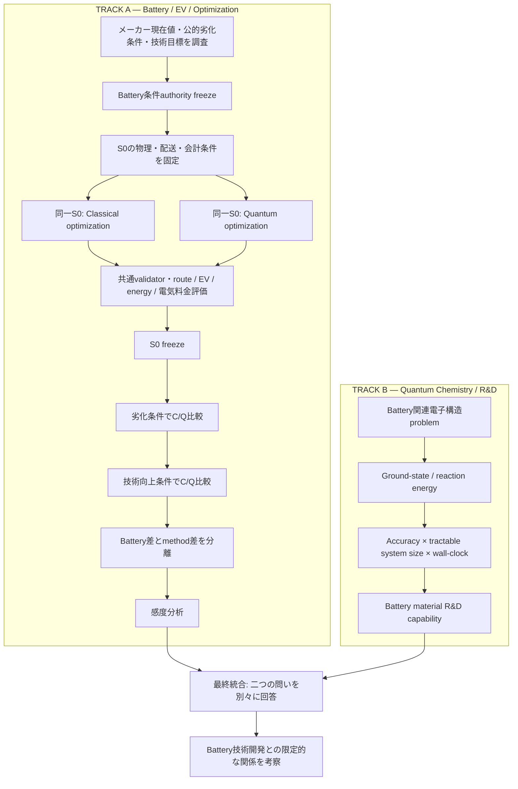

# Battery／EV／最適化と量子化学／材料R&Dの二系統研究

更新日：2026-09-26。文書改訂COMPLETED、将来分析NOT_STARTED。段階順序は[master roadmap](RESEARCH_STAGE_ROADMAP.md)を参照する。

## 二つの研究質問

A：Battery条件の変化とoptimization methodの違いが、配送計画・EV運用・電力量・限定的な運用電気料金にどのような差を生むか。

B：Quantum chemistryの計算性能の進展が、Battery material R&D capabilityにどのような意味を持つか。

各問いの証拠を別に整理し、最後に両者の関係を限定的・明示的に考察する。

図の収束は考察の接続である。量子化学からBattery kWhを生成する矢印ではない。文献調査の正式な受入順序はmaster roadmapに従う。

## TRACK Aの境界

[Minimal EVRP model validation](../reproducibility/outputs/traffic_simulation/r24_minimal_evrp_charging_validation/20260926_v2/MINIMAL_EVRP_CLASSICAL_FREEZE.json)はN002 WIDEの範囲で完了/FROZENである。既存経路が成立する検証と充電が必要になる検証、Exact/MILP/独立照合を含む。10kW・低初期SOCは制御検証条件でありcurrent vehicle charging performanceではない。実車充電性能はUNRESOLVED/DEFERREDであり、S0は未定義・未実行である。

[Battery根拠](BATTERY_PERFORMANCE_EVIDENCE_PLAN.md)はメーカー現在値、公的残存容量条件、NEDO等の技術目標の三層であり、公式値・研究仮定・換算値・感度条件を分離する。[scenario比較](BATTERY_SCENARIO_COMPARISON_PLAN.md)はS0/D/TそれぞれにClassical/Quantumを配置し、[共通比較計画](CLASSICAL_QUANTUM_EVRP_COMPARISON_PLAN.md)により同じ条件の手法差と同じ手法のBattery差を計算する。量子の成功・最適性・省エネルギーを前提にしない。

S0は過去のUniformやmodel-validation caseとは異なる。需要、顧客、depot、network/traffic/TW/service、current Battery/charging、EV model、経済パラメータと目的を固定する。経済結果はE_operation×p_electricityという運用電気料金に限定し、初期/帰庫充電・grid/battery境界と価格authorityを先に定義する。労務・設備・車両償却等を含むfull logistics costではない。実車chargingと会計authorityが不足する間はS0実行をBLOCKEDとする。

## TRACK BとBattery material R&D bridge

[量子化学benchmark計画](QUANTUM_CHEMISTRY_BENCHMARK_PLAN.md)は実際の量子実験・simulation・resource estimationで扱われたBattery関連電子構造問題を一次文献から選ぶ。Classical/Quantum chemistryを同じschemaに記録し、ground-state/reaction energyのaccuracy、electrons/orbitals/active spaceによる扱える系、end-to-end wall-clockを別々に評価する。欠測はNOT_REPORTED等を保持する。単一weighted scoreを作らない。

| 計算能力の変化 | 材料R&Dとの関係 | 留保 |
|---|---|---|
| Accuracy改善 | 電子・反応energy予測の不確かさ低減 | 参照と物理modelの誤差は残る |
| 扱える系の拡大 | より現実的な電極・界面・反応の検討 | 大きさだけで妥当性を保証しない |
| Wall-clock短縮 | 同じ研究期間での候補評価数増加の可能性 | 同じ精度・系・資源境界と他R&D工程を考慮 |

これはBattery material discovery/evaluation capabilityへの条件付き解釈である。合成・cell試験・pack設計・安全性・製造を経ずに車両容量や寿命を予測しない。技術向上scenario値のauthorityは引き続きメーカー・公的資料・技術目標・明示的研究換算であり、量子化学の性能指標ではない。

## 主張境界と停止

Quantum最適化が必ず優れる、quantum advantage/speedupがある、EV電力量が減る、Quantum結果が自動的に最適である、とは主張しない。異なるhardware/並列/budget/精度/工程範囲のruntimeを直接的speedupとして比較しない。

量子化学の進展から将来kWh、寿命の改善率、充電速度の改善率を直接換算しない。Battery技術改善への因果的寄与率、commercial viability、市場普及を確立しない。統合分析は測定された差・条件付きR&D関係・未解決authorityを区別する。本taskは文書改訂だけであり、科学実行は0である。STOP。
