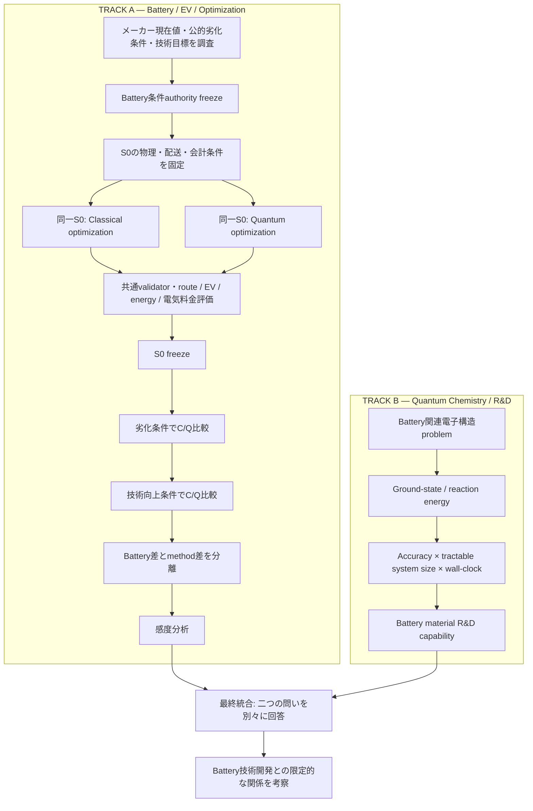

# 電池／電気自動車／最適化と量子化学／材料研究開発の二系統研究

更新日：2026-09-26。文書改訂COMPLETED、将来分析未着手。段階順序は[全体の研究段階計画](RESEARCH_STAGE_ROADMAP.md)を参照する。

## 二つの研究質問

A：電池条件の変化と最適化 手法の違いが、配送計画・電気自動車の運用・電力量・限定的な運用電気料金にどのような差を生むか。

B：量子計算 chemistryの計算性能の進展が、電池 material 研究開発 capabilityにどのような意味を持つか。

各問いの証拠を別に整理し、最後に両者の関係を限定的・明示的に考察する。

図の収束は考察の接続である。量子化学から電池 kWhを生成する矢印ではない。文献調査の正式な受入順序は全体の研究段階計画に従う。

## 研究系統Aの境界

[最小構成の電気自動車配送経路問題 モデル検証](../reproducibility/outputs/traffic_simulation/r24_minimal_evrp_charging_validation/20260926_v2/MINIMAL_EVRP_CLASSICAL_FREEZE.json)はN002 WIDEの範囲で完了/固定済みである。既存経路が成立する検証と充電が必要になる検証、Exact/MILP/独立照合を含む。10kW・低初期充電率は制御検証条件であり現行 車両 充電 性能ではない。実車充電性能はUNRESOLVED/DEFERREDであり、第0段階は未定義・未実行である。

[電池根拠](BATTERY_PERFORMANCE_EVIDENCE_PLAN.md)はメーカー現在値、公的残存容量条件、NEDO等の技術目標の三層であり、公式値・研究仮定・換算値・感度条件を分離する。[想定条件比較](BATTERY_SCENARIO_COMPARISON_PLAN.md)はS0/D/TそれぞれにClassical/Quantumを配置し、[共通比較計画](CLASSICAL_QUANTUM_EVRP_COMPARISON_PLAN.md)により同じ条件の手法差と同じ手法の電池差を計算する。量子の成功・最適性・省エネルギーを前提にしない。

第0段階は過去のUniformやモデル-検証 事例とは異なる。需要、顧客、配送拠点、network/traffic/TW/service、現行 Battery/charging、電気自動車 モデル、経済パラメータと目的を固定する。経済結果はE_operation×p_electricityという運用電気料金に限定し、初期/帰庫充電・grid/battery境界と価格正本を先に定義する。労務・設備・車両償却等を含む全体 logistics 費用ではない。実車充電と会計正本が不足する間は第0段階実行を実行不可とする。

## 研究系統Bと電池材料研究開発との接続

[量子化学ベンチマーク計画](QUANTUM_CHEMISTRY_BENCHMARK_PLAN.md)は実際の量子実験・simulation・資源 estimationで扱われた電池関連電子構造問題を一次文献から選ぶ。Classical/Quantum chemistryを同じデータ構造に記録し、ground-state/reaction 電力量の精度、electrons/orbitals/active spaceによる扱える系、終了-to-終了 実経過時間を別々に評価する。欠測はNOT_REPORTED等を保持する。単一weighted 得点を作らない。

| 計算能力の変化 | 材料研究開発との関係 | 留保 |
|---|---|---|
| 精度改善 | 電子・反応電力量予測の不確かさ低減 | 参照と物理モデルの誤差は残る |
| 扱える系の拡大 | より現実的な電極・界面・反応の検討 | 大きさだけで妥当性を保証しない |
| 実経過時間短縮 | 同じ研究期間での候補評価数増加の可能性 | 同じ精度・系・資源境界と他研究開発工程を考慮 |

これは電池 material discovery/evaluation capabilityへの条件付き解釈である。合成・cell試験・pack設計・安全性・製造を経ずに車両容量や寿命を予測しない。技術向上想定条件値の正本は引き続きメーカー・公的資料・技術目標・明示的研究換算であり、量子化学の性能指標ではない。

## 主張境界と停止

量子計算最適化が必ず優れる、量子計算 advantage/speedupがある、電気自動車の電力量が減る、量子計算結果が自動的に最適である、とは主張しない。異なる実機/並列/予算/精度/工程範囲の実行時間を直接的高速化として比較しない。

量子化学の進展から将来kWh、寿命の改善率、充電速度の改善率を直接換算しない。電池技術改善への因果的寄与率、commercial viability、市場普及を確立しない。統合分析は測定された差・条件付き研究開発関係・未解決正本を区別する。本作業は文書改訂だけであり、科学実行は0である。停止。
