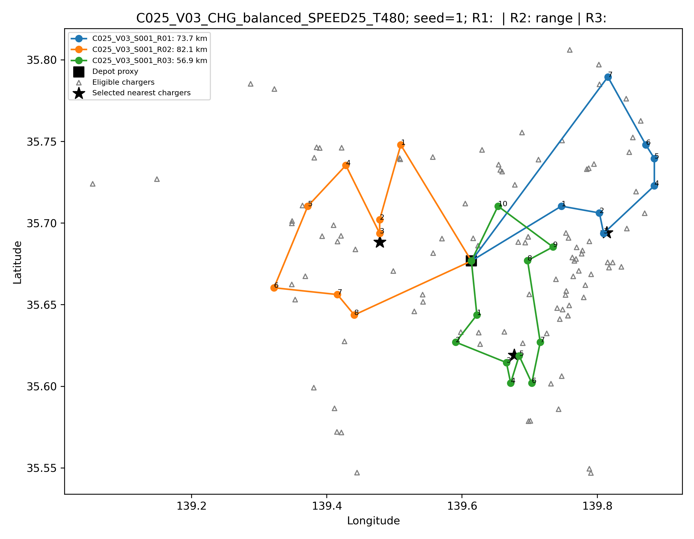

# 東京圏の物流における量子経路最適化の適用可能範囲評価手法の構築
## ー実運用に必要な計算資源の推定に向けてー

## 目的

どの程度の人口・地理的範囲に対して、量子計算による経路最適化が影響するかを評価可能にする。

## リサーチクエスチョン

東京圏における経路最適化で、物流配送時に要請される制約を満たすとき、量子計算性能はどの程度か。

## 達成要件

- 経路を作る基本的な前提要素（出発地、訪問施設数）が分かっている。
- 実際の物流条件を追加するための要素（電気・燃料状態、車載容量）が分かっている。
- 経路を作る前提要素をパラメータとして調整できている。
- 人口分布上で量子経路最適化が実行できている。
- 最適化計算によるルートの生成を実機で実行するために必要なリソースを見積もることができる。実際に計算を実行できなくても、ワークフロー上で見積もりに接続可能である。

## 完成像

- 特定の地域圏を設定し、経路の前提要素を選択し、閾値を設定して、最適化されたルートを生成する。
- 生成されたルートのうち、設定した制約を満たすルートの数を算出する。
- そのルートの数から、必要となるシステム性能を試算する手続きを作成する。

## 意義

物流環境に対する量子技術の導入に関する議論が促進される。

## 中間metric

### 古典計算との差

基本のパラメータとして、出発地、訪問施設数を置く。

将来の物流環境において想定される変数であるEV充電器、車載容量などを追加して、制約充足率の変化を見る。

また、古典最適化でルートを生成した場合と、量子最適化でルートを生成した場合の実行時間を比較する。

## 最終metric

### 量子最適化

Circuit width、depthの順に見ることが検討しうるが、量子ビット数に関連したシステム性能評価方法に関して、さらなる調査が必要である。

## サーベイ1：量子計算性能の定義について

本研究はアプリケーションを対象とするため、アプリケーションに対する評価方法を調べた。

[Lubinskiらの「Application-Oriented Performance Benchmarks for Quantum Computing」](https://arxiv.org/abs/2110.03137)では、問題規模を解釈するmetricの一つとして、circuit widthを見た上でdepthを見ていた。

Circuit widthは、定式化やアルゴリズムに基づいて変数を表現した、量子回路上で必要な量子ビット数の見積もりである。

これを見ることで、解いている問題、例えば最適化計算で変数を訪問時間割、訪問施設数、車両数として扱っているのであれば、それに対応する量子ビット数を見ることができる。

Depthはゲートの段数を指し、これはコンパイルの仕方などによって変わる。Widthと合わせて見ることで、ハードウェア上でcircuitがどのように変換されたのかを捉えることができる。

しかし、将来の量子計算環境として想定されるのは、フォールトトレラントな量子計算機である。本研究のように環境範囲を拡張したときの計算を考えるのであれば、複数の量子コンピュータの使用も考える必要がある。

複数の量子コンピュータを用いたときの計算能力に関するmetricについては、さらなる調査が必要である。

## サーベイ2：量子経路最適化アプリケーションで扱われる変数について

本研究では将来の交通環境を想定するため、変数の網羅性が重要である。

現状、アプリケーション研究で扱われる変数としては、次のものがある。

- 時間窓
- 積載量
- 訪問施設数
- 車両数
- 配送需要
- 電気状態
- 充電スポット

[Azadらの研究](https://arxiv.org/abs/2002.01351)では、訪問地点数と車両数を設定したVRPをIsing形式に変換し、QAOAによる計算を行っている。

[Leonidasらの研究](https://arxiv.org/abs/2306.08507)では、時間窓を含むVRPTWを扱い、11から3964の候補ルートを対象として、量子ビット数を削減するエンコーディングを評価している。

[Xieらの研究](https://arxiv.org/abs/2308.08785)では、車両の積載容量に制約があるCVRPを対象として、実行可能な解を生成しやすくするQuantum Alternating Operator Ansatzを提案している。

[Fitzekらの研究](https://www.nature.com/articles/s41598-024-76967-w)では、積載容量が異なる車両を含むHVRPを扱い、3顧客・2車両までの小規模問題をQAOAで検証している。

[Garcia de Andoinらの研究](https://arxiv.org/abs/2306.04414)では、EVの経路と充電を組み合わせたEVCRPを対象として、制約を満たす探索空間を量子・古典ハイブリッド手法で扱っている。

[Okadaらの研究](https://arxiv.org/abs/2506.04687)では、EVの経路と充電施設の配置を同時に扱い、バッテリー容量制約、充電施設数、充電施設の位置を含む20地点の問題をQUBOソルバーで検証している。

もちろん、これらの変数がすべての論文で同時に扱われているわけではなく、アプリケーションによって異なる。最初に、量子計算で利用可能な変数について知っておく必要があった。

## 全体の流れ

変数と閾値を設定してルートを生成する必要があるが、まずは簡単な方法でワークフローの作成を試みた。

結果として、以下の手順のワークフローでルートプロキシを生成できた。

1. **シナリオ条件を設定する。**  
   顧客数、車両数、充電条件および乱数seedを設定する。現在は顧客数25・50・100、車両数1・3・5、充電条件3水準を使用している。

2. **人口分布に基づく分析用顧客地点を生成する。**  
   e-Statの人口メッシュを使用し、人口が多いメッシュほど選ばれやすくなるように人口加重抽出を行う。抽出したメッシュの代表座標を分析用の顧客地点とする。この地点は実際の配送先ではない。

3. **顧客ごとの条件を設定する。**  
   顧客・注文単位の配送需要とサービス時間は取得できていない。そのため、各顧客の配送需要には5から30までの整数を同じ確率でランダムに割り当て、サービス時間には5から15までの整数を同じ確率でランダムに割り当てる。単位はそれぞれkgと分である。乱数生成器には `numpy.random.default_rng(seed × 100000 + customer_count)` を使用するため、同じ顧客数とseedを指定すれば同じ値を再生成できる。これらの数値は実際の注文重量や荷役時間を観測した値ではない。

4. **出発地点を選択する。**  
   人口メッシュから生成した分析用顧客地点の平均緯度・経度を顧客集合の重心とし、その重心に最も近い公開物流施設候補を出発地点のプロキシとして選択する。

5. **顧客を車両別に分割する。**  
   車両数が複数の場合、顧客地点の緯度・経度をKMeansでクラスタリングし、各クラスタを1台の車両が訪問する顧客集合とする。

6. **訪問順を決定する。**  
   各車両について出発地点から開始し、現在地点から最も近い未訪問顧客を順番に選択する。すべての顧客を訪問した後、出発地点へ戻る。

7. **ルート距離を算出する。**  
   出発地点、顧客地点、出発地点への帰着を含む各地点間のHaversine距離を合計し、道路距離補正係数1.25を乗じてルートプロキシ距離を算出する。

8. **充電施設候補との位置関係を計算する。**  
   ルート上の地点と、設定した充電条件を満たす充電施設候補との地理的距離を計算し、各ルートに対する最近傍候補を特定する。

9. **生成後のルートを制約ごとに評価する。**  
   生成したルートプロキシに対して、車載容量、最大稼働時間、航続距離、充電施設へのアクセスなどを個別に評価する。これらの制約は、現段階では訪問順の決定には使用していない。

10. **条件とseedを変えて繰り返す。**  
    同じ手順を顧客数、車両数、充電条件および100個のseedについて繰り返し、条件間の変化を比較する。

ここでいうルートは、古典・量子のいずれの最適化計算も行っていないため、見積もりを算出する土台になるものではない。

また、設定した閾値は恣意的であるため、これも参考値にはならない。

ただし、ワークフローに関しては、ルートプロキシ生成の段階に、古典最適化計算・量子最適化計算によるルート生成が当てはまりうる。

これによって、全体を改善しながら今後の作業を進めることができる。

## ルート生成方法

ルートプロキシの作成に使用したデータ・変数と、ルート生成後の評価だけに使用したデータ・変数は異なる。使用箇所を次のように区別する。

### ルートプロキシの作成に使用したもの

| データ・変数 | 設定または出典 | ルート作成での使用方法 |
|---|---|---|
| 人口メッシュの人口と代表座標 | e-Statの2020年国勢調査人口メッシュ | 顧客地点を選ぶ確率と、選択後の顧客座標に使用 |
| 顧客数 | 25・50・100の3水準を研究条件として設定 | 一つの顧客集合に含める地点数として使用 |
| 乱数seed | 1から100までを研究条件として設定 | 顧客地点、配送需要、サービス時間およびKMeansの結果を再現するために使用 |
| 物流施設候補の位置 | 国土数値情報の物流施設データから作成した候補 | 顧客集合の重心に最も近い候補を出発地点として選択 |
| 車両数 | 1・3・5の3水準を研究条件として設定 | KMeansのクラスタ数、すなわち生成するルート数として使用 |
| 顧客地点の緯度・経度 | 人口メッシュから選択した代表座標 | KMeansによる車両別の分割と、最近傍訪問順の決定に使用 |
| 地球半径 | 6,371.0088 km | 地点間のHaversine距離の計算に使用 |
| 道路距離補正係数 | 1.25を研究上の仮定として設定 | Haversine距離の合計に乗じ、ルートプロキシ距離を算出 |

この段階では、配送需要、車載容量、サービス時間、最大稼働時間、航続距離、SOC、充電施設の位置・出力を、顧客の車両割当や訪問順の決定には使用していない。したがって、KMeansによって作られた各ルートが車載容量や航続距離を超えていても、それを理由として顧客を別の車両へ割り当て直す処理は行っていない。

### ルート生成後の制約評価だけに使用したもの

| データ・変数 | 設定または出典 | 生成後の評価での使用方法 |
|---|---|---|
| 顧客ごとの配送需要 | 各顧客に5～30 kgの整数を同じ確率でランダムに割り当て | ルート内の需要合計と2,000 kgの車載容量を比較 |
| 車載容量 | 公開車両仕様から2,000 kgを使用 | 積載条件の閾値として使用 |
| 顧客ごとのサービス時間 | 各顧客に5～15分の整数を同じ確率でランダムに割り当て | ルート内のサービス時間を合計し、運行時間に加算 |
| 移動速度 | 一律25 km/hを研究上の仮定として設定 | ルートプロキシ距離を移動時間へ換算 |
| 最大稼働時間 | 480分を研究上の仮定として設定 | 移動時間とサービス時間の合計との比較に使用 |
| 公称航続距離 | 公開車両仕様から116 kmを使用 | 初期SOCと予備SOCを適用し、静的な使用可能航続距離を算出 |
| 初期SOC・予備SOC | 初期SOC 0.90、予備SOC 0.20を研究上の仮定として設定 | `116 × (0.90 − 0.20) = 81.2 km`を航続距離の閾値として使用 |
| 充電接続候補の位置・接続方式・出力 | Open Charge Map | 条件別候補の選別、最近傍候補までの距離、簡略化した充電支援判定に使用 |
| 充電アクセス距離・充電時間の閾値 | 充電条件ごとに研究上の仮定として設定 | 地理的アクセスと簡略化した充電時間の判定に使用 |

ここで「研究上の仮定」とした数値は、東京圏の実運用データから推定した代表値でも、既存研究によって妥当性が確認された標準値でもない。現時点のワークフローを動かし、パラメータを変更したときに判定結果がどのように変わるかを確認するために暫定的に置いた値であり、設定には恣意性がある。したがって、25 km/h、480分、初期SOC 0.90、予備SOC 0.20、道路距離補正係数1.25、充電アクセス距離および充電時間の閾値を、東京圏物流の実態を表す参考値として解釈しない。

ここで「ランダムに割り当てた」とは、実在する顧客の配送記録から値を取得したという意味ではない。顧客数 $n$ とseed $s$ の組ごとに `default_rng(100000s+n)` という乱数生成器を作り、配送需要については5、6、7、…、30 kgの26個の整数から各値を同じ確率で一つ選び、サービス時間については5、6、7、…、15分の11個の整数から各値を同じ確率で一つ選んでいる。したがって、現在の配送需要とサービス時間は、東京圏の実際の分布を推定したものではなく、ワークフローと制約判定を実行するために暫定的に置いた値である。

顧客地点についても、実際の配送先を取得したものではない。e-Stat人口メッシュのうち人口が正で対象座標範囲に入るメッシュを候補とし、各メッシュの人口を全候補メッシュの人口合計で割った値を選択確率とする。人口の多いメッシュほど選ばれやすくし、同じ顧客集合の中では同じメッシュを重複して選ばない。選択されたメッシュの実装上の代表座標を顧客地点としている。このため、生成された顧客地点は人口分布を反映した分析用地点であり、実在する顧客、事業所、注文または配送停止地点を表さない。

### 取得済みだが現在のルート作成・制約評価に使用しなかったもの

- OpenStreetMapに基づく道路ネットワークの集計・関連データ
- 道路交通センサスおよびJARTICに基づく交通量・交通状況の集計データ
- 国土交通省の貨物流動に関する地域・品目単位の集計データ
- GTFSなどの公共交通関連データ

これらは研究環境内に取得・整理されているが、現在のルートプロキシの訪問順、道路上の走行経路、移動速度、顧客別配送需要の設定には使用していない。

### 取得できておらず、現在評価していないもの

- 顧客・注文単位の実際の配送需要
- 顧客ごとの実際の荷役・駐車・受け渡し時間
- 顧客・施設ごとの時間窓
- 実際の車両の出発時SOCと走行中のSOC推移
- 積載量、気温、道路勾配、渋滞を反映した実際の電力・燃料消費量
- 充電施設の営業時間、空き状況、待ち時間、混雑、故障状況
- ルートと時刻に対応した実走行速度、通行規制、所要時間

以上から、現在生成しているルートは、人口分布から選んだ分析用顧客地点をKMeansで車両別に分け、最近傍法で訪問順を決めたルートプロキシである。取得済みのすべてのデータを使って生成した経路ではなく、配送需要や車両・エネルギー条件を同時に満たすように生成した経路でもない。

**図：生成した代表ルートプロキシ。**

この図は、シナリオID `C025_V03_CHG_balanced_SPEED25_T480`、seed 1の条件を、最新の再現性監査Notebookで生成したものである。`C025`は人口メッシュから生成した分析用顧客地点が25地点であること、`V03`は車両数3、`CHG_balanced`はbalanced充電条件、`SPEED25`は移動速度を一律25 km/hとする仮定、`T480`は最大稼働時間を480分とする仮定を表している。seed 1は分析用顧客地点の選択、配送需要とサービス時間のランダムな割当て、およびKMeansのクラスタリングを再現するための乱数識別子であり、実際の配送日や実在する配送状況を表すものではない。

図を生成するため、最初にe-Statの人口メッシュから人口加重抽出によって25メッシュを選択し、選択した各メッシュの代表座標を分析用顧客地点とした。次に、25地点の平均緯度・経度を顧客集合の重心とし、その重心に最も近い国土数値情報の物流施設候補を出発地点のプロキシとして選択した。その後、25地点を緯度・経度に基づくKMeansによって3つのクラスタに分割し、各クラスタを1台の車両が担当する顧客集合とした。各車両について、出発地点から最も近い未訪問顧客を順番に選択し、すべての担当顧客を訪問した後に出発地点へ戻ることで、3本のルートプロキシを生成した。

図中の黒い四角は、この顧客集合に対して選択された出発地点のプロキシを表す。青、橙、緑の丸は、人口メッシュの代表座標を用いて生成した分析用顧客地点であり、色はそれぞれ異なる車両ルートを表す。各丸の近くに付された数字は、車両ごとの訪問順を表す。色付きの線は、出発地点、各顧客地点、出発地点への帰着を結んだ訪問順を示している。

青色のR1は7顧客を訪問し、ルートプロキシ距離は73.7 kmである。各顧客に5～30 kgの整数を同じ確率でランダムに割り当てた配送需要の合計は133 kgであり、各顧客に5～15分の整数を同じ確率でランダムに割り当てたサービス時間と、25 km/hで計算した移動時間を合計した推定所要時間は237.0分である。橙色のR2は8顧客を訪問し、ルートプロキシ距離は82.1 km、同じ規則で割り当てた配送需要の合計は160 kg、推定所要時間は280.0分である。緑色のR3は10顧客を訪問し、ルートプロキシ距離は56.9 km、同じ規則で割り当てた配送需要の合計は171 kg、推定所要時間は247.7分である。3ルートとも、2,000 kgの車載容量と480分の最大稼働時間の範囲内と判定された。配送需要とサービス時間は実測値ではない。

このシナリオの静的な使用可能航続距離は、公称航続距離116 kmに初期SOC 0.90と予備SOC 0.20の差を適用した81.2 kmである。R1とR3はこの距離以下であるが、R2は82.1 kmであり、使用可能航続距離を約0.9 km超える。そのため、図のタイトルではR2に対して `range` と表示されている。R2については、後述する簡略化した充電支援判定では航続距離を補填可能と判定されている。ただし、これは走行中の逐次的なSOC変化を計算した結果ではない。

灰色の三角は、balanced充電条件を満たしたOpen Charge Mapの充電接続候補を表す。Balanced条件では、CHAdeMOとして報告され、明示的に利用不可とされておらず、既知の充電出力が40 kW以上である接続レコードを候補とする。地理的アクセスの閾値は5 km、充電時間の閾値は60分としている。この条件で抽出された候補は106接続レコードであり、106か所の独立した充電施設を意味するとは限らない。また、公共利用の可否、営業時間、空き状況、混雑、故障、実際の車両との互換性が確認された候補ではない。

黒い星は、各ルートに対して選択された最近傍の充電接続候補を表す。最近傍候補までの地理的距離は、R1が約0.53 km、R2が約0.75 km、R3が約0.83 kmであり、3ルートとも5 kmの地理的アクセス閾値以内と判定された。ただし、この判定はルート上の地点と候補の直線距離に基づくものであり、道路を使って実際に到達できることや、その時点で充電器を利用できることを保証しない。

図のタイトルにある `R1:`、`R2: range`、`R3:`は、最大稼働時間、静的航続距離、充電施設への地理的アクセスのうち、各ルートで未充足となった項目を表示している。R1とR3の後が空欄であることは、この3項目について未充足が表示されなかったことを意味するだけであり、すべての実運用制約を満たすことを意味しない。時間窓、走行中のSOC推移、充電待ち時間、充電器の混雑や故障などは、この図では評価していない。

ルートプロキシ距離は、各地点間のHaversine距離の合計に道路距離補正係数1.25を乗じて算出している。したがって、色付きの線は道路ネットワーク上の走行経路ではなく、KMeansと最近傍法によって決定した訪問順の幾何学的表現である。一方通行、道路の接続性、道路勾配、渋滞、時間窓、充電のための迂回は考慮していない。また、このルートは古典最適化または量子最適化によって得られた最適解ではない。

## 変数追加による変化

変数を追加していくことで、設定した閾値を満たすルートの数が変化する可能性が観察された。

現段階では、制約をルート生成の内部に組み込んでいない。ルートプロキシを生成した後で、それぞれの制約を個別に評価している。したがって、現在の変数追加はルート形状を変更するものではなく、同じルートプロキシに対する判定項目を増やすものである。

| 段階 | 追加する変数 | 何を判定するか | データの状態 | 現在の結果 |
|---|---|---|---|---:|
| 基本条件 | 出発地点、訪問施設数、車両数 | ルートプロキシの生成 | 人口メッシュを人口加重抽出し、その代表座標を分析用顧客地点として使用。出発地点は物流施設候補から選択。車両数は研究上の設定 | 制約判定なし |
| 積載条件 | 配送需要、車載容量 | ルートの合計需要が車載容量以下か | 実需要は未取得。各顧客に5～30 kgの整数を同じ確率でランダムに割り当てる。車載容量は公開車両仕様を使用 | 未充足率 0.00% |
| 時間条件 | サービス時間、最大稼働時間 | 移動時間とサービス時間の合計が稼働上限以下か | 実サービス時間は未取得。各顧客に5～15分の整数を同じ確率でランダムに割り当てる。最大稼働時間は480分の仮定値 | 未充足率 33.52% |
| 航続距離条件 | 航続距離、初期SOC、予備SOC | ルート距離が静的な使用可能航続距離以下か | 公称航続距離は公開仕様。初期SOCと予備SOCは仮定。走行中のSOC推移は未取得・未評価 | 未充足率 64.44%。SOCは未評価 |
| 充電アクセス条件 | 充電施設位置、アクセス距離 | ルート上の地点から充電施設候補へ地理的に到達できるか | 位置・接続・出力候補はOpen Charge Map。営業時間、空き、故障、互換性は未取得 | 未充足率 10.69% |
| 充電支援条件 | 充電出力、充電時間 | 充電による航続距離の補填と時間条件を満たせるか | 充電出力は候補情報。実際の充電時間・待ち時間は未取得で、閾値を仮定 | 航続距離補填の未充足率 33.30%（条件付き）、充電時間の未充足率 15.30%（条件付き） |
| 将来追加 | 時間窓、道路交通条件 | 指定時刻内の訪問と、交通状況を反映した所要時間を満たせるか | 顧客別時間窓は未取得。道路交通の集計データはあるが、経路・時間帯別速度として未使用 | 未評価 |

現在の制約充足率・未充足率は、すべての制約を同時に満たしたルートの割合ではない。制約ごとに評価対象となる分母も異なるため、各未充足率を足し合わせることはできない。特に、充電支援航続距離と充電時間の割合は、対象条件を満たす一部のルートを分母とした条件付きの値である。

このことから、古典最適化・量子最適化でルートを生成する際にも、変数を徐々に追加し、各段階で制約を満たすルートの割合がどのように変化するかを見る必要がある。

## 前提環境の想定

古典最適化と量子最適化について、以下の実行環境とモデル条件を基本とする。

### 実行環境

#### OR-Toolsとは

[OR-Tools](https://developers.google.com/optimization/routing?hl=ja)は、Googleが公開している組合せ最適化用のソフトウェア群である。本研究では、そのうちVehicle Routing Problem（VRP）を扱うRouting Solverを、古典最適化のベースラインとして使用する。出発地点、顧客地点、車両数、地点間の距離行列、車載容量や時間窓などの制約を入力し、車両ごとの訪問順を探索する。

#### Qiskit Aerとは

[Qiskit Aer](https://qiskit.github.io/qiskit-aer/)は、Qiskitで作成した量子回路を、CPUやGPUを用いる古典計算機上で実行する量子回路シミュレータである。理想的な量子回路だけでなく、ノイズモデルを加えた回路のシミュレーションにも利用できる。

#### 本研究での使い分け

- 古典最適化：OR-Toolsを使用する。
- 量子最適化アルゴリズム：QAOAを使用する。
- QAOAの実行環境：Qiskit Aerを使用する。
- 量子実機：現段階では使用しない。
- 量子最適化では、経路最適化問題をQUBO形式に変換する。
- OR-ToolsとQAOAには、比較可能な範囲で同じ問題データ、目的関数、制約条件を入力する。

### 対象範囲

- 対象地域は東京圏とする。
- 現在の予備的なルート生成では、東京都の人口メッシュなどを使用している。
- 人口メッシュを人口加重抽出し、選択したメッシュの代表座標を分析用顧客地点として設定する。実際の配送先は使用していない。
- 出発地点は、公開されている物流施設候補から設定する。

### 経路の基本条件

- 各車両は出発地点から配送を開始する。
- 各顧客・訪問施設を一度訪問する。
- 配送終了後は出発地点に戻る。
- 顧客数、訪問施設数、車両数はパラメータとして変更できるようにする。
- 基本の目的関数は、全車両の総移動距離の最小化とする。

### 経路生成の手順

ここで示す手順は、今後OR-ToolsとQiskit Aer上のQAOAを用いて実装する予定の経路生成手順であり、現時点では実行していない。現在実行済みなのは、前節で説明したKMeansと最近傍法によるルートプロキシの生成までである。

1. **共通の問題インスタンスを作成する。**  
   対象地域、出発地点、顧客地点、顧客数、車両数および地点間距離を設定する。顧客地点には、人口メッシュを人口加重抽出して得た分析用地点を使用する。同じ顧客地点と出発地点を、古典最適化と量子最適化の両方に入力する。

2. **基本となる目的関数を設定する。**  
   各車両が出発地点を出発し、割り当てられた顧客を訪問して出発地点へ戻る経路を対象とする。最初の段階では、全車両の総移動距離を最小化することを目的関数とする。

3. **基本制約を設定する。**  
   各顧客を一度だけ訪問すること、各車両が出発地点から出発して同じ地点へ戻ること、設定した車両数を超えないことを基本制約とする。この段階では、車載容量、最大稼働時間、航続距離、充電条件および時間窓はまだ追加しない。

4. **OR-Tools用の古典最適化モデルを作成する。**  
   出発地点、顧客地点、車両数および地点間距離行列をOR-Toolsへ入力する。総移動距離を目的関数として経路を探索し、車両ごとの訪問順、ルート距離およびソルバー実行時間を出力する。

5. **QAOA用の量子最適化モデルを作成する。**  
   同じ問題について、顧客の訪問順または地点間の移動を二値変数で表現する。総移動距離を目的関数項、各顧客を一度だけ訪問する条件や出発地点へ戻る条件を制約項としてQUBOへ変換する。

6. **Qiskit Aer上でQAOAを実行する。**  
   QUBOをIsing Hamiltonianへ変換し、Qiskit Aer上でQAOAを実行する。最初はシミュレータで実行可能な小規模の顧客数から開始し、得られたビット列、目的関数値および実行時間を記録する。

7. **QAOAの出力を経路へ変換する。**  
   QAOAから得られたビット列を、車両ごとの顧客割当てと訪問順へ変換する。出発地点から出発して同じ地点へ戻っているか、すべての顧客を一度だけ訪問しているかを確認する。経路として解釈できないビット列は、実行可能解として扱わない。

8. **ルートプロキシ、古典最適化、量子最適化の基本結果を比較する。**  
   同じ東京圏の問題インスタンスについて、現在のKMeansと最近傍法によるルートプロキシ、OR-Toolsの経路、およびQAOAの経路を比較する。比較項目は、実行可能解が得られたか、総移動距離、使用車両数、制約充足および実行時間とする。古典側のモデルと量子側のQUBOで制約表現に差が生じた場合は、その差を記録する。

9. **追加制約を一つずつ組み込む。**  
   基本条件で比較できることを確認した後、配送需要と車載容量、サービス時間と最大稼働時間、航続距離と電気・燃料状態、充電施設へのアクセスと充電時間、時間窓と道路交通条件の順に追加する。データを得られていない変数には、オープンデータの追加調査と仮定方法の検討が完了するまで、実運用を代表する値があるとはみなさない。

10. **各段階の結果と計算資源を記録する。**  
    制約を追加する各段階で、経路、総移動距離、制約充足、実行時間を保存する。量子最適化については、二値変数数、Circuit width、depthに加えて、ハードウェア側の出力性能を評価できる指標を記録する。

### 古典ベンチマークとの比較

生成した経路の品質を外部基準でも確認するため、[CVRPLIBの標準CVRPインスタンス](https://galgos.inf.puc-rio.br/cvrplib/index.php/en/instances)を古典ベンチマークとして使用する。CVRPLIBには、顧客座標、配送需要、車両容量などを定めた標準問題と、その問題に対する既知最良値または最適値が掲載されている。

本研究で参照してきたGolden_5は、CVRPLIBのGoldenセットに含まれる、顧客数200、車両数5、車載容量900のCVRPインスタンスである。Goldenセットの出典は、Goldenほかによる[1998年のベンチマーク研究](https://doi.org/10.1007/978-1-4615-5755-5_2)である。また、量子回路リソースの調査対象とした[Onah and Michielsenの研究](https://arxiv.org/abs/2509.11469)でも、Golden_5を対象に必要な量子ビット数が見積もられている。

ただし、東京圏で生成した問題とGolden_5では、顧客位置、配送需要、車両容量および距離尺度が異なる。そのため、東京圏の経路の総距離とGolden_5の既知最良値を直接比較しても、手法の優劣は判断できない。比較は次の三つに分けて行う。

1. **標準問題による古典実装の検証**  
   CVRPLIBの同一インスタンスをOR-Toolsで解き、実行可能性、総移動距離、使用車両数および実行時間を記録する。CVRPLIBの既知最良値を \(Z_{\mathrm{BKS}}\)、OR-Toolsの目的関数値を \(Z_{\mathrm{OR}}\) とし、解の差を次式で示す。

   \[
   \mathrm{gap}(\%) = \frac{Z_{\mathrm{OR}}-Z_{\mathrm{BKS}}}{Z_{\mathrm{BKS}}}\times100
   \]

   CVRPLIBで最適性が明示されていない値は、厳密な最適値ではなく既知最良値として扱う。

2. **同一問題上での古典・量子比較**  
   OR-ToolsとQAOAの両方で実行できる小規模なCVRPLIBインスタンス、または同じ条件で縮小した問題を使用する。同一の顧客、距離行列、需要、車両容量および目的関数を入力し、実行可能性、目的関数値、既知最良値との差、実行時間を比較する。Golden_5は顧客数200であり、現段階のQAOAシミュレーションへそのまま入力するには大きいため、最初の直接比較には使用しない。

3. **東京圏問題上での手法比較**  
   東京圏については、同じ入力データから生成したルートプロキシ、OR-Toolsの経路、および実行可能な規模に縮小したQAOAの経路を比較する。ここではCVRPLIBの目的関数値を基準にせず、同一の東京圏問題に対するOR-Toolsの解を古典ベースラインとする。

したがって、Golden_5は、第一に古典ソルバーの検証と問題規模の外部参照、第二に量子回路リソース見積もりの文献上の接続点として使用する。東京圏で生成した経路については、同じ東京圏入力をOR-Toolsで解いた結果との比較を中心とする。

### オープンデータの取得状況

| 項目 | 取得状況 | 現在の設定 | 得られていないもの |
|---|---|---|---|
| 配送需要 | 一部取得 | 顧客ごとに5～30 kgの整数を同じ確率でランダムに割り当てる。実際の注文重量ではない | 顧客・注文単位の配送重量、配送件数 |
| 車載容量 | 公開仕様から取得 | EVトラックの公開仕様値を使用 | 実際の運行車両の車種構成、積載実績 |
| サービス時間 | 未取得 | 顧客ごとに5～15分の整数を同じ確率でランダムに割り当てる。実測時間ではない | 実際の荷役、駐車、受け渡し時間 |
| 最大稼働時間 | 未取得 | 480分を基準として設定 | 実際の勤務・運行時間、休憩時間 |
| 航続距離 | 一部取得 | メーカーの公称値から使用可能距離を算出 | 積載量、気温、勾配、渋滞を反映した実走行距離 |
| 電気・燃料状態 | 未取得 | 初期SOCと予備SOCを仮定 | 出発時SOC、走行中のSOC推移、実際のエネルギー消費 |
| 充電施設へのアクセス | 一部取得 | Open Charge Mapの候補位置と距離閾値を使用 | 利用可否、営業時間、空き状況、混雑、故障、車両との互換性 |
| 充電時間 | 未取得 | 充電時間の閾値を設定 | 実際の充電時間、待ち時間、SOCに応じた充電速度 |
| 時間窓 | 未取得 | 現在は設定していない | 顧客の配送希望時間、施設の受入可能時間 |
| 道路交通条件 | 一部取得 | 一定速度と道路距離補正係数を使用 | 経路・時間帯別の走行速度、渋滞、通行規制 |
| 道路ネットワーク経路 | 未使用 | 直線距離に補正係数を乗算 | 道路上の最短経路、実際の走行距離と所要時間 |

配送需要については、国土交通省の貨物流動に関する集計データを得ている。しかし、顧客・注文単位の配送需要ではないため、現在のルート生成には使用していない。

車載容量と航続距離については、車両メーカーの公開仕様値を使用している。ただし、実際に運行している車両の観測データではない。

充電施設については、位置、接続方式、充電出力などの候補情報を取得している。一方、実際に配送車両が利用できるか、空いているか、故障していないか、営業時間内であるかは確認できていない。

道路交通については、道路交通センサスやJARTICに基づく集計データを取得している。ただし、現在のルートと時間帯に対応する走行速度や所要時間としては使用していない。

### 制約追加の方法

制約は、使用するデータの取得状況を明示した上で段階的に追加する。

1. **基本となる経路条件**  
   出発地点、訪問施設数、車両数を設定する。顧客地点は人口メッシュを人口加重抽出して生成し、出発地点は物流施設候補から設定する。実際の配送先は使用していない。

2. **配送需要と車載容量**  
   車載容量には公開仕様値を使用する。顧客単位の配送需要は得られていないため、各顧客に5～30 kgの整数を同じ確率でランダムに割り当てる。この割当値は実際の注文重量ではない。

3. **サービス時間と最大稼働時間**  
   どちらも実際の運行データを得られていないため、現在は暫定的な値を使用する。この値は実運用データから推定したものではなく、設定には恣意性がある。

4. **航続距離と電気・燃料状態**  
   公称航続距離には車両の公開仕様値を使用する。実際のSOC推移は得られていないため、暫定的に設定した初期SOCと予備SOCから静的な使用可能距離を算出する。初期SOCと予備SOCの設定には恣意性がある。

5. **充電施設へのアクセスと充電時間**  
   充電施設候補の位置と出力情報は取得している。ただし、実際の利用可否と充電時間は得られていないため、距離と時間の閾値を暫定的に設定する。この閾値は実際の充電行動から推定したものではなく、設定には恣意性がある。

6. **時間窓と道路交通条件**  
   顧客ごとの時間窓は得られていないため、現在は制約として設定しない。道路交通の集計データは取得しているが、経路・時間帯別の速度には変換していないため、現在は一定速度を使用する。

現段階では、これらの制約をルートプロキシの生成後に個別評価する。今後、OR-ToolsとQAOAによる最適化を実装する段階で、同じ順序によってルート生成の内部へ制約を追加する。

### 古典・量子の比較条件

- 同じ顧客地点と出発地点を使用する。
- 同じ車両数と制約条件を使用する。
- 同じ目的関数を使用する。
- 東京圏問題では、KMeansと最近傍法によるルートプロキシ、OR-Tools、QAOAを同じ問題インスタンス上で比較する。
- 標準ベンチマークでは、CVRPLIBの既知最良値または最適値との差を記録する。
- 東京圏問題とGolden問題のように入力条件が異なる問題同士では、総移動距離の値を直接比較しない。
- 生成されたルートが制約を満たしているかを確認する。
- 生成されたルートの総移動距離と実行時間を比較する。
- 量子最適化については、実行時間に加えてCircuit width、depth、およびハードウェア側の出力性能を評価できる指標を確認する。

## 今後のステップ：追加調査

古典・量子最適化でルートを生成する前に、幾つか確認すべきことがある。

まず、現在得られていない顧客単位の配送需要、サービス時間、最大稼働時間、時間窓、SOC、充電時間などについて、利用可能なオープンデータがないかを追加調査する。データの提供主体、対象地域、観測単位、期間、更新頻度および利用条件を確認し、本研究の変数として使用できる粒度かを判断する。

オープンデータを得られない変数については、値を直ちに一つに固定せず、仮定の置き方を検討する。古典・量子の経路最適化に関するアプリケーション研究、標準ベンチマーク、車両メーカーの公開仕様、物流事業者の公開資料などを調査し、どの資料のどの値を根拠にするかを記録する。

一つの代表値を設定する根拠が不十分な場合は、単一の恣意的な値だけを使用せず、低・基準・高などの複数水準または確率分布として設定する。その上で感度分析を行い、仮定の変更によって制約充足率、ルート数および計算時間がどの程度変化するかを確認する。

今後設定する仮定値については、値、単位、出典、選択理由、適用範囲、不確実性および結果への影響を表にまとめる。根拠を確認できない値は、実態を表すベンチマークではなく、探索用の暫定条件であることを明記する。

古典・量子ともに、アプリケーション研究でパラメータをどのように設定していたかを表にまとめる。

## 今後のステップ：ルート生成の実装

- 対象範囲の設定方法を決定する。
- OR-Toolsによる古典最適化を実装する。
- Qiskit Aer上でQAOAによる量子最適化を実装する。
- 古典・量子で共通する入力、目的関数、制約条件を設定する。
- CVRPLIBの小規模な標準問題をOR-Toolsで解き、既知最良値との差を確認する。
- QAOAで扱える小規模な同一問題について、OR-ToolsとQAOAを比較する。
- Golden_5は、現段階ではQAOAによる直接計算の対象ではなく、古典実装の検証、問題規模、および回路リソース見積もりの参照として使用する。
- 基本条件から制約を段階的に追加する。

## マイルストーン

- 顧客数・施設訪問数のパラメータを用いて、古典最適化・量子最適化でルートを生成し、実行時間を確認できる状態を目指す。
- 古典・量子で同じ入力条件と目的関数を使用し、比較可能な状態にする。
- CVRPLIBの標準問題を用いてOR-Toolsの実装を検証し、既知最良値との差を算出できる状態にする。
- 東京圏の同一問題上で、ルートプロキシ、OR-ToolsおよびQAOAの結果を比較できる状態にする。
- 制約を一つずつ追加し、制約充足率と計算時間の変化を確認する。
- 問題規模と必要量子ビット数の関係を整理する。
- Circuit width、depthに続いて、ハードウェア側の出力性能を評価できる指標を調査する。
- 量子計算能力の定義方法については、引き続き調査を進める。
