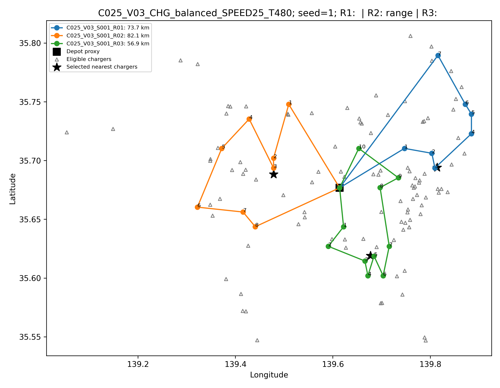

# 「東京圏の物流における量子経路最適化」スライド構成案

## この構成案について

本構成案は、[研究概要](./quantum_route_optimization_research_summary.md)の記載順に沿って、研究内容を**全16枚**にまとめたものである。

現在、KMeansと最近傍法による旧版 経路 代理指標に加え、完全な電気自動車配送経路問題とは分離した縮約した訪問順序 分岐でR20 定式化、R21 厳密 制約なし二値二次最適化 検証、R22 Ising equivalenceが合格している。R23 QAOA/Aer 実行器は実装の動作確認まで完了し `READY_FOR_PILOT` だが、正式 量子近似最適化アルゴリズム pilot/baselineと完全な電気自動車配送経路問題 最適化は未実行である。スライド上ではこれらを明確に区別する。

## スライド一覧

| No. | タイトル | 主な内容 |
|---:|---|---|
| 1 | タイトル | 研究題目 |
| 2 | 研究目的とリサーチクエスチョン | 何を評価可能にするか |
| 3 | 達成要件・完成像・意義 | 研究全体の到達点 |
| 4 | 評価指標の全体像 | アプリケーション指標と量子性能指標 |
| 5 | サーベイ1：量子計算性能の評価 | 幅、深さ、今後の指標 |
| 6 | サーベイ2：量子経路最適化の変数 | 先行研究で扱われる物流制約 |
| 7 | 現段階のルートプロキシ生成手順 | 現在実行済みのワークフロー |
| 8 | 使用データと仮定値 | ルート作成用と生成後評価用の区別 |
| 9 | 未使用データと未取得データ | 現在のデータ上の限界 |
| 10 | 生成した代表ルートプロキシ | 実際の図とシナリオ条件 |
| 11 | 変数追加による変化 | 未充足率と解釈上の注意 |
| 12 | 古典・量子最適化の前提環境 | OR-Tools、QAOA、Qiskit Aer |
| 13 | 今後の最適化経路生成手順 | 古典・量子の共通ワークフロー |
| 14 | 古典ベンチマークとの比較 | 容量制約付き配送問題の公開問題集、Golden_5、東京圏比較 |
| 15 | 制約追加と追加調査 | データ根拠と段階的実装 |
| 16 | 今後の実装と研究の到達点 | 直近の作業と最終的な評価手続き |

---

## スライド 1　タイトル

### 掲載内容

**東京圏の物流における量子経路最適化の適用可能範囲評価手法の構築**

―実運用に必要な計算資源の推定に向けて―

- 発表者名
- 所属
- 発表日

### 図表

東京圏の地図、配送経路、量子回路を簡略化した背景図を使用する。研究結果と誤認されない装飾的な表現にする。

---

## スライド 2　研究目的とリサーチクエスチョン

### このスライドの主張

物流制約を含む東京圏の経路最適化について、量子計算が扱える問題規模と必要計算資源を評価可能にする。

### 掲載内容

**目的**

どの程度の人口・地理的範囲に対して、量子計算による経路最適化が影響しうるかを評価可能にする。

**リサーチクエスチョン**

東京圏の物流配送で要請される制約を満たす経路最適化問題に対して、量子計算はどの程度の問題規模を扱え、どの程度の計算資源を必要とするか。

### 図表

`人口・地理的範囲 → 顧客・車両・物流制約 → 経路最適化 → 必要計算資源`

---

## スライド 3　達成要件・完成像・意義

### このスライドの主張

地域条件から経路問題を作り、古典・量子最適化を比較し、必要計算資源まで接続する評価手続きを目指す。

### 掲載内容

**達成要件**

1. 出発地と訪問施設数を設定できる。
2. 電気・燃料状態や車載容量などの追加要素を整理できる。
3. 各要素をパラメータとして変更できる。
4. 人口分布から作成した問題上で経路最適化を実行できる。
5. 実機実行に必要な計算資源の見積もりへ接続できる。

**完成像**

`地域・人口・制約の設定 → 最適化経路の生成 → 制約充足の評価 → 必要計算資源の試算`

**意義**

量子技術の物流導入について、対象範囲、制約、必要資源を明示した議論を可能にする。

### 説明上の注意

現段階で実行済みなのは、人口分布から分析用顧客地点を作り、ルートプロキシを生成するところまでである。

---

## スライド 4　評価指標の全体像

### このスライドの主張

物流問題の規模・結果を表す指標と、量子計算資源を表す指標を分けて評価する。

### 掲載内容

| 評価対象 | 指標 | 何を見るか |
|---|---|---|
| 問題規模 | 顧客数、訪問施設数、車両数、追加制約 | どの規模・条件の物流問題か |
| 経路結果 | 実行可能性、総移動距離、制約充足率 | 生成経路の品質 |
| 古典・量子差 | 目的関数値、実行時間 | 同一問題上の差 |
| 量子回路 | Circuit width、depth | 必要量子ビット数と回路段数 |
| 今後の評価 | ハードウェア側の出力性能指標 | 実機性能への接続 |

### 説明上の注意

訪問施設数や車載容量などのアプリケーション変数と、幅や深さなどの量子性能指標を混同しない。

---

## スライド 5　サーベイ1：量子計算性能の評価

### このスライドの主張

問題規模に対応するCircuit 幅だけでは不十分であり、深さと、その先のハードウェア性能指標が必要である。

### 掲載内容

- **Circuit 幅**：定式化とアルゴリズムから見積もられる必要量子ビット数。
- **Depth**：量子ゲートを実行する段数。コンパイル方法やハードウェア接続性で変化する。
- 幅と深さを合わせることで、問題表現とハードウェア上の回路変換を捉える。
- 将来はフォールトトレラント量子計算や複数量子計算機の利用も考慮する必要がある。
- 幅、深さに続いて、ハードウェア側の出力性能を評価できる指標を調査する。

### 図表

`アプリケーション変数 → 定式化 → width → コンパイル → depth → ハードウェア性能`

### 参考文献

- Lubinski et al., Application-Oriented Performance Benchmarks for Quantum Computing

---

## スライド 6　サーベイ2：量子経路最適化の変数

### このスライドの主張

量子経路最適化では、基本的な訪問地点・車両数に加え、時間窓、積載、電気自動車充電などが個別に検討されている。

### 掲載内容

| 研究対象 | 扱われる主な変数・制約 |
|---|---|
| 配送経路問題 | 訪問地点数、車両数 |
| 時間窓付き配送経路問題 | 時間窓、候補ルート |
| 容量制約付き配送経路問題 | 配送需要、車載容量 |
| HVRP | 車両ごとに異なる容量 |
| EVCRP | バッテリー状態、充電 |
| 電気自動車経路・施設配置 | 充電施設数、位置 |

**本研究で整理する変数**

時間窓、積載量、訪問施設数、車両数、配送需要、電気状態、充電スポット。

### 説明上の注意

すべての変数を同時に扱った一つの先行研究があるのではなく、論文ごとに対象変数と定式化が異なる。

---

## スライド 7　現段階のルートプロキシ生成手順

### このスライドの主張

最適化実装の前段階として、条件設定からルート生成後の制約評価までを反復できるワークフローを作成した。

### 掲載内容

1. 顧客数、車両数、充電条件、乱数の種を設定する。
2. e-Stat人口メッシュから人口加重抽出し、分析用顧客地点を作る。
3. 顧客ごとに暫定的な配送需要とサービス時間を割り当てる。
4. 顧客集合の重心に最も近い物流施設候補を出発地点とする。
5. 顧客座標をKMeansで車両別に分割する。
6. 各車両について最近傍法で訪問順を決める。
7. Haversine距離に補正係数1.25を乗じて距離を算出する。
8. 充電施設候補との位置関係を計算する。
9. 生成後に、積載、時間、航続距離、充電アクセスを個別評価する。
10. 顧客数25・50・100、車両数1・3・5、充電条件3水準、乱数の種 1～100で反復する。

### 図表

`条件設定 → 顧客地点生成 → 出発地点選択 → KMeans → 最近傍訪問順 → 制約別評価 → 反復`

### 説明上の注意

現在のルートプロキシは、OR-Toolsまたは量子近似最適化アルゴリズムによる最適化経路ではない。また、制約は訪問順を決める際には使用していない。

---

## スライド 8　使用データと仮定値

### このスライドの主張

ルート作成に使用した変数と、作成後の制約評価だけに使用した変数を明確に分ける。

### 掲載内容

| 使用段階 | データ・変数 |
|---|---|
| ルート作成 | 人口メッシュ、顧客数、乱数の種、物流施設候補、車両数、顧客座標、地球半径、道路距離補正係数 |
| 生成後の積載評価 | ランダムに割り当てた需要5～30 kg、公開仕様の車載容量2,000 kg |
| 生成後の時間評価 | ランダムに割り当てたサービス時間5～15分、速度25 km/h、上限480分 |
| 生成後の航続距離評価 | 公称116 km、初期充電率 0.90、予備充電率 0.20、使用可能距離81.2 km |
| 生成後の充電評価 | Open Charge Map候補、アクセス距離と充電時間の暫定閾値 |

### 説明上の注意

- 顧客地点は実際の配送先ではない。
- 配送需要とサービス時間は実測分布ではない。
- 25 km/h、480分、充電率、補正係数、充電閾値は東京圏の代表値ではなく、ワークフロー確認用の暫定値である。
- 積載、時間、航続距離などを満たすように顧客を再割当てする処理は未実装である。

---

## スライド 9　未使用データと未取得データ

### このスライドの主張

取得済みでも現在のモデルに入れていないデータと、必要な粒度で得られていないデータがある。

### 掲載内容

| 取得済みだが現在未使用 | 必要な粒度で未取得 |
|---|---|
| オープンストリートマップ関連道路データ | 顧客・注文単位の配送需要 |
| 道路交通センサス・日本道路交通情報センター集計 | 顧客別サービス時間・時間窓 |
| 地域・品目単位の貨物流動集計 | 出発時充電率と走行中の充電率推移 |
| GTFSなどの公共交通データ | 実環境を反映した電力・燃料消費 |
|  | 充電器の空き、待ち、混雑、故障 |
|  | ルート・時刻別の速度、規制、所要時間 |

### 説明上の注意

貨物流動の集計値を取得していても、顧客・注文単位の配送需要としては使用できない。未取得値については、追加のオープンデータ調査と仮定方法の検討が必要である。

---

## スライド 10　生成した代表ルートプロキシ

### このスライドの主張

人口分布から選んだ25地点を3車両へ分割し、最近傍法による3本のルートプロキシを生成した。

### 掲載する図

**シナリオ**

- `C025_V03_CHG_balanced_SPEED25_T480`
- seed 1
- 顧客数25、車両数3、balanced充電条件
- 仮定速度25 km/h、仮定最大稼働時間480分

**代表ルートの結果**

| ルート | 顧客数 | 距離 | 割当需要 | 推定所要時間 | 静的航続距離判定 |
|---|---:|---:|---:|---:|---|
| R1 | 7 | 73.7 km | 133 kg | 237.0分 | 81.2 km以下 |
| R2 | 8 | 82.1 km | 160 kg | 280.0分 | 約0.9 km超過 |
| R3 | 10 | 56.9 km | 171 kg | 247.7分 | 81.2 km以下 |

### 図の説明

- 四角：出発地点プロキシ
- 丸と線：車両別の顧客地点と訪問順
- 三角：balanced条件を満たす充電接続候補
- 星：各ルートに対する最近傍充電接続候補

### 説明上の注意

線は道路上の走行経路ではなく、訪問順の幾何学的表現である。需要とサービス時間は実測値ではなく、このルートは古典・量子最適化による最適解でもない。

---

## スライド 11　変数追加による変化

### このスライドの主張

同じルートプロキシに判定項目を追加すると、条件を満たさないルートの割合が変化した。

### 掲載内容

| 追加条件 | 現在の未充足率 | 注意点 |
|---|---:|---|
| 配送需要・車載容量 | 0.00% | 需要はランダム割当て |
| サービス時間・最大稼働時間 | 33.52% | 実測値ではなく暫定条件を含む |
| 航続距離・初期充電率・予備充電率 | 64.44% | 走行中の充電率推移は未評価 |
| 充電施設へのアクセス | 10.69% | 営業、空き、故障等は未取得 |
| 充電支援航続距離 | 33.30% | 条件付きの分母 |
| 充電時間 | 15.30% | 条件付きの分母、待ち時間未取得 |
| 時間窓・道路交通 | 未評価 | データまたはモデル未整備 |

### 解釈上の注意

- 現在の変数追加はルート形状を変更せず、同じルートへの判定項目を増やすものである。
- 制約ごとに分母が異なるため、未充足率を加算できない。
- これらは最適化性能や量子計算性能を示す結果ではない。
- 今後は同じ順序で制約を最適化モデル内部へ追加する。

---

## スライド 12　古典・量子最適化の前提環境

### このスライドの主張

OR-Toolsを古典ベースライン、Qiskit Aer上の量子近似最適化アルゴリズムを量子アルゴリズムの検証環境として使用する。

### 掲載内容

| 区分 | 使用するもの | 本研究での役割 |
|---|---|---|
| 古典最適化 | OR-Tools Routing Solver | 制約付き配送経路問題の古典ベースライン |
| 量子最適化 | 量子近似最適化アルゴリズム | 制約なし二値二次最適化に変換した小規模問題を解く |
| 回路実行環境 | Qiskit Aer | CPU/GPU上で量子近似最適化アルゴリズム回路をシミュレーション |
| 量子実機 | 現段階では使用しない | 将来の計算資源見積もり対象 |

**共通の基本条件**

- 同じ顧客地点、出発地点、車両数
- 比較可能な目的関数と制約条件
- 各顧客を一度訪問し、出発地点へ戻る
- 基本目的関数は総移動距離の最小化

### 説明上の注意

Qiskit Aerの実行時間は古典計算機上のシミュレーション時間であり、量子実機の実行時間や量子優位性を示さない。OR-Toolsの出力も、最適性が確認できない限り厳密な最適解とは呼ばない。

---

## スライド 13　今後の最適化経路生成手順

### このスライドの主張

共通問題をOR-Toolsと量子近似最適化アルゴリズムで解き、同一の評価項目で比較した後、物流制約を段階的に追加する。

### 掲載内容

1. 共通の問題インスタンスを作成する。
2. 総移動距離最小化の目的関数を設定する。
3. 一度訪問、出発・帰着、車両数の基本制約を設定する。
4. OR-Toolsで古典最適化経路を生成する。
5. 同じ問題を制約なし二値二次最適化へ変換する。
6. Qiskit Aer上で量子近似最適化アルゴリズムを実行する。
7. 出力ビット列を経路へ復号し、実行可能性を確認する。
8. ルートプロキシ、OR-Tools、量子近似最適化アルゴリズムを比較する。
9. 追加制約を一つずつ最適化内部へ組み込む。
10. 各段階の経路結果と計算資源を記録する。

### 図表

`共通入力 → OR-Tools ┐`

`　　　　→ QUBO・QAOA ┴→ 共通評価 → 制約追加 → 資源記録`

### 説明上の注意

このスライドは今後の実装計画であり、現時点の実行結果ではない。

---

## スライド 14　古典ベンチマークとの比較

### このスライドの主張

東京圏問題上の直接比較と、容量制約付き配送問題の公開問題集による外部検証を分けて評価する。

### 掲載内容

| 比較 | 使用する問題 | 比較対象 |
|---|---|---|
| 古典実装の検証 | 容量制約付き配送問題の公開問題集標準問題 | OR-Toolsと既知最良値・最適値 |
| 古典・量子の直接比較 | 両方で実行可能な同一小規模問題 | OR-Toolsと量子近似最適化アルゴリズム |
| 東京圏での比較 | 同一の東京圏問題 | ルートプロキシ、OR-Tools、量子近似最適化アルゴリズム |
| 問題規模・資源参照 | Golden_5 | 古典問題規模と量子回路資源見積もり |

**既知最良値との差**

\[
\mathrm{gap}(\%) =
\frac{Z_{\mathrm{method}}-Z_{\mathrm{BKS}}}
{Z_{\mathrm{BKS}}}\times100
\]

**Golden_5**

- 顧客数200、車両数5、車載容量900
- 現段階の量子近似最適化アルゴリズムシミュレーションへ直接入力する対象ではない
- 容量制約付き配送問題の公開問題集 Goldenセット
- Goldenほかのベンチマーク研究
- Golden_5の量子回路資源を扱う研究

### 説明上の注意

東京圏問題とGolden_5では入力条件と距離尺度が異なるため、総移動距離を直接比較しない。東京圏では、同じ入力をOR-Toolsで解いた結果を古典ベースラインとする。

---

## スライド 15　制約追加と追加調査

### このスライドの主張

データ根拠を確認しながら制約を一つずつ追加し、各段階の結果と計算資源を比較する。

### 掲載内容

**制約を追加する順序**

1. 出発地点、訪問施設数、車両数
2. 配送需要、車載容量
3. サービス時間、最大稼働時間
4. 航続距離、電気・燃料状態
5. 充電施設へのアクセス、充電時間
6. 時間窓、道路交通条件

**追加調査**

- 顧客別需要、サービス時間、時間窓、充電率、充電時間のオープンデータ
- 先行研究、標準ベンチマーク、車両仕様、物流事業者資料におけるパラメータ設定
- 仮定値の単位、出典、選択理由、適用範囲、不確実性
- 幅、深さに続くハードウェア側の性能評価指標

### 説明上の注意

根拠が不十分な値を実運用の代表値として固定しない。低・基準・高の複数水準または確率分布を検討し、感度分析を行う。

---

## スライド 16　今後の実装と研究の到達点

### このスライドの主張

まず小規模な同一問題で比較可能性を確立し、その後、制約と地域・人口規模を広げて必要計算資源を評価する。

### 掲載内容

**直近の実装**

1. OR-Toolsによる古典最適化を実装する。
2. 容量制約付き配送問題の公開問題集の小規模問題で、既知最良値との差を確認する。
3. Governed R23 予備試験を実行し、検証済み 縮約した IsingからAer 厳密-期待値 量子近似最適化アルゴリズムと経路 評価指標までを検証する。
4. 正式 縮約した 基準の後、同一完全な電気自動車配送経路問題問題上でOR-Toolsと量子近似最適化アルゴリズムを比較できる条件を整える。
5. 東京圏の同一入力について、ルートプロキシ、OR-Tools、量子近似最適化アルゴリズムを比較する。
6. 制約を段階的に追加し、結果と計算資源の変化を記録する。

**研究の到達点**

`東京圏の人口・地理的範囲と物流制約`

`↓`

`古典・量子で扱える問題規模と解の品質`

`↓`

`必要な量子回路・ハードウェア資源`

`↓`

`量子経路最適化の適用可能範囲`

---

## 全スライド共通の表現ルール

- 「現在実行済み」と「今後実装予定」を色またはラベルで区別する。
- 現在の経路は原則として「ルートプロキシ」と記載する。
- Qiskit Aerを量子実機として表現しない。
- OR-Toolsの出力を、最適性が確認できないまま厳密な最適解と呼ばない。
- 暫定的な仮定値を東京圏物流の代表値として表現しない。
- 未充足率を加算せず、条件付きの割合は分母を併記する。
- 東京圏問題とGolden問題の目的関数値を直接比較しない。
