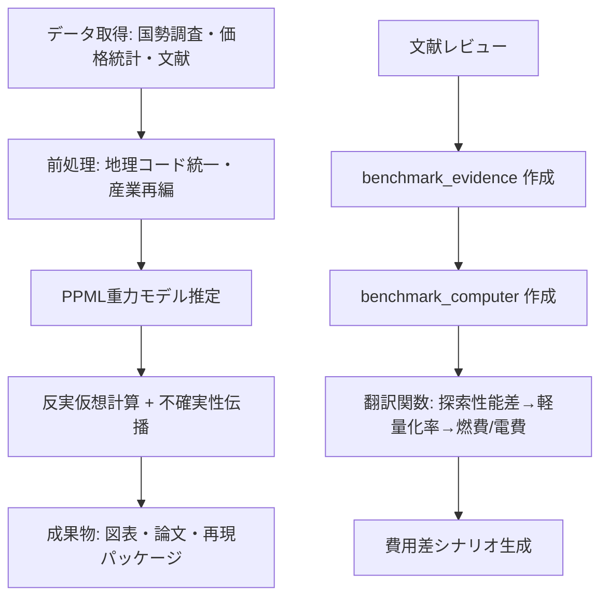

# パイプライン

```mermaid
flowchart TD
S[データ取得: 国勢調査・価格統計・文献] --> P1[前処理: 地理コード統一・産業再編]
L[文献レビュー] --> B1[benchmark_evidence 作成]
B1 --> B2[benchmark_computer 作成]
B2 --> T[翻訳関数: 探索性能差→軽量化率→燃費/電費]
P1 --> M[PPML重力モデル推定]
T --> C[費用差シナリオ生成]
M --> R[反実仮想計算 + 不確実性伝播]
R --> O[成果物: 図表・論文・再現パッケージ]
```
