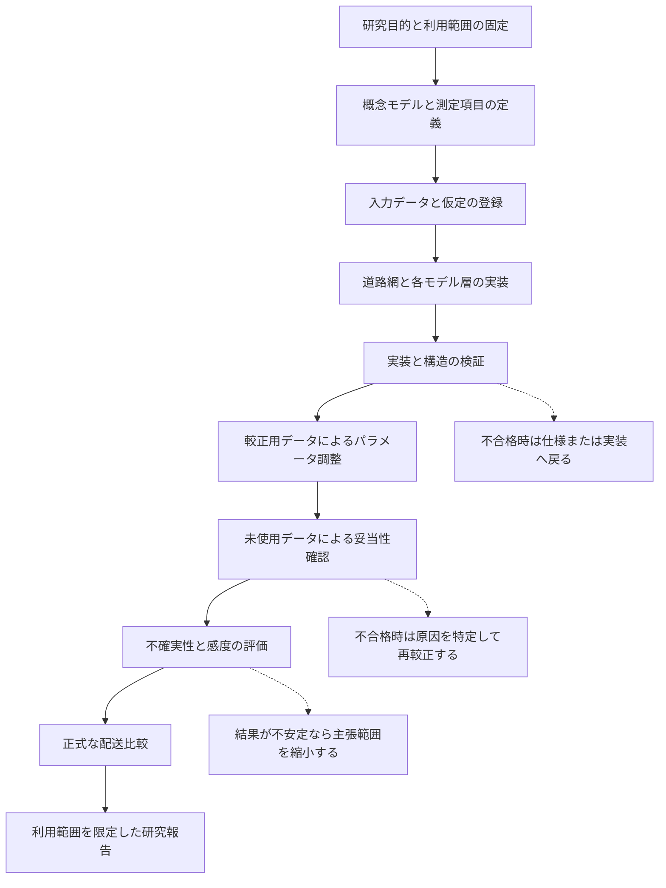

# シミュレーションモデルの作成・検証・妥当性確認

文書識別子: `DOC-SIMULATION-MODEL-DEVELOPMENT-VV`
役割: `CURRENT_REFERENCE`
ライフサイクル: `CURRENT`
作成日: `2026-07-30`
最終更新日: `2026-09-03`
現行正本: `reproducibility/indexes/research_repository_index_v17.yml`

> **文書状態**: 現行方針  
> **作成日**: 2026-07-30  
> **現状更新日**: 2026-08-14
> **対象**: 東京・大田区を起点とするスーモ交通シミュレーション、電気自動車配送評価、古典手法と回路シミュレーション手法の比較\
> **現在地**: v17属性解決段階1〜12は合格。段階12は2回の実行の単体検査、主要5成果物一致、実行条件比較、`finalize()`、原子的公開まで完了。108,189件の統制対象阻害要因が残るため`formal_build_ready`は`false`。段階13は未着手、段階14はゲート待ち。交通モデルの較正、独立妥当性確認、正式配送比較、熟練運転者の感度分析は未実施。

## 目次

- [0. 最初に確認する現在地と次の作業](#0-最初に確認する現在地と次の作業)
  - [0.1 結論](#01-結論)
  - [0.2 v17属性解決段階1〜14の現在地](#02-v17属性解決段階114の現在地)
  - [0.3 研究全体の現在地](#03-研究全体の現在地)
  - [0.4 直近の実行順序](#04-直近の実行順序)
  - [0.5 現状の課題・解決策](#05-現状の課題解決策)
  - [0.6 解決策の詳細](#06-解決策の詳細)
- [1. この文書の目的](#1-この文書の目的)
- [2. V&Vの意味](#2-vvの意味)
- [3. 評価対象となるモデルの層](#3-評価対象となるモデルの層)
- [4. モデル作成とV&Vの全体像](#4-モデル作成とvvの全体像)
- [5. 研究目的と利用目的の固定](#5-研究目的と利用目的の固定)
- [6. 概念モデルの作成](#6-概念モデルの作成)
- [7. 入力データと仮定の統制](#7-入力データと仮定の統制)
- [8. 実装の検証](#8-実装の検証)
- [9. 道路網の検証](#9-道路網の検証)
- [10. 交通モデルの較正](#10-交通モデルの較正)
- [11. 独立データによる妥当性確認](#11-独立データによる妥当性確認)
- [12. 配送・電気自動車・最適化評価のV&V](#12-配送ev最適化評価のvv)
- [13. 指標と合格基準](#13-指標と合格基準)
- [14. 不確実性と感度分析](#14-不確実性と感度分析)
- [15. 変更時の無効化規則](#15-変更時の無効化規則)
- [16. 証拠と再現性](#16-証拠と再現性)
- [17. 現在の検証状態](#17-現在の検証状態)
- [18. 正式評価へ進む条件](#18-正式評価へ進む条件)
- [19. 本研究で主張できることとできないこと](#19-本研究で主張できることとできないこと)
- [20. 関連文書](#20-関連文書)

## 0. 最初に確認する現在地と次の作業

### 0.1 結論

2026年8月14日現在、研究は**道路網の実装検証途中**にある。v17属性解決 Phase 12は
正式に合格し、次の作業単位はPhase 13の阻害要因根本原因解消である。交通モデル全体の
検証や配送手法の正式比較にはまだ進んでいない。

Phase 12の`run_1`と`run_2`は各8 検証器に合格し、主要5成果物の意味上の ハッシュ値と実行条件が
一致した。実引数は保持し、比較時だけ各実行自身に一致する`--run-id`値を正規化した。
`determinism_report.json`と`published/`を生成し、正式完了記録を作成した。

### 0.2 v17属性解決段階1〜14の現在地

ここで`v17`の`v`は**版**を表す。`V&V`の`V`は実装検証／検証を表し、
別の概念である。

| Phase | 内容 | 現在の状態 | 次に必要なこと |
|---:|---|---|---|
| 1〜11 | Authority同期、独立fixture/oracle、状態契約、方向付き区間、車線、接続、通行許可、速度、正式 根拠、統合試験 | **合格** | Phase単体の再作業は不要。上流変更時のみ影響範囲を再検証する |
| 12 | 固定v16母集団をv17 structural/formalで2回全件実行し、阻害要因・除外・母集団差を記録する | **合格** | 完了記録、決定論報告、公開成果物を生成済み。阻害要因をPhase 13へ引き渡す |
| 13 | Phase 12で得た停止記録を根本原因別に解消し、全件再実行する | **未着手** | Phase 12正式確定後、判断→規則→データ構造→検証用データ→正解判定器→コード→試験→全件実行の順で解消する |
| 14 | 属性解決の受入 | **ゲート待ち** | 阻害要因、確認-必須、配送地点-未解決、モデル-assumedを各0件にして受入検査を行う |

Phase 1〜14の定義、完了条件、証拠、Phase 12の実数は
`v17_phase1_to_phase14_integrated_status.md`を参照する。

### 0.3 研究全体の現在地

| 研究工程 | 状態 | 現在の意味 |
|---|---|---|
| 大田区研究範囲・基礎入力・来歴 | 完了 | N03、オープンストリートマップ、日本道路交通情報センター 1時間保存時点の記録、人口・需要代理データを登録済み |
| v17道路属性解決 | 進行中 | Phase 12合格。Phase 13の阻害要因解消前 |
| 正式スーモ道路網 | 未承認 | Phase 14後にも通行許可の具体化処理、接続、信号制御、道路網統合受入が必要 |
| 交通需要・信号・車両・運転行動 | 未着手 | 正式道路網と追加観測・設定が必要 |
| 交通モデルCalibration | 未着手 | 較正用の複数日時・複数地点観測が必要 |
| 独立検証 | 未着手 | 較正に使わない日時または地点の観測が必要 |
| 古典最適化・Qiskit Aer 量子近似最適化アルゴリズム正式比較 | 実行不可 | 独立検証済み交通環境と共通配送問題が必要 |
| Experienced Driver／運転挙動異質性感度分析 | 未着手 | 主参照データの取得・登録、前処理、階層推定、多出力逆較正、較正済み東京基準モデルが必要 |
| 電気自動車配送評価 | 未着手 | 車両・電池・充電データと上流工程の合格が必要 |

### 0.4 直近の実行順序

次の順序は単なる作業予定ではなく、上流の誤りや未確定値を下流の正式結果へ持ち込まない
ための依存順序である。前段のゲートが不合格の場合は後段へ進まず、原因が属する仕様、
データ、実装または試験へ戻る。

| 順序 | 行うこと | なぜ行うか | 完了・次へ進む条件 |
|---:|---|---|---|
| 1 | **完了:** Phase 12の完了検証器を実装・実行する | 合格表示を実検査に一致させるため | 8単体検証器と全体完了判定 判定基準が合格済み |
| 2 | **完了:** Phase 12 実行器、失敗経路、`finalize`、公開処理を試験する | 部分失敗、上書き、誤公開を防止するため | 関連35試験が合格済み |
| 3 | **完了:** 既存成果物を直接編集せず、Phase 12を2回独立実行する | 入力から出力までの来歴と決定論を保持するため | 固定変更記録、入力、コンテナー ハッシュ値、乱数の種による2runが合格済み |
| 4 | **完了:** Phase 12の全ゲートを検査し、完了記録とロードマップを更新する | Phase全体の正式判定を証拠化するため | `v17_phase12_completion.yml`、決定性 報告、公開成果物を生成済み |
| 5 | Phase 13で停止記録を根本原因別に解消し、全件再実行する | Phase 12は停止の完全な棚卸しであり、正式属性を承認可能にする工程ではない。欠損を既定値で埋めたり件数の多さだけで除外したりせず、原因ごとに証拠と規則を直す必要があるため | 判断、登録簿、データ構造、不変条件、検証用データ、独立正解判定器、コード、試験、全件実行の順を守り、未証明記録を残さない |
| 6 | Phase 14 属性解決の受入を行う | 個別Phaseや全件実行の成功と、正式属性全体を正式入力として受け入れる判断は別だからである | 阻害要因、確認-必須、配送地点-未解決、モデル-assumedが各0件で、全記録、通行許可被覆、母集団式、データ構造、意味、正解判定器、2回一致が合格する |
| 7 | 交通シミュレーターの道路網統合受入を行う | Phase 14が確認するのは属性解決であり、スーモの道路区間、車線、接続、右左折制限、信号制御、左側通行、到達可能性を保証しないため | 通行許可の具体化処理、最終 接続 set、信号制御 確認、スーモ 1.24.0読込み、構造・到達可能性・来歴監査が合格する |
| 8 | 交通需要、信号、車両、運転行動を固定し、Calibrationと独立検証を行う | 正式道路網だけでは現実の交通量、速度、旅行時間、渋滞を再現できない。較正データへの一致だけでは過適合を判定できないため | 較正用観測でパラメーターを固定し、未使用の日時または地点で事前定義した検証基準に合格する |
| 9 | 共通配送問題を凍結し、古典最適化とQiskit Aer 量子近似最適化アルゴリズムを正式比較する | 両方式に異なる需要、制約、コスト、乱数の種、復号・修復規則を与えると、手法差と入力差を区別できないため | 同一SHA-256の問題、目的関数、制約、コスト行列、評価関数を使用し、同一の独立検証済みスーモ環境で比較結果を再現できる |
| 10 | 独立した感度段階でExperienced Driver／運転挙動異質性を追加する | 海外のexpert・novice差を未較正の東京モデルへ先に入れると、道路・交通モデル誤差と運転者異質性の影響を識別できず、正式解法比較の公平性も崩れるため | 基準比較を固定後、受理済み出典、階層推定、多出力逆較正、移転係数、`M`・`V`・`C`系列、対照、乱数の種を事前固定して感度結果を分離報告できる |

### 0.5 現状の課題・解決策

Phase 12の実行・検査・最終化に関する課題は解消済みである。現在の課題はPhase 13以降の
正式道路網・交通検証・配送評価を止める問題として管理する。件数が多いことだけを理由に属性を補完または除外せず、
各課題について原因、証拠、修正、再試験、受入の順を保持する。

| 優先度 | 現状の課題 | 影響 | 解決策 | 解消したと判断する条件 |
|---:|---|---|---|---|
| 1 | **解消済み:** Phase 12成果物、進捗記録、完了記録を同期した | Phase 12の重複実行や誤使用を防ぐ | 完了記録、ロードマップ、実行成果物一覧、決定性 報告が同じ判定を示す |
| 2 | **解消済み:** 実コマンド操作引数と固定コンテナー ハッシュ値を正式実行へ記録した | 実行条件を再現可能にする | `--run-id`以外が一致し、実行 識別子の正規化規則が報告に記録される |
| 3 | **解消済み:** Phase 12の全完了判定 判定基準を実行した | 未検査項目を合格表示しない | 8 検証器、全byte/semantic ハッシュ値、母集団式、識別子、登録値が合格する |
| 4 | **解消済み:** `finalize`と公開の失敗経路を試験した | 部分公開、上書き、2run不一致を防ぐ | 35試験、最終化、原子的公開が合格する |
| 5 | **正式 阻害要因が大量に残る**。既存Phase 12成果物では阻害要因一覧が108,189件である | 正式属性が未完成で、Phase 14 属性解決の受入へ進めない | 件数を異なる母集団間で単純合算して判断せず、`attribute_name`、`stop_code`、`root_cause_category`、出典 道路地物、影響通行許可で集計する。高頻度原因ごとに判断、外部証拠、登録簿、検証用データ、正解判定器、コードを改訂する | 管理対象の 阻害要因、確認-必須、配送地点-未解決、モデル-assumedが各0件になり、再実行の母集団式と2回一致が合格する |
| 6 | **方向別 車線の根拠不足・競合が残る**。既存成果物では26,220 管理対象のに対し24,114 未解決、24 矛盾である | 方向別車線とその下流の車線 通行許可候補が正式に確定しない | `lanes`、`lanes:forward`、`lanes:backward`、`lanes:both_ways`、方向、関係、道路管理資料を道路地物単位で照合する。正式で根拠のない均等分割を使わず、必要なら証拠取得または登録規則を追加する | 各方向付き区間の車線vectorが根拠・規則識別子・来歴を持ち、競合と未解決が0件になる |
| 7 | **最終 通行許可が未解決である**。既存成果物では6,984 管理対象のに対し4,864 未解決である | 管理対象車種がどの車線・接続を通行できるか確定せず、通行許可の具体化処理へ渡せない | 通行許可 阻害要因を上流の接続 規則不足へリンクし、車種概念体系、静的・条件付き接続、範囲、axis dominanceを根本原因別に修正する。道路種別の対応表既定値を正式権威にしない | 全通行許可 組が解決済みとなり、各値に適用規則と上流原因の来歴がある |
| 8 | **速度が未解決である**。既存成果物では94,745 管理対象のに対し78,601 未解決である | 旅行時間、容量、遅延、電気自動車電力消費の正式計算へ使用できない | オープンストリートマップ明示値、方向別・条件付き速度、公式道路状態証拠、承認済み日本速度規則を順に適用する。法定速度、助言速度、simulation速度を分離し、道路種別の対応表既定速度を正式値にしない | 全正式 速度 記録が承認済み根拠または規則で解決済みとなり、単位・方向・期間・値 出発地が検証される |
| 9 | **正式スーモ道路網が未承認である** | 属性が解決しても、車線・接続・信号制御・左側通行・到達可能性の不具合により実走行評価が誤る可能性がある | Phase 14後に通行許可の具体化処理、最終 接続 set、信号制御 確認、スーモ 1.24.0固定検証用データ、post-構築 監査を実施する | 道路網統合受入で構造、通行許可、右左折制限、信号制御、警告、車種別到達可能性、出典・来歴が合格する |
| 10 | **Calibrationと独立検証に必要な交通観測が不足している**。現在は日本道路交通情報センターの1時間保存時点の記録が中心である | 一時点への過適合を検出できず、大田区の対象時間帯を再現する交通モデルと主張できない | 日本道路交通情報センター、道路交通センサス、警視庁交通量等から複数日時・地点・方向・車種の観測を取得し、結果を見る前にCalibration用と独立検証用へ分離する | 対象地域・時間帯を覆う観測台帳が完成し、較正後に未使用データで事前固定した誤差基準へ合格する |
| 11 | **信号、車両、運転行動、電気自動車、充電の正式設定が未固定である** | 道路網だけが正しくても、旅行時間、渋滞、電力、配送完了を妥当に評価できない | 公式資料・観測・承認済みモデル値を分離し、信号現示、車種構成、車両性能、運転パラメーター、電気自動車電池・電費、充電器をデータ構造と設定へ登録する | 各値の出典、単位、対象条件、調整可否、不確実性、検証方法が固定される |
| 12 | **Experienced Driverデータが未取得・未登録である** | 出典群差、個人間分散、東京への移転可能性を検証できず、感度分析を再現できない | Expert Driving Datasetの公開版・利用条件・検証方式を決め、原本、SHA-256、出典台帳、取得記録、正本加工表、20運転者を単位とする階層推定、多出力逆較正を整備する | 受理済み出典と前処理から群効果・個人差・不確実性を再生成でき、`M`・`V`・`C`系列と対照を事前固定できる |
| 13 | **Phase番号と研究実装「段階」番号が併存している** | `v17 Phase 14`をExperienced Driverの研究実装「段階14」と誤解する可能性がある | 文書では必ず`v17属性解決 Phase`または`研究実装 段階`と体系名を併記し、旧工程番号は対応表なしに現在地判断へ使わない | 主要日本語資料、ロードマップ、完了記録で番号体系と版が一意に識別できる |

直近の最優先課題は5〜8の正式 阻害要因である。Phase 12で固定した阻害要因一覧を
Phase 13の開始証拠として使用し、Phase 14の受入証拠には阻害要因解消後の再実行結果を使用する。

### 0.6 解決策の詳細

以下は0.5の各課題に対する実施仕様である。ここで示す順序を変える場合は、変更理由、
影響する証拠、無効化する成果物、代替する検査を判断 記録へ残す。

#### 0.6.1 段階12の成果物・進捗記録・実行記録を一致させる

**対象課題:** 0.5の1〜4

この解決策は2026-08-14に完了した。`run_1`、`run_2`と生成成果物は直接編集していない。

実施内容は次のとおりである。

1. **実装済み:** コマンド操作で受け取った`--run-id`、`--container-image`、`--container-digest`を、
   省略・順序を含む実際の引数列として環境 成果物一覧の`arguments`へ渡す。
   固定の架空引数`--profile structural --profile formal`は新規実行で記録しない。
2. **実装済み:** `container_digest`の既定値`local-unpinned`を廃止し、正式実行では
   `sha256:<64桁の小文字hex>`を必須とする。空値、未固定値、不正形式はGit検査や成果物生成より
   前に停止する。検証済みのコンテナー image名とハッシュ値を環境 成果物一覧へ記録する。
3. 実行開始前にGit作業ツリー、出典 変更記録、固定入力、設定、登録簿、データ構造、
   想定条件 Context、阻害要因 方針の存在とSHA-256を検査する。
4. 1回の実行について、全stage出力を一時ディレクトリに生成する。途中stageが失敗した場合、
   最終 保存先または`published`へ部分成果物を残さない。
5. **実装・実行済み:** 各実行単体の完了判定 検証器が構造上の・正式処理設定、
   阻害要因一覧、除外 成果物一覧、母集団 会計の存在とデータ構造を検証する。
   環境 成果物一覧と実行 成果物一覧を含む全実行成果物を最終化時に再検査する。
6. 意味上の ハッシュ値は格納値を除いた正本 ジェイソン形式から再計算する。実行 成果物一覧に記録した
   バイト ハッシュ値は保存後の実ファイルから再計算する。
7. `run_manifest.json`は自身を参照せず、他の6 実行成果物を一度ずつ参照することを検査する。
8. **主要5成果物は実装済み:** `validation_results`のデータ構造、意味整合、母集団保存則、
   識別子一意性は単体完了判定 検証器の結果対象から生成する。8 検証器はそれぞれ
   独立コマンド操作として実行し、実際のコマンド引数列、終了コード、stdout/stderrを含む正本 記録、
   記録のSHA-256を`run_manifest.json`の`validator_executions`へ記録する。各コマンド操作が返す
   `required`、`completed`、`failed`から項目別合否と実行全体合否を集約し、固定文字列の
   `passed`は成果物一覧生成に使用しない。
9. **実行済み:** `finalize`時に両実行の実行 成果物一覧と環境 成果物一覧をデータ構造検証し、出典 変更記録、
   input hash、configuration hash、Schema hash、Registry hash、library version、command、
   arguments、乱数の種、コンテナー ハッシュ値の一致を確認する。実引数は保持し、各実行自身に一致する
   `--run-id`値だけを`<run_id>`へ正規化して比較する。
10. 決定論対象5成果物の意味上の SHA-256が完全一致した場合だけ、`run_1`から
    `published`を原子的に作成する。**実装済み:** 公開前に両run manifest、8 validatorの
    command・終了コード・検査件数・結果・ログhash、参照成果物のbyte/semantic hashを再検証し、
    失敗run、既存determinism report、既存`published`、既存一時公開pathがあれば上書きせず停止する。

完了判定 検証器では、少なくとも次を個別判定基準として出力する。

2026-08-13時点で、各実行の主要5成果物について`required_artifacts`、`schema`、
`semantic_hash`、`semantic`、`identity_uniqueness`、`population_accounting`、
`registered_values`、`blocker_exclusion`の8 判定基準を実装済みである。既存`run_1`と`run_2`は
双方とも8 判定基準に合格した。全成果物、バイト ハッシュ値、実行 成果物一覧、環境、2回一致、公開も
2026-08-14の全体completion/finalize 判定基準で合格した。

| Gate | 検査内容 | 不合格時の扱い |
|---|---|---|
| required artifacts | 契約で定めた8成果物が正確な保存先に存在する | Phase 12 不合格。公開しない |
| データ構造 | すべての成果物が対応データ構造に適合する | 当該成果物と実行を無効化する |
| semantic hash | 正本 ジェイソン形式から再計算したハッシュ値が格納値と一致する | 改変またはserialization不整合として停止する |
| byte hash | 実行 成果物一覧の全バイト ハッシュ値が保存ファイルと一致する | 成果物一覧または成果物破損として停止する |
| 同一性 | 記録 識別子、阻害要因 識別子、最上位-cause 識別子、成果物 識別子に禁止された重複がない | 識別子生成規則を修正して実行を再生成する |
| population equations | `input = governed + excluded`、`governed = resolved + unresolved + conflict + invalid + valid_but_unsupported` | 集計実装を修正し、生成物を直接直さない |
| registered values | 未登録状況、停止コード、仮定 識別子、除外 規則 識別子が0件 | 登録簿または実装を判断-firstで改訂する |
| blocker causality | 通行許可 阻害要因が存在する最上位-cause 記録へリンクし、suppressed 候補を欠落させない | 阻害要因一覧生成を修正する |
| 除外 | 空の場合も成果物一覧、比率、道路網 impactが存在し、除外が登録規則に基づく | 除外を撤回または正式な証拠・規則を追加する |
| environment equality | 2回の出典、入力、設定、環境、引数、乱数の種が一致する | 比較不能として両実行を完了扱いにしない |
| 決定性 | 決定論対象5成果物の意味上の ハッシュ値が2回で一致する | 非決定要因を特定し、修正後に新規2回実行を行う |
| publication | 全判定基準合格後にのみ、既存保存先を上書きせず原子的に公開する | 部分公開を削除対象ではなく失敗証拠として隔離する |

追加する試験は、正式運用全件データではなく小型検証用データを基本とする。

2026-08-13時点で、正常系、主要成果物欠落、意味上の値改変、識別子重複、母集団式不整合、
既存成果物上書き拒否、失敗実行からの公開禁止、既存`published`上書き拒否を実装済みである。

- 正常な`run_1`と`run_2`が同じ意味上の成果物を作る試験
- 実コマンド操作引数と成果物一覧の`arguments`が一致する試験
- stage例外時に最終 成果物と`published`を作らない試験
- データ構造不合格、意味上の ハッシュ値不一致、バイト ハッシュ値不一致を拒否する試験
- 記録 識別子、阻害要因 識別子、最上位-cause 識別子の重複を拒否する試験
- 母集団式の各辺を1件ずつ変更した場合に不合格となる試験
- 未登録仮定または除外 規則を拒否する試験
- 通行許可 阻害要因の最上位-cause リンク欠落を拒否する試験
- 実行間でコンテナー ハッシュ値、引数、乱数の種のいずれかが違う場合に公開しない試験
- 既存実行、既存決定性 報告、既存`published`を上書きしない試験

修正後は、新しい実行識別子または新しい出力最上位を契約で固定する。正式実行はDockerの
固定image ハッシュ値で2回実行し、次をGit管理する。

2026-08-13の修正後独立再実行では、既存成果物と分離した出力最上位
`reproducibility/outputs/traffic_simulation/attribute_resolution_v17/phase12_20260813_independent_rerun`
を機械契約に固定する。
Phase 12属性解決はスーモ 二値を呼び出さないため、環境 成果物一覧には虚偽の版番号ではなく
`sumo_version: not_invoked_phase12`を記録する。スーモ版固定・実測は後続道路網 Integrationで行う。
この出力最上位への`run_1`、`run_2`は2026-08-13に実行済みで、双方とも8個の実行単体判定基準と
実行後の独立コマンド操作再検査に合格した。主要5成果物の意味上の SHA-256も一致し、2026-08-14に
two-実行 finalize、決定性 報告生成、原子的公開が合格した。Phase 12は正式完了とする。
ただし正式 阻害要因 108,189件が残るため、正式 構築 準備完了は主張しない。

- 段階12の完了記録
- 完了判定 検証器の判定基準別結果
- 実行 識別子、出典 変更記録、コンテナー ハッシュ値、成果物SHA-256の索引
- 阻害要因集計への引継ぎ
- 更新後の`v17_phase9_to_phase14_execution_roadmap.yml`
- 更新後の研究現在地

#### 0.6.2 段階13で正式 阻害要因を根本原因別に解消する

**対象課題:** 0.5の5〜8

Phase 12正式完了後、阻害要因一覧を次の軸で集計する。

- `attribute_name`
- `stop_code`
- `root_cause_category`
- 出典 道路地物またはRelation
- 方向、車線 位置、車種、想定条件 Context
- 上流阻害要因が抑止した方向付き区間・車線 組・通行許可候補数

108,189件は異なる属性母集団の阻害要因 記録総数であり、108,189本の道路または
108,189個の独立原因を意味しない。上流原因と下流通行許可影響を単純加算せず、
正本 阻害要因 識別子とcausal 道路区間を保持したまま優先順位を決める。

各根本原因は、次の順序で解消する。

1. **判断 記録:** 現象、対象母集団、採用・不採用案、外部根拠、影響範囲を記録する。
2. **登録簿または判断 table:** 人手判断を再実行可能な規則へ変換する。
3. **データ構造:** 新しい値、状態、根拠、規則識別子を機械的に制約する。
4. **意味上の不変条件:** 複数項目、方向、車線、車種間の意味条件を追加する。
5. **small 検証用データ:** 正常、境界、異常、競合、未対応の最小入力を作る。
6. **正式運用-independent 正解判定器:** 正式運用 コードの出力を見ずに期待値を固定する。
7. **正式運用 コード:** 不確実な場合は拒否を保ったまま属性解決器へ実装する。
8. **段階 試験・regression:** 新規規則と既存規則の非退行を確認する。
9. **母集団全体 実行:** 新しい出力先で構造上の・正式を再生成する。
10. **impact 確認:** 阻害要因減少だけでなく、新規競合、通行許可変化、道路網影響を確認する。

属性別の解決方針は次のとおりである。

| 属性 | 詳細な解決方法 | 禁止事項 |
|---|---|---|
| directional lanes | オープンストリートマップの総車線、方向別車線、中央共用車線、`oneway`、関係、出典 ノード順を同じ道路地物単位で照合する。道路管理資料等の正式証拠を追加する場合は対象区間・方向・基準日をハッシュ値-境界 記録へする | 正式で偶数車線を自動的に半分へ割る、構造上の仮定を正式へ昇格する、競合値の一方を黙って採る |
| static access | `access`、`vehicle`、`motor_vehicle`、個別車種、方向・車線 接尾辞を範囲と車両 概念体系に従って比較する。最大適用規則が複数なら優先順位ではなく支配関係と競合を検査する | 道路種別の対応表既定値を現実の通行許可とみなす、未知車種を既知車種へ無根拠に統合する |
| conditional access | 条件式grammar、曜日、時刻、祝日、日付範囲、評価区間内変化を想定条件 Contextで評価する。区間内に値が変わる場合は時間分割規則がない限り停止する | 条件を無視して静的値へ代替値する、解析不能条件を常時許可または禁止とみなす |
| final permission | 静的・条件付き・範囲・axis dominanceから全車線×車種 組を生成し、未解決組を最上位 causeへリンクする | 欠落 組を通行許可なしと数える、上流で生成抑止された候補を影響0とする |
| 速度 | 明示値、方向別値、条件付き値、承認済み公式証拠、日本速度規則の順を固定する。法的`maxspeed`、助言速度、simulation希望速度を別項目にする | `JP:urban`を道路状態証拠なしに数値化する、道路種別の対応表速度を正式法定速度とする |

頻度が高い原因から着手してよいが、頻度は補完や除外の許可根拠にはならない。
正式除外は、研究対象外であることを独立証拠で示し、登録済み除外規則、比率、道路網影響を
記録できる場合だけ認める。

#### 0.6.3 段階14で属性解決を受け入れる

**対象課題:** 0.5の5〜8および13

Phase 14では、Phase 13の最終2回実行を入力として、次を一括検査する。

- `complete=true`
- 管理対象の 阻害要因が0件
- `review_required=0`
- `stop_unresolved=0`
- `model_assumed=0`
- すべての管理対象の 記録が解決済み
- 宣言母集団、除外母集団、属性記録、通行許可 組の被覆が一致
- データ構造、意味上の不変条件、独立正解判定器が合格
- v16から保持すべき分類 projectionが不変
- 記録・self-ハッシュ値・実行 成果物一覧・入力参照ハッシュ値が一致
- 構造上の成果物と正式成果物が混在しない
- 独立2回実行の決定論が合格

受入成果物一覧には、設定 識別子、方針 識別子、母集団 版、実行 識別子、変更記録、
コンテナー ハッシュ値、件数、分布、検査結果、受入者、受入日、既知の限界を記録する。
一つでも不合格ならPhase 13へ戻り、成果物を直接編集しない。

#### 0.6.4 正式スーモ道路網を生成・統合検証する

**対象課題:** 0.5の9

Phase 14合格後、正式属性成果物から暫定 道路網 入力を生成し、オープンストリートマップ 道路地物・
方向付き区間・スーモ 道路区間の厳密 出典・来歴を保存する。通行許可の具体化処理は
属性解決器の通行許可 期待値を車線と接続へ明示的に反映し、生成済み
`net.xml`を直接編集しない。

実施順序は次とする。

1. 正式属性と出典 lineageから暫定 道路区間・車線入力を生成する。
2. 車線 通行許可を具体化する。
3. 通行許可を満たす最終 接続候補を生成し、空車線、空道路区間、存在しない接続を停止する。
4. 右左折制限と管理対象車種の接続 通行許可を照合する。
5. 最終 接続 set確定後に信号 交差点と信号制御 リンク 索引を確認する。
6. スーモ 1.24.0で`netconvert`し、注意事項を登録済み分類へ割り当てる。
7. 道路区間方向、車線数・順序、左側通行、通行許可、接続、信号制御 段階 状態長を監査する。
8. 車種別到達可能性、最大成分、配送拠点・顧客・充電候補間の往復到達性を検査する。
9. 出典、設定、コマンド、交通シミュレーターの版、出力、監査のSHA-256を成果物一覧へ保存する。

小型検証用データで車線・接続期待値を先に検証し、その後に実データ全体へ適用する。
道路網統合受入合格までは正式属性合格を「正式スーモ道路網完成」と表現しない。

#### 0.6.5 交通観測を拡充し、較正と独立妥当性確認を分離する

**対象課題:** 0.5の10

観測計画を、データ取得前に次のように固定する。

- 対象地域、道路分類、方向、地点、曜日、時間帯、季節
- 交通量、速度、旅行時間、車種構成等の観測変数と単位
- 欠測、異常フラグ、sensor重複、時間集計、地図対応の規則
- Calibration用と独立検証用の日時・地点分割
- 評価指標、重み、許容誤差、合否と保留の条件

日本道路交通情報センターの追加期間を保存期間内に取得し、道路交通センサスと警視庁交通量を補助根拠として
登録する。各原本は出典台帳、取得日、対象期間、利用条件、SHA-256、加工スクリプト、品質まとめを
持つ。道路へのマップ matchingは方向と位置誤差を保存し、一意に対応できない観測を較正へ混入しない。

Calibrationでは需要量、経路選択、信号、車両・追従パラメーターの調整可能範囲を事前固定し、
複数指標を同時に評価する。同じ観測でパラメーターを選び、その同じ観測だけで検証合格と
しない。独立検証不合格時は誤差を道路網、需要、信号、車両、観測対応へ分解し、原因に
応じた上流工程へ戻る。

#### 0.6.6 信号・車両・運転行動・電気自動車・充電データを固定する

**対象課題:** 0.5の11

各データを観測値、公式・外部資料、地図明示値、規則導出値、モデル 値、構造確認用代替値へ
分類する。値ごとに出典 識別子、基準日、地域・車種、単位、加工、調整可否、範囲、不確実性、
無効化条件を設定へ記録する。

| モデル層 | 固定する内容 | 主な検証 |
|---|---|---|
| 信号 | cycle、段階、状態、所要時間、位置補正値、制御接続 | 接続数と状態長、現示順、観測旅行時間・停止との整合 |
| 一般車両 | 車長、最高速度、加減速度、車種構成、出発分布 | 公式仕様、観測車種比、保存則、極端値 |
| 運転行動 | car-following モデル、`tau`、`sigma`、車線 change等 | パラメーターではなく速度・車間・加減速・停止等の多出力で較正 |
| 電気自動車 | 電池容量、初期残量、消費、回生、最低残量、空調影響 | 単位、状態遷移、エネルギー収支、公式仕様・測定条件 |
| 充電 | 位置、connector、出力、利用時間、同時数、待ち | 保存時点の記録時点、重複・廃止、道路到達性、充電量・時間整合 |

根拠がない値は正式値として確定せず、感度範囲を持つモデル 値として表示する。

#### 0.6.7 熟練運転者データと感度分析を整備する

**対象課題:** 0.5の12

Experienced Driverは上流の道路・交通モデルを修正するためのデータではなく、独立検証済み
東京基準モデルに後から加える感度要因とする。詳細は20.1.4に従う。

データ取得では、Expert Driving Datasetの公開版 識別子、DOI、利用条件、各検証方式のファイル list、
容量、公開・申請制限を確認する。取得後は原本を`driver_behavior/`へ保存し、ファイル単位または
公開版 成果物一覧単位のSHA-256、取得日、提供元URL、利用条件を出典台帳と取得記録へ追加する。

加工は次の4表を分離する。

- `driver_condition_metrics.parquet`: 運転者×条件のCAN・GNSS・視覚的交通曝露
- `trip_level_evaluations.parquet`: 走行前後の快適性・主観評価
- `driver_effect_posterior.parquet`: 出典群効果、運転者効果、不確実性
- `preprocessing_sensitivity.parquet`: 再標本化、絞り込み、微分、閾値別の結果

20運転者を独立標本とする階層モデルを使用し、条件行を独立標本として扱わない。
Traffic Recorder値を道路交通量と呼ばず、EEG、心拍、視線を単一の熟練度得点へ合成しない。
東京への移転係数`lambda`、設定プロファイル構成比、平均、分散を事前固定し、多出力逆較正で
スーモ 設定プロファイル候補を作る。

正式基準比較を変更せず、次を独立系列として実行する。

- `M`: 設定プロファイル構成比を変え、平均と分散を含む総効果を見る
- `V`: 平均を概ね固定し、異質性・分散の効果を見る
- `C`: 分散を概ね固定し、平均能力の効果を見る
- `parameter-mean-matched`: パラメーター平均を合わせた均質対照
- `low-density-output-matched`: 低密度時の出力分布を合わせた均質対照

設定プロファイル割当、出発、経路、事故、スーモの乱数の種を役割別に保存し、対比較ではcommon random
numbersを使用する。結果は東京の母集団構成推定ではなく、移転係数を伴う感度範囲として報告する。

#### 0.6.8 番号体系と現状資料を継続的に統制する

**対象課題:** 0.5の13

文書、設定、変更記録 message、完了記録では、次の表記を使用する。

- `v17属性解決 Phase 12`のように版とPhase体系を併記する。
- `研究実装 段階14（運転挙動異質性）`のように研究実装体系を併記する。
- `V&V`は実装検証と妥当性確認の略とし、版の`v`と混同しない。
- v16母集団、v17方針、スーモ 1.24.0のように、何の版かを明記する。

Phase完了、実行生成、阻害要因件数、`formal_build_ready`、Acceptance状態、版変更のいずれかが
発生した場合、同じ変更セットで次を更新する。

1. 機械可読な完了記録・ロードマップ
2. `v17_phase1_to_phase14_integrated_status.md`
3. 本書の0章と17章
4. 必要に応じて`research_stage.yml`と研究ダッシュボード

自動検査では、Phase 現行 状態、next Phase、正式 構築 準備状況、Acceptance、主要件数が
文書と機械可読記録で矛盾していないことを確認する。古い状態を履歴として残す文書には、
「履歴」「基準日」「現行判断に使用しない」を明示する。

## 1. この文書の目的

この文書は、本研究のシミュレーションモデルをどの順序で作成し、何を根拠として
正しく実装されたと判断し、どの範囲で現実の交通・配送を表すモデルとして利用するかを
整理する。対象はスーモの道路網だけではない。一般交通、信号、車両、運転行動、
電気自動車の電力消費、配送需要、配送計画、評価指標までを、相互に依存する複数のモデル層
として扱う。

本書の役割は、個別仕様を置き換えることではない。個別の変換規則、データ形式、
失敗コード、較正手順は各仕様書と設定ファイルを正本とする。本書は、それらが
シミュレーションモデル全体の作成とV&Vのどこに位置するかを示す上位整理である。

本書では、次の混同を避ける。

- プログラムのテスト合格だけで、現実を十分に表すモデルとは判断しない。
- 観測値へ近づくようにパラメータを調整しただけで、独立した妥当性確認が済んだとは判断しない。
- 一つの道路や一つの時点が一致しただけで、大田区全域または東京全域へ一般化しない。
- シミュレーション内の配送完了を、実際の配送人数や社会厚生と同一視しない。
- Qiskit Aerによる回路シミュレーションを、量子ハードウェア上の性能実証と解釈しない。

## 2. V&Vの意味

本研究では、V&Vを実装検証と妥当性確認の略称として使用する。ただし、
本文では意味が分かるよう、原則として「実装・構造の検証」と「利用目的に対する
妥当性確認」と書き分ける。

この文書で使用する主な英語表記と略称は次のとおりである。

| 表記 | 日本語での意味 | 本研究で指す内容 |
|---|---|---|
| V&V | 検証と妥当性確認 | 仕様どおりの実装確認と、利用目的に対する現実との比較を組み合わせた評価 |
| 実装検証（実装検証） | 実装・構造の検証 | 決めた式、規則、データ変換、道路構造が正しく実装されているかの確認 |
| 妥当性確認（検証） | 利用目的に対する妥当性確認 | モデル出力を未使用の観測や独立した根拠と比較し、定めた用途に使用できるかを判断すること |
| 較正（Calibration） | 較正 | 較正用観測との誤差を小さくするよう、調整可能なモデル値を定めること |
| スーモ | 道路交通シミュレーター | 道路、車線、信号、車両移動を表現し、配送計画を交通環境内で実行するソフトウェア |
| 電気自動車 | 電気自動車 | 電池残量、電力消費、充電条件を持つ配送車両 |
| 量子近似最適化アルゴリズム | 量子近似最適化アルゴリズム | 配送問題を制約なし二値二次最適化へ変換し、Qiskit Aer上の回路シミュレーションで評価する手法 |
| Qiskit Aer | 量子回路シミュレーター | 古典計算機上で量子回路を模擬する実行環境。量子ハードウェアではない |
| SHA-256 | ファイル内容の識別値 | 入力、設定、出力が登録時から変わっていないかを確認するための値 |

### 2.1 実装検証（実装検証）

実装検証は、決めた仕様どおりにモデル、データ処理、プログラム、道路網が
作られているかを確認することである。問いは次のように表せる。

> 決めたモデルを正しく作ったか。

対象には、計算式、単位、データ形式、道路方向、車線対応、通行権限、車線間接続、
信号リンク、乱数、集計処理、制約判定、復号処理が含まれる。

実装検証に合格しても、現実との一致は保証されない。例えば、最高速度を常に
時速30キロメートルとするプログラムが仕様どおり動いていても、その仕様が東京の
対象道路を適切に表すとは限らない。

### 2.2 妥当性確認（検証）

妥当性確認は、作成したモデルが、定めた利用目的に対して必要な精度と振る舞いを
持つかを、現実の観測または独立した根拠と比較して確認することである。問いは
次のように表せる。

> このモデルは、定めた研究目的に使用できる程度に現実を表しているか。

妥当性確認は「現実を完全に再現した」という証明ではない。対象地域、時間帯、
天候、交通状態、車種、評価指標、許容誤差を限定した上で、その用途に対して利用
可能かを判断する。

### 2.3 較正（較正）

較正は、観測値とモデル出力の差が小さくなるように、需要、容量、経路選択、
信号時間、車両挙動などの調整可能なパラメータを定めることである。日本語では
「較正」と表記する。

較正は妥当性確認ではない。同じ観測データを使って値を調整し、その同じデータへの
一致だけを根拠に妥当と判断すると、過適合を検出できない。そのため、較正用データと
独立検証用データを、結果を見る前に日時または地点で分離する。

### 2.4 利用可否判断

実装検証と妥当性確認の結果を用いて、正式な研究評価に使えるかを判断する。
合格はモデル一般に対して与えるのではなく、次の組合せに対して与える。

- 対象地域
- 対象期間と時間帯
- 交通・天候・事故などの条件
- 使用するモデル版と設定版
- 評価対象となる指標
- 許容誤差
- 利用目的

条件が変われば、以前の合格状態をそのまま流用できるとは限らない。

## 3. 評価対象となるモデルの層

本研究のシミュレーションは一つのモデルではなく、次の層から構成される。上流の
誤りは下流の結果へ引き継がれるため、層ごとに検証してから統合する。

| モデル層 | 主な内容 | 主な確認事項 |
|---|---|---|
| 研究目的・概念モデル | 何を比較し、何を対象外とするか | 研究質問、境界、因果と代理指標の区別 |
| 地理・道路網 | 道路形状、方向、車線、通行規制、接続、信号 | 原本との対応、左側通行、接続性、通行可能性 |
| 一般交通需要 | 時間帯別流入、起終点、車種構成、経路選択 | 観測交通量、空間・時間分布、保存則 |
| 信号・車両・運転行動 | 信号現示、加減速、車間時間、車線変更 | 根拠、単位、許容範囲、観測との整合 |
| 電気自動車配送 | 車両、積載、電池、充電、配送地点、時間制約 | 状態推移、エネルギー収支、制約充足 |
| 配送計画 | 未最適化基準、古典手法、回路シミュレーション手法 | 同一問題、同一制約、復号、実行可能性 |
| 評価・集計 | 距離、時間、遅延、電力、配送完了量、人口相当 | 定義、集計単位、欠損処理、不確実性 |

道路網が正しくても、需要や信号が妥当でなければ旅行時間は妥当にならない。また、
交通モデルが妥当でも、電気自動車の電力式や配送制約が誤っていれば配送評価には使用できない。
したがって、「スーモが起動した」ことを、シミュレーション全体のV&V完了とは扱わない。

## 4. モデル作成とV&Vの全体像

次の図は、モデル作成と評価の管理関係を示す。矢印は、後段の判断が前段の成果物を
前提とすることを表す。結果が基準を満たさない場合は、原因が属する上流の定義、
データまたは実装へ戻る。

この流れは、一度だけ直線的に実行する工程ではない。修正により上流成果物の内容や
識別値が変わった場合、影響を受ける下流の較正、妥当性確認、正式評価を無効化して
再実行する。

## 5. 研究目的と利用目的の固定

モデル作成前に、少なくとも次を固定する。

1. 比較対象は、未最適化基準、古典最適化手法、Qiskit Aer上の量子近似最適化アルゴリズムである。
2. 各手法には、同じ配送地点、需要、車両、交通条件、距離・時間・電力コスト、
   目的関数、制約、実行可能性判定を与える。
3. 配送問題は、最適化開始後に新しい情報が到着しない固定インスタンスを基本とする。
4. 交通シミュレーションは、配送計画を道路上で実行した場合の運行結果を評価する。
5. 配送可能人口相当は、配送達成範囲を人口単位へ換算したモデル上の代理的概念であり、
   実際の受取人数を示さない。
6. 現時点では、排出量、顧客満足度、社会厚生、地域公平性、配送費用、収益を正式な
   評価対象に含めない。

利用目的を変更した場合、既存の検証結果を自動的に引き継がない。例えば、
平常時の日次配送を対象として妥当性確認したモデルを、事故発生時の即時再配送や
豪雨時の運転安全性評価へそのまま使用しない。

## 6. 概念モデルの作成

概念モデルは、現実の何を残し、何を単純化し、何を対象外とするかを定義した
シミュレーション実装前のモデルである。少なくとも次を文章と表で固定する。

- 対象地域と境界外道路を保持する理由
- 対象時間帯、準備時間、評価時間
- 道路、交差点、信号、車線間接続の表現
- 一般交通と配送車両の関係
- 配送需要、車両台数、積載、電池、充電の表現
- 時間依存情報として事前に与えるもの
- 最適化開始後には更新しない情報
- 観測値、外部証拠、モデル値、構造確認用代替値の区別
- 最終的な指標へ集約する規則

概念モデルのレビューでは、必要な現象が欠けていないかだけでなく、研究目的に不要な
要素を含めていないかも確認する。不要な自由度は較正時の識別性を低下させ、複数の
誤りが相互に相殺される可能性を高める。

## 7. 入力データと仮定の統制

すべての入力を次の区分で記録する。

| 区分 | 内容 | 例 |
|---|---|---|
| 観測値 | 対象地域・日時において測定された値 | 日本道路交通情報センター交通量・速度 |
| 公式・外部資料 | 法令、仕様、統計、車両資料などから採用する値 | 車両寸法、電池容量 |
| 地図明示値 | オープンストリートマップに明示された属性 | 一方通行、車線数、最高速度 |
| 規則による導出値 | 登録済み入力へ固定規則を適用した値 | 行政界から計算した取得範囲 |
| モデル値 | 現実を単純化して表すために採用した値 | 運転行動分布、充電処理 |
| 構造確認用代替値 | 正式評価には使用しない仮の値 | 非重要道路の仮車線数 |

各値について、出典、取得日、対象期間、対象地域、単位、加工処理、ファイルの
SHA-256、既知の限界を記録する。欠損値を補う場合は、補完可能な条件、使用する証拠、
優先順位、停止条件を事前に固定する。

入力データの形式が正しいことは、モデルの検証とは別である。例えば、交通量
コンマ区切り形式がデータ構造へ適合しても、その観測地点がスーモ道路へ正しく対応していることや、
観測期間が評価対象を代表することは別途確認する必要がある。

## 8. 実装の検証

実装検証では、モデルの意図がコードへ正しく変換されていることを確認する。

### 8.1 単体検証

- 単位変換と座標変換
- 車線位置とスーモ車線番号の対応
- 方向別通行権限の集合演算
- 電気自動車の電力消費と充電量の状態更新
- 積載量、時刻、配送完了の状態更新
- 目的関数、制約違反、ペナルティの計算
- 解の符号化、復号、修復処理
- 指標の集計と人口単位への換算

### 8.2 境界・失敗検証

正常例だけでなく、空集合、最小値、最大値、方向反転、参照欠損、重複、矛盾、
未知の値、単位不一致を与える。処理を継続できない場合は、暗黙の既定値で続行せず、
型付けした失敗コードと対象を記録して停止する。

### 8.3 固定された小型試験データ

小さな入力と期待結果を固定し、実装コードとは独立して正解データを作る。実装出力
から正解データを生成してはならない。固定スーモ 1.24.0環境で拡張マークアップ形式適合、道路網変換、
スーモ読込みまで確認する。

### 8.4 統合検証

個別処理が合格した後、入力取得、属性解決、道路網生成、信号構造、需要生成、
シミュレーション、結果抽出までを接続する。処理境界ごとにデータ構造、設定版、
入力SHA-256、出力件数を検査する。

## 9. 道路網の検証

道路網は、形状が地図らしく見えることだけでは合格しない。少なくとも次を検証する。

| 対象 | 確認内容 |
|---|---|
| 地理範囲 | 大田区行政界、取得用矩形範囲、境界外接続道路の区別 |
| 道路保持 | 対象道路種別の件数と延長、除外理由 |
| 方向 | 一方通行、逆方向指定、左側通行、方向別道路の対応 |
| 車線 | 車線数、方向別配分、車線番号、明示的な車線通行権限 |
| 交差点 | 平面交差、立体交差、結合・非結合、右左折接続 |
| 交通規制 | 一般車、配送車、バス等の通行可否と右左折規制 |
| 信号 | 制御対象接続、信号リンク番号、現示長の整合 |
| 接続性 | 最大走行可能成分、主要道路間、車庫・顧客・充電地点間の往復到達性 |
| 来歴 | 各スーモ道路・車線から元の地図道路と構成点順序を追跡できること |
| 実行 | 拡張マークアップ形式検査、`netconvert`成功、スーモ読込み、未分類警告ゼロ |

構造確認用道路網と正式用道路網を分ける。構造確認用代替値を含む道路網は、可視化、
接続確認、変換処理の開発には使えるが、較正、配送コスト行列、正式比較には使わない。

## 10. 交通モデルの較正

較正は、正式道路網と信号構造が承認された後に実施する。道路網の誤りを、需要量や
運転行動パラメータの調整で吸収してはならない。

較正順序は次のとおりとする。

1. 道路、車線、接続、信号構造を固定する。
2. 観測可能な一般交通需要を調整する。
3. 容量と飽和交通流を調整する。
4. 経路選択を調整する。
5. 旅行時間、速度、待ち行列を調整する。
6. 必要な範囲だけ局所パラメータを調整する。

一度にすべてのパラメータを自由にすると、異なる原因が同じ出力誤差を説明でき、
採用値を識別できなくなる。各パラメータについて、初期値、探索範囲、根拠、
目的指標、固定条件、停止規則を、結果を見る前に登録する。

複数の乱数シードを使用し、平均だけでなく分散または信頼区間を報告する。準備時間、
集計時間、反復回数、観測欠損の除外規則も事前に固定する。

## 11. 独立データによる妥当性確認

較正に使用していない日時または地点を用いて、次を評価する。

- 観測地点別交通量
- 平均速度と速度分布
- 旅行時間
- 時間帯内の変化
- 主要道路別の精度
- 待ち行列または渋滞長
- 流入・流出の保存
- 到達不能車両、テレポート、異常終了
- 乱数シード間の変動

指標の定義、集計単位、重み、合格基準は検証結果を見る前に固定する。
同一データを較正と独立検証の両方へ使用しない。

独立検証が不合格の場合、道路構造、観測地点対応、需要、信号、経路選択、
パラメータ識別性のどこに原因があるかを分けて確認する。検証データへ合わせて
パラメータを変更した場合、そのデータは以後、独立検証データではなく較正データ
として扱う。新たな未使用データで再度検証を行う。

## 12. 配送・電気自動車・最適化評価のV&V

### 12.1 配送状態と電気自動車状態

配送シミュレーションでは、各車両について少なくとも位置、時刻、積載量、電池残量、
充電、訪問済み顧客を追跡する。各移動後に保存則と制約を検査する。

- 積載量が負または容量超過にならない。
- 電池残量が負または容量超過にならない。
- 充電量と充電時間の関係が採用モデルと一致する。
- 同一顧客を意図せず重複配送しない。
- 配送完了と未完了の判定が全手法で同一である。
- 到達不能、時間超過、電池切れを成功として数えない。

### 12.2 配送計画手法

未最適化基準、古典手法、量子近似最適化アルゴリズムには同じ固定配送インスタンスを与える。解法ごとに
都合のよい制約緩和、経路修復、充電救済、出発時刻変更を行わない。修復を使う場合は、
生の解と修復後の解を両方保存し、全手法へ同じ最終実行可能性判定を適用する。

極小問題では全列挙または厳密解と比較し、目的値、制約、制約なし二値二次最適化係数、ビット順序、
復号結果を検証する。交通モデルが未較正の段階で生成したコスト行列は、最適化実装の
検証には使えても、正式な手法比較結果には使わない。

### 12.3 シミュレーション結果と計算結果の分離

道路上で実現した距離、旅行時間、遅延、電力、配送完了量は運用評価である。一方、
目的値、実行可能解率、計算時間、変数量、回路深さ、測定回数は解法と計算資源の
評価である。両者を別の評価系統として報告する。

## 13. 指標と合格基準

指標は、何を測るか、どの単位で集計するか、どの誤差を許容するかを事前に定義する。

| 評価層 | 指標例 | 解釈 |
|---|---|---|
| 道路網構造 | 道路保持率、道路延長保持率、最大接続成分、到達成功率 | 道路構造と移動可能性の完全性 |
| 交通流 | 交通量、速度、旅行時間、待ち行列、GEH、RMSE、MAE、MAPE | 観測交通に対するモデルの一致 |
| シミュレーション健全性 | 到達不能、テレポート、警告、保存則違反 | 結果を歪める実行異常 |
| 電気自動車運行 | 電力消費、最低電池残量、充電回数、電池切れ | 電気自動車配送の運行可能性 |
| 配送達成 | 配送完了量、未完了量、遅延、走行距離、所要時間 | 所与条件下の配送達成性能 |
| 社会的代理表現 | 配送可能人口相当 | 配送達成範囲を人口単位へ換算したモデル上の値 |
| 解品質 | 目的値、最適値との差、実行可能解率 | 配送計画手法の計算上の性能 |
| 計算資源 | 実行時間、変数量、補助変数量、回路深さ、測定回数 | 解法実行に必要な計算資源 |

数値の合格基準は、結果を見てから決めない。現時点で未決定の基準は
「今後決める値」ではなく、正式評価を停止する未解決事項として記録する。

## 14. 不確実性と感度分析

シミュレーション結果には、入力測定誤差、地図欠損、パラメータ推定誤差、乱数、
モデル単純化が影響する。少なくとも次を分けて評価する。

- 乱数シード間の変動
- 交通需要の変動
- 速度・旅行時間観測の誤差
- 車両性能と電力消費パラメータの範囲
- 充電条件の範囲
- 運転行動パラメータの範囲
- 配送需要分布、顧客数、車両数の変化
- 時間窓の厳しさ
- 道路属性の証拠水準または許容範囲

感度分析は、都合のよい一つの設定を選ぶためではなく、結論がどの仮定に依存するかを
示すために行う。小さな入力変化で手法順位や主要結論が変わる場合、その不安定性を
結果として報告し、一般化範囲を縮小する。

## 15. 変更時の無効化規則

上流成果物を変更した場合、影響を受ける下流証拠を無効化する。

| 変更対象 | 原則として再実行する対象 |
|---|---|
| 地図原本、道路属性、道路種別対応表 | 道路網生成、構造検証、信号確認、較正、独立検証、コスト行列、正式比較 |
| 車線間接続 | 通行権限反映、信号リンク確認、最終道路網、較正以降 |
| 信号構造・時間制御 | 交通較正、独立検証、旅行時間・電力コスト、正式比較 |
| 一般交通需要 | 交通較正、独立検証、正式交通シナリオ、コスト行列 |
| 車両・運転行動 | 影響する交通較正、独立検証、運行結果 |
| 電気自動車電力モデル | 電気自動車検証、コスト行列、配送実行可能性、正式比較 |
| 配送制約・目的関数 | 全手法の問題生成、実行可能性評価、正式比較 |
| 指標定義 | 集計処理、過去結果の再集計、合格判定 |

生成済み`net.xml`や結果コンマ区切り形式を直接修正して整合させてはならない。正本となる上流入力
または処理を修正し、同じ生成手順を再実行する。

## 16. 証拠と再現性

V&Vの合格は、文章で「確認した」と記載するだけでは成立しない。各実行について
次を保存する。

- Gitコミット識別値と作業ツリーの状態
- 入力、設定、仕様、出力の相対パスとSHA-256
- Python、スーモ、`netconvert`、依存パッケージの版
- コンテナ画像の固定識別値
- 実行した正確なコマンドと引数
- 開始・終了日時、終了コード、標準出力・標準エラー
- 乱数シードとその役割
- 使用した観測データが較正用か独立検証用か
- 指標、集計期間、合格基準
- 合格、不合格、保留、無効化の状態
- 失敗コード、警告分類、既知の限界

静的検査、単体テスト、小型固定データ試験、固定スーモ実行試験、実データ全件処理、
観測比較を区別する。上位の実行証拠を、下位の静的検査だけで代替しない。

## 17. 現在の検証状態

2026-08-13時点の状態は次のとおりである。Phase 1〜14の詳細な定義、証拠、未完了事項は
`v17_phase1_to_phase14_integrated_status.md`を正本索引として参照する。

| 対象 | 状態 | 現在の意味 |
|---|---|---|
| 実行環境 | 完了 | Docker構成と基礎依存関係を固定済み |
| 基礎データ取得・来歴 | 完了 | N03、オープンストリートマップ、日本道路交通情報センター 1時間保存時点の記録、人口・需要代理データを登録済み。ただし正式較正・独立検証・Experienced Driver用データは不足 |
| 大田区研究範囲 | 完了 | 行政界と取得範囲を区別して固定済み |
| 入力可視化 | 完了 | 道路と観測点の確認用地図を生成可能 |
| v17属性解決 Phase 1〜11 | 合格 | Authority、fixture/oracle、状態契約、方向・車線・接続・通行許可・速度・根拠・統合試験が各完了記録上合格 |
| v17属性解決 Phase 12 | 合格 | `run_1`、`run_2`、8 検証器、主要5成果物一致、実行条件比較、決定性 報告、原子的公開、正式完了記録が合格 |
| v17属性解決 Phase 13 | 未着手 | Phase 12の正式確定後、停止記録を根本原因別に解消する |
| v17属性解決 Phase 14 | ゲート待ち | 属性解決の受入は`not_run`、`formal_build_ready=false` |
| 正式スーモ道路網 | 未承認 | Phase 14後に通行許可の具体化処理、接続、信号制御、交通シミュレーターの道路網統合受入が必要 |
| 通行権限のスーモ 車線・接続反映 | 未完了 | 属性解決器の通行許可 期待値とスーモ要素の統合受入は別工程 |
| 信号構造確認 | 未実施 | 最終的な車線間接続が未確定 |
| 正式道路網の生成後監査 | 未実施 | 正式道路網は未承認 |
| 一般交通需要・観測拡充 | 未着手 | 較正と独立検証に必要な観測が不足 |
| 交通モデル較正 | 未着手 | 正式道路網が前提 |
| 独立データ検証 | 未着手 | 較正用と分離したデータが必要 |
| 正式配送・量子近似最適化アルゴリズム比較 | 実行不可 | 独立検証済みの交通環境と正式コスト行列がない |
| Experienced Driver感度分析 | 未着手 | データ原本未取得・出典台帳未登録。較正済み東京基準モデルの後に独立感度段階として実施する |
| 電気自動車配送評価 | 未着手 | 正式比較、車両・電池・充電条件、Experienced Driverを含む感度系列の固定が必要 |

現在の主作業は、シミュレーション全体の検証ではなく、道路網モデルの
実装検証である。現段階の可視化や小型試験結果を、東京交通モデルの妥当性を
示す証拠として使用してはならない。

## 18. 正式評価へ進む条件

正式な配送比較へ進むには、少なくとも次を順に満たす。

1. 道路属性、通行権限、交差点、信号を含む正式道路網を生成する。
2. 生成後監査で入力との一致、接続性、スーモ読込み、警告分類に合格する。
3. 一般交通需要、信号時間、車両、運転行動の設定と出典を固定する。
4. 較正用データで交通モデルを較正する。
5. 未使用の日時または地点で独立検証に合格する。
6. 環境シナリオ、地点間距離・旅行時間・電力コストを固定する。
7. 共通配送問題、目的関数、制約、シード、評価指標を固定する。
8. 未最適化基準、古典手法、量子近似最適化アルゴリズムを同じ条件で実行する。
9. 運用結果、解品質、計算資源、不確実性を分けて報告する。

いずれかが不合格または未決定の場合、後段の出力は開発用または探索用と明記し、
正式な研究結果へ含めない。

## 19. 本研究で主張できることとできないこと

V&V完了後も、主張は妥当性確認した条件と指標に限定する。

主張可能な内容は、固定した大田区の道路・交通・配送条件において、各配送計画手法が
シミュレーション上で示した相対的な解品質、運行結果、配送達成性能、および
配送可能人口相当の差である。

次の内容は、本研究のシミュレーション結果だけからは主張しない。

- 東京全域または他都市で同じ性能が得られること
- 実際の配送人数、顧客満足度、社会厚生、経済便益
- 事故、悪天候、突発注文を含む実時間配送性能
- 量子ハードウェア上の高速化または量子優位性
- 現実の交通・人間行動・電力消費を完全に再現したこと

## 20. 関連文書

| 内容 | 文書または設定 |
|---|---|
| v17属性解決 Phase 1〜14の統合定義・現在地・証拠 | `v17_phase1_to_phase14_integrated_status.md` |
| 研究シミュレーションの正式利用要件 | `specifications/00_research_simulation_requirements.md` |
| 道路網生成と検証 | `network_build_and_validation_protocol.md` |
| 道路網構成要素の責務 | `specifications/01_network_build_architecture.md` |
| 道路属性の採用規則 | `specifications/02_resolver_specification.md` |
| 通行権限反映規則 | `specifications/03_permission_materializer_specification.md` |
| 信号構造確認 | `specifications/04_tls_review_specification.md` |
| 最終道路網生成 | `specifications/05_final_build_specification.md` |
| 生成後監査 | `specifications/06_post_build_audit_specification.md` |
| 交通モデル較正 | `traffic_calibration_protocol.md` |
| 配送手法の比較条件 | `optimization_comparison_protocol.md` |
| 全体実装計画 | `implementation_plan.md` |
| 機械可読な研究現在地 | `../../reproducibility/config/traffic_simulation/research_stage.yml` |
| 閲覧用研究ダッシュボード | `../../RESEARCH_STATUS.md` |

### 20.1 使用するデータ群

本研究で使用するデータは、原本、再生成可能な加工データ、実行時の固定入力、実行成果物を
区別して管理する。`v17`は属性解決の版 17、`v16`は固定母集団等の版 16を表し、
データの観測年や取得日を表さない。出典、取得日、対象期間、利用条件、原本SHA-256、
加工処理および生成先の機械可読な正本は
`../../03_data/metadata/traffic_simulation_sources.csv`とする。

#### 20.1.1 現在登録済みの外部原本

| データ群 | 出典台帳識別子・基準時点 | 本研究での用途 | 主な加工データ・固定入力 | 現在の状態と制約 |
|---|---|---|---|---|
| 行政区域 | `mlit_n03_2026_tokyo`、2026-01-01 | 大田区研究領域、オープンストリートマップ取得範囲、道路網clip、観測点対応の空間基準 | `../../03_data/processed/traffic_simulation/road_network/boundaries/ota_ward_n03_2026.parquet` | 加工済み。大田区は最小統合試験地域であり、東京全域の代表とはみなさない |
| オープンストリートマップ道路・道路属性 | `osm_geofabrik_kanto_20260716`、2026-07-16 | 道路形状、方向、車線、通行属性、右左折制限、信号位置等の主要原典 | `../../03_data/processed/traffic_simulation/road_network/sumo/common/ota_ward_20260716_relation_closure_v16.osm.xml` | v17 Phase 12の固定母集団入力。オープンストリートマップの完全性・属性タグ精度には限界があり、信号現示時間は含まれない |
| 日本道路交通情報センター常設トラカン交通量 | `jartic_1h_road3_tokyo_202607042200`、2026-07-04 22時台 | 観測形式、品質処理、道路対応処理の開発、および将来の交通需要・較正データ設計 | `../../03_data/processed/traffic_simulation/calibration/jartic_1h_road3_tokyo_202607042200_observations.parquet` | 1時間・road 種類 3のみ。較正と独立検証を成立させる観測量・期間には不足する |
| 2020年国勢調査500mメッシュ人口 | `estat_census_2020_500m_jgd2011_mesh5339`、2020-10-01 | 大田区内の合成需要の空間配分、地域別人口相当指標 | `../../03_data/processed/traffic_simulation/demand/ota_ward_baseline_demand_2024_500m.parquet` | 2020年分布を2024年大田区人口へ比例調整した推定であり、2024年実測メッシュ人口ではない |
| e-Stat表T001141定義書 | `estat_t001141_definition` | 人口列`T001141001`の意味と読取方法の固定 | 加工データなし。人口メッシュ加工時の定義根拠 | 検証済み。観測値そのものではない |
| 大田区人口・世帯数 | `ota_population_20240401`、2024-04-01 | メッシュ推定人口の大田区合計制約 | 基準 demand設定の`expected_ota_total: 736652` | 区全体総数であり、メッシュ別人口ではない |
| 全国人口推計 | `statistics_bureau_population_20241001`、2024-10-01 | 全国宅配便取扱個数を一人一日当たり需要代理値へ換算する分母 | 基準 demand設定の`expected_national_population: 123802000` | 全国値であり、大田区の需要観測ではない |
| 全国宅配便等取扱個数 | `mlit_parcel_2024`、2024年度 | 合成配送需要の一人一日当たり宅配便個数相当を作る代理値 | 基準 demand設定の`annual_parcel_count: 5031470000` | 全国集計で地域別・顧客別・配送停止別データではない。実配送需要とはみなさない |

利用するオープンデータの提供元とダウンロード元は次のとおりである。URLは本研究で
原本を取得したページまたはファイルを示す。配布URLが変更された場合も、取得済み原本、
取得日、SHA-256および取得時URLは出典台帳から削除しない。

| データ群 | 提供元 | ダウンロード元URL |
|---|---|---|
| 国土数値情報N03行政区域データ2026年東京都版 | 国土交通省 | [国土数値情報 行政区域データ N03-2026](https://nlftp.mlit.go.jp/ksj/gml/datalist/KsjTmplt-N03-2026.html) |
| オープンストリートマップ関東地方extract（2026-07-16版） | Geofabrik GmbH／OpenStreetMap contributors | [kanto-260716.osm.pbf](https://download.geofabrik.de/asia/japan/kanto-260716.osm.pbf) |
| 日本道路交通情報センター常設トラカン1時間交通量 | 公益財団法人日本道路交通情報センター（日本道路交通情報センター）／国土交通省 xROAD | [日本道路交通情報センターオープン交通情報](https://www.jartic-open-traffic.org/) |
| 令和2年国勢調査500mメッシュ人口・世帯（第1次地域区画5339） | 総務省統計局／e-Stat | [e-Stat 地図で見る統計 データダウンロード](https://www.e-stat.go.jp/gis/statmap-search/data?statsId=T001141&code=5339&downloadType=2) |
| e-Stat表T001141データ定義書 | 総務省統計局／e-Stat | [T001141データ定義書 文書ファイル](https://www.e-stat.go.jp/help/data-definition-information/downloaddata/T001141.pdf) |
| 大田区の面積・人口・世帯数（令和6年度） | 大田区／東京都オープンデータカタログサイト | [131113_R6_01_ootakunomenseki_jinkou_setaisuu.xlsx](https://www.opendata.metro.tokyo.lg.jp/ota/R6/131113_R6_01_ootakunomenseki_jinkou_setaisuu.xlsx) |
| 人口推計2024年10月1日現在 第1表 | 総務省統計局 | [05k2024-1.xlsx](https://www.stat.go.jp/data/jinsui/2024np/zuhyou/05k2024-1.xlsx) |
| 令和6年度宅配便等取扱個数 | 国土交通省 | [令和6年度宅配便等取扱個数 文書ファイル](https://www.mlit.go.jp/report/press/content/001906814.pdf) |

各原本のローカル保存先、SHA-256、取得・加工記録は次を参照する。

- 出典台帳: `../../03_data/metadata/traffic_simulation_sources.csv`
- 取得記録索引: `../../03_data/metadata/acquisition/README.md`
- 原本配置規約: `../../03_data/raw/traffic_simulation/README.md`
- 加工データ配置規約: `../../03_data/processed/traffic_simulation/README.md`

#### 20.1.2 研究内で生成・固定するデータ

| データ群 | 主な内容 | 正本または配置先 | 利用上の位置付け |
|---|---|---|---|
| 研究領域設定 | 行政区域コード、座標参照系、取得範囲、clip規則 | `../../reproducibility/config/traffic_simulation/study_areas.yml` | v17とは独立した研究領域設定版 1 |
| v16 関係-参照先の補完母集団 | オープンストリートマップ 道路地物、ノード、Relationと役割を閉包した属性解決入力 | `../../03_data/processed/traffic_simulation/road_network/sumo/common/ota_ward_20260716_relation_closure_v16.osm.xml`および同成果物一覧 | v17属性解決で変更せず参照する固定母集団。`v16`は母集団版 |
| v17属性解決設定・規則 | Configuration、Registry、Semantic Invariant、Scenario Context、blocker policy | `../../reproducibility/config/traffic_simulation/`以下のv17設定 | 観測データではなく、入力の解釈・停止・来歴を統制する機械可読規則 |
| v17 構造上の属性成果物 | 登録済み構造上の 仮定を許容した構造確認用属性 | `../../reproducibility/outputs/traffic_simulation/attribute_resolution_v17/phase12/` | 開発・構造確認用。正式較正、検証、配送評価には使用しない |
| v17 正式属性成果物 | モデル 仮定を許容せず、根拠不足を停止として保持した属性 | 同上 | Phase 14 Acceptance前は正式スーモ道路網の入力として未承認 |
| 合成基準需要 | 500mメッシュ推定人口と全国宅配便統計から作る宅配便個数相当 | `../../03_data/processed/traffic_simulation/demand/ota_ward_baseline_demand_2024_500m.parquet` | 手法間で共通化する需要代理値。実注文、実荷物、実顧客、最大配送能力ではない |
| 較正用観測表 | 日本道路交通情報センター等の観測を時刻、地点、方向、品質フラグとともに正規化した表 | `../../03_data/processed/traffic_simulation/calibration/` | 現在の1時間保存時点の記録だけでは正式較正に不足する |
| スーモ入力 | 承認済み道路網、経路、additional ファイル、信号、車両、demand設定 | `../../03_data/processed/traffic_simulation/sumo_inputs/` | 正式道路網と需要・信号・車両設定が未承認のため、正式実験用は未生成 |
| 実行成果物 | 実行 成果物一覧、入力・設定・環境ハッシュ値、監査、集計、試験結果 | `../../reproducibility/outputs/traffic_simulation/` | 再実行可能な実行証拠。確認済み最終成果物だけを`../../06_outputs/traffic_simulation/`へ移す |

#### 20.1.3 正式評価前に追加取得または固定が必要なデータ

次のデータ群はディレクトリまたは設計上の利用先は存在するが、正式評価に使用できる
対象期間・範囲・出典・品質基準・独立分割がまだ固定されていない。取得済みと仮定せず、
出典台帳への登録、原本SHA-256、取得記録、加工試験、利用可否判定が完了するまで
正式入力へ含めない。

| 必要データ群 | 予定用途 | 現在不足している条件 |
|---|---|---|
| 複数日時・複数地点の交通量と速度 | 一般交通需要作成、Calibration、独立検証 | 現在は日本道路交通情報センター 1時間保存時点の記録のみ。較正用と独立検証用の日時・地点分離が未固定 |
| 道路交通センサス・警視庁交通量 | 日本道路交通情報センター以外の交通量根拠、空間・車種構成の補完 | 対象年、地点対応、方向対応、利用条件、品質基準が未登録 |
| 信号現示・交差点制御 | 信号制御 program、接続-to-リンク対応、信号遅延の再現 | オープンストリートマップは信号位置を含み得るが、正式な現示時間と制御計画を提供しない |
| 車種構成・車両性能 | 車長、加減速、最高速度、一般交通と配送車両の構成 | 対象時間帯・地域に対応する観測または公式資料と採用規則が未固定 |
| Experienced Driver／運転挙動異質性 | `source_expert`・`source_novice`間の相対差、個人間分散、加減速、制動、操舵、反応、車線変更 | 主参照データの公開版、利用条件、原本、SHA-256、前処理、東京基準モデルへの移転係数と感度範囲が未固定。20.1.4を参照 |
| 電気自動車仕様・電力消費 | 電池容量、消費、回生、最低残量、充電状態推移 | 対象車両、環境条件、測定・公式根拠、検証データが未固定 |
| 充電施設 | 位置、出力、connector、利用可能時間、待ち時間 | 対象期間の保存時点の記録、廃止・重複処理、到達可能性確認が未実施 |
| 物流拠点・貨物流動・指定物流道路 | 配送拠点候補、配送起終点、貨物需要、道路利用根拠 | 対象データセットと大田区への適用方法が未固定 |
| GTFS・公共交通 | バス経路・運行による道路利用と交通条件 | 対象事業者、運行日、道路マップ matching、利用範囲が未固定 |
| 天候・事故・道路規制 | 環境シナリオ、感度分析、平常時との分離 | 対象シナリオ、時空間対応、発生確率、利用目的が未固定 |
| 実配送需要・配送実績 | 合成需要の外部妥当性確認 | 利用可能な個票・集計データ、匿名化、対象期間、代表性が未確定 |

#### 20.1.4 熟練運転者／運転挙動異質性の参照データ

##### 段階上の位置、現状、次の作業

Experienced Driver／運転挙動異質性は、現在進行中の**v17属性解決 Phase 1〜14には
含まれない**。v17 Phase 14は`Attribute Resolution Acceptance`であり、Experienced
Driver分析ではない。一方、`implementation_plan.md`の**研究実装「段階14」**は
運転挙動異質性の感度分析を指す。この二つの「14」は別の番号体系である。

| 確認項目 | 内容 |
|---|---|
| 所属する工程 | 正式配送比較後に追加する、研究実装「段階14：運転挙動異質性の感度分析」 |
| v17属性解決Phaseとの関係 | v17 Phase 14とは別。v17 Phase 14および交通シミュレーターの道路網 Integrationは上流前提 |
| 現在の状態 | **未着手**。`research_stage.yml`では`driver_sensitivity: planned` |
| データ状態 | Expert Driving Dataset等は未取得、出典台帳未登録、原本SHA-256未記録 |
| 実装状態 | 正本加工表、階層推定、東京への相対移転、多出力逆較正、スーモ 設定プロファイル生成は未実装 |
| 実行可能性 | 現在は実行不可。正式道路網、交通設定、Calibration、独立検証、正式配送比較が前提 |
| 完了時の主張範囲 | 海外データに基づく相対的異質性の感度実験。東京の熟練運転者の実測再現とはしない |

次の作業は、現在のv17 Phase 12〜14を飛ばしてExperienced Driver分析へ進むことではない。
上流工程と並行できるのは、データ取得条件の確認と再現可能な前処理設計までである。

1. Expert Driving Datasetの正確な公開版、ライセンス・利用条件、取得対象検証方式を決める。
2. 原本を取得し、出典台帳、取得日、原本ファイル、SHA-256、取得記録へ登録する。
3. CAN、GNSS、走行条件、視覚的交通曝露、trip-level評価のデータ構造と正本加工表を固定する。
4. 欠測、時刻同期、再標本化、平滑化、微分、外れ値処理の規則と感度試験を実装する。
5. 20運転者を独立標本とする階層モデルで、出典群差と個人間分散を推定する。
6. inD、INTERACTION、highD、HDDをsoft plausibility参照として必要性・取得条件を審査する。
7. PSADを使用する場合は、事故映像刺激への反応遅延に用途を限定する。
8. 上流の東京交通モデルがCalibration・独立検証に合格した後、多出力逆較正で
   スーモ 設定プロファイル候補を作る。
9. `M`（構成比）、`V`（平均固定・異質性）、`C`（分散固定・平均能力）の感度系列と
   均質対照、移転係数、乱数の種を事前固定する。
10. 旅行時間、急操作率、事故時未回避率、電力消費、配送完了量、需要充足人口相当への
    影響を系列別に実行・報告する。

本研究における`Experienced Driver`データの目的は、東京の運転者を熟練・非熟練へ
分類することではない。能力や挙動の異なる車両設定プロファイルが混在した場合に、旅行時間、
遅延、急操作、事故時反応、電力消費、配送完了量および需要充足人口相当がどの程度
変化するかを調べる、後続の感度分析に使用する。

主参照は`Expert Driving Dataset`である。同データの原典群名は`source_expert`と
`source_novice`として保持する。10名ずつ、計20名の運転者を独立標本として扱い、
13走行条件を260名分の独立標本として数えない。海外データの絶対値、群構成比、
性別差または車種差を東京へ直接移植しない。

現在、次のデータはいずれも`traffic_simulation_sources.csv`へ登録されておらず、
`03_data/raw/traffic_simulation/driver_behavior/`にも原本がない。このため、正式入力ではなく
取得・審査前の候補である。公開ページが存在しても、登録、利用条件確認、原本SHA-256、
取得記録、前処理検証が終わるまで「取得済みオープンデータ」とは扱わない。

| データ | 提供元 | 論文・説明URL | 配布・申請URL | 本研究で認める役割 | 禁止する解釈 |
|---|---|---|---|---|---|
| Expert Driving Dataset | Gong et al.／上海交通大学、清華大学AIR等の研究チーム。データ配布はSpringer Nature Figshare | [Scientific データ論文](https://www.nature.com/articles/s41597-026-07223-1) | [Figshareデータリリース](https://springernature.figshare.com/articles/dataset/29664056)、[公式処理コード](https://github.com/AIR-DISCOVER/ExpertDrivingDataset) | CAN、GNSS、条件、視覚的交通曝露から、出典群間の相対的操作差と個人間異質性を推定する主参照 | 東京の熟練配送運転者、東京の群構成比、東京の絶対スーモ パラメーター、性別一般差、車種一般差を示すデータとはみなさない |
| inD | inD Dataset project／LevelXdata | [inD公式説明](https://www.ind-dataset.com/) | [inD公式取得ページ](https://www.ind-dataset.com/) | 都市交差点、譲り、追従、車線変更分布のsoft plausibility参照 | 経験差の推定や、海外絶対値の東京への直接移植には使用しない |
| INTERACTION | INTERACTION Dataset project team／UC Berkeley MSC Labほか共同研究機関 | [INTERACTION公式説明](https://www.interaction-dataset.com/) | [利用条件・アクセス申請](https://interaction-dataset.com/terms-for-non-commercial-use) | 都市交差点、合流、譲り、相互作用分布のsoft plausibility参照 | 出典 experience 表示名がないため、熟練効果の推定には使用しない |
| highD | highD Dataset project／LevelXdata | [highD公式説明](https://www.highd-dataset.com/) | [highD公式取得ページ](https://www.highd-dataset.com/) | 高速道路の追従・車線変更に関する分布距離の補助参照 | 都市部モデルの二値合否ゲートや熟練差の根拠には使用しない |
| Honda HRI Driving Dataset（HDD） | Honda Research Institute USA | [HDD公式説明](https://usa.honda-ri.com/hdd) | [HDD利用申請案内](https://usa.honda-ri.com/filter-projects/-/asset_publisher/OEpov0TwVreT/content/downloads-hdd-landing-page) | 操作、車線変更、右左折等の意味的event抽出の補助 | experience 表示名のないデータから熟練効果を作らない |
| PSAD | PSAD データセット公開者／Shun-Gan | [PSAD公式リポジトリ](https://github.com/Shun-Gan/PSAD-dataset) | [PSAD公式リポジトリ](https://github.com/Shun-Gan/PSAD-dataset) | 事故映像刺激に対する認知・反応遅延の分布を事故感度シナリオの境界へ使用する | 実車走行時の制動、操舵、衝突回避軌跡とはみなさない |

Expert Driving DatasetのTraffic Recorder由来値は、映像内に現れた交通参加者等の
**視覚的交通曝露**であり、道路交通量ではない。乗客快適性は走行前後のtrip-level評価
として条件別表から分離する。EEG、心拍、視線等は後続Human Factors分析に限定し、
初期スーモ較正の直接入力や単一の熟練度得点には使用しない。

東京基準モデルへの反映は、出典群間の相対差と個人間分散を保持した感度シナリオとする。
観測指標をスーモ パラメーターへ一対一に割り当てず、速度、加速度、減速度、車間、停止、
ジャーク、車線変更等の多出力分布を用いる逆較正を行う。移転係数、構成比、平均、分散、
乱数乱数の種を事前固定し、結果は「海外データに基づく相対的異質性の感度実験」と報告する。
「東京の熟練運転者を再現した」とは報告しない。

#### 20.1.5 データ利用のゲート

データはローカルに存在するだけでは正式利用可能としない。少なくとも次を満たす。

1. 出典台帳へ一意な`source_id`、対象期間、地域、利用条件、原本SHA-256を登録する。
2. 原本を`03_data/raw/traffic_simulation/`へ改変せず保存する。
3. 加工処理、データ構造または構造、件数、欠損、異常フラグ、単位、座標系を検証する。
4. 加工データを`03_data/processed/traffic_simulation/`へ再生成可能な形で保存する。
5. 観測値、公式資料、地図明示値、規則導出値、モデル値、構造確認用代替値を区別する。
6. Calibration用データと独立検証用データを、結果を見る前に日時または地点で分離する。
7. 入力・設定・データ構造・実装が変わった場合、影響を受ける下流成果物を無効化して再実行する。

設定値と実装状態は`sumo_network.yml`および`research_stage.yml`を正本とする。
本書と正本が矛盾する場合は正式実行を停止し、同じコミットで文書または正本を
修正して整合させる。
