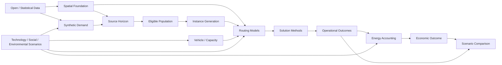

# Complete Current Research Design

Document ID: `CURRENT-RESEARCH-DESIGN-20260915-v3`

Role: **current design authority**

Effective date: 2026-09-15 JST

## 1. Authority and reading rule

This document is the single integrated authority for the research design currently in force. It consolidates the accepted design without requiring the reader to reconstruct it from historical artifacts. Stage-specific specifications, manifests, hashes, and evidence registers remain authoritative for their detailed values and execution evidence.

The companion [Research Progress and Decision Record](RESEARCH_PROGRESS_AND_DECISION_RECORD.md) explains how this design was reached. Deprecated proposals do not override this document. Earlier architecture documents remain current for architecture or definitions that were not superseded, but their old Gate statuses and `NEXT_EXECUTABLE_TASK` values are historical.

## 2. Research question

The primary research question is:

> When technical, social, and environmental conditions change, how do those changes propagate through EV residential B2C last-mile delivery planning and operation into logistics-system operational and economic outcomes?

Quantum computing is a candidate solution method, and quantum-enabled battery development may inform future technology scenarios. Neither quantum advantage nor a battery-performance improvement is assumed. Classical references, resource feasibility, and explicit scenario evidence are required before comparative claims.

## 3. Scope

- geography: Ota Ward, Tokyo;
- application: residential B2C last-mile delivery;
- vehicle context: battery-electric delivery vehicles, with kei-class electric commercial vans as the R24 primary class;
- present study layer: controlled benchmark and subsequent scenario analysis;
- present optimization problem: R24 multi-vehicle capacitated routing after the closed R23 route-ordering study;
- claim boundary: modeled, open-data-grounded and synthetic-demand-grounded results, not reconstruction of a named carrier's operations.

## 4. End-to-End architecture



The architecture separates data lineage, customer meaning, instance construction, mathematical modeling, solution method, operation, and economics. A benchmark instance is not the same object as the source horizon or the full Ota eligible population.

## 5. Data and provenance

### 5.1 Current source categories

| Category | Principal source | Current role |
|---|---|---|
| Roads | OSM/Geofabrik Kantō extract | directed road topology and tags |
| Administrative boundary | MLIT N03 | Ota spatial scope |
| Buildings | PLATEAU Ota CityGML | stable building support and geometry |
| Population/households | 2020 census, Ota and Japan population statistics | spatial totals and calibration denominators |
| Housing | census and 2023 Housing and Land Survey | synthetic household/housing calibration |
| Parcel/delivery statistics | MLIT parcel totals and metropolitan goods-movement survey | aggregate parcel-equivalent calibration and receipt propensity |
| Vehicle specifications | manufacturer official records | real-vehicle reference envelope |
| Traffic sources | JARTIC/MLIT and other accepted traffic evidence | separate network/traffic validation path; not observed delivery time |

### 5.2 Classification system

Every input or parameter must retain a provenance class. The current vocabulary distinguishes at least:

- `OPEN_DATA_OBSERVED`: published source records, not necessarily observed delivery operations;
- `OPEN_DATA_DERIVED`: deterministic transformations of open data;
- `OPEN_DATA_CALIBRATED_SYNTHETIC`: synthetic entities or realizations calibrated to public statistics;
- `MODEL_BASED_SYNTHETIC`: modeled network, route, or computational artifacts;
- `FIXED_MODEL_ASSUMPTION`: explicit research parameter, not empirical fact;
- `EXTERNAL_REFERENCE`: evidence used for plausibility or future scenarios but not automatically adopted;
- `RESEARCHER_SPECIFIED_RANDOM` or `EMPIRICALLY_CALIBRATED_RANDOM`: randomness with its source and role made explicit;
- `OBSERVED_OPERATIONAL`: carrier/customer/tour records; no qualifying Ota operator manifest has been identified.

Deterministic or reproducible does not mean empirically observed. Every generated artifact must preserve input paths, versions, hashes, transformation code/config, RNG and seed where applicable, units, and known gaps. The original household/building generator environment remains incomplete; this blocks a full regeneration claim, not bounded use of the verified saved snapshot.

## 6. Synthetic demand

The demand pipeline uses public population, household, housing, parcel-total, and receipt-frequency evidence to calibrate synthetic household propensities, assign synthetic households to a PLATEAU-supported building frame, and realize a designated Poisson synthetic day.

Current saved facts are:

| Stage | Count | Parcel-equivalents |
|---|---:|---:|
| positive household-day source rows on 2026-01-01 | 73,547 | 82,246 |
| rows with stable assigned building | 73,200 | 81,859 |
| positive-demand building aggregates | 39,956 | 81,859 |
| routing-eligible building aggregates | 39,930 | 81,793 |

The 347 source rows and 387 parcel-equivalents without a usable stable building assignment are recorded exceptions. Routing removes a further 26 buildings and 66 parcel-equivalents.

`parcel-equivalent` is a calibrated synthetic realized abstract content count. It is not an actual observed parcel, order, customer, stop, kg, or m³. The synthetic construction is not arbitrary random data: its source support and aggregate calibration are explicit. It nevertheless inherits modeling choices, including population transfer, synthetic household construction, uniform building allocation within the eligible support, and a Poisson realization not fitted as an Ota parcel-level variance model.

No current design authorizes regeneration, reinterpretation as observed demand, or automatic physical-mass conversion.

## 7. Spatial and Routing Foundation

The current graph is the accepted V18/run_3 SUMO 1.24.0 model network:

- network ID: `P13-THREE-TIER-RUN-3-GEOMETRY-REACCEPTANCE`;
- SHA-256: `460554c7716fe5e3e1410bbee790e69745a2c423146bac88e51e3a2b95f051b2`;
- routing permission domain: SUMO `delivery`;
- routing is directed and connection-aware;
- endpoint semantics are edge plus offset, not an arbitrary replacement node.

The historical run_2 produced the full 39,956-row deterministic building-to-edge map. Run_3 preserved topology, IDs, one-way direction, permissions, delivery access, and mapped edges while repairing geometry and lengths. Mapping endpoints transfer; historical run_2 route costs do not. Every generated instance must compute directed distances and travel times on run_3.

For an allowed ordered pair `(i,j)`, the Routing Baseline minimizes free-flow/model travel time using current edge length and model speed, including partial-edge endpoint costs. Distance in metres is reported along that same fastest-time path; it is not independently shortest distance. Travel time is not observed delivery time, congestion simulation output, or a service duration.

Unreachable and missing pairs remain null/explicit. No symmetry, forced connection, zero replacement, or finite penalty edge is permitted.

DEP_006 is the controlled benchmark depot/origin mapped to edge `617631294`. It is a public-facility-based proxy, not an observed carrier depot, assigned territory, fleet base, or proof of dispatch practice.

Population eligibility uses membership in the connection-aware `delivery` SCC containing DEP_006. This establishes directed mutual graph reachability without full-population all-pairs routing. Selected instances must still materialize and validate every ordered-pair status, distance, and travel time, including connection transitions and zero-cost duplicate endpoints.

## 8. Planning Horizon

`R24-SOURCE-DAY-2026-01-01-v1` is the designated synthetic day used as the **source horizon**. Membership means that a saved realized synthetic demand row belongs to that date.

The source horizon is distinct from:

- the full candidate or eligible population;
- an optimization instance;
- a dispatch batch, wave, shift, tour, or vehicle day;
- an observed operational day.

No dispatch/wave/shift evidence is required for the controlled R24 benchmark. Those concepts require a future operational model and separate evidence.

## 9. Benchmark customer and eligible population

The current customer construction is:

\[
\text{positive-demand mapped building}
\rightarrow
\text{Routing Proxy Customer}.
\]

One stable positive-demand building is one benchmark customer identity. Its `q_i` is the conserved building aggregate, and its road endpoint is the versioned run_3 edge-offset proxy inherited through the validated run_2 mapping.

The final eligibility rule is:

\[
C_{eligible}=\{i\mid
\text{positive demand}\land
\text{stable building ID}\land
\text{valid geometry}\land
\text{valid run_3 proxy}\land
\text{delivery-compatible edge}\land
edge(i)\in SCC(edge(DEP\_006))\}.
\]

`C_eligible` contains 39,930 customers and 81,793 methodological parcel-equivalents. The complete assessed ledger is preserved in the routing revalidation manifest; only rows marked `ELIGIBLE` belong to the set.

This identity is not an observed person, household, order, physical delivery stop, entrance, curb/loading position, or carrier service event. Multiple buildings sharing a proxy remain separate. Duplicate flags and group IDs are retained, and no implicit service-event aggregation is allowed.

## 10. Instance Generation

The executable instance-generation design is frozen by `R24-INSTANCE-GEN-20260915-v1` with verdict `R24_INSTANCE_GENERATION_SPEC_FROZEN_WITH_LIMITATIONS`.

### Primary: Repeated Random Suite

\[
C_{n,r}\sim SRSWOR(C_{eligible},n).
\]

Sampling is without replacement within an instance. The purpose is to reduce discretionary case selection and measure variation conditional on the eligible frame. It does not establish statistical representativeness of all Ota deliveries. The frozen primary sizes are `n={2,3,4}` for the quantum-comparable core and `n={5,8,10,15,20}` for the classical extension, with exactly 10 independently keyed deterministic repetitions per n. The key is derived by SHA-256 from protocol, suite, n, and repetition; a second SHA-256 ranks canonical eligible customer IDs to realize SRSWOR without library-dependent PRNG behavior.

### Secondary: Controlled Structural Suite

`CLUSTERED`, `DISPERSED`, and `MIXED` cases expose structural route differences at `n={4,10,20}`, with three deterministic repetitions per `(structure,n)`. They use EPSG:6677 projected Euclidean metres, mechanically hash-keyed anchors, fixed tie rules, nearest-anchor selection for clustered cases, deterministic farthest-point traversal for dispersed cases, and two-anchor quota selection for mixed cases. They are stress tests and do not claim Ota-wide representativeness.

### Reference: Fixed Anchor Suite

Three fixed anchors at `n={4,10,20}` are exact aliases of primary repetition `R01`. A rejected or packing-infeasible source remains rejected/infeasible and is never replaced. Anchors support regression and cross-method comparison and are not additional independent observations.

Problem size `n` is a computational benchmark parameter, not an Ota stop-count estimate. Every base customer subset is fixed before capacity conditions and reused unchanged for `rho*={0.50,0.70,0.90}`. The rule is sample once, validate, and record: no demand, difficulty, duplicate-proxy, zero-arc, capacity-effect, solver, or QAOA outcome can cause redraw. Base hard failures and capacity-condition packing failures remain under the planned ID.

All ordered pairs over the depot plus selected customers must be recomputed and connection-validated on run_3. Duplicate proxies remain eligible and are flagged. Exact deterministic bin-packing preflight is required for each capacity condition; `PACKING_INFEASIBLE` preserves the subset but blocks optimization of that condition. Same-m targets are retained and marked `DEGENERATE_REGIME_SAME_M`, then excluded from capacity-effect comparison.

The frozen suite was generated without specification deviation. All 80 random bases, 27 structural bases, and three anchor aliases are valid; the 107 independently generated bases have complete connection-validated run_3 OD matrices. All 330 capacity conditions are packing-feasible. Of these, 135 are non-degenerate `READY` conditions and 195 are retained `DEGENERATE_REGIME_SAME_M` conditions. Sixteen independent bases contain at least one within-instance shared proxy group, producing 304 validated zero-distance and zero-time ordered arcs; no redraw or rejection occurred.

## 11. Vehicle

`R24_PRIMARY_VEHICLE_CLASS = kei-class electric commercial van`.

The choice reflects dense residential delivery, narrow urban streets, frequent stopping, public specification quality, and modeling simplicity. It does not claim that a named carrier uses this class for the modeled population.

Primary-class real references are maintained as coherent manufacturer-specific records:

- Mitsubishi Minicab EV, two-seat 20 kWh variant;
- Suzuki e Every, two-seat variant;
- Honda N-VAN e:, with trim/occupancy-specific payload retained.

These records provide roughly 300–350 kg variant payloads, batteries from 20.0 to 36.6 kWh, WLTC ranges from 180 to 257 km, and model-specific charging evidence. Values may not be averaged across incompatible trims. WLTC range is not a route-level energy model.

Light-duty electric trucks are a secondary scenario. Compact electric delivery vans currently have insufficient matched Japanese evidence for primary use. `managed_urban_ev_delivery_v1` is `REFERENCE_ONLY`: its 3,500 kg permissible mass, 1,500 kg unladen mass, 2,000 kg assumed payload, and 4.70 x 1.70 x 2.00 m dimensions remain a historical fixed research profile, not the current class or capacity source.

The current graph is compatible with the kei-class abstraction under the `delivery` permission domain with limitations. It does not comprehensively encode field-measured width, height, gross-weight, temporary/time-dependent, private-access, parking, or loading restrictions; graph compatibility is not universal real-world legal access.

## 12. Capacity

The primary capacity unit is `METHODOLOGICAL_PARCEL_EQUIVALENT`. It is not kg, m³, an observed parcel count, manufacturer capacity, or physical utilization.

For every benchmark customer:

\[
q_i=N_i,
\]

where `N_i` is the unchanged positive integer building aggregate from the saved source snapshot. Candidate-population values have minimum 1, maximum 14, mean 2.048729, median 2, P75 3, P90 4, P95 5, and P99 7.

The common capacity is:

\[
Q=14.
\]

It is the minimum integer that gives every candidate customer individual feasibility. It is constant across primary R24 instances and was not selected to force a binding constraint.

For instance demand `D=sum_i q_i`, the controlled regimes are:

\[
\rho^*\in\{0.50,0.70,0.90\}
\]

for `LOOSE`, `MODERATE`, and `TIGHT`, and available fleet size is:

\[
m(\rho^*)=\left\lceil\frac{D}{\rho^*Q}\right\rceil,
\qquad
\rho_{actual}=\frac{D}{mQ}.
\]

Both target and actual pressure are recorded. `m` is a methodological available fleet size, not an observed Ota or carrier fleet. `mQ>=D` is necessary but not sufficient: instance validation must check exact bin packing of indivisible demands, single-customer feasibility, route feasibility, regime degeneracy, and capacity redundancy.

Physical kg and volume capacity are deferred. Official kei-van payload evidence is preserved for a later physical scenario, but 350 kg is not 350 parcel-equivalents and does not determine `Q`.

## 13. Routing model progression

\[
R23\subset R24/CVRP\subset VRPTW\subset EVRP.
\]

| Layer | Added scope |
|---|---|
| R23 | one vehicle; route ordering; directed travel-time objective |
| R24 | multiple vehicles; exact-once allocation; depot tours; methodological capacity; connectivity |
| VRPTW | time windows, service time, route-time feasibility |
| EVRP | battery/SOC, energy consumption, charging locations, charging time and policy |

Each extension retains valid lower-layer definitions but requires new evidence and validation. Historical R23 QUBO penalties or resource conclusions are not automatically valid for the R24 encoding.

## 14. R24 mathematical model

### 14.1 Sets and parameters

- `C`: finite nonempty selected R24 customer set, with `C subseteq C_eligible`;
- `0`: DEP_006;
- `V={0} union C`;
- `K={1,...,m}`: homogeneous available methodological vehicles;
- `r_ij in {0,1}`: validated directed reachability for distinct `i,j`;
- `A={(i,j): i != j, r_ij=1}`;
- `c_ij`: finite nonnegative run_3 directed Routing Baseline travel time in seconds for `(i,j) in A`;
- `q_i`: positive integer methodological demand;
- `Q=14`: common methodological capacity.

### 14.2 Variables

- `x_ijk in {0,1}`: vehicle `k` travels from service node `i` to `j` in the service-order graph;
- `y_ik in {0,1}`: vehicle `k` serves customer `i`;
- `u_k in {0,1}`: vehicle `k` is used.

Road-network paths realize service-order arcs. Passing a building/proxy on a road path does not serve that customer.

### 14.3 Objective

\[
\min \sum_{k\in K}\sum_{(i,j)\in A}c_{ij}x_{ijk}.
\]

This minimizes total fleet directed model travel time, not makespan, energy, fleet count, service duration, or monetary cost.

### 14.4 Constraints

Exact-once service:

\[
\sum_{k\in K}y_{ik}=1 \qquad \forall i\in C.
\]

Per-vehicle customer degree and flow:

\[
\sum_{j:(i,j)\in A}x_{ijk}=y_{ik},
\qquad
\sum_{j:(j,i)\in A}x_{jik}=y_{ik}
\quad \forall i\in C,\ k\in K.
\]

One depot departure and return for every used vehicle:

\[
\sum_{j\in C:(0,j)\in A}x_{0jk}=u_k,
\qquad
\sum_{i\in C:(i,0)\in A}x_{i0k}=u_k
\quad \forall k\in K.
\]

Use linking:

\[
y_{ik}\le u_k \qquad \forall i\in C,\ k\in K.
\]

Capacity:

\[
\sum_{i\in C}q_i y_{ik}\le Q u_k
\qquad \forall k\in K.
\]

Subtour elimination/connectivity, for every nonempty `S subseteq C`, `h in S`, and `k in K`:

\[
\sum_{\substack{i\in S,\ j\in V\setminus S\\(i,j)\in A}}x_{ijk}
\ge y_{hk}.
\]

Reachability is enforced by the arc domain `A`; no self-loop is materialized, and missing/unknown status invalidates an instance rather than becoming unreachable or finite-cost by default.

The model is delivery-only, unsplittable, single-departure/single-return per used vehicle, homogeneous-fleet, no-reload, and single-depot. It has no fleet-minimization term. The target pressure uses available `m`; fewer vehicles may be used by a minimum-travel-time solution, which must be reported separately from available-fleet pressure.

## 15. Solution methods

### Classical

An exact or certifiably bounded MILP reference is required first for each authorized R24 size. It must report solver/version, formulation, tolerances, status, objective bound/gap, runtime, and decoded routes. A heuristic result cannot silently replace the exact-reference role.

### Quantum

The quantum path is:

```text
validated R24 instance
  -> frozen QUBO formulation and penalty proof/validation
  -> logical-variable and memory/resource estimate
  -> Resource Gate
  -> QAOA only for authorized sizes
```

The QUBO must preserve customer allocation, fleet/depot, capacity, connectivity, and forbidden-arc semantics or explicitly declare a narrower subproblem. Integer `q_i`, `Q`, and `m` permit exact capacity encoding in principle; a simple per-vehicle slack over `0..14` needs four bits before formulation-specific auxiliaries. This is not yet a frozen R24 QUBO.

CPU Aer is a software simulator. No QPU performance, general scaling, convergence, or quantum advantage claim follows from it.

## 16. Evaluation metrics

Quantum/QUBO reporting must preserve:

- raw full-state `P_feasible`;
- raw full-state `P_optimal`;
- absolute and relative optimality gap with denominator stated;
- best feasible route recovery / exact-optimum recovery;
- optimizer-reported success, termination reason, evaluations and iterations;
- runtime, backend, shots/statevector mode, seeds, and resource use.

`P_feasible`, `P_optimal`, route recovery, and optimizer success are distinct and must not be conflated or silently renormalized.

Classical/logistics reporting includes:

- objective value and bound/gap;
- total road distance and directed travel time;
- available and used vehicle counts;
- per-route demand, capacity utilization, and violations;
- target and actual capacity pressure;
- customer completion and reachability/route-validation failures;
- runtime and termination status.

Cross-method comparisons must use identical immutable instances and cost matrices.

## 17. Planned VRPTW extension

VRPTW will add customer time windows, service duration, vehicle operating horizon, waiting, lateness policy, and time propagation. Existing historical time-window/service fixtures are reference-only. No current evidence makes their values valid R24 inputs, and R24 contains no time-window or service-time constraint.

A future gate must establish temporal semantics, units, source population, aggregation, feasibility rules, and provenance before execution.

## 18. Planned EVRP extension

EVRP will add battery capacity, initial/minimum SOC, edge/route energy, load/speed/temperature effects where supported, charging endpoints, compatibility, charging power/curve, dwell time, and policy.

The N-VAN e:, Minicab EV, and e Every records provide vehicle-side battery/range/charging references. Catalog WLTC values are not direct route-energy functions. Historical eCanter or fixed-profile values are not automatically inherited. EVRP needs a separate coherent vehicle/scenario parameter freeze.

## 19. Operational outcomes

Future operational outputs may include:

- assigned and completed synthetic deliveries;
- fulfillment and explicit non-fulfillment reasons;
- total and per-route distance/travel time;
- available/used fleet and methodological utilization;
- energy use;
- SOC trajectories and violations;
- charging events, energy, time, and location.

These will be model outcomes. Without observed carrier validation, they are not observed Ota operational performance.

## 20. Economic outcome

The formal fixed economic definition is:

\[
\boxed{C_{op}=E_{operation}\times p_{electricity}}.
\]

`E_operation` is modeled operation electricity consumption and `p_electricity` is the adopted scenario-consistent electricity price. Their accounting boundary, tariff period, currency, and numerical authority must be frozen before evaluation.

Current economic scope excludes labor, vehicle purchase, depreciation, battery replacement, charging infrastructure, depot cost, maintenance, delay cost, and broader total cost of ownership. Results must be called operating electricity expenditure, not full logistics cost.

## 21. Scenario comparison

The scenario mechanism is:

```text
technology / social / environmental scenario parameters
  -> demand, vehicle, routing, traffic, and energy parameters
  -> routing plan
  -> operational outcomes
  -> E_operation
  -> C_op
  -> scenario differences and sensitivity
```

Baseline and scenario values, source year, geographic/population transfer, units, uncertainty, and unchanged controls must be declared before outcomes. Solution-method effects and physical-scenario effects must be separable. A favorable result may not be used to select the scenario, instance, capacity, or solver budget retrospectively.

## 22. Claims and limitations

The current study is:

- Ota-grounded through its spatial foundation;
- synthetic-demand grounded through public statistics and a preserved saved realization;
- a controlled methodological benchmark;
- not an observed carrier-operation reconstruction;
- not statistically representative of all Ota deliveries;
- based on routing proxies that are not physical stops or entrances;
- based on methodological capacity that is not physical payload;
- based on DEP_006 as a controlled depot proxy, not an actual carrier depot;
- based on model free-flow travel time, not observed delivery travel time;
- not evidence of quantum advantage.

Active limitations include incomplete original demand-generator provenance, mixed source years/populations, non-observed household/building allocation, absent service-event/dispatch/fleet evidence, incomplete field-level road restriction authority, deferred physical load and temporal/energy models, and severe quantum-simulation resource growth.

## 23. Current status

| Component | Status | Current meaning |
|---|---|---|
| R23 | `CLOSED_WITH_DOCUMENTED_LIMITATIONS` | reduced single-vehicle route-ordering evidence closed |
| Gate A | `ACCEPTED_WITH_LIMITATIONS` | source horizon, customer/proxy semantics and interface frozen |
| Gate B | `ACCEPTED_WITH_LIMITATIONS` | kei-class electric commercial van selected |
| Gate C | `ACCEPTED_WITH_LIMITATIONS` | methodological parcel-equivalent dimension selected |
| Gate D | `ACCEPTED_WITH_LIMITATIONS` | `q_i`, `Q`, pressure regimes and `m` rule frozen |
| Routing compatibility | `ACCEPTED_WITH_LIMITATIONS` | run_2 mapping validated on run_3; population SCC checked |
| Final `C_eligible` | `READY_WITH_LIMITATIONS` | 39,930 eligible rows / 81,793 parcel-equivalents materialized |
| Instance specification | `FROZEN_WITH_LIMITATIONS` | suite sizes, repetitions, seeds, selection, validation, packing, IDs and schema frozen |
| R24 instances | `GENERATED_WITH_LIMITATIONS` | 80 random + 27 structural valid bases; 3 valid anchor aliases; 330 packing-feasible conditions |
| Classical R24 | `NOT_IMPLEMENTED` | no R24-specific CVRP reference solver or result |
| R24 QUBO/QAOA | `NOT_EXECUTED` | no R24 encoding or quantum execution |
| VRPTW | `DEFERRED` | temporal authority not accepted |
| EVRP | `DEFERRED` | energy/SOC/charging specification not accepted |
| Operational outcomes | `DEFERRED` | requires accepted models and executions |
| Economic outcome | `DEFINITION_FROZEN; NUMERICS_DEFERRED` | formula fixed; energy/tariff values open |

## 24. Remaining research steps

The completed routing and eligibility steps are retained in the dependency record; the remaining execution order is:

1. implement and validate the Classical R24 CVRP reference solver;
2. execute the prespecified classical benchmark only after its solver/validation contract is accepted;
3. design and validate the R24 QUBO;
4. execute the Resource Gate;
5. execute QAOA only for authorized sizes;
6. compare R23 and R24 within their distinct scopes;
7. establish the VRPTW evidence/specification gate;
8. establish the EVRP evidence/specification gate;
9. produce operational outcomes;
10. freeze energy-accounting and electricity-price authority and compute the economic outcome;
11. execute prespecified scenario comparisons;
12. complete sensitivity, reproducibility, and limitation analyses.

`NEXT_EXECUTABLE_TASK = implement and validate classical R24 CVRP reference solver`

## 25. Deprecated / superseded defaults

The following remain historical only: mandatory dispatch batching; quartile-by-tertile primary design; nested PPS primary sampling; automatic `Q=2,000 kg`; building-as-observed-customer; physical-stop claims; daily-demand-as-one-tour; representative-small-`n` claims; and physical kg as the R24 primary capacity. They may be studied only through a newly versioned, evidence-backed scenario or method—not inherited silently.

## 26. Current evidence index

- [R23 status](R23_STATUS.md)
- [Research progress and decisions](RESEARCH_PROGRESS_AND_DECISION_RECORD.md)
- [End-to-End Workflow Authority](../../reproducibility/outputs/traffic_simulation/end_to_end_workflow_feasibility_audit/20260914_v2/END_TO_END_WORKFLOW_AUTHORITY.md)
- [Routing Baseline canonical specification](specifications/ROUTING_BASELINE_CANONICAL.md)
- [Gate A sign-off](../../reproducibility/outputs/traffic_simulation/r24_gate_a_minimal_benchmark_abstraction/20260915_v1/GATE_A_SIGNOFF.md)
- [Planning Horizon decision](../../reproducibility/outputs/traffic_simulation/r24_planning_horizon_decision/20260915_v1/R24_PLANNING_HORIZON_DECISION.md)
- [Gate B vehicle-class decision](../../reproducibility/outputs/traffic_simulation/r24_gate_b_vehicle_class/20260915_v1/R24_GATE_B_VEHICLE_CLASS_DECISION.md)
- [Demand-side mass evidence review](../../reproducibility/outputs/traffic_simulation/r24_demand_side_mass_evidence/20260915_v1/R24_DEMAND_SIDE_MASS_EVIDENCE_REVIEW.md)
- [Methodological capacity specification](../../reproducibility/outputs/traffic_simulation/r24_methodological_capacity_specification/20260915_v1/R24_METHODOLOGICAL_CAPACITY_SPECIFICATION.md)
- [Routing compatibility revalidation](../../reproducibility/outputs/traffic_simulation/r24_routing_compatibility_revalidation/20260915_v1/R24_ROUTING_COMPATIBILITY_REVALIDATION.md)
- [Instance generation readiness](../../reproducibility/outputs/traffic_simulation/r24_routing_compatibility_revalidation/20260915_v1/INSTANCE_GENERATION_READINESS.md)
- [Frozen R24 instance-generation specification](../../reproducibility/outputs/traffic_simulation/r24_instance_generation_specification/20260915_v1/R24_INSTANCE_GENERATION_SPECIFICATION.md)
- [Generated R24 benchmark instance suite](../../reproducibility/outputs/traffic_simulation/r24_benchmark_instance_suite/20260915_v1/R24_BENCHMARK_INSTANCE_SUITE_REPORT.md)
