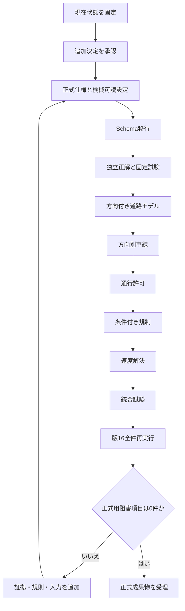

# 版16道路属性の正式解決に向けた実行手順

> **文書状態:** 実行計画
> **開始位置:** 初期正式仕様案を作成済み、追加決定事項あり
> **終了条件:** 版16正式用成果物が`complete=true`となり、阻害項目が0件になる
> **禁止事項:** 未決定事項を実装者の推測で補わない

## 目次

- [1. この手順の目的](#1-この手順の目的)
- [2. 現在位置](#2-現在位置)
- [3. 全体の実行順序](#3-全体の実行順序)
- [4. 工程0 現在状態を基準点として固定する](#4-工程0-現在状態を基準点として固定する)
- [5. 工程1 追加決定事項を解消する](#5-工程1-追加決定事項を解消する)
- [6. 工程2 正式仕様と機械可読設定を作る](#6-工程2-正式仕様と機械可読設定を作る)
- [7. 工程3 Schemaを移行する](#7-工程3-schemaを移行する)
- [8. 工程4 独立した固定試験用データを作る](#8-工程4-独立した固定試験用データを作る)
- [9. 工程5 方向付き道路モデルを実装する](#9-工程5-方向付き道路モデルを実装する)
- [10. 工程6 方向別車線を実装する](#10-工程6-方向別車線を実装する)
- [11. 工程7 通行許可を実装する](#11-工程7-通行許可を実装する)
- [12. 工程8 条件付き規制を実装する](#12-工程8-条件付き規制を実装する)
- [13. 工程9 速度解決を実装する](#13-工程9-速度解決を実装する)
- [14. 工程10 統合試験を行う](#14-工程10-統合試験を行う)
- [15. 工程11 版16を全件再実行する](#15-工程11-版16を全件再実行する)
- [16. 工程12 停止記録を解消する](#16-工程12-停止記録を解消する)
- [17. 工程13 正式成果物を受理する](#17-工程13-正式成果物を受理する)
- [18. 基準点コミット](#18-基準点コミット)
- [19. 工程ごとの成果物一覧](#19-工程ごとの成果物一覧)
- [20. 中断と再開](#20-中断と再開)

## 1. この手順の目的

本文書は、版16の道路属性について、研究上の決定を正式仕様へ変換し、実装、固定試験、
実データ全件実行および正式受理まで進める順序を定める。

対象は次のとおりである。

- `maxspeed:type=JP:urban`を含む速度解決
- 時刻、曜日、祝日、車種、重量および利用目的に依存する条件付き規制
- `private`、`permit`、`destination`、`delivery`等の通行許可
- `lanes:forward`、`lanes:backward`、`lanes:both_ways`等の方向別車線
- `oneway=-1`と方向依存タグ
- 通常の右左折規制とバス向け規制

通行権限反映、SUMO道路生成、交差点・信号処理は、本手順の正式属性成果物を入力として
後続工程で実施する。

## 2. 現在位置

現在は次の状態である。

| 項目 | 状態 |
|---|---|
| 版16道路母集団 | 26,220道路として受理済み |
| 重要度分類 | 全件実行済み |
| 属性値解決 | 全件実行済みだが停止記録あり |
| 構造確認用 | 52,440組、785停止 |
| 正式用 | 52,440組、24,741停止 |
| 初期正式仕様案 | 作成済み |
| 追加決定 | `OPEN-PROP-001`から`015`が未解決 |
| 正式道路網への利用 | 不可 |

正本は次の文書である。

- 未決定事項:
  `specifications/attribute_resolution_decisions_to_finalize.md`
- 初期正式仕様案:
  `specifications/initial_formal_attribute_resolution_specification_proposal.md`
- 例外決定表:
  `reproducibility/config/traffic_simulation/resolver_exception_decision_table.yml`
- 現在の阻害事項:
  `current_issues_and_blockers.md`

## 3. 全体の実行順序



工程を入れ替えてはならない。特に、方向付き道路モデルが未確定のまま方向別車線、
方向別権限または方向別速度を正式化しない。

## 4. 工程0 現在状態を基準点として固定する

### 4.1 実施内容

1. 作業ツリーの差分を確認する。
2. 版16入力と現在の全件実行記録のSHA-256を確認する。
3. 現在の試験一式を実行する。
4. 未コミット変更を目的別に確認する。
5. 基準点コミットを作成する。

### 4.2 検証コマンド

```bash
git status --short --branch
git diff --check

docker compose config
docker compose run --rm analysis \
  python -m traffic_simulation.network.validate_sumo_network_config
docker compose run --rm analysis \
  pytest -q 05_src/traffic_simulation/validation
```

入力SHA-256は、次の記録と一致させる。

```text
03_data/metadata/acquisition/
  20260730_ota_ward_v16_attribute_resolution_run.json
```

### 4.3 停止条件

- 試験が一件でも不合格である。
- 版16入力のSHA-256が受理記録と異なる。
- 独立正解のSHA-256が変更されている。
- 内容を説明できない差分がある。

## 5. 工程1 追加決定事項を解消する

### 5.1 入力

```text
specifications/
  attribute_resolution_decisions_to_finalize.md
  initial_formal_attribute_resolution_specification_proposal.md
```

### 5.2 実施内容

`OPEN-PROP-001`から`015`について、次を記録する。

- 採用する規則
- 採用理由
- 適用する道路、方向、車線、車種および期間
- 使用する出典とSHA-256
- 優先順位
- 停止条件
- 既存成果物を無効化する範囲
- 必要な固定試験識別子
- 承認者と承認日

### 5.3 最低限必要な決定

1. 研究用4,500 kg配送車両とOSM車種キーの対応
2. 道路進入時の実重量計算
3. OSM Wayの分割規則
4. `lanes:both_ways`欠損時の扱い
5. accessタグの具体性比較
6. 目的地区域と配送先一致判定
7. 条件式の正式文法
8. 2026年7月16日に適用する日本速度規則表
9. `JP:urban`に必要な道路状態の出典
10. 通常・バス向け右左折規制の方向変換
11. 既存`value_state`から新しい状態・由来への移行
12. 名称付き停止理由と既存失敗コードの対応

### 5.4 完了条件

- 全`OPEN-PROP-*`が`approved`または明示的な`out_of_scope`である。
- 同じ入力から複数の出力が導かれない。
- 「適切に処理する」等の実装者判断を残す表現がない。
- 必要な出典がローカル記録とSHA-256へ結び付いている。

未決定事項が一つでも残る場合は、工程2へ進まない。

## 6. 工程2 正式仕様と機械可読設定を作る

### 6.1 作成物

初期案を承認済み正式仕様へ移す。予定する機械可読設定は、責任を分離して作る。

```text
reproducibility/config/traffic_simulation/
  formal_attribute_resolution_v16.yml
  scenario_profiles/
    tokyo_delivery_v16.yml
  vehicle_profiles/
    managed_delivery_truck_v1.yml
  legal_speed_rules/
    japan_road_speed_rules.yml
  conditional_profiles/
    tokyo_delivery_conditional_v1.yml
  permit_registry/
    managed_delivery_permits_v1.yml
```

これらのパスは予定配置である。作成時に既存設定構造との重複を確認し、同じ値を
複数ファイルで管理しない。

### 6.2 必須内容

- 設定識別子と設定版
- 適用開始日と終了日
- 出典ファイル参照とSHA-256
- 決定規則識別子
- 優先順位
- 停止コード
- 正式用と構造確認用の利用可否

### 6.3 検証

各設定にはJSON Schemaと意味整合検査を作る。Schema合格だけでなく、次を検査する。

- 期間の重複と空白
- 規則優先順位の重複
- 未登録車種
- 未登録停止コード
- 出典SHA-256不一致
- 許可対象道路の母集団外参照
- 条件プロファイルの未登録構文

### 6.4 停止条件

- 同じ規則の正本が複数ある。
- 設定と仕様の識別子が一致しない。
- 出典ファイルを取得できない。
- 法令適用期間が一意でない。

## 7. 工程3 Schemaを移行する

### 7.1 対象

現在の`value_state`を次へ分離する案を実装する。

```text
resolution_status
value_origin
```

### 7.2 実施内容

1. 新Schema版を作る。
2. 旧値から新しい二フィールドへの移行表を作る。
3. 移行不能な旧値は停止する。
4. 旧版成果物を上書きせず、新版成果物として生成する。
5. レコードSHA-256を新版内容から再計算する。
6. Schema版と設定版の互換表を作る。

### 7.3 必要な検査

- `resolved`なのに値がない状態を拒否する。
- `model_assumed`を正式用で拒否する。
- 停止状態なのに停止コードがない状態を拒否する。
- 解決済みなのに停止コードがある状態を拒否する。
- 状態と由来の禁止組合せを拒否する。
- 旧成果物と新版成果物を同じrunへ混在させない。

### 7.4 完了条件

- Schemaの正常、異常、境界試験が合格する。
- 意味整合検査が新Schemaを検査する。
- 既存成果物の扱いが、保持、移行、無効化のいずれかへ分類されている。

## 8. 工程4 独立した固定試験用データを作る

ここでいう「独立」は、正解結果を本番実装の出力から生成せず、承認済み仕様から
別途導出することを意味する。独立した人間による受理工程は要求しない。人間による
独立受理を省略した方針は開示したまま、正解結果と本番実装の生成経路を分離する。

### 8.1 作成順序

1. production実装を変更する前に入力を作る。
2. 承認済み仕様だけを参照して正解を作る。
3. 入力と正解の作成者、作成日、参照仕様SHA-256を記録する。
4. 入力、正解、manifestをSHA-256で固定する。
5. production実装から正解を生成していないことを記録する。

### 8.2 必須事例

- 通常、異常、境界
- 同一入力の再実行
- 規則改訂
- 証拠競合
- 日付境界
- 条件式の時刻境界
- 重量境界
- access優先順位
- `oneway=-1`
- 通常の右左折規制
- バス向け規制
- `lanes:both_ways`
- 方向別速度
- 未登録構文

### 8.3 禁止事項

- 実装出力に合わせて正解を変更しない。
- 実データの一行を説明なしに正解として転用しない。
- 一つの正常例だけで規則全体を受理しない。

## 9. 工程5 方向付き道路モデルを実装する

### 9.1 実施内容

1. 原典OSM Wayを読み取り専用で保持する。
2. 承認済み分割規則から分割区間を生成する。
3. `F`と`B`の方向付き区間を生成する。
4. oneway規則から生成可能方向を決める。
5. 元Way、分割区間、方向付き区間、SUMO edgeの来歴を生成する。
6. 方向依存タグの適用先を記録する。
7. 通常・バス向けrelationを方向付き接続へ対応させる。

### 9.2 検査

- 原典OSMが変更されていない。
- `oneway=-1`では`B`だけが生成される。
- 意図しない反対方向区間がない。
- 元構成点順と走行構成点順を復元できる。
- `from`、`to`、`via`の意味が変換前後で一致する。
- `no_*`と`only_*`の接続集合が独立正解と一致する。

### 9.3 停止条件

- 未知の方向接尾辞がある。
- 分割位置を一意に決められない。
- relationを一つの接続集合へ対応できない。
- 複数via等が承認済み範囲外である。

## 10. 工程6 方向別車線を実装する

### 10.1 実施内容

1. `lanes`と方向別タグを構文解析する。
2. 承認済み整合式を検査する。
3. 一意な場合だけ欠けた一値を算術導出する。
4. OSM車線位置をSUMO車線番号へ変換する。
5. 車線別タグの要素数を検査する。
6. `lanes:both_ways`、可逆車線、潮汐車線を承認済み範囲に従って処理する。

### 10.2 検査

- 総数と方向別合計が一致する。
- 負数または0未満の差分を拒否する。
- 総数だけから均等配分しない。
- formalでは統計的補完を使用しない。
- lane順がforward・backwardの独立正解と一致する。

## 11. 工程7 通行許可を実装する

### 11.1 実施内容

1. 管理車両をOSM access階層へ対応させる。
2. 車線、方向、車種、一般タグの具体性を評価する。
3. `private`、`permit`を基準シナリオへ適用する。
4. `destination`、`delivery`、`customers`を目的地文脈へ照合する。
5. 条件付きタグは工程8の評価器へ渡す。
6. laneごとの許可集合と規則来歴を生成する。

### 11.2 検査

- 具体タグと一般タグの優先順位が固定試験と一致する。
- 同順位競合を暗黙に解消しない。
- 許可IDがない`permit`を通行可能にしない。
- 対象区域外の配送を`delivery`で通行可能にしない。
- 他方向・他車線のタグを来歴へ混入させない。

## 12. 工程8 条件付き規制を実装する

### 12.1 実施内容

1. 承認済み文法だけを受理する構文解析器を作る。
2. `Asia/Tokyo`、祝日暦、車両、重量、目的を評価文脈へ設定する。
3. 09:00から17:00の変化点を列挙する。
4. 各区間の評価結果を求める。
5. 全期間で値が同一か検査する。
6. 同時に有効な規則の競合を検査する。

### 12.2 検査

- 不正構文を拒否する。
- 未登録トークンを拒否する。
- 欠損文脈を偽として扱わない。
- 時刻境界の包含が仕様と一致する。
- 夜間をまたぐ条件が仕様と一致する。
- 全期間で値が変わる場合は停止する。
- 同時に真となる異値規則は競合停止する。

## 13. 工程9 速度解決を実装する

### 13.1 実施内容

1. 方向付き区間と期間に一致する公式証拠を検索する。
2. OSMの方向別数値を評価する。
3. OSMの一般数値を評価する。
4. 必要な場合だけ適用日付き日本速度規則表を評価する。
5. 指定速度、法定速度、助言速度、シミュレーション速度を分離して記録する。
6. typemap既定速度を`model_assumed`として分離する。

### 13.2 検査

- 2026年7月16日へ有効な規則だけを使用する。
- 2026年9月1日以降の規則を遡及適用しない。
- 数値`maxspeed`と`JP:urban`を混同しない。
- 指定速度証拠の区間、方向、日付を照合する。
- 道路状態不足時に法令速度を推測しない。
- typemap既定値を正式値へ昇格しない。

## 14. 工程10 統合試験を行う

### 14.1 実行順序

```bash
docker compose run --rm analysis \
  pytest -q \
  05_src/traffic_simulation/validation/test_attribute_classification_schemas.py

docker compose run --rm analysis \
  pytest -q \
  05_src/traffic_simulation/validation/test_resolve_attribute_values.py

docker compose run --rm analysis \
  pytest -q 05_src/traffic_simulation/validation
```

新しい試験ファイルを追加した場合は、その個別試験を先に実行してから全体試験を行う。

### 14.2 必須検査

- 分類結果を属性値解決が変更していない。
- 正常、異常、境界、再実行、規則改訂が合格する。
- 独立正解SHA-256が変更されていない。
- 構造確認用仮定がformalへ混入しない。
- 全レコードの自己ハッシュが一致する。
- 失敗時に部分的な成功成果物を公開しない。

### 14.3 停止条件

一件でも不合格なら版16全件実行へ進まない。

## 15. 工程11 版16を全件再実行する

### 15.1 新規出力

既存の`attribute_resolution_v16`を上書きしない。新しいrun識別子と出力ディレクトリを
使用する。

```bash
docker compose run --rm analysis \
  python -m traffic_simulation.network.run_v16_attribute_resolution \
  --output-dir \
  03_data/processed/traffic_simulation/road_network/sumo/common/\
attribute_resolution_v16_r2
```

実装時には、固定run IDをコードへ埋め込まず、設定または明示CLI入力から受け取るよう
実行器を先に修正する。

### 15.2 入力条件

- 受理済み版16relation closure
- 受理済み役割成果物
- 新版の正式仕様と設定
- 新Schema
- 受理済み固定試験用データ
- 外部証拠、祝日暦、速度規則、許可台帳

### 15.3 実行後検査

```bash
docker compose run --rm analysis \
  python -m traffic_simulation.network.validate_attribute_classification \
  03_data/processed/traffic_simulation/road_network/sumo/common/\
attribute_resolution_v16_r2/structural-attribute-resolution.json

docker compose run --rm analysis \
  python -m traffic_simulation.network.validate_attribute_classification \
  03_data/processed/traffic_simulation/road_network/sumo/common/\
attribute_resolution_v16_r2/formal-attribute-resolution.json
```

次を別途照合する。

- 入力と出力のSHA-256
- 母集団26,220道路
- 各プロファイル52,440組
- 版15記録の非流用
- 分類前後の分類オブジェクト一致
- formalの`model_assumed`が0件
- 停止コード別件数
- 未登録状態と未登録規則が0件

## 16. 工程12 停止記録を解消する

### 16.1 分類

全停止記録を次へ排他的に分類する。

- 入力データ修正が必要
- 外部証拠が必要
- 許可台帳が必要
- 規則追加が必要
- 対応範囲外として除外
- 実装不具合

### 16.2 反復

停止記録を直接編集しない。次の順で修正する。

```text
原因を分類
→ 仕様または入力を改訂
→ 固定試験と独立正解を追加
→ 実装
→ 個別試験
→ 全体試験
→ 新しいrunとして全件再実行
```

正解を実装出力に合わせて変更しない。既存runを上書きしない。

### 16.3 完了条件

正式用で次をすべて満たす。

```text
complete = true
blockers = []
review_required = 0
stop_unresolved = 0
model_assumed = 0
```

## 17. 工程13 正式成果物を受理する

### 17.1 受理記録

次を機械可読な受理manifestへ記録する。

- run ID
- 設定IDと版
- Schema版
- 入力・出力パスとSHA-256
- 母集団件数とレコード件数
- 状態・由来・停止コード分布
- 試験件数と結果
- 固定SUMO版とコンテナdigest
- 受理者と受理日
- 既知の限界

### 17.2 固定SUMO検査

正式属性成果物を入力として、固定SUMO 1.24.0で次を検査する。

- edge方向
- 車線数と車線順
- lane permissions
- connections
- 通常・バス向け右左折規制
- 意図しない反対方向edge
- 左側通行
- 読込み警告と除外

### 17.3 下流工程への移行

正式成果物受理後に限り、通行権限反映、仮道路構造、交差点・信号、最終道路網、
交通較正へ進む。正式属性成果物の受理だけで最終SUMO道路網が承認されたとは
みなさない。

## 18. 基準点コミット

少なくとも次の基準点でコミットする。

| 基準点 | 内容 |
|---|---|
| A | 現在状態と初期案 |
| B | 全追加決定の承認 |
| C | 正式仕様、機械可読設定、Schema |
| D | 独立正解と固定試験用データ |
| E | 方向付き道路と方向別車線 |
| F | 通行許可、条件付き規制、速度 |
| G | 統合試験合格 |
| H | 版16全件実行 |
| I | 正式用阻害項目0件と受理manifest |

各コミット前に次を実行する。

```bash
git diff --check
docker compose run --rm analysis \
  pytest -q 05_src/traffic_simulation/validation
```

pushは、コミット内容と生成物の扱いを確認してから行う。大容量生成成果物はGitへ
直接追加せず、Git管理のmanifestからパスとSHA-256を参照する。

## 19. 工程ごとの成果物一覧

| 工程 | 成果物 | Git管理 |
|---|---|---|
| 0 | 現状基準点 | コミット |
| 1 | 承認済み決定記録 | 対象 |
| 2 | 正式仕様と機械可読設定 | 対象 |
| 3 | Schema、移行表、検査器 | 対象 |
| 4 | 小型入力、独立正解、manifest | 対象 |
| 5 | 方向付き道路生成器と来歴 | 対象 |
| 6 | 方向別車線解決器 | 対象 |
| 7 | 通行許可解決器 | 対象 |
| 8 | 条件付き規制解析・評価器 | 対象 |
| 9 | 速度解決器と法令規則表 | 対象 |
| 10 | 試験結果 | 小型記録だけ対象 |
| 11 | 版16全件成果物 | 大容量本体は対象外、manifestは対象 |
| 12 | 停止分類と改訂記録 | 対象 |
| 13 | 受理manifest | 対象 |

## 20. 中断と再開

### 20.1 中断する場合

次を記録する。

- 最後に完了した工程
- 未完了の決定または試験
- 作業ツリー状態
- 最後に合格したコマンド
- 入力・中間成果物のSHA-256
- 再開時に最初に実行するコマンド

### 20.2 再開する場合

1. `git status`で作業ツリーを確認する。
2. 正本文書と設定版を確認する。
3. 入力SHA-256を再照合する。
4. 最後に合格した試験を再実行する。
5. 上流変更で無効になった成果物を確認する。
6. 未完了工程の先頭から再開する。

不完全な出力ディレクトリを成功成果物として再利用しない。再実行は新しいrun IDと
新しい出力先で行う。
