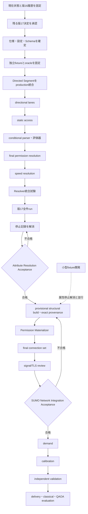

# 版17道路属性解決・道路網統合の実行手順

> **文書状態:** 実行計画
> **開始位置:** 中核方針・機械可読設定・基礎JSON Schema固定済み、production統合・fixture移行前
> **属性終了条件:** Attribute Resolution Acceptance合格
> **道路網終了条件:** SUMO Network Integration Acceptance合格
> **禁止事項:** 未決定事項を実装者の推測で補わない

## 目次

- [1. この手順の目的と正本](#1-この手順の目的と正本)
- [2. 現在位置と状態表現](#2-現在位置と状態表現)
- [3. structural networkとformal network](#3-structural-networkとformal-network)
- [4. canonicalな実行順序](#4-canonicalな実行順序)
- [5. 工程0 現在状態と版16履歴を固定する](#5-工程0-現在状態と版16履歴を固定する)
- [6. 工程1 残る版17決定事項を承認する](#6-工程1-残る版17決定事項を承認する)
- [7. 工程2 正式仕様・設定・Schemaを確定する](#7-工程2-正式仕様設定schemaを確定する)
- [8. 工程3 独立fixtureとoracleを固定する](#8-工程3-独立fixtureとoracleを固定する)
- [9. 工程4 Directed Segmentをproductionへ統合する](#9-工程4-directed-segmentをproductionへ統合する)
- [10. 工程5 方向別車線を実装する](#10-工程5-方向別車線を実装する)
- [11. 工程6 static accessを実装する](#11-工程6-static-accessを実装する)
- [12. 工程7 conditional parserと評価器を実装する](#12-工程7-conditional-parserと評価器を実装する)
- [13. 工程8 final permission resolutionを実装する](#13-工程8-final-permission-resolutionを実装する)
- [14. 工程9 速度解決を実装する](#14-工程9-速度解決を実装する)
- [15. 工程10 Resolver統合試験を行う](#15-工程10-resolver統合試験を行う)
- [16. 工程11 版17を全件実行する](#16-工程11-版17を全件実行する)
- [17. 工程12 停止記録を解消する](#17-工程12-停止記録を解消する)
- [18. 工程13 Attribute Resolution Acceptance](#18-工程13-attribute-resolution-acceptance)
- [19. 工程14 provisional structural buildとmaterializer](#19-工程14-provisional-structural-buildとmaterializer)
- [20. 工程15 final connection setとsignal TLS review](#20-工程15-final-connection-setとsignal-tls-review)
- [21. 工程16 SUMO Network Integration Acceptance](#21-工程16-sumo-network-integration-acceptance)
- [22. 工程17以降の下流工程](#22-工程17以降の下流工程)
- [23. 基準点コミットと成果物一覧](#23-基準点コミットと成果物一覧)
- [24. 中断と再開](#24-中断と再開)

## 1. この手順の目的と正本

本文書は、承認済み版17方針をproductionへ統合し、新規runとして全件実行し、
正式属性成果物と最終SUMO道路網を別々のゲートで受理する順序を定める。版16の
結果を版17として再ラベルせず、版16成果物、既存run、生成済み`net.xml`を上書き
しない。

正本の責務は次のとおりであり、本文書は同じ規則を独立に再定義しない。

| 責務 | 正本 |
|---|---|
| 機械可読なネットワーク状態 | `reproducibility/config/traffic_simulation/sumo_network.yml` |
| typed state contract | `reproducibility/config/traffic_simulation/sumo_network.schema.json` |
| 要件単位の実装状態 | `reproducibility/config/traffic_simulation/requirements_traceability.yml`および版17追跡表 |
| 研究工程と利用可否 | `reproducibility/config/traffic_simulation/research_stage.yml` |
| 版17属性解決方針 | `reproducibility/config/traffic_simulation/approved_attribute_resolution_policy_v17.yml` |
| 版17方針のnormative explanation | `specifications/10_approved_attribute_resolution_policy.md` |
| 現在状態summary | `network_current_specification.md` |
| 問題追跡 | `current_issues_and_blockers.md` |

`approved_attribute_resolution_policy_v17.yml`は作成済みの機械可読authorityである。
新規作成物として扱わず、不足設定だけを追加または改版する。

現行`sumo_network.yml`はv16状態のauthorityで、legacy
`formal_build_input_ready`にmaterializerとsignal structureを含む。この履歴は変更
しない。v17のnetwork-state configurationを発行するときに、本手順の二つの受理
ゲートを機械可読化し、それまでは当該差異を既知の設定移行事項として扱う。

## 2. 現在位置と状態表現

| 項目 | 状態 |
|---|---|
| 版16道路母集団 | 26,220道路として受理済み |
| 版16構造確認用 | 52,440組、785停止 |
| 版16正式用 | 52,440組、24,741停止、`complete=false` |
| 版17方針 | fixed |
| 新Schema、managed vehicle profile | implemented、production未統合、runtime境界未検証 |
| access比較、Directed Segment generator | isolated utilityとしてimplemented、production未統合 |
| typemap importer governance fixture | `failed` |
| Permission Materializer実装 | `not_implemented` |
| Permission Materializer runtime fixture | `not_run` |
| 既存交通シミュレーションpytest | `passed` |
| formal network | 未承認 |

状態値は`passed`、`failed`、`not_implemented`、`not_run`、`pending`、`ineligible`
を区別する。方針固定、implemented、integrated、runtime_validatedも別々に記録する。
単体試験合格だけでproduction利用可能とはしない。

`resolution_status`と`value_origin`は承認済み版17契約のcanonical fieldsであり、案
ではない。legacy `value_state`はread compatibilityだけに使用する。

## 3. structural networkとformal network

structural/provisional networkは、topology、direction、connection、provenance、
Permission Materializerの開発・確認専用である。structural assumptionを含み得て、
正式属性の全停止解消前でも小型fixtureまたは開発用出力として生成できる。ただし、
travel time、capacity、delivery、solver comparison、calibrationには使用できず、
公開可能な実データformal networkではない。

formal networkは、Attribute Resolution Acceptance済みの正式属性成果物を入力とし、
governed permissions、final connections、reviewed TLS structureを反映する。SUMO
Network Integration Acceptanceに合格した場合だけ正式道路網として承認する。
下流研究へ使用できるのは独立検証完了後である。

小型fixtureを使うprovisional build、materializer、SUMO runtime fixtureの開発は、
工程12の属性停止解消と並行できる。実データformal network acceptanceは工程13後
でなければ開始しない。

## 4. canonicalな実行順序



## 5. 工程0 現在状態と版16履歴を固定する

作業ツリー、版16入力、run記録、入力・出力・独立oracleのSHA-256を照合する。
版16の受理済み件数、要件ID、失敗コード、run ID、SHA-256を変更しない。

実在する基準検証コマンドは次である。

```bash
git status --short --branch
git diff --check
bash reproducibility/scripts/hayate/verify_hayate_native_environment.sh
PYTHONPATH="05_src:${PYTHONPATH:-}" \
  python -m traffic_simulation.network.validate_sumo_network_config
python -m pytest -q 05_src/traffic_simulation/validation
```

不明な差分、版16入力SHA-256不一致、oracle SHA-256変更、試験不合格で停止する。

## 6. 工程1 残る版17決定事項を承認する

`attribute_resolution_decisions_to_finalize.md`に残る`OPEN-PROP-005`、`009`から
`012`、`015`を、`approved`または明示的な`out_of_scope`へする。条件式文法、
2026年7月16日に適用する日本速度規則、`JP:urban`の証拠、許可台帳、停止コード
対応、独立oracleを確定する。方針固定済み項目は再決定しない。

`out_of_scope`は入力レコードを無言で削除する状態ではない。承認済み版17 Schemaの
`resolution_status` enumに`excluded`はないため、独断でenumを変更せず、現時点では
exclusion manifestを必要実装とする。各除外に理由、規則ID、道路・方向・車線、
承認者、承認日、根拠SHA-256を記録する。

除外が母集団定義を変える場合は新しいpopulation/configuration versionを発行する。
版16の26,220道路は上書きしない。版17は入力母集団、管理対象母集団、除外母集団を
別件数で記録し、`complete=true`の分母を管理対象母集団、permission completenessの
分母を全管理対象way/direction/lane tupleとしてmanifestに明記する。除外でblocker
を形式的に0件へ見せかけてはならない。

## 7. 工程2 正式仕様・設定・Schemaを確定する

版17方針を正本として、不足する条件プロファイル、速度規則、許可台帳、停止コード
対応を機械可読化し、既存設定との重複を避ける。作成済み
`attribute_resolution_v2.schema.json`をproductionの全入出力境界へ接続し、
`resolution_status`と`value_origin`へ移行する。

formalでは`model_assumed`を拒否し、停止状態と停止コード、解決状態と値・由来、
Schema版と設定版の整合を検査する。structuralとformalを同じrun成果物へ混在させ
ない。仕様、設定、Schemaの識別子不一致、未登録規則・状態・停止コードで停止する。

## 8. 工程3 独立fixtureとoracleを固定する

production実装を変更する前に入力を作り、承認済み仕様からoracleを別経路で導出する。
production出力から正解を生成せず、入力、oracle、manifest、参照仕様をSHA-256で
固定する。

通常、異常、境界、再実行、規則改訂、証拠競合、日付・時刻・重量境界、access
優先順位、`oneway=-1`、通常・バスrestriction、`lanes:both_ways`、direction-specific
speed、relation mapping、未登録構文を含める。

## 9. 工程4 Directed Segmentをproductionへ統合する

原典OSM Wayは読み取り専用とする。`oneway=-1`ではbackward Directed Segmentだけを
生成し、原典Wayの形状やタグを破壊的に反転しない。方向別属性はsource directionと
target Directed Segmentの対応として保持する。

relationの`from`、`via`、`to`をDirected Segment候補へ写像する。zero candidateは
`RELATION_DIRECTED_MAPPING_MISSING`、multiple candidateは
`RELATION_DIRECTED_MAPPING_AMBIGUOUS`で停止する。SUMO edge IDの符号、座標最近傍、
生成順をformal方向証拠に使用しない。exact provenanceを復元できない場合も停止する。

## 10. 工程5 方向別車線を実装する

formalの双方向道路では`lanes:forward`と`lanes:backward`を明示的に要求する。総車線
数だけから均等配分せず、統計的補完を使わない。総車線数と片方向値から他方向値が
算術上一意でも、現行版17方針ではformal値に自動採用せず、
`LANE_DIRECTIONAL_ALLOCATION_MISSING`で停止する。

算術導出を使えるのはstructural-onlyで、承認済み規則に従い、assumption IDと
`value_origin=model_assumed`相当の非formal由来、`formal_eligible=false`を必ず記録
する。formal成果物へ混入させない。単方向道路の明示総車線数に関する承認済み
`rule_derived`規則は版17正本に従う。

## 11. 工程6 static accessを実装する

static access normalizationは、spatial、vehicle、purpose、lane、direction、
general/specific ruleを正規化し、Pareto-dominated rulesを除き、maximal static rules
を選択する。この工程はconditionalタグを評価せず、最終permission expectationも
まだ生成しない。`private`、`permit`、`destination`、`delivery`等を、登録済み車両・
許可・目的文脈に対する静的規則として処理する。

## 12. 工程7 conditional parserと評価器を実装する

承認済み文法だけを解析し、date、time、holiday、vehicle、weight、dimensions、trip
purposeを評価する。missing contextをfalseとして通過させず、unsupported syntax、
未登録token、interval内で結果が変化する条件を明示的に停止する。この工程の出力は
評価済みconditional rulesであり、complete permission expectationではない。

## 13. 工程8 final permission resolutionを実装する

static rulesと評価済みconditional rulesを統合する。multiple maximal rulesが同じ
結果なら一度だけ採用し、異なる結果なら`ACCESS_SPECIFICITY_CONFLICT`で停止する。
lane-local provenanceを保持し、全管理対象way/direction/lane tupleを被覆するcomplete
permission expectationを生成する。

Resolver expected permissionsを版17formal authorityとする。typemap permissionsを
formal上限にせず、managed vClass universeだけを上限とする。unsupported、unresolved、
conflict、invalidを暗黙の既定値で通過させない。

## 14. 工程9 速度解決を実装する

direction-specific explicit value、一般値、日付・区間・方向が一致する公式証拠、
承認済み日本速度規則の順序を正本どおりに評価する。指定速度、法定速度、助言速度、
simulation speedを分離し、typemap既定速度は`model_assumed`としてformalから除外する。
`JP:urban`を数値`maxspeed`と同一視せず、道路状態証拠がなければ停止する。

## 15. 工程10 Resolver統合試験を行う

個別試験の後に交通シミュレーション検証一式を実行する。

```bash
python -m pytest -q \
  05_src/traffic_simulation/validation/test_attribute_classification_schemas.py
python -m pytest -q \
  05_src/traffic_simulation/validation/test_resolve_attribute_values.py
python -m pytest -q 05_src/traffic_simulation/validation
```

classification非変更、正常・異常・境界・再実行・規則改訂、oracle SHA-256不変、
structural仮定のformal非混入、原子的出力を検査する。一件でも不合格なら全件runへ
進まない。

## 16. 工程11 版17を全件実行する

版17専用runner、明示run ID、新しい出力先を使い、`attribute_resolution_v16`や既存
runを上書きしない。現時点のコードベースには版17runnerが存在しないため、推測した
CLIコマンドは記載しない。runner実装とCLI固定は`ISSUE-ATTR-001`の必要作業である。

受理済み版16 relation closureを不変入力として参照し、新仕様・設定・Schema、fixture、
oracle、外部証拠、祝日暦、速度規則、許可台帳からstructuralとformalを別成果物として
生成する。run manifestに入力、設定、Schema、出力、oracleのSHA-256と母集団三件数を
記録する。

### 16.1 validator実装の確認結果

実装済み`validate_attribute_classification`は、現行v16の
`artifact_type=attribute_classification`統合形状について、classification Schema、
resolutionを含む意味整合、被覆、completeと停止状態、record/self-hash、参照hash等を
検査する。classification projectionだけに限定されたvalidatorではない。

ただし、版17の`attribute_resolution_v2`成果物、permission expectation completeness、
版17run manifestを包括検証するCLIではない。したがって版17成果物へこのコマンドを
流用しない。次の責務を持つ版17検証処理は未実装であり、実装・CLI固定後に手順へ
実コマンドを追加する。

- classification Schema validation
- attribute resolution Schema validation
- semantic consistency validation
- classification non-mutation validation
- permission expectation completeness validation
- record/self-hash validation
- run manifest validation
- unresolved and blocker count validation

## 17. 工程12 停止記録を解消する

停止を、入力修正、外部証拠、許可台帳、規則追加、承認済み除外、実装不具合へ排他的
に分類する。停止記録を直接編集せず、原因分類、仕様・入力改訂、fixture/oracle追加、
実装、個別試験、全体試験、新規runの順に反復する。oracleをproduction出力へ合わせて
変更しない。

formalで`complete=true`、`blockers=[]`、`review_required=0`、`stop_unresolved=0`、
`model_assumed=0`になるまで工程13へ進まない。

## 18. 工程13 Attribute Resolution Acceptance

このゲートの対象はResolverが生成した正式属性成果物であり、次をすべて要求する。

- `complete=true`
- `blockers=[]`
- `review_required=0`
- `stop_unresolved=0`
- `model_assumed=0`
- 入力・管理対象・除外母集団、レコード数、属性被覆、permission被覆が宣言分母と一致
- classification Schemaとattribute resolution Schemaに合格
- 意味整合、classification projection非変更、permission completenessに合格
- record/self-hashとrun manifestに合格
- 入力、設定、Schema、出力、独立oracleのSHA-256を記録
- 未登録の状態、規則、停止コードが0件
- structural成果物とformal成果物が混在しない

受理manifestへrun ID、設定・Schema版、件数、分布、試験結果、受理者、受理日、既知
の限界を記録する。このゲートにはSUMO edge、lane permissions、connections、TLS、
reachability等の最終道路網検査を含めない。合格しても最終SUMO道路網は未承認である。

## 19. 工程14 provisional structural buildとmaterializer

Attribute Resolution Acceptance済みformal属性を実データformal buildの入力とする。
provisional structural buildを行い、exact edge provenanceを生成する。Permission
MaterializerはResolver expectationをlaneとconnectionの明示的なfinal `netconvert`
入力へ反映する。provisionalファイルや生成済み`net.xml`を直接編集しない。

lane permissions、connection permissionsを反映し、空lane・edge、存在しない接続、
lane順、方向対応を承認済み契約どおりに処理する。小型fixture実装は工程12と並行
できるが、実データformal buildは工程13合格後だけに行う。

## 20. 工程15 final connection setとsignal TLS review

materialized permissionsからfinal connection setを確定する。その後にsignal junction
とTLS linkをreviewし、connection-to-link対応、controlled connection数、phase state
長を固定する。connection set変更後はreviewをやり直す。

## 21. 工程16 SUMO Network Integration Acceptance

承認済み入力からfinal `net.xml`を生成し、SUMO 1.24.0で読み込む。次を監査する。

- edge方向、車線数、車線順、lane permissions
- connection permissionsとfinal connection set
- 通常・バスturn restrictions
- signal junction、TLS link、phase state長
- left-hand traffic
- warning、exclusion、未登録状態
- 車種別reachability、最大走行可能成分、主要地点間往復到達性
- exact provenance、manifest、出力SHA-256

不一致時は上流入力または生成処理を修正して再生成する。`net.xml`を直接編集しない。
このゲート合格時だけ正式道路網として承認する。

## 22. 工程17以降の下流工程

正式道路網承認後にdemand、calibration、independent validationの順で進む。delivery、
classical、QAOA evaluationへ進めるのは独立検証完了後だけである。structural networkの
較正結果をformal networkへ移さない。

## 23. 基準点コミットと成果物一覧

| 基準点 | 主な成果物 | Git管理 |
|---|---|---|
| A | 現状と版16履歴 | コミット |
| B | 承認済み決定、不足設定、Schema | 対象 |
| C | 独立fixture、oracle、manifest | 対象 |
| D | Directed Segment、directional lane | 対象 |
| E | static access、conditional evaluator、final permission、speed | 対象 |
| F | Resolver統合試験 | 小型記録を対象 |
| G | 版17全件run | 大容量本体は対象外、manifestを対象 |
| H | Attribute Resolution Acceptance manifest | 対象 |
| I | provisional XML、exact provenance、materializer | 小型成果物とmanifestを対象 |
| J | reviewed final connection/TLS manifest | 対象 |
| K | SUMO Network Integration Acceptance manifest | 対象 |

各基準点で`git diff --check`と交通シミュレーション検証一式を実行する。大容量成果物
はGitへ直接追加せず、manifestからパスとSHA-256を参照する。

## 24. 中断と再開

中断時は、最後に完了した工程、未完了の決定・試験、作業ツリー、最後に合格した
コマンド、入力・中間成果物SHA-256、再開時の最初のコマンドを記録する。

再開時は、正本と版、作業ツリー、入力SHA-256を再確認し、最後の合格試験を再実行
する。上流変更で無効化された成果物を確認し、未完了工程の先頭から再開する。
不完全な出力を成功成果物として再利用せず、新しいrun IDと出力先を使用する。
