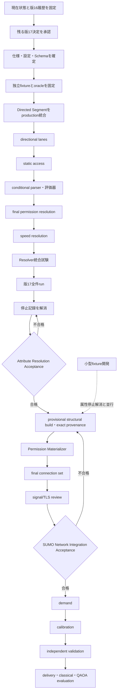

# 版17道路属性解決・道路網統合の実行手順

> **文書状態:** 実行計画
> **開始位置:** 中核方針・機械可読設定・基礎ジェイソン形式 データ構造固定済み、正式運用統合・検証用データ移行前
> **属性終了条件:** 属性解決の受入合格
> **道路網終了条件:** 交通シミュレーターの道路網統合受入合格
> **禁止事項:** 未決定事項を実装者の推測で補わない

## 目次

- [1. この手順の目的と正本](#1-この手順の目的と正本)
- [2. 現在位置と状態表現](#2-現在位置と状態表現)
- [3. 構造上の 道路網と正式 道路網](#3-structural-networkとformal-network)
- [4. 正本な実行順序](#4-canonicalな実行順序)
- [5. 工程0 現在状態と版16履歴を固定する](#5-工程0-現在状態と版16履歴を固定する)
- [6. 工程1 残る版17決定事項を承認する](#6-工程1-残る版17決定事項を承認する)
- [7. 工程2 正式仕様・設定・データ構造を確定する](#7-工程2-正式仕様設定schemaを確定する)
- [8. 工程3 独立検証用データと正解判定器を固定する](#8-工程3-独立fixtureとoracleを固定する)
- [9. 工程4 方向付き区間を正式運用へ統合する](#9-工程4-directed-segmentをproductionへ統合する)
- [10. 工程5 方向別車線を実装する](#10-工程5-方向別車線を実装する)
- [11. 工程6 静的 接続を実装する](#11-工程6-static-accessを実装する)
- [12. 工程7 条件付き 解析器と評価器を実装する](#12-工程7-conditional-parserと評価器を実装する)
- [13. 工程8 最終 通行許可 解決を実装する](#13-工程8-final-permission-resolutionを実装する)
- [14. 工程9 速度解決を実装する](#14-工程9-速度解決を実装する)
- [15. 工程10 属性解決器統合試験を行う](#15-工程10-resolver統合試験を行う)
- [16. 工程11 版17を全件実行する](#16-工程11-版17を全件実行する)
- [17. 工程12 停止記録を解消する](#17-工程12-停止記録を解消する)
- [18. 工程13 属性解決の受入](#18-工程13-attribute-resolution-acceptance)
- [19. 工程14 暫定 構造上の 構築と具体化処理](#19-工程14-provisional-structural-buildとmaterializer)
- [20. 工程15 最終 接続 setと信号 信号制御 確認](#20-工程15-final-connection-setとsignal-tls-review)
- [21. 工程16 交通シミュレーターの道路網統合受入](#21-工程16-sumo-network-integration-acceptance)
- [22. 工程17以降の下流工程](#22-工程17以降の下流工程)
- [23. 基準点コミットと成果物一覧](#23-基準点コミットと成果物一覧)
- [24. 中断と再開](#24-中断と再開)

## 1. この手順の目的と正本

本文書は、承認済み版17方針を正式運用へ統合し、新規実行として全件実行し、
正式属性成果物と最終スーモ道路網を別々のゲートで受理する順序を定める。版16の
結果を版17として再ラベルせず、版16成果物、既存実行、生成済み`net.xml`を上書き
しない。

正本の責務は次のとおりであり、本文書は同じ規則を独立に再定義しない。

| 責務 | 正本 |
|---|---|
| 機械可読なネットワーク状態 | `reproducibility/config/traffic_simulation/sumo_network.yml` |
| typed state contract | `reproducibility/config/traffic_simulation/sumo_network.schema.json` |
| 要件単位の実装状態 | `reproducibility/config/traffic_simulation/requirements_traceability.yml`および版17追跡表 |
| 研究工程と利用可否 | `reproducibility/config/traffic_simulation/research_stage.yml` |
| 版17属性解決方針 | `reproducibility/config/traffic_simulation/approved_attribute_resolution_policy_v17.yml` |
| 版17方針のnormative explanation | `specifications/10_approved_attribute_resolution_policy.md` |
| 現在状態まとめ | `network_current_specification.md` |
| 問題追跡 | `current_issues_and_blockers.md` |

`approved_attribute_resolution_policy_v17.yml`は作成済みの機械可読正本である。
新規作成物として扱わず、不足設定だけを追加または改版する。

現行`sumo_network.yml`はv16状態の正本で、旧版
`formal_build_input_ready`に具体化処理と信号 structureを含む。この履歴は変更
しない。v17の道路網-状態 設定を発行するときに、本手順の二つの受理
ゲートを機械可読化し、それまでは当該差異を既知の設定移行事項として扱う。

## 2. 現在位置と状態表現

| 項目 | 状態 |
|---|---|
| 版16道路母集団 | 26,220道路として受理済み |
| 版16構造確認用 | 52,440組、785停止 |
| 版16正式用 | 52,440組、24,741停止、`complete=false` |
| 版17方針 | 固定済み |
| 新データ構造、管理された 車両 設定プロファイル | 実装済み、正式運用未統合、実行時間境界未検証 |
| 接続比較、方向付き区間 生成器 | isolated utilityとして実装済み、正式運用未統合 |
| typemap importer governance fixture | `failed` |
| 通行許可の具体化処理実装 | `not_implemented` |
| Permission Materializer runtime fixture | `not_run` |
| 既存交通シミュレーションpytest | `passed` |
| formal network | 未承認 |

状態値は`passed`、`failed`、`not_implemented`、`not_run`、`pending`、`ineligible`
を区別する。方針固定、実装済み、integrated、runtime_validatedも別々に記録する。
単体試験合格だけで正式運用利用可能とはしない。

`resolution_status`と`value_origin`は承認済み版17契約の正本 fieldsであり、案
ではない。旧版 `value_state`はread compatibilityだけに使用する。

<a id="3-structural-networkとformal-network"></a>

## 3. 構造上の 道路網と正式 道路網

structural/provisional 道路網は、接続構造、方向、接続、出典・来歴、
通行許可の具体化処理の開発・確認専用である。構造上の 仮定を含み得て、
正式属性の全停止解消前でも小型検証用データまたは開発用出力として生成できる。ただし、
移動 時間、容量、配送、求解器 比較、較正には使用できず、
公開可能な実データ正式 道路網ではない。

正式 道路網は、属性解決の受入済みの正式属性成果物を入力とし、
管理対象の 通行許可、最終 接続、reviewed 信号制御 structureを反映する。スーモ
道路網統合受入に合格した場合だけ正式道路網として承認する。
下流研究へ使用できるのは独立検証完了後である。

小型検証用データを使う暫定 構築、具体化処理、スーモ 実行時間 検証用データの開発は、
工程12の属性停止解消と並行できる。実データ正式 道路網 受入は工程13後
でなければ開始しない。

<a id="4-canonicalな実行順序"></a>

## 4. 正本な実行順序


```mermaid
flowchart TD
    A[現在状態と版16履歴を固定] --> B[残る版17決定を承認]
    B --> C[仕様・設定・Schemaを確定]
    C --> D[独立fixtureとoracleを固定]
    D --> E[Directed Segmentをproduction統合]
    E --> F[directional lanes]
    F --> G[static access]
    G --> H[conditional parser・評価器]
    H --> I[final permission resolution]
    I --> J[speed resolution]
    J --> K[Resolver統合試験]
    K --> L[版17全件run]
    L --> M[停止記録を解消]
    M --> N{Attribute Resolution Acceptance}
    N -- 不合格 --> M
    N -- 合格 --> O[provisional structural build・exact provenance]
    O --> P[Permission Materializer]
    P --> Q[final connection set]
    Q --> R[signal/TLS review]
    R --> S{SUMO Network Integration Acceptance}
    S -- 不合格 --> O
    S -- 合格 --> T[demand]
    T --> U[calibration]
    U --> V[independent validation]
    V --> W[delivery・classical・QAOA evaluation]
    X[小型fixture開発] -. 属性停止解消と並行 .-> O
```

## 5. 工程0 現在状態と版16履歴を固定する

作業ツリー、版16入力、実行記録、入力・出力・独立正解判定器のSHA-256を照合する。
版16の受理済み件数、要件識別子、失敗コード、実行 識別子、SHA-256を変更しない。

実在する基準検証コマンドは次である。

```bash
git status --short --branch
git diff --check
bash reproducibility/scripts/hayate/verify_hayate_native_environment.sh
PYTHONPATH="05_src:${PYTHONPATH:-}" \
  python -m traffic_simulation.network.validate_sumo_network_config
python -m pytest -q 05_src/traffic_simulation/validation
```

不明な差分、版16入力SHA-256不一致、正解判定器 SHA-256変更、試験不合格で停止する。

## 6. 工程1 残る版17決定事項を承認する

`attribute_resolution_decisions_to_finalize.md`に残る`OPEN-PROP-005`、`009`から
`012`、`015`を、`approved`または明示的な`out_of_scope`へする。条件式文法、
2026年7月16日に適用する日本速度規則、`JP:urban`の証拠、許可台帳、停止コード
対応、独立正解判定器を確定する。方針固定済み項目は再決定しない。

`out_of_scope`は入力レコードを無言で削除する状態ではない。承認済み版17 データ構造の
`resolution_status` 列挙値に`excluded`はないため、独断で列挙値を変更せず、現時点では
除外 成果物一覧を必要実装とする。各除外に理由、規則識別子、道路・方向・車線、
承認者、承認日、根拠SHA-256を記録する。

除外が母集団定義を変える場合は新しいpopulation/configuration 版を発行する。
版16の26,220道路は上書きしない。版17は入力母集団、管理対象母集団、除外母集団を
別件数で記録し、`complete=true`の分母を管理対象母集団、通行許可 completenessの
分母を全管理対象way/direction/lane 組として成果物一覧に明記する。除外で阻害要因
を形式的に0件へ見せかけてはならない。

<a id="7-工程2-正式仕様設定schemaを確定する"></a>

## 7. 工程2 正式仕様・設定・データ構造を確定する

版17方針を正本として、不足する条件プロファイル、速度規則、許可台帳、停止コード
対応を機械可読化し、既存設定との重複を避ける。作成済み
`attribute_resolution_v2.schema.json`を正式運用の全入出力境界へ接続し、
`resolution_status`と`value_origin`へ移行する。

正式では`model_assumed`を拒否し、停止状態と停止コード、解決状態と値・由来、
データ構造版と設定版の整合を検査する。構造上のと正式を同じ実行成果物へ混在させ
ない。仕様、設定、データ構造の識別子不一致、未登録規則・状態・停止コードで停止する。

<a id="8-工程3-独立fixtureとoracleを固定する"></a>

## 8. 工程3 独立検証用データと正解判定器を固定する

正式運用実装を変更する前に入力を作り、承認済み仕様から正解判定器を別経路で導出する。
正式運用出力から正解を生成せず、入力、正解判定器、成果物一覧、参照仕様をSHA-256で
固定する。

通常、異常、境界、再実行、規則改訂、証拠競合、日付・時刻・重量境界、接続
優先順位、`oneway=-1`、通常・バス制限、`lanes:both_ways`、方向-specific
速度、関係 対応付け、未登録構文を含める。

<a id="9-工程4-directed-segmentをproductionへ統合する"></a>

## 9. 工程4 方向付き区間を正式運用へ統合する

原典オープンストリートマップ 道路地物は読み取り専用とする。`oneway=-1`では逆方向 方向付き区間だけを
生成し、原典道路地物の形状やタグを破壊的に反転しない。方向別属性は出典 方向と
対象 方向付き区間の対応として保持する。

関係の`from`、`via`、`to`を方向付き区間候補へ写像する。zero 候補は
`RELATION_DIRECTED_MAPPING_MISSING`、multiple 候補は
`RELATION_DIRECTED_MAPPING_AMBIGUOUS`で停止する。スーモ 道路区間 識別子の符号、座標最近傍、
生成順を正式方向証拠に使用しない。厳密 出典・来歴を復元できない場合も停止する。

## 10. 工程5 方向別車線を実装する

正式の双方向道路では`lanes:forward`と`lanes:backward`を明示的に要求する。総車線
数だけから均等配分せず、統計的補完を使わない。総車線数と片方向値から他方向値が
算術上一意でも、現行版17方針では正式値に自動採用せず、
`LANE_DIRECTIONAL_ALLOCATION_MISSING`で停止する。

算術導出を使えるのは構造上の-onlyで、承認済み規則に従い、仮定 識別子と
`value_origin=model_assumed`相当の非正式由来、`formal_eligible=false`を必ず記録
する。正式成果物へ混入させない。単方向道路の明示総車線数に関する承認済み
`rule_derived`規則は版17正本に従う。

<a id="11-工程6-static-accessを実装する"></a>

## 11. 工程6 静的 接続を実装する

静的 接続 正規化は、空間的な、車両、目的、車線、方向、
general/specific 規則を正規化し、Pareto-dominated 規則を除き、maximal 静的 規則
を選択する。この工程は条件付きタグを評価せず、最終通行許可 期待値も
まだ生成しない。`private`、`permit`、`destination`、`delivery`等を、登録済み車両・
許可・目的文脈に対する静的規則として処理する。

<a id="12-工程7-conditional-parserと評価器を実装する"></a>

## 12. 工程7 条件付き 解析器と評価器を実装する

承認済み文法だけを解析し、日付、時間、holiday、車両、重み、dimensions、trip
目的を評価する。欠落 文脈を偽として通過させず、未対応 syntax、
未登録token、interval内で結果が変化する条件を明示的に停止する。この工程の出力は
評価済み条件付き 規則であり、complete 通行許可 期待値ではない。

<a id="13-工程8-final-permission-resolutionを実装する"></a>

## 13. 工程8 最終 通行許可 解決を実装する

静的 規則と評価済み条件付き 規則を統合する。multiple maximal 規則が同じ
結果なら一度だけ採用し、異なる結果なら`ACCESS_SPECIFICITY_CONFLICT`で停止する。
車線-local 出典・来歴を保持し、全管理対象way/direction/lane 組を被覆するcomplete
通行許可 期待値を生成する。

属性解決器 expected 通行許可を版17formal 正本とする。道路種別の対応表 通行許可を
正式上限にせず、管理された vClass universeだけを上限とする。未対応、未解決、
矛盾、不正を暗黙の既定値で通過させない。

## 14. 工程9 速度解決を実装する

方向-specific explicit 値、一般値、日付・区間・方向が一致する公式証拠、
承認済み日本速度規則の順序を正本どおりに評価する。指定速度、法定速度、助言速度、
simulation 速度を分離し、道路種別の対応表既定速度は`model_assumed`として正式から除外する。
`JP:urban`を数値`maxspeed`と同一視せず、道路状態証拠がなければ停止する。

<a id="15-工程10-resolver統合試験を行う"></a>

## 15. 工程10 属性解決器統合試験を行う

個別試験の後に交通シミュレーション検証一式を実行する。

```bash
python -m pytest -q \
  05_src/traffic_simulation/validation/test_attribute_classification_schemas.py
python -m pytest -q \
  05_src/traffic_simulation/validation/test_resolve_attribute_values.py
python -m pytest -q 05_src/traffic_simulation/validation
```

分類非変更、正常・異常・境界・再実行・規則改訂、正解判定器 SHA-256不変、
構造上の仮定の正式非混入、原子的出力を検査する。一件でも不合格なら全件実行へ
進まない。

## 16. 工程11 版17を全件実行する

版17専用実行器、明示実行 識別子、新しい出力先を使い、`attribute_resolution_v16`や既存
実行を上書きしない。現時点のコードベースには版17runnerが存在しないため、推測した
コマンド操作コマンドは記載しない。実行器実装とコマンド操作固定は`ISSUE-ATTR-001`の必要作業である。

受理済み版16 関係要素の参照先の補完を不変入力として参照し、新仕様・設定・データ構造、検証用データ、
正解判定器、外部証拠、祝日暦、速度規則、許可台帳から構造上のと正式を別成果物として
生成する。実行 成果物一覧に入力、設定、データ構造、出力、正解判定器のSHA-256と母集団三件数を
記録する。

<a id="161-validator実装の確認結果"></a>

### 16.1 検証器実装の確認結果

実装済み`validate_attribute_classification`は、現行v16の
`artifact_type=attribute_classification`統合形状について、分類 データ構造、
解決を含む意味整合、被覆、completeと停止状態、record/self-hash、参照ハッシュ値等を
検査する。分類 projectionだけに限定された検証器ではない。

ただし、版17の`attribute_resolution_v2`成果物、通行許可 期待値 completeness、
版17run 成果物一覧を包括検証するコマンド操作ではない。したがって版17成果物へこのコマンドを
流用しない。次の責務を持つ版17検証処理は未実装であり、実装・コマンド操作固定後に手順へ
実コマンドを追加する。

- classification Schema validation
- attribute resolution Schema validation
- semantic consistency validation
- classification non-mutation validation
- permission expectation completeness validation
- record/self-hash validation
- run manifest validation
- unresolved and blocker count validation

## 17. 工程12 停止記録を解消する

停止を、入力修正、外部証拠、許可台帳、規則追加、承認済み除外、実装不具合へ排他的
に分類する。停止記録を直接編集せず、原因分類、仕様・入力改訂、fixture/oracle追加、
実装、個別試験、全体試験、新規実行の順に反復する。正解判定器を正式運用出力へ合わせて
変更しない。

正式で`complete=true`、`blockers=[]`、`review_required=0`、`stop_unresolved=0`、
`model_assumed=0`になるまで工程13へ進まない。

<a id="18-工程13-attribute-resolution-acceptance"></a>

## 18. 工程13 属性解決の受入

このゲートの対象は属性解決器が生成した正式属性成果物であり、次をすべて要求する。

- `complete=true`
- `blockers=[]`
- `review_required=0`
- `stop_unresolved=0`
- `model_assumed=0`
- 入力・管理対象・除外母集団、レコード数、属性被覆、通行許可被覆が宣言分母と一致
- 分類 データ構造と属性 解決 データ構造に合格
- 意味整合、分類 projection非変更、通行許可 completenessに合格
- record/self-hashと実行 成果物一覧に合格
- 入力、設定、データ構造、出力、独立正解判定器のSHA-256を記録
- 未登録の状態、規則、停止コードが0件
- 構造上の成果物と正式成果物が混在しない

受理成果物一覧へ実行 識別子、設定・データ構造版、件数、分布、試験結果、受理者、受理日、既知
の限界を記録する。このゲートにはスーモ 道路区間、車線 通行許可、接続、信号制御、
到達可能性等の最終道路網検査を含めない。合格しても最終スーモ道路網は未承認である。

<a id="19-工程14-provisional-structural-buildとmaterializer"></a>

## 19. 工程14 暫定 構造上の 構築と具体化処理

属性解決の受入済み正式属性を実データ正式 構築の入力とする。
暫定 構造上の 構築を行い、厳密 道路区間 出典・来歴を生成する。通行許可
具体化処理は属性解決器 期待値を車線と接続の明示的な最終 `netconvert`
入力へ反映する。暫定ファイルや生成済み`net.xml`を直接編集しない。

車線 通行許可、接続 通行許可を反映し、空車線・道路区間、存在しない接続、
車線順、方向対応を承認済み契約どおりに処理する。小型検証用データ実装は工程12と並行
できるが、実データ正式 構築は工程13合格後だけに行う。

<a id="20-工程15-final-connection-setとsignal-tls-review"></a>

## 20. 工程15 最終接続集合と信号信号制御の確認

materialized 通行許可から最終 接続 setを確定する。その後に信号 交差点
と信号制御 リンクを確認し、接続-to-リンク対応、条件を統制した 接続数、段階 状態
長を固定する。接続 set変更後は確認をやり直す。

<a id="21-工程16-sumo-network-integration-acceptance"></a>

## 21. 工程16 交通シミュレーターの道路網統合受入

承認済み入力から最終 `net.xml`を生成し、スーモ 1.24.0で読み込む。次を監査する。

- 道路区間方向、車線数、車線順、車線 通行許可
- 接続 通行許可と最終 接続 set
- 通常・バス右左折 restrictions
- 信号 交差点、信号制御 リンク、段階 状態長
- left-hand traffic
- 注意事項、除外、未登録状態
- 車種別到達可能性、最大走行可能成分、主要地点間往復到達性
- 厳密 出典・来歴、成果物一覧、出力SHA-256

不一致時は上流入力または生成処理を修正して再生成する。`net.xml`を直接編集しない。
このゲート合格時だけ正式道路網として承認する。

## 22. 工程17以降の下流工程

正式道路網承認後にdemand、較正、independent 検証の順で進む。配送、
古典計算、量子近似最適化アルゴリズム evaluationへ進めるのは独立検証完了後だけである。構造上の 道路網の
較正結果を正式 道路網へ移さない。

## 23. 基準点コミットと成果物一覧

| 基準点 | 主な成果物 | Git管理 |
|---|---|---|
| A | 現状と版16履歴 | コミット |
| B | 承認済み決定、不足設定、データ構造 | 対象 |
| C | 独立検証用データ、正解判定器、成果物一覧 | 対象 |
| D | Directed Segment、directional lane | 対象 |
| E | static access、conditional evaluator、final permission、speed | 対象 |
| F | 属性解決器統合試験 | 小型記録を対象 |
| G | 版17全件実行 | 大容量本体は対象外、成果物一覧を対象 |
| H | Attribute Resolution Acceptance manifest | 対象 |
| I | provisional XML、exact provenance、materializer | 小型成果物と成果物一覧を対象 |
| J | reviewed final connection/TLS manifest | 対象 |
| K | SUMO Network Integration Acceptance manifest | 対象 |

各基準点で`git diff --check`と交通シミュレーション検証一式を実行する。大容量成果物
はGitへ直接追加せず、成果物一覧からパスとSHA-256を参照する。

## 24. 中断と再開

中断時は、最後に完了した工程、未完了の決定・試験、作業ツリー、最後に合格した
コマンド、入力・中間成果物SHA-256、再開時の最初のコマンドを記録する。

再開時は、正本と版、作業ツリー、入力SHA-256を再確認し、最後の合格試験を再実行
する。上流変更で無効化された成果物を確認し、未完了工程の先頭から再開する。
不完全な出力を成功成果物として再利用せず、新しい実行 識別子と出力先を使用する。
