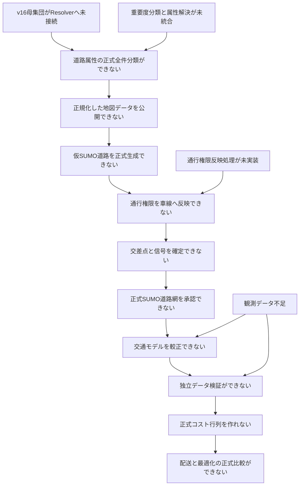

# 交通シミュレーション研究の現状の問題と阻害事項

> **文書状態**: 現状説明・問題追跡文書
> **状態基準日**: 2026-07-30
> **現在工程**: 工程6「SUMO道路網生成・構造検証」
> **正式道路網**: 未承認
> **下流実験**: 実行不可

## 目次

- [1. この文書の目的](#1-この文書の目的)
- [2. 現状の結論](#2-現状の結論)
- [3. 問題の読み方](#3-問題の読み方)
- [4. 問題間の依存関係](#4-問題間の依存関係)
- [5. 道路母集団の参照補完は確定](#5-道路母集団の参照補完は確定)
- [6. 道路属性の停止記録が残る](#6-道路属性の停止記録が残る)
- [7. 重要度分類と属性解決が未統合](#7-重要度分類と属性解決が未統合)
- [8. 307件の規則・データ例外は分類済み・解決保留](#8-307件の規則データ例外は分類済み解決保留)
- [9. 通行権限をSUMOへ反映する処理が未実装](#9-通行権限をsumoへ反映する処理が未実装)
- [10. 仮道路構造と道路対応履歴の正式生成が未実装](#10-仮道路構造と道路対応履歴の正式生成が未実装)
- [11. 交差点・信号・最終道路網の検証が未実施](#11-交差点信号最終道路網の検証が未実施)
- [12. 交通モデルの較正・独立検証データが不足](#12-交通モデルの較正独立検証データが不足)
- [13. 配送・最適化の正式比較へ進めない](#13-配送最適化の正式比較へ進めない)
- [14. 現在のHTML地図で確認できないこと](#14-現在のhtml地図で確認できないこと)
- [15. リポジトリ運用上の未完了事項](#15-リポジトリ運用上の未完了事項)
- [16. 優先順位と解消順序](#16-優先順位と解消順序)
- [17. 問題解消の判定条件](#17-問題解消の判定条件)
- [18. 正本と証拠](#18-正本と証拠)

## 1. この文書の目的

この文書は、交通シミュレーション研究が現在どこで停止しているかを、人間が確認
できる形で説明する。単に「未実装」と列挙するのではなく、各問題について次を示す。

- 何が未確定または未実装なのか
- 何を根拠に問題と判断しているか
- 問題を放置すると、どの下流成果物へ影響するか
- どの作業で解消するか
- 何をもって解消済みと判定するか

機械可読な現在地の正本は
`reproducibility/config/traffic_simulation/research_stage.yml`である。要件単位の
実装状態は`reproducibility/config/traffic_simulation/requirements_traceability.yml`
を正本とする。この文書は正本を説明するものであり、状態を独自に上書きしない。

## 2. 現状の結論

現時点で確認用HTML地図は生成できる。しかし、正式なSUMO道路網は未承認であり、
較正、独立データ検証、正式配送比較には使用できない。

| 対象 | 現在の判定 | 理由 |
|---|---|---|
| 道路網仕様 | 統制済みドラフト | 仕様と一部のデータ形式・試験は存在するが、実データの正式受入が未完了 |
| 正式SUMO道路網 | 未承認 | 道路属性、通行権限、交差点、信号、最終生成、生成後監査が未完了 |
| 交通モデル較正 | 開始不可 | 正式道路網が前提であり、観測データも不足 |
| 独立データ検証 | 開始不可 | 較正済みモデルと、較正に使わない観測が必要 |
| 正式コスト行列 | 作成不可 | 独立検証済み交通環境がない |
| 配送・最適化の正式比較 | 実行不可 | 正式コスト行列と共通配送問題が未確定 |

現在の最優先問題は、次の三つである。

1. 受理済みv16母集団をClassifier・Resolverへ接続する。
2. 道路属性の重要度分類と採用値決定を実装し、全件停止記録を分類・解決する。
3. 決定済み通行可能車種をSUMOの車線・車線間接続へ反映する処理を実装する。

## 3. 問題の読み方

### 3.1 問題の種類

| 種類 | 意味 |
|---|---|
| 研究利用阻害 | 解消しなければ正式な研究結果を生成できない |
| 実装阻害 | 仕様はあるが、処理本体または実行試験がない |
| データ阻害 | 必要な観測、証拠、参照データが不足している |
| 検証阻害 | 処理は存在しても、固定環境または実データで合格証拠がない |
| 運用上の未完了 | Gitへの反映、実行記録、文書同期などが完了していない |

### 3.2 「46,056件」の解釈

v15道路属性解決処理の全件試行では、46,056行が停止として記録された。この数字は、
46,056本の道路に個別の重大な誤りがあることを意味しない。

- 集計単位は道路本数ではなく、道路と属性の組である。
- 一つの道路が車線数と最高速度の両方で停止すれば2行になる。
- 停止行46,056件は24,346本の道路に対応する。
- 45,749行は、主として車線数または最高速度の明示値がない通常欠損候補である。
- 欠損以外の307行は、未対応表現、矛盾、条件付き通行規制などの
  規則・データ例外である。現在は20規則へ排他的に分類済みだが、値解決は保留している。

したがって、46,056行すべてを手作業で確認する方針は採らない。通常欠損を決定表で
処理し、人間または追加証拠が必要な例外だけを分離する。

## 4. 問題間の依存関係

図は主要な阻害関係を示す。実装作業は一部並行できるが、正式成果物の受入は上流の
合格を必要とする。例えば、小型試験データを使った通行権限反映処理の開発は、
次版道路母集団の確定前でも進められる。しかし、実データの正式出力には受理済み
母集団と完全な道路属性解決結果が必要である。

## 5. 道路母集団の参照補完は確定

**問題識別子:** `ISSUE-NET-001`
**種類:** 上流データ統制
**現在状態:** 解消済み。下流移行は未完了

### 5.1 何が問題か

v15の関係データ参照補完は`type=restriction`を保持したが、
`type=restriction:bus`を3件除外していた。この問題に対して、
`ota_ward_relation_closure_v16`を実装・実行し、通常規制581件と
バス向け規制3件を別規則で保持した。

| 関係データ識別子 | 現在分かっている内容 |
|---|---|
| `16016504` | バスは直進のみ許可する規制 |
| `16016506` | バスの直進を禁止する規制 |
| `16026064` | バスは直進のみ許可する規制 |

地域原本からnode 59件、way 16件を補い、参照欠損、循環参照、要素種別内の
重複識別子がすべて0件であることを確認した。属性解決候補は26,220本、
N03大田区境界と交差する最終分析対象は13,494本、relationのために保持する
構造維持用wayは555本である。

### 5.2 残る下流への影響

- v16参照補完は受理済みだが、Classifier・Resolverはまだv16入力を消費しない。
- バス規制をSUMOのconnectionへ反映する工程は、後続の接続生成・権限反映である。
- v15の全件分類結果は履歴証拠であり、v16正式結果として再利用できない。

### 5.3 実施した解消作業

1. 通常の右左折規制とバス向け規制を明示的に保持する。
2. 地域原本から参照構成点、道路、関係データを再帰補完する。
3. 参照先欠損、循環参照、重複識別子を検査する。
4. 道路構造維持用要素と、最終分析対象道路を区別する。
5. 次版の設定識別子、入力、出力、SHA-256、母集団件数を固定する。

### 5.4 解消条件

- 3件のバス向け規制を保持した。
- 保持対象関係データの参照先欠損は0件である。
- 同一入力の2回目実行でPBF、XML、ID集合、役割一覧のSHA-256が一致した。
- v15との差分は、候補wayの追加0、削除0、不変26,220、relation追加3である。
- 新しい母集団を正式分類入力として受理した。

固定値と再現手順は
`03_data/metadata/acquisition/20260730_ota_ward_relation_closure_v16.md`
に記録した。次の阻害事項は、受理済み入力をClassifier・Resolverへ接続して
全件再生成することである。

## 6. 道路属性の停止記録が残る

**問題識別子:** `ISSUE-ATTR-001`
**種類:** 研究利用阻害、実装阻害
**現在状態:** 未解決

### 6.1 v15全件試行の結果

| 項目 | 件数 |
|---|---:|
| 分類対象道路 | 26,220本 |
| 監査行 | 83,884行 |
| 採用 | 37,051行 |
| 感度分析を要求して採用 | 777行 |
| 停止 | 46,056行 |
| 停止した道路 | 24,346本 |
| 通行可能車種期待値を生成できた道路 | 1,874本 |
| 正規化地図データ | 未公開 |

停止属性の内訳は次のとおりである。

| 属性 | 停止行 |
|---|---:|
| 車線数 | 22,656 |
| 最高速度 | 23,135 |
| 一方通行 | 1 |
| 通行可能車種 | 264 |
| 合計 | 46,056 |

### 6.2 なぜ停止したか

| 状態 | 件数 | 意味 |
|---|---:|---|
| 欠損 | 45,749 | 明示値がなく、現在の処理では採用可能な値を決めていない |
| 未解決 | 264 | 通行規制や方向別車線配分を現行規則で解釈できない |
| 有効だが未対応 | 42 | 値は存在するが、表現形式に対応する規則がない |
| 矛盾 | 1 | 総車線数と方向別車線数が一致しない |

欠損は直ちに地図データの誤りを意味しない。通常道路では明示されない属性も多い。
問題は、どの道路でどの根拠による補完を許し、どの道路では停止するかを、実装が
まだ完全には決定できないことである。

### 6.3 解消条件

- 次版母集団の全道路・全管理属性を分類する。
- 各停止行が、通常規則、構造確認用規則、例外規則、追加証拠要求のいずれかへ
  排他的に分類される。
- 正式用では構造確認用代替値を残さない。
- 通行権限期待値が全対象道路を被覆し、`complete=true`となる。
- 続行阻害項目が0件になるまで正規化地図データを公開しない。

### 6.4 2026年7月30日に実装した安全条件

道路属性解決処理の監査形式へ、`stop_category`と
`stop_category_rule_id`を追加した。停止行は、通常規則、構造確認用規則、
例外規則、追加証拠要求の4区分のうち正確に1区分へ入る。停止でない行に区分が
付く場合もエラーとする。

また、各保持道路について、一方通行、車線数、最高速度をそれぞれ1件、通行権限を
停止、前提属性による未実行、方向・車線別採用のいずれか一形式で必ず記録する
被覆検査を追加した。前提属性による未実行は、原因停止の二重計上を避けるため、
独立した阻害項目には数えない。

固定試験では、正式用の欠損が追加証拠要求へ、構造確認用の欠損が構造確認用規則へ
分類され、停止中は正規化XMLを公開せず、通行権限期待値が
`complete=false`となることを確認した。これらは公開条件の実装完了を意味するが、
v16母集団のClassifier・Resolver統合実行と阻害項目0件を意味しない。したがって、
本問題の状態は未解決のままである。

## 7. 重要度分類と属性解決が未統合

**問題識別子:** `ISSUE-ATTR-002`
**種類:** 実装阻害、検証阻害
**現在状態:** 一部実装済み

### 7.1 実装済み

- 4種類のJSON Schema
- 判定事実生成処理
- 成果物間の意味整合検査
- 実装コードと独立して作成した試験用固定データ
- 異常入力で停止するテスト
- RFC 8785に基づく正規化ハッシュ処理

独立した人間による試験用固定データ確認は、研究責任者判断で省略している。この
判断は開示事項であり、自動検証を省略する理由にはならない。

### 7.2 未実装

- 判定事実から車線数L0-L3、最高速度S0-S3を決める重要度分類処理
- 適用規則と一致規則を記録する処理
- 明示値、外部証拠、モデル値、代替値から採用値を決める道路属性解決処理
- 分類結果と解決結果を全対象道路へ適用する統合処理
- 固定試験データに対する分類・解決の正式実行証拠

### 7.3 なぜ分離が必要か

重要度分類は「この属性の誤りが研究結果へどの程度影響するか」を決める。道路属性
解決は「どの値を採用し、採用できなければどの理由で停止するか」を決める。
両者を混ぜると、値を採用したいという都合で重要度を下げる可能性が生じる。

### 7.4 解消条件

- 重要度分類処理が値を採用せず、重要度と規則識別子だけを出力する。
- 道路属性解決処理が分類結果を上書きしない。
- 正常、異常、境界、再実行、規則改訂の試験に合格する。
- 正解データを実装出力に合わせて変更していないことを確認する。

## 8. 307件の規則・データ例外は分類済み・解決保留

**問題識別子:** `ISSUE-ATTR-003`
**種類:** 実装阻害、データ阻害
**現在状態:** 排他的分類を実装・実データ検証済み、属性値の解決は保留

45,749件の一括欠損とは別に、307件は個別の表現または規則を必要とする。

| 属性・状態 | 件数 |
|---|---:|
| 車線数・有効だが未対応 | 19 |
| 車線数・矛盾 | 1 |
| 最高速度・有効だが未対応 | 22 |
| 一方通行・有効だが未対応 | 1 |
| 通行可能車種・未解決 | 264 |
| 合計 | 307 |

主な例は次のとおりである。

- `oneway=-1`に伴う形状、方向別車線、通行権限、右左折規制の反転
- `lanes:both_ways`等を含む方向別車線表現
- 総車線数と方向別車線数の矛盾
- `maxspeed=50;40`
- `maxspeed:type=JP:urban`
- `maxspeed:advisory=40`
- `hgv:conditional`、`motor_vehicle:conditional`等の条件付き通行規制
- `motorcycle`、`psv`等の車種別通行規制
- `access=destination`、`access=private`等のアクセス制限

日本・東京の法制度とOSM地図表現に合わせた20規則を定義し、通常例、異常例、
境界例を固定した。実装から生成していない独立正解と照合し、未知規則は0一致、
重複規則は2一致として停止する試験も実装した。

固定SHA-256のv15停止記録に対して実装を実行した結果は次のとおりである。

| 検証項目 | 結果 |
|---|---:|
| 対象行 | 307 |
| ちょうど一つの規則へ一致 | 307 |
| 一致なし | 0 |
| 複数一致 | 0 |
| 実装済み分類規則 | 20 |

規則と実装は
`specifications/japan_tokyo_osm_exception_classification_rules.md`、
試験用固定データと独立正解は
`validation/fixtures/resolver_exception_rules/`に記録した。
固定`analysis`コンテナによる再実行では、従来の検証一式は331件中331件、
例外分類器の4件を含む現在の検証一式は335件中335件が合格した。以前の
`330/331`は再現しておらず、現在の既知のテスト不合格は0件である。実行条件と
詳細は
`03_data/metadata/acquisition/20260730_ota_ward_v15_exception_rule_validation.md`
に記録した。

ただし、完了したのは例外分類であり、属性値の解決ではない。`JP:urban`からの
速度採用、条件付き規制の時刻・車種評価、`private`・`permit`の許可確認、
方向別車線と`oneway=-1`の安全な変換は未完了である。これらを暗黙の既定値で
通過させず、停止状態を維持する。

## 9. 通行権限をSUMOへ反映する処理が未実装

**問題識別子:** `ISSUE-PERM-001`
**種類:** 実装阻害、検証阻害
**現在状態:** 仕様化済み・未実装

道路属性解決処理は、地図上の道路、方向、車線ごとに通行可能車種の期待値を作る。
しかし、その期待値をSUMOの道路・車線・車線間接続へ書き込む処理は未実装である。

未実装の主な内容は次のとおりである。

- 地図上の道路とSUMO道路の正確な方向対応
- 左から右の車線位置とSUMO車線番号の対応
- 道路属性解決結果、道路種別基準、仮道路構造の通行権限の共通部分
- 通行可能車種が空になる車線・道路・車線間接続の処理
- 存在しない右左折接続を生成しない規則
- 決定的なXML出力
- 部分的成功を公開しない原子的処理
- PM001からPM028までの失敗コード

PM-REQ-001からPM-REQ-011は、要件追跡表で
`specified_not_implemented`である。小型試験データを固定SUMO 1.24.0へ入力し、
道路網変換とSUMO読込みまで確認する必要がある。

## 10. 仮道路構造と道路対応履歴の正式生成が未実装

**問題識別子:** `ISSUE-BUILD-001`
**種類:** 実装阻害、検証阻害
**現在状態:** 小型確認のみ

`build_sumo_network.py prepare`のrelation closure工程は実装・受理済みである。
一方、仮SUMO道路を生成して原本道路との対応履歴を作るProvisional Buildは
未実装である。現時点の小型確認から、SUMO中間XMLと`origId`を出力できることは
分かっているが、次は証明できていない。

- 一つの地図道路が複数SUMO道路へ分割された場合の完全な対応
- 順方向・逆方向の決定
- 車線数と車線順序の一致
- 交差点結合後の原本道路への追跡
- 全車線間接続の一意な識別
- 実データ全件を処理した場合の完全性

SUMO道路識別子の符号や座標最近傍を、方向の証拠として使用してはならない。
元の地図構成点の順序と開始・終了位置を記録した道路対応履歴が必要である。

## 11. 交差点・信号・最終道路網の検証が未実施

**問題識別子:** `ISSUE-BUILD-002`
**種類:** 研究利用阻害、検証阻害
**現在状態:** 未実施

通行権限反映後も、次の工程が残る。

1. 最終的な車線間接続を確認する。
2. 信号制御対象の接続と信号表示番号を対応付ける。
3. 信号状態文字列と制御接続数を一致させる。
4. 承認済み入力から最終`net.xml`を生成する。
5. 生成後の道路網を修正せず監査する。

確認すべき内容には、左側通行、道路・車線数、右左折接続、信号、最大走行可能成分、
主要道路間到達性、車庫・顧客・充電地点間の往復到達性、警告分類、SUMO読込みが
含まれる。

最終`net.xml`を直接編集して不一致を直してはならない。不一致時は上流入力または
生成処理を修正し、最終生成を再実行する。

## 12. 交通モデルの較正・独立検証データが不足

**問題識別子:** `ISSUE-VV-001`
**種類:** データ阻害、研究利用阻害
**現在状態:** 未着手

現在登録されているJARTIC加工データは、2026年7月4日22時台、道路種別3の
1時間値という単一スナップショットである。現在のHTML地図には33観測地点を
表示している。

この一つのスナップショットだけでは、次を十分に行えない。

- 平日・休日差の評価
- 朝・昼・夕方・夜間差の評価
- 日ごとの変動の評価
- 較正用と独立検証用データの分離
- 主要道路種別ごとの妥当性確認
- 複数乱数シードに対する誤差分布の評価

必要なのは、複数の日、時間帯、地点を取得し、モデル出力を見る前に較正用と独立
検証用へ分けることである。同じ観測値をパラメータ調整と最終性能評価の両方に
使用してはならない。

## 13. 配送・最適化の正式比較へ進めない

**問題識別子:** `ISSUE-EXP-001`
**種類:** 研究利用阻害
**現在状態:** 下流実験実行不可

正式な古典手法・QAOA比較には次が必要である。

- 独立検証済みの交通環境
- 正式な地点間距離、旅行時間、電力コスト
- 全手法に共通する配送地点、需要、車両、制約、目的関数
- 固定した乱数シードと評価指標
- 生の解と修復後の解へ適用する共通評価器
- 運用結果と計算資源を分離した報告

現在はこれらの上流条件が揃っていない。未較正交通モデルから作ったコスト行列は
実装確認には使用できるが、正式比較結果には使用できない。

## 14. 現在のHTML地図で確認できないこと

**問題識別子:** `ISSUE-VIS-001`
**種類:** 解釈上の注意
**現在状態:** 可視化自体は利用可能

現在の地図で確認できるのは次である。

- N03大田区行政界
- 地図取得用の矩形範囲
- 登録済みOSM道路候補と信号位置
- JARTIC観測地点
- 人口・合成配送需要メッシュ
- 研究工程の現在地

一方、次は確認できない。

- 正式SUMO道路と車線
- SUMO車線間接続
- 孤立成分と車種別到達性
- 信号現示と時間変化
- SUMO車両の移動
- 古典手法・QAOAの配送経路

したがって、地図が自然に見えることを道路網Verificationの合格証拠としては
使用しない。可視化は異常候補を発見する補助手段であり、自動検査と実行試験を
置き換えない。

## 15. リポジトリ運用上の未完了事項

**問題識別子:** `ISSUE-OPS-001`
**種類:** 運用上の未完了
**現在状態:** ローカルコミットあり

日本語地図の変更はコミット`9042695`としてローカル`main`へ記録済みだが、
2026-07-30時点では`origin/main`より1コミット先行している。リモートで共有・再現
するにはpushが必要である。

これは研究モデル自体の妥当性問題ではないが、別環境から最新版を取得できないため、
再現性と共同作業に影響する。

## 16. 優先順位と解消順序

| 優先 | 作業 | 解消する問題 | 並行実施 |
|---:|---|---|---|
| 1 | 現在のローカルコミットをpushする | `ISSUE-OPS-001` | 即時可能 |
| 2 | 固定試験データで判定事実生成を再検証する | `ISSUE-ATTR-002`の一部 | 次版母集団実装と並行可能 |
| 3 | 重要度分類処理を実装する | `ISSUE-ATTR-002` | 通行権限反映の小型試験と並行可能 |
| 4 | 道路属性解決処理を統合する | `ISSUE-ATTR-001`、`ISSUE-ATTR-002` | 例外規則実装と連携 |
| 5 | バス向け規制を含む次版参照補完を実装する | `ISSUE-NET-001` | 工程3・4と並行可能 |
| 6 | 次版母集団を全件分類・解決する | `ISSUE-ATTR-001`、`ISSUE-ATTR-003` | 上記完了後 |
| 7 | 仮道路構造と道路対応履歴を正式生成する | `ISSUE-BUILD-001` | 通行権限反映開発と連携 |
| 8 | 通行権限反映処理を固定SUMOで検証する | `ISSUE-PERM-001` | 小型データでは前倒し可能 |
| 9 | 交差点・信号・最終道路網を検証する | `ISSUE-BUILD-002` | 実データ通行権限確定後 |
| 10 | 観測を拡充し、較正・独立検証を行う | `ISSUE-VV-001` | 観測取得は道路網開発と並行可能 |
| 11 | 正式配送問題と比較実験を実施する | `ISSUE-EXP-001` | 独立検証後 |

## 17. 問題解消の判定条件

問題一覧から項目を削除するだけでは解消済みとしない。少なくとも次を満たす。

1. 仕様、設定、データ形式、実装、テストが相互に一致する。
2. 固定試験データで正常・異常・境界例へ合格する。
3. 必要な場合は固定SUMO 1.24.0で実行する。
4. 実データ全件処理の入力・出力・SHA-256を記録する。
5. 未分類警告、対応不能道路、対応不能車線間接続が0件になる。
6. 合格状態を要件追跡表へ反映する。
7. 上流変更で無効になった下流証拠を再実行する。
8. 既知の限界と未実施事項を研究報告へ残す。

## 18. 正本と証拠

| 内容 | 正本・証拠 |
|---|---|
| 研究工程と利用可否 | `reproducibility/config/traffic_simulation/research_stage.yml` |
| 閲覧用進捗 | `RESEARCH_STATUS.md` |
| 要件実装状態 | `reproducibility/config/traffic_simulation/requirements_traceability.yml` |
| v15全件試行記録 | `03_data/metadata/acquisition/20260723_ota_ward_v15_resolver_dry_run.md` |
| v15集計 | `03_data/processed/traffic_simulation/validation/ota_ward_20260716_resolver_dry_run_summary.json` |
| 例外決定表 | `reproducibility/config/traffic_simulation/resolver_exception_decision_table.yml` |
| 道路網生成・検証規則 | `05_src/traffic_simulation/network_build_and_validation_protocol.md` |
| シミュレーションV&V | `05_src/traffic_simulation/simulation_model_development_and_vv.md` |
| 全工程と通行権限実装手順 | `05_src/traffic_simulation/learning/permission_materializer_reproducible_implementation_guide.md` |

この文書の件数または状態が正本と異なる場合、正式実行を停止し、正本の更新理由を
確認した上でこの文書を更新する。
