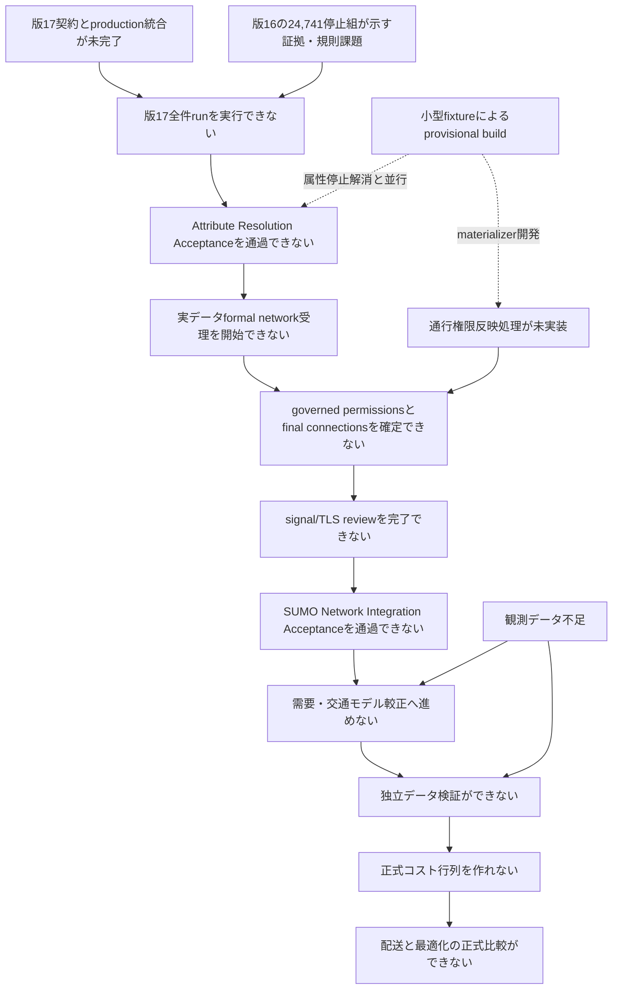

# 交通シミュレーション研究の現状の問題と阻害事項

> **文書状態**: 現状説明・問題追跡文書
> **状態基準日**: 2026-07-31
> **現在工程**: 工程6「SUMO道路網生成・構造検証」
> **正式道路網**: 未承認
> **下流実験**: 実行不可

## 目次

- [1. この文書の目的](#1-この文書の目的)
- [2. 現状の結論](#2-現状の結論)
- [3. 問題の読み方](#3-問題の読み方)
- [4. 問題間の依存関係](#4-問題間の依存関係)
- [5. 版17契約とproduction統合が未完了](#5-版17契約とproduction統合が未完了)
- [6. 版16全件実行は完了したが停止記録が残る](#6-版16全件実行は完了したが停止記録が残る)
- [7. 307件の規則・データ例外は分類済み・解決保留](#7-307件の規則データ例外は分類済み解決保留)
- [8. 通行権限をSUMOへ反映する処理が未実装](#8-通行権限をsumoへ反映する処理が未実装)
- [9. provisional buildと道路対応履歴が未実装](#9-provisional-buildと道路対応履歴が未実装)
- [10. 交差点・信号・最終道路網の検証が未実施](#10-交差点信号最終道路網の検証が未実施)
- [11. 交通モデルの較正・独立検証データが不足](#11-交通モデルの較正独立検証データが不足)
- [12. 配送・最適化の正式比較へ進めない](#12-配送最適化の正式比較へ進めない)
- [13. 現在のHTML地図で確認できないこと](#13-現在のhtml地図で確認できないこと)
- [14. 優先順位と解消順序](#14-優先順位と解消順序)
- [15. 問題解消の判定条件](#15-問題解消の判定条件)
- [16. 正本と証拠](#16-正本と証拠)

## 1. この文書の目的

この文書は、交通シミュレーション研究が現在どこで停止しているかを、人間が確認
できる形で説明する。単に「未実装」と列挙するのではなく、各問題について次を示す。

- 何が未確定または未実装なのか
- 何を根拠に問題と判断しているか
- 問題を放置すると、どの下流成果物へ影響するか
- どの作業で解消するか
- 何をもって解消済みと判定するか

機械可読な現在地の正本は
`reproducibility/config/traffic_simulation/research_stage.yml`である。要件単位の
実装状態は`reproducibility/config/traffic_simulation/requirements_traceability.yml`
を正本とする。この文書は正本を説明するものであり、状態を独自に上書きしない。

現行`sumo_network.yml`はv16の状態正本であり、legacy
`formal_build_input_ready`へmaterializerとsignal structureを含めている。このv16履歴
は本文書から上書きしない。v17用の新しい機械可読状態では、Attribute Resolution
AcceptanceとSUMO Network Integration Acceptanceを別ゲートとして表現する必要が
あり、これは未解消の設定移行事項である。

## 2. 現状の結論

現時点で確認用HTML地図は生成できる。しかし、正式なSUMO道路網は未承認であり、
較正、独立データ検証、正式配送比較には使用できない。

| 対象 | 現在の判定 | 理由 |
|---|---|---|
| 道路網仕様 | 版17中核方針固定・実装移行中 | 機械可読方針、基礎Schema、access比較・方向付き区間の独立関数は作成済みだが、production統合とfixture移行が未完了 |
| 正式SUMO道路網 | 未承認 | 道路属性、通行権限、交差点、信号、最終生成、生成後監査が未完了 |
| 交通モデル較正 | 開始不可 | 正式道路網が前提であり、観測データも不足 |
| 独立データ検証 | 開始不可 | 較正済みモデルと、較正に使わない観測が必要 |
| 正式コスト行列 | 作成不可 | 独立検証済み交通環境がない |
| 配送・最適化の正式比較 | 実行不可 | 正式コスト行列と共通配送問題が未確定 |

現在の最優先問題は、次の三つである。

1. 版17のpermissions authority、access多軸比較、二軸値状態をproduction Resolverと成果物生成へ統合する。
2. 作成済みの方向付き区間生成をproductionへ接続し、`oneway=-1`、方向依存属性・relation・lane順のfixtureを実装する。
3. Resolver expected permissionsをSUMOの車線と車線間接続へ反映する処理を実装する。

## 3. 問題の読み方

### 3.1 問題の種類

| 種類 | 意味 |
|---|---|
| 研究利用阻害 | 解消しなければ正式な研究結果を生成できない |
| 実装阻害 | 仕様はあるが、処理本体または実行試験がない |
| データ阻害 | 必要な観測、証拠、参照データが不足している |
| 検証阻害 | 処理は存在しても、固定環境または実データで合格証拠がない |
| 運用上の未完了 | Gitへの反映、実行記録、文書同期などが完了していない |

### 3.2 「46,056件」の解釈

v15道路属性解決処理の全件試行では、46,056行が停止として記録された。この数字は、
46,056本の道路に個別の重大な誤りがあることを意味しない。

- 集計単位は道路本数ではなく、道路と属性の組である。
- 一つの道路が車線数と最高速度の両方で停止すれば2行になる。
- 停止行46,056件は24,346本の道路に対応する。
- 45,749行は、主として車線数または最高速度の明示値がない通常欠損候補である。
- 欠損以外の307行は、未対応表現、矛盾、条件付き通行規制などの
  規則・データ例外である。現在は20規則へ排他的に分類済みだが、値解決は保留している。

したがって、46,056行すべてを手作業で確認する方針は採らない。通常欠損を決定表で
処理し、人間または追加証拠が必要な例外だけを分離する。

版15全件試行の履歴値は次のとおりであり、版17結果へ再ラベルしない。

| 項目 | 件数 |
|---|---:|
| 分類対象道路 | 26,220本 |
| 監査行 | 83,884行 |
| 採用 | 37,051行 |
| 感度分析を要求して採用 | 777行 |
| 停止 | 46,056行 |
| 停止した道路 | 24,346本 |
| 通行可能車種期待値を生成できた道路 | 1,874本 |
| 正規化地図データ | 未公開 |

| 属性 | 停止行 |
|---|---:|
| 車線数 | 22,656 |
| 最高速度 | 23,135 |
| 一方通行 | 1 |
| 通行可能車種 | 264 |
| 合計 | 46,056 |

| 状態 | 件数 |
|---|---:|
| 欠損 | 45,749 |
| 未解決 | 264 |
| 有効だが未対応 | 42 |
| 矛盾 | 1 |

## 4. 問題間の依存関係

図は主要な阻害関係を示す。実装作業は一部並行できるが、正式成果物の受入は上流の
合格を必要とする。例えば、小型試験データを使った通行権限反映処理の開発は、
属性値の全件解決前でも進められる。structural/provisional networkは、topology、
direction、connection、provenance、materializer開発専用であり、structural
assumptionを含み得る。小型fixtureや開発用出力として生成できるが、travel time、
capacity、delivery、solver comparison、calibrationには使用できず、公開可能な
実データformal networkとも区別する。実データformal networkの受理開始には
Attribute Resolution Acceptance済みの正式属性成果物が必要である。

## 5. 版17契約とproduction統合が未完了

**問題識別子:** `ISSUE-ATTR-001`
**種類:** 実装阻害、検証阻害
**現在状態:** 未解決

本問題は停止件数の解消ではなく、承認済み版17契約をproductionで実行可能にする
責務を持つ。対象は次である。

- 作成済みの新Schemaをproduction入出力境界へ接続する。
- `resolution_status`と`value_origin`をcanonical fieldsとして移行する。
- Resolver expected permissionsをformal authorityとしてproductionへ統合する。
- managed vehicle profileを全runtime境界で検証する。
- Directed Segment、directional lane、static access、conditional access、final
  permission resolution、speed resolutionをproductionへ統合する。
- relationの`from`、`via`、`to`をDirected Segment候補へ写像し、zero candidateを
  `RELATION_DIRECTED_MAPPING_MISSING`、multiple candidateを
  `RELATION_DIRECTED_MAPPING_AMBIGUOUS`で停止する。

Schema、managed vehicle profile、access比較、Directed Segment generatorには
作成済みまたは単体試験済みの部分があるが、`implemented`、`integrated`、
`runtime_validated`は別状態である。isolated utilityやunit test合格をproduction
統合済みとは扱わない。

解消条件は、必要な仕様、不足する機械可読設定、Schema、production実装、独立fixture
およびoracleが統合され、新規run IDと出力先で版17全件runを実行可能になることで
ある。formal停止0件や`complete=true`は`ISSUE-ATTR-002`の解消条件であり、本問題の
close条件ではない。

## 6. 版16全件実行は完了したが停止記録が残る

**問題識別子:** `ISSUE-ATTR-002`
**種類:** データ阻害、検証阻害
**現在状態:** 版16実装・全件実行済み、版17全件run前

### 6.1 実装済み

- 判定事実、出典台帳、分類専用、分類・解決統合、試験用固定データの
  5種類のJSON Schema
- 判定事実生成処理
- 車線数を`L0`から`L3`、最高速度を`S0`から`S3`へ分類する重要度分類処理
- `criticality_level`、`selected_rule_id`、`matched_rule_ids`だけを出力する
  分類専用成果物
- 重要度分類処理が属性値や`resolution_action`を出力しないことの検査
- 属性値解決処理の読取境界が既存の分類オブジェクトを上書きしないことの検査
- 成果物間の意味整合検査
- 実装コードと独立して作成した試験用固定データ
- 正常、異常、境界、再実行、規則改訂、分類非上書きの試験
- RFC 8785に基づく正規化ハッシュ処理
- 明示値、外部証拠、構造確認用代替値、証拠競合、確認状態および停止コードを
  扱う属性値解決処理
- 受理済み版16母集団26,220道路に対する判定事実生成、重要度分類、
  属性値解決の全件実行
- `structural`と`formal`の各52,440組に対するJSON Schema検査と意味整合検査
- 分類前後の分類オブジェクト投影SHA-256完全一致
- 正式用成果物に構造確認用代替値が0件であることの全件検査
- 版15記録を前版として参照しない初回版16生成

独立した人間による試験用固定データ確認は、研究責任者判断で省略している。この
判断は開示事項であり、自動検証を省略する理由にはならない。

### 6.2 実行結果と残作業

- 構造確認用では、`AC005`が265組、`AC007`が520組、合計785組残る。
- 正式用では、`AC005`が24,221組、`AC007`が520組、合計24,741組残る。
- `AC005`は、採用可能な明示値または適用可能な証拠がない組、もしくは現在の
  表現規則で安全に採用できない組である。
- `AC007`は、高重要度または条件付き・方向別表現について必要な確認来歴が
  未完了の組である。
- 正式用成果物は`complete=false`であり、正式道路網の入力にはできない。
- 外部証拠および検証済みモデルによる採用は処理として実装済みだが、版16実データ
  には受理済み正例をまだ登録していない。

実行記録、入力・出力SHA-256および停止件数は、
`03_data/metadata/acquisition/20260730_ota_ward_v16_attribute_resolution_run.json`
に固定する。

### 6.3 なぜ分離が必要か

重要度分類は「この属性の誤りが研究結果へどの程度影響するか」を決める。道路属性
解決は「どの値を採用し、採用できなければどの理由で停止するか」を決める。
両者を混ぜると、値を採用したいという都合で重要度を下げる可能性が生じる。

実装済みの分類処理と属性値解決処理はこの責務分離を満たしている。版16全件適用後も
停止記録が残るため、問題全体は未解決である。

### 6.4 実装・全件実行の合格条件

- 属性値解決処理が、重要度分類結果を変更せずに採用値、証拠、競合結果、
  確認状態、停止コードを出力する。
- 固定試験用データの正常、異常、境界、再実行、規則改訂、証拠競合、
  構造確認用代替値の各事例に合格する。
- 独立した正解結果を実装出力に合わせて変更していないことを確認する。
- 受理済み版16母集団から全組を新規生成し、版15の記録を流用しない。
- 全件成果物がスキーマと意味整合検査に合格し、未解決組を停止記録として保持する。

上記条件は版16履歴としてすべて合格した。`ISSUE-ATTR-002`は、版17全件run後に
残るformal停止記録、証拠不足、確認未完了だけを追跡する。解消条件は、版17正式用
成果物が`complete=true`、formal blockers 0件、review requirement 0件、未解決停止
0件、formal `model_assumed` 0件を満たすことである。版17契約のproduction統合完了は
`ISSUE-ATTR-001`の条件であり、本問題とは独立に判定する。

## 7. 307件の規則・データ例外は分類済み・解決保留
**問題識別子:** `ISSUE-ATTR-003`
**種類:** 実装阻害、データ阻害
**現在状態:** 排他的分類を実装・実データ検証済み、属性値の解決は保留

45,749件の一括欠損とは別に、307件は個別の表現または規則を必要とする。

| 属性・状態 | 件数 |
|---|---:|
| 車線数・有効だが未対応 | 19 |
| 車線数・矛盾 | 1 |
| 最高速度・有効だが未対応 | 22 |
| 一方通行・有効だが未対応 | 1 |
| 通行可能車種・未解決 | 264 |
| 合計 | 307 |

主な例は次のとおりである。

- `oneway=-1`からのbackward Directed Segment生成（原典OSM Wayは変更しない）
- `lanes:both_ways`等を含む方向別車線表現
- 総車線数と方向別車線数の矛盾
- `maxspeed=50;40`
- `maxspeed:type=JP:urban`
- `maxspeed:advisory=40`
- `hgv:conditional`、`motor_vehicle:conditional`等の条件付き通行規制
- `motorcycle`、`psv`等の車種別通行規制
- `access=destination`、`access=private`等のアクセス制限
- `permit`、`delivery`の許可・目的判定
- direction-specific speedとrelation mapping

日本・東京の法制度とOSM地図表現に合わせた20規則を定義し、通常例、異常例、
境界例を固定した。実装から生成していない独立正解と照合し、未知規則は0一致、
重複規則は2一致として停止する試験も実装した。

固定SHA-256のv15停止記録に対して実装を実行した結果は次のとおりである。

| 検証項目 | 結果 |
|---|---:|
| 対象行 | 307 |
| ちょうど一つの規則へ一致 | 307 |
| 一致なし | 0 |
| 複数一致 | 0 |
| 実装済み分類規則 | 20 |

規則と実装は
`specifications/japan_tokyo_osm_exception_classification_rules.md`、
試験用固定データと独立正解は
`validation/fixtures/resolver_exception_rules/`に記録した。
固定`analysis`コンテナによる例外分類実装時の検証では335件中335件が合格した。
版17基礎契約追加後の直近の交通シミュレーション検証一式は`370 passed`であり、
現在の既知のテスト不合格は0件である。例外分類の実行条件と詳細は
`03_data/metadata/acquisition/20260730_ota_ward_v15_exception_rule_validation.md`
に記録した。

ただし、完了したのは例外分類であり、属性値の解決ではない。`JP:urban`からの
速度採用、条件付き規制の時刻・車種評価、`private`・`permit`の許可確認、
方向別車線と`oneway=-1`の安全な変換は未完了である。方向別属性はsource direction
とtarget Directed Segmentの対応として保持し、relation mappingはzero/multiple
candidateを明示停止する。これらを暗黙の既定値で通過させず、停止状態を維持する。

formalの双方向道路は`lanes:forward`と`lanes:backward`の両方を明示的に要求する。
総数だけの均等配分、統計的補完、総数と片方向値からの他方向値の算術自動採用は
行わず、`LANE_DIRECTIONAL_ALLOCATION_MISSING`で停止する。算術導出を残す場合は
structural-onlyとし、assumption IDと`model_assumed`相当の非formal由来を記録する。

## 8. 通行権限をSUMOへ反映する処理が未実装

**問題識別子:** `ISSUE-PERM-001`
**種類:** 実装阻害、検証阻害
**現在状態:** 版17authority方針固定・実装未完了

道路属性解決処理は、地図上の道路、方向、車線ごとに通行可能車種の期待値を作る。
しかし、その期待値をSUMOの道路・車線・車線間接続へ書き込む処理は未実装である。

未実装の主な内容は次のとおりである。

- 地図上の道路とSUMO道路の正確な方向対応
- 左から右の車線位置とSUMO車線番号の対応
- Resolver expected permissionsをformal authorityとして扱い、typemap候補を上限にしない処理
- 通行可能車種が空になる車線・道路・車線間接続の処理
- 存在しない右左折接続を生成しない規則
- 決定的なXML出力
- 部分的成功を公開しない原子的処理
- PM001からPM028までの失敗コード

PM-REQ-001からPM-REQ-011は、要件追跡表で
`specified_not_implemented`である。小型試験データを固定SUMO 1.24.0へ入力し、
道路網変換とSUMO読込みまで確認する必要がある。

Resolver側の処理は、(1) static access normalization、(2) conditional expressionの
parse/evaluation、(3) 両者を統合するfinal permission resolutionへ分離する。static
工程ではcomplete permissionを生成せず、conditional工程ではmissing context、
unsupported syntax、interval内変化を停止する。final工程で同結果の複数maximal rule
を統合し、異結果を`ACCESS_SPECIFICITY_CONFLICT`で停止し、lane-local provenanceと
完全なpermission expectationを生成する。

状態は次のように分離する。実行証拠がない項目を`failed`とはしない。

| 対象 | 状態 |
|---|---|
| typemap importer governance fixture | `failed` |
| permission materializer implementation | `not_implemented` |
| permission materializer runtime fixture | `not_run` |
| 既存の交通シミュレーションpytest | `passed` |

## 9. provisional buildと道路対応履歴が未実装

**問題識別子:** `ISSUE-BUILD-001`
**種類:** 実装阻害、検証阻害
**現在状態:** 小型確認のみ

`build_sumo_network.py prepare`のrelation closure工程は実装・受理済みである。
一方、仮SUMO道路を生成して原本道路との対応履歴を作るprovisional buildは
未実装である。この開発は小型fixtureを用いてformal停止の解消と並行できる。
現時点の小型確認から、SUMO中間XMLと`origId`を出力できることは
分かっているが、次は証明できていない。

- 一つの地図道路が複数SUMO道路へ分割された場合の完全な対応
- 順方向・逆方向の決定
- 車線数と車線順序の一致
- 交差点結合後の原本道路への追跡
- 全車線間接続の一意な識別
- 実データ全件を処理した場合の完全性

SUMO道路識別子の符号や座標最近傍を、方向の証拠として使用してはならない。
元の地図構成点の順序と開始・終了位置を記録した道路対応履歴が必要である。
実データformal networkとしての受理はAttribute Resolution Acceptance後に限る。

## 10. 交差点・信号・最終道路網の検証が未実施

**問題識別子:** `ISSUE-BUILD-002`
**種類:** 研究利用阻害、検証阻害
**現在状態:** 未実施

通行権限反映後も、次の工程が残る。

1. 最終的な車線間接続を確認する。
2. 信号制御対象の接続と信号表示番号を対応付ける。
3. 信号状態文字列と制御接続数を一致させる。
4. 承認済み入力から最終`net.xml`を生成する。
5. 生成後の道路網を修正せず監査する。

確認すべき内容には、左側通行、道路・車線数、右左折接続、信号、最大走行可能成分、
主要道路間到達性、車庫・顧客・充電地点間の往復到達性、警告分類、SUMO読込みが
含まれる。

最終`net.xml`を直接編集して不一致を直してはならない。不一致時は上流入力または
生成処理を修正し、最終生成を再実行する。

## 11. 交通モデルの較正・独立検証データが不足

**問題識別子:** `ISSUE-VV-001`
**種類:** データ阻害、研究利用阻害
**現在状態:** 未着手

現在登録されているJARTIC加工データは、2026年7月4日22時台、道路種別3の
1時間値という単一スナップショットである。現在のHTML地図には33観測地点を
表示している。

この一つのスナップショットだけでは、次を十分に行えない。

- 平日・休日差の評価
- 朝・昼・夕方・夜間差の評価
- 日ごとの変動の評価
- 較正用と独立検証用データの分離
- 主要道路種別ごとの妥当性確認
- 複数乱数シードに対する誤差分布の評価

必要なのは、複数の日、時間帯、地点を取得し、モデル出力を見る前に較正用と独立
検証用へ分けることである。同じ観測値をパラメータ調整と最終性能評価の両方に
使用してはならない。

## 12. 配送・最適化の正式比較へ進めない

**問題識別子:** `ISSUE-EXP-001`
**種類:** 研究利用阻害
**現在状態:** 下流実験実行不可

正式な古典手法・QAOA比較には次が必要である。

- 独立検証済みの交通環境
- 正式な地点間距離、旅行時間、電力コスト
- 全手法に共通する配送地点、需要、車両、制約、目的関数
- 固定した乱数シードと評価指標
- 生の解と修復後の解へ適用する共通評価器
- 運用結果と計算資源を分離した報告

現在はこれらの上流条件が揃っていない。未較正交通モデルから作ったコスト行列は
実装確認には使用できるが、正式比較結果には使用できない。

## 13. 現在のHTML地図で確認できないこと

**問題識別子:** `ISSUE-VIS-001`
**種類:** 解釈上の注意
**現在状態:** 可視化自体は利用可能

現在の地図で確認できるのは次である。

- N03大田区行政界
- 地図取得用の矩形範囲
- 登録済みOSM道路候補と信号位置
- JARTIC観測地点
- 人口・合成配送需要メッシュ
- 研究工程の現在地

一方、次は確認できない。

- 正式SUMO道路と車線
- SUMO車線間接続
- 孤立成分と車種別到達性
- 信号現示と時間変化
- SUMO車両の移動
- 古典手法・QAOAの配送経路

したがって、地図が自然に見えることを道路網Verificationの合格証拠としては
使用しない。可視化は異常候補を発見する補助手段であり、自動検査と実行試験を
置き換えない。

## 14. 優先順位と解消順序

| 優先 | 作業 | 解消する問題 | 並行実施 |
|---:|---|---|---|
| 1 | 現状と版16履歴を固定する | 全問題の基準点 | 観測取得は並行可能 |
| 2 | 残る`OPEN-PROP`を承認する | `ISSUE-ATTR-001` | 小型fixture設計は並行可能 |
| 3 | 条件式文法、速度規則、許可台帳、停止コード対応を機械可読化する | `ISSUE-ATTR-001`、`ISSUE-ATTR-003` | 独立oracle作成と調整可能 |
| 4 | 新Schemaとproduction入出力境界を統合する | `ISSUE-ATTR-001` | provisional build開発は並行可能 |
| 5 | 独立fixtureとoracleを固定する | `ISSUE-ATTR-001` | production出力から生成しない |
| 6 | Directed Segmentとrelation mappingをproduction統合する | `ISSUE-ATTR-001`、`ISSUE-ATTR-003` | 小型provisional buildと並行可能 |
| 7 | directional lanesを統合する | `ISSUE-ATTR-001`、`ISSUE-ATTR-003` | materializer fixture開発と並行可能 |
| 8 | static access、conditional evaluation、final permission resolutionを統合する | `ISSUE-ATTR-001`、`ISSUE-ATTR-003` | 三責務を別々に検証する |
| 9 | speed resolutionを統合する | `ISSUE-ATTR-001`、`ISSUE-ATTR-003` | 小型SUMO runtime fixtureと並行可能 |
| 10 | Resolver統合試験を行う | `ISSUE-ATTR-001` | 全production境界を対象にする |
| 11 | 版17全件runを新規runとして実行する | `ISSUE-ATTR-001`、`ISSUE-ATTR-002` | 既存runを上書きしない |
| 12 | formal停止記録を反復解消する | `ISSUE-ATTR-002`、`ISSUE-ATTR-003` | 小型materializer開発と並行可能 |
| 13 | Attribute Resolution Acceptance | `ISSUE-ATTR-002` | 実データformal buildの前提 |
| 14 | provisional build、exact provenance、Permission Materializer、final connection setを生成する | `ISSUE-PERM-001`、`ISSUE-BUILD-001` | 小型fixture実装自体は前倒し可能 |
| 15 | signal/TLS reviewとSUMO Network Integration Acceptance | `ISSUE-BUILD-002` | 実データでは工程13・14後 |
| 16 | demand、calibration、independent validation、正式比較 | `ISSUE-VV-001`、`ISSUE-EXP-001` | 観測取得以外は正式道路網後 |

## 15. 問題解消の判定条件

### 15.1 二段階の受理ゲート

Attribute Resolution AcceptanceはResolverの正式属性成果物だけを受理する。
`complete=true`、`blockers=[]`、`review_required=0`、`stop_unresolved=0`、
`model_assumed=0`、母集団・レコード数・被覆一致、JSON Schema、意味整合、分類投影
不変、入力・設定・Schema・出力・独立正解のSHA-256、未登録状態・規則・停止コード
0件、structural/formal非混在を要求する。この合格は最終SUMO道路網の承認ではない。

SUMO Network Integration Acceptanceはその後に、provisional structural build、exact
edge provenance、Permission Materializer、lane/connection permissions、final connection
set、signal junction/TLS link review、final `net.xml`、SUMO 1.24.0読込みを完了し、lane、
connection、turn restriction、left-hand traffic、warning、reachabilityを監査する。
生成済み`net.xml`は直接編集しない。

### 15.2 母集団と除外

`out_of_scope`は入力レコードの削除ではない。承認済み版17 Schemaのenumには
`excluded`がないため、独断で追加せず、現時点ではexclusion manifestを必要実装と
する。除外理由、規則ID、道路・方向・車線、承認者、承認日、根拠SHA-256を残す。
母集団定義を変える場合は新しいpopulation/configuration versionを発行し、版16の
26,220道路を上書きしない。版17では入力母集団、管理対象母集団、除外母集団を別々
に数え、`complete=true`の分母を管理対象母集団、permission completenessの分母を
全管理対象way/direction/lane tupleとしてmanifestに明記する。除外で阻害項目を
見かけ上0件にしてはならない。

### 15.3 共通条件

問題一覧から項目を削除するだけでは解消済みとしない。少なくとも次を満たす。

1. 仕様、設定、データ形式、実装、テストが相互に一致する。
2. 固定試験データで正常・異常・境界例へ合格する。
3. 必要な場合は固定SUMO 1.24.0で実行する。
4. 実データ全件処理の入力・出力・SHA-256を記録する。
5. 未分類警告、対応不能道路、対応不能車線間接続が0件になる。
6. 合格状態を要件追跡表へ反映する。
7. 上流変更で無効になった下流証拠を再実行する。
8. 既知の限界と未実施事項を研究報告へ残す。

## 16. 正本と証拠

| 内容 | 正本・証拠 |
|---|---|
| 研究工程と利用可否 | `reproducibility/config/traffic_simulation/research_stage.yml` |
| 閲覧用進捗 | `RESEARCH_STATUS.md` |
| 要件実装状態 | `reproducibility/config/traffic_simulation/requirements_traceability.yml` |
| 確定済み実装・検証 | `05_src/traffic_simulation/confirmed_implementation_and_verification.md` |
| 確定済み道路母集団 | `05_src/traffic_simulation/confirmed_network_population_and_relation_closure.md` |
| v15全件試行記録 | `03_data/metadata/acquisition/20260723_ota_ward_v15_resolver_dry_run.md` |
| v15集計 | `03_data/processed/traffic_simulation/validation/ota_ward_20260716_resolver_dry_run_summary.json` |
| 例外決定表 | `reproducibility/config/traffic_simulation/resolver_exception_decision_table.yml` |
| 属性解決の詳細規則を作るための決定事項 | `05_src/traffic_simulation/specifications/attribute_resolution_decisions_to_finalize.md` |
| 版16属性解決の初期正式仕様案 | `05_src/traffic_simulation/specifications/initial_formal_attribute_resolution_specification_proposal.md` |
| 版17属性解決の実行手順 | `05_src/traffic_simulation/attribute_resolution_execution_procedure.md` |
| 版17承認済み属性解決方針 | `05_src/traffic_simulation/specifications/10_approved_attribute_resolution_policy.md` |
| 版17機械可読方針 | `reproducibility/config/traffic_simulation/approved_attribute_resolution_policy_v17.yml` |
| 道路網生成・検証規則 | `05_src/traffic_simulation/network_build_and_validation_protocol.md` |
| シミュレーションV&V | `05_src/traffic_simulation/simulation_model_development_and_vv.md` |
| 全工程と通行権限実装手順 | `05_src/traffic_simulation/learning/permission_materializer_reproducible_implementation_guide.md` |

この文書の件数または状態が正本と異なる場合、正式実行を停止し、正本の更新理由を
確認した上でこの文書を更新する。
