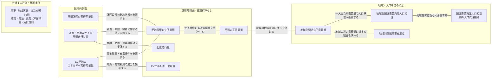

# 配送評価における技術・運用・人口代理指標の概念体系

## 概念体系の位置づけ

本資料は、本研究で扱う複数の技術的側面と運用的側面を、地域単位および人口単位を介して、最終的な人口代理指標である「配送需要充足人口相当」へ対応づける。接続線は、同じ測定結果を別の観点から捉える関係、判定時に別の測定項目を参照する関係、または同じ配送結果を別の集計単位で表す関係を示す。

この概念体系は、実社会の因果関係、技術から社会への効果波及、時間的な前後関係、ソフトウェアの実行順序、データ処理フロー、研究工程、政策効果、社会厚生または経済便益の発生過程を示さない。左から右への配置は、異なる分析レベルの概念を一つの人口代理指標へ整理するための概念的な収束だけを表す。

## 概念・操作化・実装の区別

**概念**は、研究上扱う対象または性質そのものを表す。概念名には「指標」「測定値」「判定値」などの測定操作を原則として含めず、二値、数量または比率という表現形式は操作的定義に記載する。

**操作化**は、概念を本研究でどのように測定、判定または集計するかを示す。例えば、配送計画の実行可能性を二値で表すこと、配送走行特性を道路交通シミュレーションで測定すること、および地域の空間単位として人口メッシュを用いることが操作化に当たる。

**実装・データ項目**は、操作化のために保存する具体的な識別子や値である。メッシュコード、需要ID、車両ID、経路ID、配送完了フラグ、走行距離および電力消費量は実装項目であり、上位概念の名称としては用いない。

## 共通する評価・解釈条件

次の条件群は、特定の結果を生じさせる単一の原因ではなく、図全体の値と解釈可能範囲を定める共通条件である。手法間比較では、これらを同一に固定するか、変更した条件を明示する。

- 需要条件には、人口データ、一人当たり需要換算値、その対象期間、合成需要生成規則、整数化・丸め規則および需要IDの規則を含める。
- 空間・交通条件には、対象地域、地域区分、道路網、交通需要、信号および評価時間帯を含める。
- 配送条件には、配送期限、車両台数、積載容量、出発地点、終端・帰着条件および評価期間を含める。
- EV条件には、電池容量、初期電池残量、最低許容電池残量、電力消費モデル、充電地点、充電速度および充電待ち条件を含める。
- 評価規則には、配送完了条件、欠損・失敗の扱い、重複排除、集計方法および最終表示時の丸め規則を含める。

## 概念図

実線は無方向であり、ラベルに記した概念上の対応だけを示す。共通条件と技術的側面の間の不可視リンクは描画上の配置にだけ用い、因果関係を表さない。地域別配送需要充足度は地域間比較のための概念であり、最終値の算出経路には用いない。配送需要充足人口相当は、地域別配送完了需要量から換算した地域別配送需要充足人口相当を合計する唯一の最終人口代理指標である。

## 概念・測定対応表

| 概念 | 一文定義 | 本研究での操作化 | 観測単位 | 測定単位 | 集計単位 | 成立・算出規則 | 隣接概念との違い | 解釈上の注意 |
|---|---|---|---|---|---|---|---|---|
| 配送計画の実行可能性 | 配送計画が計画段階の必須制約をすべて満たしている性質である。 | 復号した計画の需要割当、容量、経路連続性、始終点、帰着および計画時間制約を検査し、実行可能を一、実行不可能をゼロで表す。 | 配送計画 | 二値 | 計画別、手法別 | 一つでも必須制約に違反した計画は実行不可能とし、個別制約の違反件数・充足割合は補助値として別に保存する。 | 道路交通シミュレーション前の計画を対象とし、配送需要の完了状態や解品質とは異なる。 | アルゴリズムの正常終了、SUMO上の走行可能性または実車運行可能性を意味しない。 |
| 道路・交通条件下の配送走行特性 | 設定した道路網と交通条件の下で生じる配送車両の距離、時間および遅延の特徴である。 | SUMOで走行距離、旅行時間、交通遅延、信号遅延、出発・最終配送完了・帰着時刻を測定する。 | 車両、試行 | km、分、時刻 | 車両別、試行別、手法別 | 経路未生成、投入失敗または異常終了はゼロ値ではなく失敗状態として保存する。 | 配送走行量が各成分の量を集計するのに対し、本概念は走行を構成する複数の特徴全体を表す。 | 実社会で観測した実績、東京交通全体の性能、道路網自体の性能またはSUMOの計算性能ではない。 |
| EV配送のエネルギー実行可能性 | 一車両の配送運行が電池残量と充電に関する必須条件の範囲内で成立する性質である。 | 各確認時点の電池残量、電池切れ、充電行動および評価時間内の完了を検査し、実行可能を一、実行不可能をゼロで表す。 | 車両、試行 | 二値 | 車両別、試行別、手法別 | 電池残量が下限を下回る、電池切れとなる、許可されない充電を行う、または充電を含む運行が時間内に終わらない場合は実行不可能とする。 | EVエネルギー使用量は電力・充電利用の量を表し、本概念は必須条件内で成立したかを表す。 | 実車の電費、電池劣化、実在充電器の利用可能性または充電費用を保証しない。 |
| 配送走行量 | 配送運行に伴って生じた車両移動および車両時間の量である。 | 車両別の走行距離、旅行時間、交通遅延および信号遅延を個別に記録する。 | 車両、試行 | km、分 | 車両別、試行別、手法別 | 試行全体では同じ成分の車両別値だけを合計し、距離と時間を一つの総合値へ合算しない。 | 配送走行特性のうち距離・時間・遅延を数量として集計し、EVの電力・充電利用は含めない。 | 配送完了、配送効率、配送費用または経済価値を意味しない。 |
| EVエネルギー使用量 | 配送運行に伴って使用された電力量および充電設備の利用量である。 | 車両別の電力消費量、充電回数、充電時間および充電待ち時間を個別に記録する。 | 車両、充電イベント、試行 | kWh、回、分 | 車両別、試行別、手法別 | 試行全体では各成分の車両別値を合計し、異なる単位を一つの総合値へ合算しない。充電回数は実際に充電を開始したイベントだけを数える。 | EV配送のエネルギー実行可能性が成立の二値を表すのに対し、本概念は電力と充電利用の量を表す。 | 電池の実効劣化、充電費用または経済価値を意味しない。 |
| 配送需要の完了状態 | 個々の配送需要が事前に定めた配送完了条件をすべて満たしている状態である。 | 各需要IDの到着、期限、容量、電池、充電、重複および未配送を検査し、完了を一、未完了をゼロで表す。 | 配送需要 | 二値 | 需要別、車両別、試行別、手法別 | 必須条件を一つでも満たさない需要は未完了とする。帰着を需要単位の条件に含めるか試行全体の条件だけに含めるかは正式実験前に固定する。 | 配送計画の実行可能性に加え、走行・EV条件下の実行結果を参照する。配送完了需要量は完了状態の需要量を合計した値である。 | 一部条件だけを満たす配送や、単一試行の結果を、完全な配送成立または試行間の安定性とみなさない。 |
| 配送完了需要量 | 一試行で完了状態にある配送需要の宅配便個数相当量を合計した値である。 | 凍結した需要IDごとの完了状態と設定需要量を用い、試行全体の宅配便個数相当量を集計する。 | 配送需要 | 宅配便個数相当 | 試行別、手法別 | 同じ需要IDは一試行で一度だけ数え、未完了、重複配送、経路未生成およびシミュレーション失敗の需要を含めない。 | 配送需要の完了状態が需要ごとの二値を表すのに対し、本概念は試行全体の完了量を表す。 | 実荷物数、実注文数、顧客数、訪問地点数、重量、人口または最大配送能力ではない。 |
| 地域別配送完了需要量 | 各地域に帰属する配送需要のうち、完了状態にある需要の宅配便個数相当量である。 | 各需要IDを一つの人口メッシュへ帰属させ、地域内の完了需要量を合計する。 | 地域、配送需要 | 宅配便個数相当 | 地域別、試行別、手法別 | 複数地域に帰属する需要は集計せず帰属エラーとする。同じ需要IDは地域内で一度だけ数える。 | 配送完了需要量を地域単位へ分けた値であり、設定需要に対する割合や人口換算値ではない。 | 人口メッシュは地域を操作化する空間単位であり、概念そのものではない。 |
| 地域別配送需要充足度 | 各地域の設定需要のうち完了した需要が占める割合である。 | 地域別配送完了需要量を分子、同じ地域の設定需要量を分母として比率を求める。 | 地域 | 比率 | 地域別、試行別、手法別 | 値の範囲はゼロから一とする。需要ゼロ地域は「需要なし」とし、完了量が設定需要を超える場合は補正せずデータエラーとする。 | 地域別配送完了需要量を地域内需要に対する割合で表す。最終人口相当の算出には用いない。 | 実注文の充足率、行政区域別実績または地域公平性を意味しない。 |
| 地域別配送需要充足人口相当 | 各地域の配送完了需要量を、その地域人口に対応する単位へ換算した値である。 | 地域別完了量、一人当たり評価期間内需要量および公開人口を用いて人相当へ換算する。 | 地域、試行 | 人相当 | 地域別、試行別、手法別 | 完了量を一人当たり評価期間内需要量で除すことに相当する換算を行い、公開人口を上限とする。中間値は丸めない。 | 地域別配送需要充足度が割合を表すのに対し、本概念は同じ完了量を人口単位で表す。 | 実配送人数、固有受益者数、将来配送可能人口またはサービス利用可能人口ではない。 |
| 配送需要充足人口相当 | 対象地域全体の完了した配送需要量を人口単位で表した集約値である。 | 重複しない全地域の地域別配送需要充足人口相当を試行ごとに合計する。 | 試行 | 人相当 | 試行別、手法別、対象地域全体 | 地域別値を中間で丸めず合計し、事前固定した方法で表示値だけを丸める。値はゼロ以上かつ対象地域全体の公開人口以下とする。 | 地域別人口相当を対象地域全体へ集約した、概念体系上唯一の最終人口代理指標である。 | 実配送人数、受益者数、将来配送可能人口、道路到達可能人口、最大供給能力、社会厚生または経済便益ではない。 |

## 操作的定義

### 配送計画の実行可能性

一つの配送計画を評価単位とする。各配送需要の割当回数、重複割当の有無、車両積載容量、訪問順序の連続性、出発地点、終端地点、帰着条件、計画上の時間制約、および当該実験段階で必須とするその他の制約を確認する。すべての必須制約を満たす計画を実行可能として一を付与し、一つでも違反する計画を実行不可能としてゼロを付与する。個別制約の違反件数や充足割合は、この性質の内容を説明する補助値として別に保存する。

### 道路・交通条件下の配送走行特性

一車両・一試行を基本評価単位とし、配送計画をSUMO上で実行した結果として、走行距離、旅行時間、交通遅延、信号遅延、出発時刻、最終配送完了時刻、および必要な場合の帰着時刻を保存する。この概念は単一値ではなく、異なる単位を持つ複数の特徴から構成される。経路が生成できない場合、SUMOへ投入できない場合または異常終了した場合は、距離や時間をゼロとせず、失敗状態と理由を保存する。

### EV配送のエネルギー実行可能性

一車両・一試行を評価単位とする。出発時、配送地点到着時、充電地点到着時および運行終了時の電池残量が最低許容値以上であり、電池切れがなく、充電が許可された条件に従い、充電を含む運行が評価時間内に完了した場合に実行可能として一を付与する。一つでも満たさない場合はゼロを付与する。電力消費量、最低電池残量、充電回数、充電時間および充電待ち時間は、実行可能性を説明または判定する値として別に保存する。

### 配送走行量

一車両・一試行について、走行距離、旅行時間、交通遅延および信号遅延を個別に記録する。試行全体の総走行距離、総車両時間、総交通遅延および総信号遅延は、それぞれ同じ成分の車両別値を合計する。距離と時間は単位が異なるため、一つの総合値には合算しない。

### EVエネルギー使用量

一車両・一試行について、電力消費量、充電回数、充電時間および充電待ち時間を個別に記録する。総電力消費量は車両別消費量を、総充電回数は実際に充電を開始したイベントを、総充電時間は充電開始から終了までを、総充電待ち時間は充電地点到着から充電開始までをそれぞれ合計する。電力量、回数および時間を一つの総合値には合算しない。

### 配送需要の完了状態

一つの配送需要を評価単位とする。対象地点への到着、配送期限または時間窓、車両積載容量、最低許容電池残量、必要な充電条件、重複配送がないこと、および未配送状態でないことを確認する。すべてを満たす需要を完了状態として一を付与し、一つでも満たさない需要を未完了状態としてゼロを付与する。帰着条件を個別需要の完了条件に含めるか、試行全体の成立条件だけに含めるかは正式実験前に固定する。

### 配送完了需要量

一試行について、完了状態にある各配送需要の宅配便個数相当量を合計する。各需要が一個相当なら完了需要数と一致するが、一需要が複数個相当を持つ場合は件数ではなく設定量を合計する。同じ需要IDは一試行で一度だけ数え、未完了、重複配送、経路未生成、投入失敗または異常終了の需要を含めない。需要IDの生成規則は現時点で未決定であり、正式実験前に一意性、決定性および入力への追跡可能性を満たす規則を固定する。

### 地域別配送完了需要量

一地域を評価単位とする。各配送需要へ事前に一つの地域を割り当て、その地域に属する完了需要の宅配便個数相当量を合計する。複数地域へ帰属する需要は集計せず、地域帰属エラーとして扱う。本研究では地域を人口メッシュで操作化するが、人口メッシュは概念名には含めない。

### 地域別配送需要充足度

一地域を評価単位とし、その地域の配送完了需要量を分子、設定需要量を分母として割合を求める。値は、需要が全く完了していない場合のゼロから、すべて完了した場合の一までとする。設定需要量がゼロなら算出せず「需要なし」とする。完了量が設定需要量を上回る場合は一へ補正せず、重複集計または需要帰属のデータエラーとして扱う。

地域別配送需要充足度の地図表示は補助分析であり、道路上で到達可能な地域、将来のサービス提供地域または地域公平性を意味しない。表示区分は結果を見る前に固定し、配送需要充足人口相当の算出には使用しない。

### 地域別配送需要充足人口相当

一地域を評価単位とする。地域別配送完了需要量と、その地域に適用する一人当たり評価期間内需要量を確定し、完了量を一人当たり需要量で除すことに相当する換算を行う。換算値が地域の公開人口を上回る場合は公開人口を用い、それ以下なら換算値をそのまま用いる。値はゼロ以上かつ地域人口以下の人相当とし、中間段階では丸めない。

### 配送需要充足人口相当

一試行を評価単位とし、空間的に重複しない全地域の地域別配送需要充足人口相当を合計する。地域が重複する場合は、重複排除規則を固定しない限り算出しない。地域別値は途中で丸めず、全地域を合計した後に事前固定した方法で表示値だけを丸める。値はゼロ以上かつ対象地域全体の公開人口以下の人相当とする。

## 合成需要と丸め規則

合成需要には、e-Statの人口メッシュと大田区人口から作る地域別推定人口、全国宅配便取扱個数を全国人口と日数で除した一人一日当たり需要換算値、および事前固定した評価期間を用いる。初期基準では、区全体の期待需要を先に整数へ四捨五入し、その整数総量を各地域の期待需要の小数部分に基づく最大剰余法で配分する。同率時はメッシュコード昇順とし、地域別整数需要の合計が区全体の整数需要に一致することを検証する。期待需要が一未満の地域も独立に丸めず、区全体からの配分に従う。

同じ需要単位を追跡する一意な需要IDの生成規則は未決定である。正式実験前に、同じ入力と設定から同じIDが得られ、地域、合成需要成果物およびmanifestまで追跡できる規則を固定する。

配送完了需要量を一人当たり評価期間内需要量で除す方法を人口換算規則とする。地域別配送需要充足度を地域人口へ乗じる方法は、地域設定需要が丸めなしで地域人口と一人当たり評価期間内需要量の積に等しい場合だけ同じ値になる。整数需要の最大剰余配分によって両者が一致しない可能性があるため、二つの方法を混在させない。

## 複数試行の集計

配送需要充足人口相当は各試行で算出した後、試行間で集約する。先に複数試行の配送完了需要量を平均してから人口換算する方法は用いない。各試行について、設定需要量、配送完了需要量、地域別配送完了需要量、地域別配送需要充足度、地域別配送需要充足人口相当、最終人口相当、シミュレーション失敗および経路未生成を保存する。

試行群では、試行数、失敗試行数、経路未生成試行数、平均値、中央値、最小値、最大値および標準偏差を報告し、必要な場合は事前に方法を定めた信頼区間を付す。失敗試行をゼロ値へ置換せず、完了試行の統計と全試行に占める失敗率を分ける。試行ごとに需要量が異なる場合は、試行別比率の単純平均と全需要をまとめた加重比率を区別する。

## 解釈上の限界

配送需要充足人口相当は、実際に配送を受けた人数、固有の受益者数、将来配送できる人口、サービス利用可能人口、道路上で到達可能な人口または最大供給能力ではない。その値が大きいことから、社会厚生、経済便益、生活の質または政策効果が大きいとは結論づけられない。

地域別需要は、公開人口と事前固定した規則から生成する合成需要であり、実注文ではない。地域単位として人口メッシュを用いることは本研究上の操作化であって、概念そのものではない。人口換算値は、人口データ、一人当たり需要換算値、評価期間、需要生成規則、丸め規則および配送完了条件に依存する。人口代理指標だけでは地域公平性を評価できない。

シミュレーション結果は、設定した道路網、交通需要、信号、車両モデル、電力消費モデルおよび充電条件の範囲内でのみ解釈できる。排出量、配送費用、収益、顧客満足度、社会厚生および地域公平性は現在の評価対象に含まれず、運用量を金銭価値へ換算しない。

## 解品質および計算資源の評価系統

解品質および計算資源は主要概念図へ含めず、配送計画手法を比較する別の評価系統として扱う。配送計画の実行可能性は必須制約を満たす計画が得られたかを表し、解品質はその実行可能解が目的関数上でどの程度良いかを表す。配送走行特性は道路交通シミュレーション上の距離、時間および遅延を表し、配送需要の完了状態は各需要が走行・EV条件を含む必須条件を満たしたかを表す。配送完了需要量、地域別配送完了需要量、地域別配送需要充足度および各人口相当は、その結果を異なる単位で表す。

計算資源には、計算時間、メモリ、問題規模、QUBO規模、回路幅、回路深さ、反復回数および回路評価回数を含める。良い目的関数値は、必ずしも短い旅行時間、大きな配送完了需要量または大きな配送需要充足人口相当を意味しない。目的関数、走行測定、配送完了、需要集計および人口換算を別々に保存する。回路シミュレーション上の資源値を、物理量子ハードウェアの所要資源または量子優位性の実証として解釈しない。
