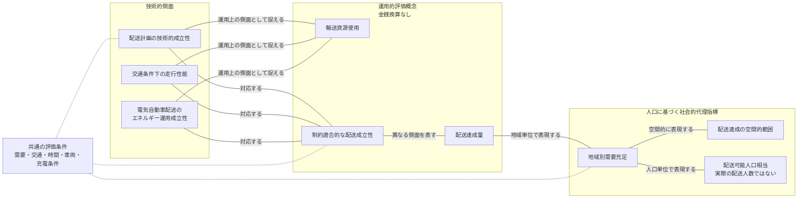

# 配送評価における技術・運用・人口代理指標の概念的対応

## 1. 現在の図と説明文の主要な問題点

従来の図は、技術的側面から運用的側面を経て社会的代理指標へ至る一方向の矢印を用いていた。そのため、研究上の概念を対応づける意図に反して、技術が社会的結果を直接引き起こす因果過程や、データ処理の順序を表しているように読めた。また、「道路網・交通性能」は道路網自体の性能と交通条件下の車両走行を区別しておらず、「配送サービスの確実性」は反復試行に対する安定性と単一評価条件での配送成立性を混同し得た。「配送サービスの提供能力」も、最大供給能力ではなく実際にモデル内で達成された配送量を測る本研究の内容より広い概念であった。

社会的代理指標についても、地域別の需要充足、配送が成立した地域の空間的範囲、配送完了量の人口単位への換算が直線的に接続されていたため、三者の分析単位の違いが不明瞭であった。さらに、評価条件が結果を生じさせる原因のように配置され、解品質と計算資源を別系統で評価する位置づけも図だけでは十分に判別できなかった。

## 2. 改善方針

改善後の整理では、技術的側面、運用的評価概念、人口に基づく社会的代理指標を、互いに異なる分析レベルとして扱う。接続線は、概念間の対応、異なる分析単位での表現、または解釈上の関連だけを示し、原因と結果の方向を表さない。複数の技術的概念を複数の運用的概念に対応させることで、単線的な波及過程としての読み方を避ける。

評価条件は、各概念の値を解釈するために共通して固定・記録すべき前提として三層の外側に置く。距離、時間、遅延、電力消費および充電は、金銭的費用ではなく運用資源の使用を表す測定項目とする。人口に基づく指標は、モデル上の配送達成範囲を地域または人口単位で表現する代理指標に限定する。解品質および計算資源は、配送計画手法自体を比較する別の評価系統とし、この概念図には組み込まない。

## 3. 改善後のタイトル

**配送評価における技術・運用・人口代理指標の概念的対応**

## 4. 改善後の導入説明文

次の図は、本研究の評価枠組みに含まれる技術的側面、運用的評価概念、および人口に基づく社会的代理指標の意味上の対応を整理した概念図である。三層は異なる分析レベルに属し、線は対応関係または解釈上の接続だけを示す。線の配置は、実社会における因果関係、技術から社会への効果波及、ソフトウェアの実行順序、データ処理フロー、研究工程、政策効果または社会的便益を示さない。

運用的な測定値は金銭価値へ換算しない。最終的な「配送可能人口相当」は、モデル上の配送完了量を事前に定めた需要換算規則によって人口単位で表した代理指標であり、実際に配送を受けた人数ではない。その増加を、社会厚生または経済便益の増加として解釈してはならない。

## 5. 改善後のMermaid図

図中の実線は概念間の対応を示す無方向線であり、因果方向を示さない。評価条件から延びる破線も原因を示すものではなく、各層を解釈するときの共通前提を代表的な概念へ接続している。

## 6. 図中の各概念層の説明

**技術的側面**は、特定のアルゴリズム名ではなく、配送システムをモデル内で成立させる技術上の側面を表す。「配送計画の技術的成立性」は経路と配送制約の整合性を、「交通条件下の走行性能」は構築した道路網と交通条件の下で得られる走行結果を、「電気自動車配送のエネルギー運用成立性」は電池および充電条件と整合する運行をそれぞれ扱う。

**運用的評価概念**は、技術的な結果を配送運用の観点から記述するための分析層である。「輸送資源使用」は距離、時間、遅延、電力および充電の使用状況を表すが、配送費用や経済価値には換算しない。「制約適合的な配送成立性」は所与の一回または各試行で配送制約を満たしたかを表し、条件変動に対する統計的な安定性を意味する「確実性」とは区別する。「配送達成量」は所与の条件下で完了した配送量であり、システムの理論的な最大供給能力ではない。

**人口に基づく社会的代理指標**は、配送達成を地域および人口の単位で再表現する分析層である。「地域別需要充足」は各人口メッシュ内の需要に対する配送完了の程度を表す。「配送達成の空間的範囲」は、事前に定めた充足条件を満たす人口メッシュの地理的な分布または範囲を表す。「配送可能人口相当」は、メッシュ別配送完了量を需要換算規則により人口単位へ換算し、重複を避けて集約したモデル上の代理指標である。

## 7. 改善後の概念・測定項目対応表

| 概念 | 本研究で対応する測定項目 | 概念上の意味 | 解釈上の注意 |
|---|---|---|---|
| 配送計画の技術的成立性 | 経路の実行可能性、計画経路の特性、および配送制約の充足状態を測定する。 | 配送地点の訪問順序と経路が、設定した容量、時間、帰着その他の配送制約と整合する程度を表す。 | 特定のアルゴリズムの優位性や、実走行時の配送完了をそれ自体で示すものではない。 |
| 交通条件下の走行性能 | SUMO上で実現した走行距離、旅行時間、交通遅延および信号遅延を測定する。 | 所与の道路網と交通条件の下で、計画された配送走行がどのような走行特性を示すかを表す。 | 道路網そのものの一般的な性能や、東京の交通全体の性能を示す指標ではない。 |
| 電気自動車配送のエネルギー運用成立性 | 電力消費、電池残量、電池切れの有無、充電回数および充電待ちを測定する。 | 所与の車両、電池および充電条件の下で、配送運行がエネルギー制約と整合する程度を表す。 | 実車の電費保証、充電インフラの実態、または運行費用を直接表すものではない。 |
| 輸送資源使用 | 走行距離、旅行時間、遅延、電力消費、充電回数および充電待ちを測定する。 | 配送運用に伴ってモデル内で使用される時間的、走行的およびエネルギー的な資源の大きさを表す。 | 「負担」という価値判断を避けた概念であり、各測定値を金銭的費用へ換算していない。 |
| 制約適合的な配送成立性 | 制約違反の有無、実行可能な配送の取得状態、配送完了率および失敗試行を測定する。 | 所与の評価条件において、配送が定義済みの成立条件を満たした程度を表す。 | 単一試行の成立性と、複数seedや条件変動に対する結果の安定性は分けて報告する。 |
| 配送達成量 | 期限、容量、電池残量および終端条件を満たして完了した配送個数相当量を、配送全体について集計する。 | 評価対象全体で実際にモデル上達成された配送量を表す。 | 最大供給能力ではなく、所与の条件と評価期間に依存する実現値である。 |
| 地域別需要充足 | 人口メッシュごとの配送完了量、設定需要量、および両者から得る需要充足度を測定する。 | 配送達成量を地域単位へ分解し、各地域で設定需要のどの程度が満たされたかを表す。 | 分析用需要は公開人口と事前固定した需要換算規則に基づく合成需要であり、実注文ではない。 |
| 配送達成の空間的範囲 | 事前に定めた充足条件を満たす人口メッシュの位置、数および地理的分布を測定する。 | 地域別需要充足を、充足が確認された地域の空間的な広がりとして表す。 | 到達可能な道路領域一般を意味せず、充足条件の閾値によって範囲が変わる。地域公平性も評価しない。 |
| 配送可能人口相当 | メッシュ別配送完了量を、公開人口、事前固定した一人当たり需要換算値および評価期間に基づいて人口単位へ換算し、各メッシュ人口を上限として集約する。 | 配送達成量を人口単位で比較可能に表した、研究モデル上の集約的な社会的代理指標である。 | 実際の配送人数、固有の受益者数、サービス利用可能人口、社会厚生または経済便益を表さない。 |

配送完了量は複数の概念に用いられるが、分析単位が異なる。「配送達成量」では配送全体の完了量として集計し、「地域別需要充足」では人口メッシュ単位の設定需要に対する充足として扱い、「配送可能人口相当」では事前固定した規則により人口単位へ換算して集約する。

## 8. 解釈上の限界

この概念整理は、モデル内の測定項目を異なる分析レベルへ対応づけるものであり、実社会の因果機構を同定または実証するものではない。配送可能人口相当が大きい場合でも、社会厚生、経済便益、生活の質または政策効果が増加したとは結論づけられない。排出量、顧客満足度、社会厚生、地域公平性、配送費用および収益は、現在の評価範囲に含まれない。配送先と需要は分析用に構成されたものであり、人口代理指標も実在する個人の配送経験を測定しない。

評価条件である需要水準、交通条件、時間制約、車両条件および充電条件は、結果を解釈できる範囲を定める共通前提である。したがって、条件の異なる評価結果を同一の尺度として比較する場合には、変更した条件と集計規則を明示しなければならない。

## 9. 解品質および計算資源を別評価系統とする説明

解品質および計算資源は、配送計画手法を比較するための別の評価系統として扱う。解品質には目的関数値、実行可能解の取得状態、最適性に関する指標および制約充足を含め、計算資源には実行時間、問題規模、QUBO規模、回路幅・深さ、反復回数および回路評価回数などを含める。これらは、共通の配送問題に対する解法の計算上の性質を記述するものであり、技術的側面から人口代理指標へ至る概念連関の一部ではない。

配送運用に関する測定値と解法に関する測定値を分離することで、良い目的関数値が直ちに良い実走行結果または大きな人口代理指標を意味するという誤解を避ける。また、回路シミュレーション上の資源指標を、物理量子ハードウェア上の所要資源または量子優位性の実証として解釈しない。
