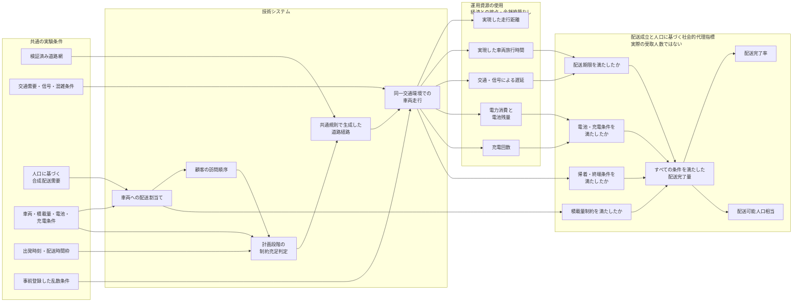

# 配送計画から配送可能人口相当までの運用波及

この図は、生成された配送計画の違いが、技術システム、運用資源の使用、人口に基づく社会的代理指標という三つの層を通じて、配送完了量および配送可能人口相当へどのように波及するかを示す。

ここで示すのは、本研究のモデル内における処理・判定・集計の関係であり、実社会における因果効果を実証するものではない。中間層は運用資源と経済との接点を示すが、金銭価値へ換算しない。最終層の配送可能人口相当は、実際に配送を受けた人数ではない。排出量、顧客満足度、社会厚生および地域公平性は、現在の評価範囲に含めない。



図の中心となる三層の波及関係は次のとおりである。

```text
技術システム
配送割当て・訪問順序・道路経路・車両走行
        ↓
運用資源の使用
走行距離・車両旅行時間・遅延・電力消費・充電
経済との接点を示すが金銭換算しない
        ↓
配送成立と人口に基づく社会的代理指標
条件判定・配送完了量・配送完了率・配送可能人口相当
実際の受取人数ではない
```

解品質および計算資源は、この運用波及経路へ含めず、別の評価系統として扱う。
