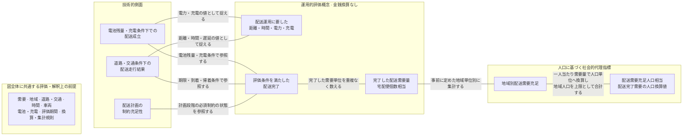

# 配送評価における技術・運用・人口代理指標の概念体系

## 概念体系の位置づけ

本資料は、本研究で扱う複数の技術的側面と運用的評価概念を、異なる分析単位を介して、最終的な人口代理指標である「配送需要充足人口相当」へ対応づける。図中の接続線は、同じ測定結果を別の観点から捉える関係、判定時に測定項目を参照する関係、同じ配送結果を別の空間・集計単位で表す関係、または詳細値を集約的な代理指標へ対応づける関係を示す。

この概念体系は、実社会の因果関係、技術から社会への効果波及、時間的な前後関係、ソフトウェアの実行順序、データ処理フロー、研究工程、政策効果、社会厚生または経済便益の発生過程を示さない。左から右への配置は、異なる分析レベルの概念を一つの人口代理指標へ整理するための概念的な収束だけを表す。

## 概念・操作化・実装の区別

**概念**は、研究上何を意味するかを示す一般的な名称である。概念図の主要ノードには、「配送計画の制約充足性」や「地域別配送需要充足」のように、特定のソフトウェアやデータ形式に依存しない名称を用いる。

**操作化**は、概念を本研究でどのように測定、判定または集計するかを示す。例えば、配送走行結果を道路交通シミュレーションで測定することや、地域別配送需要充足の地域単位として人口メッシュを用いることが操作化に当たる。

**実装・データ項目**は、操作化のために保存する具体的な識別子や値である。メッシュコード、需要ID、車両ID、経路ID、配送完了フラグ、走行距離および電力消費量は実装項目であり、上位概念の名称としては用いない。

## 共通前提

次の条件群は、特定の結果を生じさせる単一の原因ではなく、図全体の値と解釈可能範囲を定める共通前提である。手法間比較では、これらを同一に固定するか、変更した条件を明示する。

- 需要条件には、人口データ、一人当たり需要換算値、その対象期間、合成需要生成規則、整数化・丸め規則および需要IDの規則を含める。
- 空間・交通条件には、対象地域、地域区分、道路網、交通需要、信号および評価時間帯を含める。
- 配送条件には、配送期限、車両台数、積載容量、出発地点、終端・帰着条件および評価期間を含める。
- EV条件には、電池容量、初期電池残量、最低許容電池残量、電力消費モデル、充電地点、充電速度および充電待ち条件を含める。
- 評価規則には、配送完了条件、欠損・失敗の扱い、重複排除、集計方法および最終表示時の丸め規則を含める。

## 概念図

実線は無方向であり、ラベルに記した概念上の対応だけを示す。共通前提と技術的側面の間の不可視リンクは描画上の配置にだけ用い、因果関係を表さない。最終点は「配送需要充足人口相当」だけであり、その先に社会的効果を表す別の概念を置かない。

## 概念・測定対応表

| 概念 | 一文定義 | 本研究での操作化 | 観測単位 | 測定単位 | 集計単位 | 成立・算出規則 | 隣接概念との違い | 解釈上の注意 |
|---|---|---|---|---|---|---|---|---|
| 配送計画の制約充足性 | 計画された割当、訪問順序および経路が、計画段階の必須制約をすべて満たす状態である。 | 最適化問題から復号した計画について、需要割当、容量、経路連続性、始終点および計画時間制約を検査する。 | 計画、個別制約、需要 | 二値、違反件数、比率 | 計画別、制約種別、手法別 | 一つでも必須制約に違反した計画は全体として未充足とし、計画全体の二値判定と個別制約の充足率を別に保存する。 | 配送走行結果や配送完了とは異なり、道路交通シミュレーションを実行する前の計画を対象とする。 | アルゴリズムの正常終了、目的関数上の良さ、SUMO上の走行可能性または実車運行可能性を意味しない。 |
| 道路・交通条件下の配送走行結果 | 配送計画を設定済みの道路・交通条件で実行したときに得られる車両走行の結果である。 | SUMOで各車両・経路・試行の走行距離、旅行時間、遅延および時刻を測定する。 | 車両、経路、試行 | km、分、時刻 | 車両別、経路別、試行別、手法別 | 出発から終端または必要な帰着までを集計し、経路未生成、投入失敗および異常終了はゼロ値ではなく失敗状態として保存する。 | 配送計画の制約充足性は計画値を扱うが、本概念はシミュレーション上の実現値を扱う。EV固有の条件は別に判定する。 | 実社会で観測された走行実績、東京交通全体の性能、道路網自体の性能またはSUMOの計算性能ではない。 |
| 電池残量・充電条件下での配送成立 | 配送運行中の電池残量と充電行動が、事前に定めたEV条件をすべて満たす状態である。 | 各車両の電力消費、各主要時点の電池残量、充電イベント、充電時間および待ち時間を記録して制約を検査する。 | 車両、走行区間、配送地点、充電イベント、試行 | kWh、電池残量率、回、分、二値 | 車両別、試行別、手法別 | 電池残量が最低許容値を下回るか電池切れとなった試行は未成立とし、充電地点への到着、充電開始、充電終了および通過を区別する。 | 配送走行結果が距離・時間・遅延を扱うのに対し、本概念はEV固有の電池・充電条件を扱う。 | 実車の電費、電池劣化、実在充電器の利用可能性または充電費用を保証しない。 |
| 配送運用に要した距離・時間・電力・充電 | 配送運行に伴う移動、時間、エネルギーおよび充電利用の絶対量を個別に表す概念である。 | 総走行距離、総旅行時間、総交通・信号遅延、総電力消費、総充電回数、総充電時間および総充電待ち時間を保存する。 | 車両、経路、充電イベント、試行 | km、分、kWh、回 | 車両別、試行別、手法別 | 各値を固有の単位のまま集計し、一つの合成得点へ統合しない。配送完了需要量当たりの値は別の効率指標として算出する。 | 配送完了の成否や数量ではなく、運用中に記録された絶対量を表す。 | 金銭的費用、経済価値または単独の効率指標を意味しない。 |
| 評価条件を満たした配送完了 | 各配送需要が、事前に定めたすべての必須条件を満たして完了した状態である。 | 各需要IDについて、対象地点への到着、期限、容量、電池、充電、重複、未配送および必要な終端・帰着条件を検査する。 | 配送需要、試行 | 二値、完了率、失敗試行数 | 需要別、車両別、試行別、手法別 | 必須条件を一つでも満たさない需要は完了に含めない。需要ごとの二値判定と試行全体の成功判定を別に保存する。 | 配送計画の制約充足性に加え、道路・交通およびEV条件下の実行結果を参照する。完了した配送需要量は、この判定後の数量である。 | 一部条件だけを満たす配送や、単一試行の完了を、完全な配送成立または試行間の安定性とみなさない。 |
| 完了した配送需要量 | 配送完了条件を満たした合成需要を、人口換算前の需要単位で重複なく合計した値である。 | 凍結した需要IDごとの完了フラグを用い、宅配便個数相当量を地域別、車両別および試行全体で集計する。 | 配送需要 | 宅配便個数相当 | 地域別、車両別、試行別、手法別 | 同じ需要IDは一試行で一度だけ数え、未完了、重複配送および失敗状態は完了量へ含めない。 | 配送完了が需要ごとの状態を表すのに対し、本概念は完了した数量を表す。地域別配送需要充足はこの数量を設定需要と比較する。 | 実荷物数、実注文数、顧客数、訪問地点数、配送先数、重量、人口または最大配送能力ではない。 |
| 地域別配送需要充足 | 事前に定めた各地域について、設定需要のうち完了した需要の量と割合を表す概念である。 | 地域単位に人口メッシュを用い、メッシュコード、公開人口、設定需要量、完了量、未完了量および充足率を保存する。 | 地域、配送需要 | 宅配便個数相当、比率 | 地域別、試行別、手法別 | 設定需要量を分母、完了した配送需要量を分子として充足率を求める。需要ゼロ地域は百パーセントやゼロパーセントではなく「需要なし」とし、各需要IDを一地域だけに帰属させる。 | 完了した配送需要量を地域単位に分けて設定需要と比較する。配送需要充足人口相当は地域別完了量を人口単位へ換算する。 | 人口メッシュは操作化であって概念そのものではない。行政区域別実績、実注文の充足または地域公平性を意味しない。 |
| 配送需要充足人口相当 | 地域別の完了した配送需要量を人口単位へ換算し、各地域人口を上限として重複なく合計した人口代理指標である。 | 人口メッシュ別完了量、公開人口、一人当たり需要換算値および評価期間を用いて、各試行・各手法について算出する。 | 地域、試行 | 人相当 | 試行別、手法別、対象地域全体 | 地域別完了量を一人当たり評価期間内需要量で除し、公開人口を超える値は公開人口までに制限する。地域別値は中間で丸めず重複なく合計し、事前固定した表示規則で最終値だけを丸める。 | 地域別配送需要充足が地域単位の需要量と比率を表すのに対し、本概念は地域別完了量を人口単位に換算した最終集約値である。 | 実配送人数、固有受益者数、将来配送可能人口、サービス利用可能人口、道路到達可能人口、最大供給能力、社会厚生または経済便益ではない。 |

## 操作的定義

### 配送計画の制約充足性

一つの配送計画を観測単位とし、計画された配送割当、訪問順序および経路を検査する。各配送需要が規定回数だけ割り当てられていること、重複割当がないこと、車両積載容量を超えないこと、訪問順序が連続していること、出発地点と終端地点または帰着先が正しいこと、計画上の時間制約、および当該実験段階で必須としたその他の制約をすべて確認する。一つでも違反があれば計画全体を制約未充足とする。計画全体の二値判定と、各制約種別の違反件数・充足率は別項目として保存する。

### 道路・交通条件下の配送走行結果

一車両・一経路・一試行を基本観測単位とし、配送計画をSUMO上で実行した結果として、走行距離、旅行時間、交通遅延、信号遅延、出発時刻、最終配送完了時刻、および帰着を要求する場合の帰着時刻を保存する。車両別の値と試行全体の合計を区別する。経路が生成できない場合、SUMOへ投入できない場合または異常終了した場合は、距離や時間をゼロとして扱わず、対応する失敗状態と欠損理由を保存し、完了試行の要約統計へ暗黙に含めない。

### 電池残量・充電条件下での配送成立

一車両・一試行を基本観測単位とし、総電力消費量、出発時、各配送地点到着時、各充電地点到着時および運行終了時の電池残量、最低許容電池残量、電池切れの有無、充電回数、充電時間および充電待ち時間を保存する。電池残量が事前設定した下限を一度でも下回るか、電池切れとなった運行は未成立とする。充電地点への到着、充電開始、充電終了および単なる通過は別イベントとして識別する。

### 配送運用に要した距離・時間・電力・充電

一車両・一試行について、総走行距離、総旅行時間、総交通遅延、総信号遅延、総電力消費量、総充電回数、総充電時間および総充電待ち時間を個別に保存する。異なる単位の値を一つの合成得点へ統合せず、金銭的費用にも換算しない。配送完了需要量当たりの距離、時間または電力を用いる場合は、絶対量とは別の効率指標として名称、分子、分母および需要ゼロ時の扱いを定義する。

### 評価条件を満たした配送完了

一つの配送需要を観測単位とし、対象地点への到着、期限または時間窓、車両積載容量、最低許容電池残量、必要な充電条件、重複配送がないこと、未配送状態でないこと、および必要な終端・帰着条件をすべて満たした場合だけ完了とする。一部の条件だけを満たした需要は完了に数えない。需要ごとの完了フラグと、すべての必須条件を満たした試行であるかという試行全体の成功フラグを区別する。

### 完了した配送需要量

各需要IDの完了フラグを用いて、完了と判定された合成需要の宅配便個数相当量を合計する。需要ID別、地域別、車両別および試行全体の値を区別して保存し、同じ需要IDを一試行で複数回数えない。経路未生成、投入失敗、異常終了、未配送または重複配送の需要は完了量へ含めず、失敗種別を別に記録する。需要IDの生成規則は現時点で未決定であるため、正式実験前に一意性、決定性、入力データとの追跡可能性を満たす規則を固定する。

### 地域別配送需要充足

評価対象地域を事前に定めた空間単位へ区分し、各地域の設定需要量、完了した配送需要量、未完了需要量および需要充足率を保存する。本研究では地域単位として人口メッシュを用いる。需要充足率は、その地域に設定された需要量を分母とし、同じ地域で完了した配送需要量を分子として算出する。設定需要がゼロの地域は、充足率を百パーセントまたはゼロパーセントとせず「需要なし」として扱う。各需要IDは一つの地域識別子だけに帰属させ、地域間で重複集計しない。

地域別配送需要充足の空間表示は主概念ではなく、完了量または充足率を人口メッシュ上に表示する補助分析とする。「一件以上完了」「事前固定した充足率以上」「全需要完了」のいずれを表示するかを図ごとに明記する。この表示は、道路上で到達可能な地域、将来のサービス提供地域または地域公平性を意味せず、配送需要充足人口相当の算出にも用いない。

### 配送需要充足人口相当

一地域・一試行について、配送完了条件を満たした需要量と、その地域に適用する一人当たり需要換算値を確定する。一人一日当たりの需要換算値を用いる場合は、評価期間の日数を反映して一人当たり評価期間内需要量へ直す。地域別完了量をこの値で除して人相当へ換算し、換算値が地域の公開人口を上回る場合は公開人口までに制限する。地域別の値を中間段階で丸めず、各需要IDが一地域にだけ属することを確認した上で、地域間で重複なく合計する。最終表示時の桁数と丸め方は結果を見る前に固定する。

本研究では地域単位として人口メッシュを用いるが、これは算出上の操作化である。主要概念の名称は「配送需要充足人口相当」とし、メッシュコードやメッシュ人口は実装データとして扱う。

## 合成需要と丸め規則

合成需要には、e-Statの人口メッシュと大田区人口から作る地域別推定人口、全国宅配便取扱個数を全国人口と日数で除した一人一日当たり需要換算値、および事前固定した評価期間を用いる。初期基準では、区全体の期待需要を先に整数へ四捨五入し、その整数総量を各地域の期待需要の小数部分に基づく最大剰余法で配分する。同率時はメッシュコード昇順とし、地域別整数需要の合計が区全体の整数需要に一致することを検証する。期待需要が一未満の地域も独立に丸めず、区全体からの最大剰余配分に従う。

同じ需要単位を追跡する一意な需要IDの生成規則は未決定である。正式実験へ進む前に、同じ入力と設定から同じIDが得られ、地域、合成需要成果物およびmanifestまで追跡できる規則を固定する必要がある。

配送完了需要量を一人当たり評価期間内需要量で除する方法を主要指標の換算規則とする。地域の需要充足率を地域人口へ乗じる方法は、地域設定需要が丸めなしで地域人口と一人当たり評価期間内需要量の積に等しい場合だけ同じ値になる。整数需要の最大剰余配分によって両者が一致しない可能性があるため、二つの方法を混在させない。

## 複数試行の集計

配送需要充足人口相当は、各試行について地域別値を算出して合計した後、試行間で集約する。先に複数試行の配送完了需要量を平均してから人口換算する方法は用いない。各試行について、設定需要量、完了需要量、地域別配送需要充足、配送需要充足人口相当、シミュレーション失敗の有無および経路未生成の有無を保存する。

試行群については、試行数、失敗試行数、経路未生成試行数、平均値、中央値、最小値、最大値および標準偏差を報告し、必要な場合は事前に方法を定めた信頼区間を付す。失敗試行をゼロ値へ置換せず、完了試行だけの統計と全試行に占める失敗率を分けて示す。試行ごとに需要量が異なる設計を採用する場合は、試行別比率の単純平均と全需要をまとめた加重比率を区別し、採用した集約方法を明記する。

## 解釈上の限界

配送需要充足人口相当は、実際に配送を受けた人数、固有の受益者数、将来配送できる人口、サービス利用可能人口、道路上で到達可能な人口または最大供給能力ではない。その値が大きいことから、社会厚生、経済便益、生活の質または政策効果が大きいとは結論づけられない。

地域別需要は、公開人口と事前固定した規則から生成する合成需要であり、実注文ではない。地域単位として人口メッシュを用いることは本研究上の操作化であって、概念そのものではない。人口換算値は、人口データ、一人当たり需要換算値、評価期間、需要生成規則、丸め規則および配送完了条件に依存する。人口代理指標だけでは地域公平性を評価できない。

シミュレーション結果は、設定した道路網、交通需要、信号、車両モデル、電力消費モデルおよび充電条件の範囲内でのみ解釈できる。排出量、配送費用、収益、顧客満足度、社会厚生および地域公平性は現在の評価対象に含まれず、運用量を金銭価値へ換算しない。

## 解品質および計算資源の評価系統

解品質および計算資源は主要概念図へ含めず、配送計画手法を比較する別の評価系統として扱う。配送計画の制約充足性は必須制約を満たす計画が得られたかを表し、解品質はその実行可能解が目的関数上でどの程度良いかを表す。配送走行結果は道路交通シミュレーション上の距離、時間および遅延を表し、評価条件を満たした配送完了は各需要が走行・EV条件を含む必須条件を満たしたかを表す。完了した配送需要量、地域別配送需要充足および配送需要充足人口相当は、その完了状態を需要単位、地域単位および人口単位でそれぞれ表す。

計算資源には、計算時間、メモリ、問題規模、QUBO規模、回路幅、回路深さ、反復回数および回路評価回数を含める。良い目的関数値は、必ずしも短い実旅行時間、大きな完了需要量または大きな配送需要充足人口相当を意味しない。目的関数、走行測定、配送完了、需要集計および人口換算を別々に保存する。回路シミュレーション上の資源指標を、物理量子ハードウェアの所要資源または量子優位性の実証として解釈しない。
