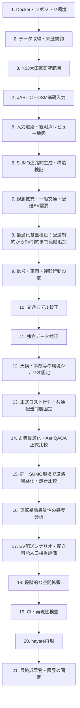

# Tokyo traffic simulation implementation plan

## 0. 研究の現在地

状態更新日：2026年7月18日

> 現在は、N03大田区行政界、JARTIC基礎観測、日付固定OSM PBF、入力レビュー地図が揃い、`netconvert`によるSUMO道路網の生成・構造検証へ進む段階である。



| 状態 | 工程 |
|---|---|
| 完了 | Docker環境、取得規約、N03大田区境界、JARTIC・OSM基礎入力、入力レビュー地図 |
| **進行中** | **SUMO道路網生成・構造検証** |
| 次 | 観測拡充、交通需要、最適化基盤検証、較正、独立検証、環境シナリオ、正式配送問題、古典・QAOA正式比較、走行比較 |

機械可読な状態の正本は`reproducibility/config/traffic_simulation/research_stage.yml`とする。生成地図はこの設定を読み、左上パネルへ現在工程と全工程を表示する。工程の作業量が均等ではないため、恣意的な百分率は表示しない。工程が完了したときは、証拠ファイルを`evidence`へ登録し、`status`と`current_stage_id`を同じ変更で更新する。成果物の存在だけから状態を自動昇格させない。

## 5. データ取得規約を作る

実データを取得する前に、各データについて以下を記録する仕組みを用意する。

- データセット名
- 配布元URL
- 取得日
- ライセンス
- 対象期間・対象地域
- 元ファイル名
- SHA-256
- 加工スクリプト
- 加工後ファイルとの対応

生データ自体は `03_data/raw/traffic_simulation/` のデータ源別サブディレクトリに置き、Gitには登録しない。データ出典一覧 `03_data/metadata/traffic_simulation_sources.csv` だけをGit管理する。実行コードは `traffic_simulation.paths` の共通定義を利用し、固定された親階層番号、作業ディレクトリ、ホスト固有の絶対パスに依存しない。

生データの保存先は以下に統一する。

| ディレクトリ | 内容 |
|---|---|
| `boundaries/` | N03等の行政区域・対象地域境界 |
| `charging/` | 充電地点API応答・取得スナップショット |
| `driver_behavior/` | 利用許諾を確認した運転行動データ |
| `freight/` | 貨物流動・貨物需要集計表 |
| `freight_network/` | N12等の物流道路GISデータ |
| `gtfs/` | GTFS・GTFS-RTスナップショット |
| `jartic/` | 時刻を固定したJARTIC API応答 |
| `logistics_hubs/` | P31等の物流施設GISデータ |
| `osm/` | 日付を固定したOSM PBF原本 |
| `population/` | e-Stat人口・世帯メッシュ |
| `road_census/` | 道路交通センサスの区間・時間帯表 |
| `tokyo_police/` | 警視庁交通量調査アーカイブ |
| `vehicles/` | メーカー公式車両仕様の取得原本 |

### 5.1 現在の取得状態

調査基準日は2026年7月17日とする。JARTICの1時間交通量スナップショット、N03東京都版原本、日付固定Geofabrik関東OSM PBFは、取得、SHA-256登録、加工、検証まで完了している。N03から大田区境界GeoParquet、OSM原本から大田区取得用BBOX抽出PBFも生成済みであり、登録済みPBFを用いたレビュー用HTML地図を生成できる。道路交通センサス等の後続原本、SUMOネットワーク、交通需要、配送最適化入力は未作成である。従来の交通関連加工表は利用できるが、原本がないデータについては完全な再加工ができない。

| データ | 現在の取得状態 | 再取得可否 | 現状での利用可否 |
|---|---|---|---|
| OpenStreetMap道路網 | 2026年7月16日時点の関東PBF原本、台帳、取得記録、大田区BBOX抽出、品質サマリー、レビュー用可視化を作成済み | 取得済み | SUMO道路網生成の原典として利用可能。`netconvert`変換と接続性検証は未実施 |
| 東京都行政境界 N03 | 2026年東京都版原本、台帳、取得記録、大田区境界を作成済み | 取得済み | 大田区の地域設定、OSM取得範囲生成、空間判定に利用可能 |
| 道路交通センサス | 東京都の集計結果と車種別要約あり | 可能 | 交通量規模の推定には利用可能。道路区間への割当には元の箇所別・時間帯別表が必要 |
| 警視庁交通量統計 | 集計表と都県境の時間帯別表あり | 可能 | 一部の較正に利用可能。全観測地点を使う場合は元ZIPが必要 |
| JARTIC交通量 | 2026年7月4日22時の33地点、1時間分の原本、台帳、正規化結果を作成済み | 追加取得可能。ただし保存期間あり | 限定的な較正に利用可能。複数時刻・複数日の追加取得が必要 |
| 全国貨物純流動調査 | 東京都の発着量、貨物車台数、施設種別、地域間流動の加工表あり | 可能 | 地域単位の貨物需要生成に利用可能 |
| 物流拠点 P31 | 東京都の候補地点500件あり | 可能 | デポ候補として利用可能。ただし2013年基準のため現存確認が必要 |
| 重要物流道路 N12 | 路線属性、区分、延長の加工表あり | 可能 | 加工表に道路形状がないため、道路網との重ね合わせには元GISデータが必要 |
| e-Stat人口メッシュ | 5,448メッシュの人口・世帯数あり | 可能 | 顧客需要や一般交通需要の空間配分に利用可能 |
| Open Charge Map | 東京都境界内の充電地点135件あり | APIキー等の条件付きで可能 | EV充電候補として利用可能。実際の利用可否、稼働状況、出力には追加検証が必要 |
| EV車両仕様 | メーカー公式情報から作成した加工表あり | 概ね可能 | 車両・電池・航続距離シナリオに利用可能。仕様ページの更新に注意する |
| 都営バスGTFS | 経路数、停留所数、便数などの要約のみ | 可能 | バスをSUMOへ導入するにはGTFS ZIPの再取得が必要 |
| 信号制御 | 未取得 | 部分的 | OSMから信号位置は取得できるが、現示、サイクル、オフセットは原則として不足する |
| 実旅行時間・速度 | 独立した詳細検証データは未取得 | 部分的 | 道路交通センサス等で一部補完できるが、本格的な旅行時間検証には不足する |
| 実配送OD・車両軌跡 | 未取得 | 公開データでは困難 | 合成需要、事業者提供データ、または明示的な仮定が必要 |

### 5.2 配布元と取得可能性

#### 道路ネットワークと行政境界

- Geofabrikの[関東地方OpenStreetMapデータ](https://download.geofabrik.de/asia/japan/kanto.html)からPBF、Shapefile、GeoPackageを取得できる。SUMO用の原典には日付を固定したPBFを使用し、取得時のファイル名とSHA-256を記録する。
- [国土数値情報ダウンロードサイト](https://nlftp.mlit.go.jp/)から行政区域N03を再取得できる。
- [物流拠点P31](https://nlftp.mlit.go.jp/ksj/gml/datalist/KsjTmplt-P31.html)と[重要物流道路N12](https://nlftp.mlit.go.jp/ksj/gml/datalist/KsjTmplt-N12-v1_1.html)も再取得可能である。ただし、配布ページに示される利用条件を個別に記録する。P31の最新版は2013年度版であり、現在の施設を完全には表さない。

#### 静的交通量

- [令和3年度全国道路・街路交通情勢調査](https://www.mlit.go.jp/road/census/r3/index.html)から、東京都の箇所別基本表と時間帯別交通量表をCSVで取得できる。
- [東京都オープンデータカタログの警視庁交通量統計表](https://catalog.data.metro.tokyo.lg.jp/dataset/t000022d0000000035)から、調査結果、都県境、主要交差点、主要断面、調査概要のZIPを取得できる。ライセンス表示と帰属条件を記録する。

#### JARTIC動的交通量

- [JARTIC交通量オープンデータ](https://www.jartic-open-traffic.org/)は、直轄国道の一部観測点について5分値と1時間値をCSVまたはGeoJSONで提供する。
- 検索可能期間は、5分値が過去1か月、1時間値が過去3か月である。期間経過後は同一データを再取得できないため、取得したAPI応答を直ちに生データとして保存する。
- 現在の加工表が参照する2026年7月4日22時の1時間値は、保存期間内に再取得して原本を確保する。JARTICは東京都内の全道路を覆わず、観測精度にもばらつきがあるため、道路交通センサス等と併用する。

#### 貨物流動と人口

- [全国貨物純流動調査の集計表](https://www.mlit.go.jp/sogoseisaku/transport/sosei_transport_fr_000074.html)から2021年等の集計結果を取得できる。これは地域・産業・品目単位の集計であり、個別顧客や実配送経路ではない。
- [e-Stat統計GIS](https://www.e-stat.go.jp/gis/statmap-search?page=1&toukeiCode=00200521&type=1)から2020年国勢調査の地域メッシュ統計を取得できる。人口・世帯数を合成需要の空間配分に利用する。

#### 充電設備、車両、公共交通

- [Open Charge Map API](https://openchargemap.io/develop/api)から充電地点を取得できるが、APIキー、利用規約、レート制限に従う。位置、出力、稼働状態、利用条件には欠損や古い情報が含まれるため、候補地点として扱う。
- EV車両仕様はメーカー公式ページ・仕様書から再取得する。取得時点の仕様書を保存し、モデル、架装、電池構成、測定条件の違いを記録する。
- [公共交通オープンデータセンターの東京都交通局データ](https://ckan.odpt.org/dataset/?organization=toei&res_format=GTFS%2FGTFS-JP)から都営バスのGTFS/GTFS-JPを取得できる。公共交通再現には利用できるが、道路交通量や配送需要の直接的な観測値ではない。

### 5.3 公開データだけでは取得が難しい情報

以下は現時点で未取得であり、一般公開データだけからの完全な取得は難しい。

- 交差点ごとの信号現示、サイクル、オフセット
- 宅配事業者の顧客別配送OD
- 実配送車のGPS軌跡
- デポごとの車両台数と出発時刻
- 充電器のリアルタイム空き状況
- 路上駐停車、荷さばき、二重駐車の実態
- 全道路を覆うリアルタイム旅行速度

これらを取得できない場合は、公開集計値に合う合成データまたはシナリオ仮定で補う。観測値、推定値、仮定値をメタデータ上で明確に区別し、完全な実環境再現ではなく「実測値で較正した近似モデル」と位置付ける。

### 5.4 構築可能性と取得優先順位

現状の公開データにより、小規模SUMOネットワーク、実交通量による較正、時間帯別需要の近似、集計的な貨物車需要、EV配送・充電シナリオは構築可能である。一方、実配送運行の完全再現と東京全域の完全なデジタルツインは、公開データだけでは構築できない。

当初の取得優先順位は以下である。1、2、5のうちN03は2026年7月17日までに完了した。次は3の道路交通センサス取得と、取得済みOSMからのSUMO道路網生成を進める。

1. 保存期間が限定されるJARTICの既存時刻と追加観測期間
2. 日付を固定したOpenStreetMap PBF
3. 道路交通センサスの東京都箇所別・時間帯別CSV
4. 警視庁交通量統計の元ZIP
5. N03行政境界、P31物流拠点、N12重要物流道路の元GISデータ
6. 物流センサスとe-Stat人口メッシュの元データ
7. Open Charge Map、EV車両仕様、GTFSなどのシナリオ補助データ

### 5.5 海外実走行データによる運転挙動異質性の参照設計

目的は東京の運転者を熟練・非熟練へ分類することではなく、能力や挙動の異なる車両が混在したときの交通上の摩擦、エネルギー消費、配送結果への影響を検証することである。海外データの絶対値や構成比は東京へ移植せず、データ内で観測された相対差と個人間分散を、東京基準モデルに対する感度情報として扱う。

#### 5.5.1 データの役割と禁止する解釈

| データ | 役割 | 禁止する解釈 |
|---|---|---|
| Expert Driving Dataset | 主参照。10名のsource expertと10名のsource noviceが、同一Lincoln MKZ、固定5.7 km都市経路、13条件で走行したCAN、GNSS、条件、視覚情報から、source群間の相対的な操作差と個人間異質性を分析する | 東京の熟練者母集団、配送運転者、性別一般差、車種差、東京の構成比または絶対パラメータとはみなさない |
| inD、INTERACTION | 都市交差点、追従、譲り、車線変更の分布妥当性を確認する軟らかい参照 | 経験差の推定、東京への絶対値移植には使用しない |
| highD | 高速道路の追従・車線変更に関する分布距離の補助参照 | 都市部の二値合否ゲートまたは熟練差の根拠にはしない |
| Honda HDD | 操作・車線変更・右左折等の意味的イベント抽出を補助する | source経験ラベルのないデータから熟練効果を作らない |
| PSAD | 事故映像刺激に対する認知・反応遅延の分布を、事故感度シナリオの境界へ使用する | 実車走行時の制動、操舵、衝突回避軌跡とはみなさない |

Expert Driving DatasetのTraffic Recorder由来指標は、映像内の交通参加者等による**視覚的交通曝露**であり、道路交通量ではない。乗客快適性は走行前後のtrip-level評価として別表に保存し、13条件へ複製しない。source群名は原典どおり`source_expert`、`source_novice`とし、東京の実態を表す名称へ置換しない。EEG、視線、心拍等は機序説明の後続分析に限定し、初期SUMO較正の直接入力にしない。

N03は大田区行政界だけを供給し、道路形状、接続、車線、方向、速度を供給しない。道路網の基礎はOSM、東京の交通状態の較正・検証は用途を明記したJARTIC等、海外データは運転挙動の相対的異質性というように役割を分離する。

#### 5.5.2 分析単位と統計モデル

独立標本は260条件行ではなく20運転者である。条件別成果`y_dc`は、少なくとも次の階層モデルで分析する。

```text
y_dc = beta_0 + beta_group * source_group_d + gamma_condition_c
       + beta_X * context_dc + u_driver_d + epsilon_dc
```

- `d`: 運転者、`c`: 走行条件
- `context_dc`: 視覚的交通曝露、停止制御、先行車、歩行者、曲線等、取得可能な交絡要因
- `u_driver_d`: 運転者ランダム効果

不確実性は運転者単位クラスターブートストラップまたは階層ベイズで求め、partial poolingを使用する。20名の偶発的な個人差を20個の固定SUMOプロファイルとして確定しない。速度、停止、加減速等は信号、先行車、歩行者、曲線等の影響を受けるため、可能な場合はfree-flowに近い区間を分離し、急操作件数は走行時間または距離で正規化する。

#### 5.5.3 前処理と派生指標

CAN等からジャークを求める前に、タイムスタンプの単調性、重複、欠測、実効サンプリング周期を検査する。原系列を保存したうえで、宣言した規則グリッドへ再標本化し、補間上限、平滑化、微分方法、端点処理を設定化する。フィルタ、再標本化周期、閾値を変えた感度分析を行い、前処理だけで群差の符号や大きさが変わる場合は確定的な効果として採用しない。

正本となる加工表は少なくとも次へ分離する。

```text
driver_condition_metrics.parquet   # 運転者×条件、視覚的交通曝露を含む
trip_level_evaluations.parquet     # 走行前後の快適性等
driver_effect_posterior.parquet    # 群効果・運転者効果・不確実性
preprocessing_sensitivity.parquet  # 前処理別の再計算結果
```

#### 5.5.4 東京基準モデルへの相対移転

変換は変数型ごとに定義し、単一の比率式を全指標へ適用しない。

- 正の連続量: 対数比または対数偏差を用いる。
- 正負を取る連続量: 加算差または標準化差を用いる。
- 確率・割合: logit差を用いる。
- 件数: 距離または時間で正規化した率の対数比を用いる。
- ばらつき: 標準偏差の対数比を用いる。

正の量の個体差を移す例は次とする。

```text
r_i = log(x_i) - log(median_source(x))
x_Tokyo_i = x_Tokyo_baseline * exp(lambda * r_i)
```

`lambda`は東京への移転可能性を調べる事前固定の感度係数であり、海外データから推定した東京係数とは表現しない。値域、物理制約、相関構造を保つ変換を用い、技能、慎重・攻撃的スタイル、車両性能を同一潜在変数へまとめない。

#### 5.5.5 SUMOへの逆較正

観測指標とSUMOパラメータを一対一に対応させない。先に追従モデルを固定し、候補パラメータ集合を生成し、source条件を模した小規模SUMO走行を行い、速度、加速度、減速度、車間、停止、ジャーク、車線変更等の**多出力分布距離**を最小化する逆較正として推定する。

- `sigma`を一般的なジャーク制御値とみなさない。
- `actionStepLength`を観測反応頻度、`tau`を反応時間そのものとみなさない。
- `accel`と`decel`による通常の選択行動と、`emergencyDecel`による緊急・物理限界寄りの挙動を分離する。
- Driver State deviceと`actionStepLength`で同じ遅延効果を二重計上しない。
- highD等との比較は`D = sum_k(w_k * D_k)`のような事前登録した重み付き分布距離とし、二値ゲートにはしない。重み自体の感度も報告する。

PSAD由来の事故反応は連続分布を保持し、少数の固定クラスへ早期に離散化しない。必要な場合だけ事前登録した分位点から低・中・高の感度シナリオを作る。初期実装ではTraCIによる明示的な遅延アクション1方式に限定し、同じ事故効果を恒常的な追従パラメータ、Driver State、`actionStepLength`へ重複して与えない。

#### 5.5.6 実験系列、対照群、乱数

異質性と平均能力を識別するため、次の系列を分離する。

| 系列 | 操作 | 解釈 |
|---|---|---|
| `M` | profile構成比を変える | 平均と分散が共に変わり得る総効果 |
| `V` | 平均を概ね固定し、分散・異質性を変える | 混在そのものの効果 |
| `C` | 分散を概ね固定し、平均能力を変える | 平均的能力の効果 |

均質対照は、異質モデルのパラメータ平均へ合わせる`parameter-mean-matched`と、低密度時の出力分布へ合わせる`low-density-output-matched`の2種類を用意する。profile生成、車両割当、出発、経路、事故、SUMOのseedを個別に保存し、対比較にはcommon random numbersを使用する。東京におけるsource群構成比は観測されていないため、`M`系列の構成比は事実推定ではなく事前固定シナリオである。

主要出力は旅行時間、遅延、渋滞、急操作率、事故時未回避率、電力消費、配送完了量、需要充足人口相当とする。結果は「海外データに基づく相対的異質性を東京基準モデルへ移した感度実験」と表現し、「東京の熟練運転者を再現した」とは表現しない。

## 6. テスト用の最小地域を決める

いきなり東京全域には進まず、最初の環境・データ統合検証には国土数値情報N03の大田区行政界を使用する。研究対象範囲の正本は行政界ポリゴンとし、OSM等の矩形問い合わせに必要なBBOXはポリゴンの外接矩形から機械的に生成する。

| 項目 | 設定 |
|---|---|
| 地域ID | `ota_ward` |
| 名称 | 東京都大田区行政区域 |
| 境界原典 | 国土数値情報N03行政区域データ |
| 選択条件 | `N03_007="13111"`（大田区） |
| 研究対象形状 | N03の大田区行政界ポリゴン |
| 取得用BBOX | 行政界ポリゴンをEPSG:4326へ変換後、外接矩形を機械生成 |
| 距離計算用座標系 | `EPSG:6677` |
| 用途 | OSM取得、SUMO道路網生成、JARTIC観測点対応付け、起動試験 |

N03は行政区域コード `N03_007`、都道府県名 `N03_001`、市区町村名 `N03_004` を持つ。大田区は行政区域コード `13111` で選択し、名称条件 `N03_001="東京都"`、`N03_004="大田区"` も併用して誤選択を検出する。JARTIC観測点数、交通量、欠測、異常の有無は地域選定条件に使用しない。行政界確定後に全観測点を空間結合し、境界内の件数と品質状態を結果として報告する。

### 6.1 対象地域設定を固定する

- 地域ID、行政界の出典ID、選択属性、座標系を追跡可能な設定として保存する。
- 行政界の座標値やBBOXを取得・加工スクリプトへ直接記述せず、登録済みN03原本から生成する。
- OSM取得用BBOXと研究対象の行政界ポリゴンを区別し、分析対象判定には行政界ポリゴンを使用する。
- N03の基準年または行政界が変わる場合は設定版を上げ、既存原本と生成物を上書きしない。

#### 6.1.1 N03行政界を先に取得する

OSM取得より先に、国土数値情報N03の2026年版原本を取得・登録する。

| 項目 | 設定 |
|---|---|
| データセット | 国土数値情報N03行政区域データ、2026年版 |
| 配布ファイル | `N03-20260101_13_GML.zip`（東京都版） |
| 出典台帳ID | `mlit_n03_2026_tokyo` |
| 生データ保存先 | `03_data/raw/traffic_simulation/boundaries/N03-20260101_13_GML.zip` |
| 取得記録 | `03_data/metadata/acquisition/YYYYMMDD_mlit_n03_2026_tokyo_acquisition.md` |
| 境界抽出実装 | `05_src/traffic_simulation/network/study_areas.py` |
| 境界抽出テスト | `05_src/traffic_simulation/validation/test_study_areas.py` |
| 大田区境界出力 | `03_data/processed/traffic_simulation/road_network/boundaries/ota_ward_n03_2026.parquet` |

手順は以下とする。

1. 国土交通省の公式配布ページから2026年版原本を取得する。
2. 配布ページURL、実ダウンロードURL、取得日、利用規約、原本名、SHA-256を出典台帳へ記録する。
3. ZIP原本を改変せず保存し、展開物や加工境界と混在させない。
4. ZIP内のメタデータ、CRS、必須属性 `N03_001`、`N03_004`、`N03_007` を検証する。
5. `N03_007="13111"`、`N03_001="東京都"`、`N03_004="大田区"` をすべて満たす地物を選択する。
6. 同一行政区域の複数ポリゴンを統合し、空形状、自己交差、面積0を拒否する。
7. 行政界をCRS情報付きGeoParquetとして加工先へ保存する。
8. 加工境界のSHA-256、地物数、面積、原本CRS、境界BBOXを品質サマリーへ記録する。
9. 生データと加工境界がGit除外対象で、出典台帳、取得記録、コード、テストがGit管理対象であることを確認する。

配布ページのHTMLを原本として扱わず、実際のN03 ZIPを原本とする。配布URLが変更された場合も、同じファイル名だけで同一性を判断せずSHA-256を照合する。

#### 6.1.2 作成する設定・実装・テストファイル

対象地域の設定は次の3ファイルに分ける。

| 役割 | パス | Git管理 |
|---|---|---|
| 地域設定の正本 | `reproducibility/config/traffic_simulation/study_areas.yml` | する |
| 設定の読込・検証 | `05_src/traffic_simulation/network/study_areas.py` | する |
| 設定の単体テスト | `05_src/traffic_simulation/validation/test_study_areas.py` | する |

`study_areas.yml` は取得データや生成物ではなく、解析条件を固定する設定ファイルである。ホスト固有の絶対パス、APIキー、取得済みファイルの実体は含めない。

初期設定は次の形式とする。

```yaml
schema_version: 1
study_areas:
  ota_ward:
    version: 1
    status: active
    name_ja: 東京都大田区行政区域
    geometry_type: administrative_boundary
    boundary_source:
      dataset: MLIT_N03
      source_registry_id: mlit_n03_2026_tokyo
      code_field: N03_007
      code_value: "13111"
      prefecture_field: N03_001
      prefecture_value: 東京都
      municipality_field: N03_004
      municipality_value: 大田区
    api_crs: EPSG:4326
    metric_crs: EPSG:6677
    acquisition_extent_method: boundary_envelope
    network_clip_method: intersects_boundary
    intended_uses:
      - osm_acquisition
      - sumo_network_validation
      - jartic_edge_mapping
```

YAMLには行政界の座標や手入力BBOXを保存せず、N03原本の出典台帳IDと属性選択条件を保存する。OSM取得時は、選択した行政界を `api_crs` へ変換した後、`west`、`south`、`east`、`north` の外接矩形をコードで算出する。算出した実行時BBOXは出典台帳と取得記録へ証跡として記録する。

#### 6.1.3 地域IDと版管理のルール

- 地域IDには英小文字、数字、アンダースコアだけを使用する。
- 地域IDはファイル名、出典台帳ID、CLI引数、生成物名で共通して使用する。
- 同じ地域ID・同じ `version` の境界原典、基準年、選択条件を取得後に書き換えない。
- N03の基準年や選択方法を変更する場合は `version` を上げ、別の行政区域を対象にする場合は新しい地域IDを作る。
- `status` は `draft`、`active`、`retired` のいずれかとする。
- 行政界の版を更新しても過去の取得・生成結果を再現できるよう、出典台帳IDを固定する。
- 使用停止した設定も削除せず `retired` とし、過去の出典台帳・生成物との対応を維持する。

#### 6.1.4 座標系のルール

- N03原本のCRSはファイルのメタデータから読み取る。2026年版で想定するJGD2011経緯度は `EPSG:6668` だが、CRS情報をコードで無条件に上書きしない。
- `api_crs` はOSM等の外部APIとBBOX交換に使用し、`EPSG:4326` とする。
- `metric_crs` は距離、近傍、バッファ、道路対応付けに使用し、東京周辺では `EPSG:6677` とする。
- 経緯度の値をメートルとして計算しない。
- 座標系が不明な入力を推測で変換せず、取得記録または原典で確認できない場合は処理を停止する。
- GeoParquet、GeoJSON、対応表等の出力には、可能な限りCRS情報を保持する。
- CSV等、CRSを埋め込めない形式では、列名または付随メタデータへEPSGコードを記録する。

#### 6.1.5 読み込みコードのルール

`study_areas.py` は次の責務だけを持つ。

- `study_areas.yml` を共通パスから読み込む。
- `schema_version` と必須項目を検証する。
- 指定された地域IDが存在し、`active` であることを確認する。
- 出典台帳IDからN03原本を解決し、SHA-256一致を確認する。
- 行政区域コード、都道府県名、市区町村名の3条件で大田区だけを選択する。
- 選択結果が0件または複数の異なる行政区域になる場合は停止し、同一区域の複数ポリゴンは統合する。
- 行政界を `api_crs` へ変換し、外接矩形について `west < east`、`south < north` と経緯度範囲を確認する。
- 原本CRS、`api_crs`、`metric_crs` が有効であることを `pyproj` で確認する。
- 呼出側へ変更不能な `StudyArea` オブジェクトを返す。
- 行政界、取得用BBOX、投影後行政界を生成する処理を一か所に集約する。

取得・変換・対応付けの各スクリプトは、次のように地域IDを受け取る。

```bash
python -m traffic_simulation.network.fetch_osm --region ota_ward
```

正式な取得・加工では `--bbox` による任意値の直接指定を使用せず、追跡可能な `--region` を必須とする。探索的な直接指定を将来許可する場合も、出典台帳へ登録する正式原本とは別扱いにする。

#### 6.1.6 設定テストのルール

`test_study_areas.py` では少なくとも以下を検査する。

- `ota_ward` を正常に読み込める。
- N03の `N03_007="13111"`、`N03_001="東京都"`、`N03_004="大田区"` だけを選択する。
- 原本CRSを保持し、`api_crs` が `EPSG:4326`、`metric_crs` が `EPSG:6677` である。
- 行政界から算出したBBOXが行政界全体を包含する。
- BBOXの東西または南北が逆になる異常を拒否する。
- 範囲外の経緯度を拒否する。
- 不明な地域ID、重複した地域ID、不明な状態、未対応のスキーマ版を拒否する。
- ホスト固有の絶対パスや秘密情報に相当する項目を設定へ含めない。
- 取得済みJARTICデータを行政界へ空間結合し、境界内外の判定を再現できる。
- JARTIC観測点数や品質フラグを変更しても行政界の選択結果が変わらない。

#### 6.1.7 ファイル名と保存先のルール

ファイル名には少なくともデータ種別、地域ID、観測時点または取得日を含める。

```text
03_data/raw/traffic_simulation/osm/
  kanto_YYYYMMDD.osm.pbf

03_data/processed/traffic_simulation/road_network/osm_extracts/
  osm_ota_ward_YYYYMMDD.osm.pbf

03_data/processed/traffic_simulation/road_network/
  ota_ward_YYYYMMDD.net.xml

03_data/processed/traffic_simulation/sumo_inputs/
  ota_ward_YYYYMMDD.sumocfg

03_data/metadata/acquisition/
  YYYYMMDD_osm_ota_ward_acquisition.md
```

- 配布元の原本名に意味がある場合は `original_filename` として出典台帳に保持する。
- 生データ、問い合わせ文、API応答は `03_data/raw/` に保存しGitへ登録しない。
- `netconvert` 等で再生成できるファイルは `03_data/processed/` に保存しGitへ登録しない。
- 取得記録、地域設定、コード、テスト、出典台帳はGitへ登録する。
- ファイル名にスペース、ホスト名、ユーザー名、絶対パスを含めない。
- 同名ファイルが存在する場合は上書きせず、SHA-256一致なら既存原本を検証し、不一致なら処理を停止する。

#### 6.1.8 ファイル間の参照ルール

```text
N03 raw snapshot + traffic_simulation_sources.csv
  └─ study_areas.yml の地域ID・属性選択条件・CRS
       └─ study_areas.py
            └─ ota_ward administrative-boundary GeoParquet
                 ├─ fetch_osm.py
                 │    ├─ 境界外接BBOX
                 │    ├─ raw OSM snapshot
                 │    ├─ traffic_simulation_sources.csv
                 │    └─ acquisition Markdown
                 ├─ SUMO network builder
                 │    └─ processed *.net.xml / *.sumocfg
                 └─ JARTIC edge mapper
                      └─ jartic_edge_mapping.csv
```

- 出典台帳は生データから加工後出力までの来歴を保持する。
- 取得記録Markdownは実行手順、判断、検証結果、失敗と修正を保持する。
- YAMLは解析条件の正本であり、MarkdownからBBOXを読み取って処理しない。
- PythonコードはYAMLを読み込み、MarkdownやCSVへ重複した設定値を手作業で転記しない。ただし出典台帳と取得記録には、実行時に使用した値を証跡として出力する。
- 生データや生成物から地域設定を逆推定しない。

### 6.2 OSM道路データを取得する（2026年7月17日完了）

実装予定ファイルは以下とする。

```text
05_src/traffic_simulation/network/fetch_osm.py
05_src/traffic_simulation/validation/test_fetch_osm.py
```

取得・記録手順は以下の順で行う。

1. 日付または取得時点を固定できる関東地方OSM PBFを正式原典として選ぶ。
2. 配布されたPBF原本を `03_data/raw/traffic_simulation/osm/` に改変せず保存する。
3. ファイル名に地域IDと取得日を含め、既存原本を上書きしない。
4. SHA-256、配布元URL、取得日時、BBOX、ライセンス、原本ファイル名を `03_data/metadata/traffic_simulation_sources.csv` に登録する。
5. `03_data/metadata/acquisition/_template.md` を複製し、`03_data/metadata/acquisition/YYYYMMDD_osm_ota_ward_acquisition.md` に取得・検証手順を日本語で記録する。
6. PBFとして読めること、行政界から生成した取得用BBOXと交差すること、道路要素が空でないことを検証する。
7. 生データがGit除外対象で、取得記録、出典台帳、コード、テストだけがGit管理対象であることを確認する。

#### 6.2.1 BBOXの役割と現在値

BBOXはOSM原本を漏れなく取得するための軸平行な外接矩形であり、空間解像度、道路網の精度、研究対象形状のいずれも表さない。研究対象の正本はN03大田区行政界ポリゴンとし、BBOX内かつ行政界外の地物を大田区内の観測・評価へ含めない。

2026年版N03から生成した `ota_ward` version 1の参考値は以下である。これらの数値は実行結果の確認値であり、取得コードへ固定値として転記しない。

| 項目 | 現在値 |
|---|---:|
| 西端 | 139.652974773 |
| 南端 | 35.528198081 |
| 東端 | 139.826027782 |
| 北端 | 35.613210171 |
| BBOXのおよその幅 | 15.69 km |
| BBOXのおよその高さ | 9.45 km |
| BBOX面積 | 約147.94 km² |
| N03大田区行政界面積 | 約61.84 km² |
| BBOX面積 / 行政界面積 | 約2.39 |

外接矩形に行政界外が含まれること自体は異常としない。大田区は非矩形かつ島しょ・水域を含むため、面積比だけを根拠にBBOXを手作業で縮小、丸め、移動しない。境界原典、地域設定、または変換コードが変わらない限り、同一BBOXが再生成されなければならない。

道路環境の詳細度はBBOXではなく、取得するOSM道路属性、対象道路種別、車線、制限速度、交差点接続、右左折関係、信号、`netconvert`設定等によって決まる。これらは取得後の構造検証で別に評価する。

#### 6.2.2 PBF取得・切り出し方式

正式取得は、日付を固定できる関東地方等の地域PBFを原本として保存し、ローカルで大田区取得用BBOXへ切り出す方式に統一する。これにより、外部APIの可用性や応答上限に取得結果を依存させず、同じ原本SHA-256から再加工できる。

Overpass API、ブラウザー画面からの手動エクスポート、複数API応答の結合は正式取得に使用しない。PBFを取得できない場合は別方式へ自動的に切り替えず、正式取得を未完了として停止する。

PBF方式では、配布されたPBFを改変しない原本として保存する。BBOX切り出しファイルは原本と区別できる名称にし、加工スクリプト、全オプション、入力SHA-256、出力SHA-256を記録する。OSMのデータ時点と実際の取得日時を区別し、確認できる場合は両方を台帳へ記録する。

`fetch_osm.py` は少なくとも `--region ota_ward` を受け取り、地域設定からBBOXを取得して、登録済みPBF原本をローカルで切り出す。正式実行では任意の座標を与える `--bbox` や取得方式の切替を受け付けない。ホスト固有の絶対パス、認証情報、実行時刻だけで変わる暗黙の既定値をコードへ埋め込まない。

#### 6.2.3 取得対象のOSM地物

初回取得では道路網構築に必要な `highway` タグを持つwayと、その構成node・参照関係を対象とする。建物、店舗、土地利用等を一括取得しない。道路の採否は取得時に過度に絞り込まず、原本から再判定できるようにする。

取得後のSUMO変換対象は、自動車が通行可能な道路を基本とし、少なくとも以下を明示的に扱う。

- `highway`、`lanes`、`maxspeed`、`oneway`、`junction`、`access`、`vehicle`、`motor_vehicle`、`service`、`surface`、`bridge`、`tunnel` 等の道路属性
- 交差点、道路接続、方向、turn restriction等の経路接続に必要なrelation
- `highway=traffic_signals` 等の信号位置。ただし信号現示、周期、オフセットの実測値とはみなさない
- フェリー、鉄道、歩道、自転車道、構内道路等についての採否規則と除外理由

タグ欠損を推測で実測値へ置き換えない。`netconvert`の既定値または補完値を使用する場合は、OSM由来値、ソフトウェア既定値、研究上の仮定値を区別して記録する。

#### 6.2.4 行政界、境界道路、バッファの扱い

取得はBBOXで行い、研究対象判定はN03行政界ポリゴンで行う。道路wayが行政界と交差する場合、境界で直ちに切断せず、SUMOネットワークの接続性を検証できる範囲で関連nodeと接続edgeを保持する。行政界外の保持部分はネットワーク接続用であり、大田区内の交通量、旅行時間、配送実績等の集計対象へ自動的に含めない。

行政界への任意バッファは設定せず、N03行政界から生成した現在のBBOXを道路切り出し範囲として固定する。範囲に関する感度分析は実施しない。主要道路の切断、入口・出口の欠落、孤立成分等が残る場合は、BBOXを実行ごとに変更せず、現在の範囲によるモデル上の制約として記録する。将来範囲を変更する場合は、既存設定を上書きせず、対象地域設定のversionを上げた別計画として扱う。

#### 6.2.5 `fetch_osm.py` の出力と原子性

取得中のファイルには `.part` を付け、取得、形式検証、対象範囲検証、SHA-256計算がすべて成功した後にだけ正式名へ変更する。既存ファイルがある場合は上書きせず、既存SHA-256が期待値と一致すれば再利用し、一致しなければ停止する。

1回の正式取得では少なくとも以下を生成または更新する。

- 改変していない地域PBF原本
- BBOXでローカル切り出ししたOSM PBF
- 使用したローカル切り出しコマンド相当の実行メタデータ
- SHA-256、地物数、OSM要素種別別件数、BBOX、PBF切り出しツールとバージョンを含む品質サマリー
- `traffic_simulation_sources.csv` の出典・加工対応行
- 日本語の取得記録Markdown

ログや一時ファイルを成功済み原本とみなさない。失敗時は `.part` と失敗記録を調査用に残してよいが、台帳上の `status` を成功扱いにしない。

#### 6.2.6 `test_fetch_osm.py` の検証仕様

ネットワークへ接続しない単体テストを基本とし、小さな固定fixtureとモック応答で少なくとも以下を検証する。

- `--region ota_ward` から `StudyArea` のBBOXを使用し、手入力座標へ依存しない。
- BBOXが `west < east`、`south < north` を満たし、行政界全体を包含する。
- BBOXを丸めたり縮小したりせず、設定と境界が同じなら同じ範囲を生成する。
- PBF原本の必要なメタデータ項目が欠けていれば失敗する。
- 道路要素0件、壊れたPBF、対象範囲と非交差するPBFを拒否する。
- ローカル切り出し結果が元BBOXを対象とし、手入力範囲へ変更されていない。
- `.part` を成功済み原本として扱わず、検証成功後だけ正式名へ移す。
- 既存ファイルの不一致を上書きしない。
- 出典台帳、品質サマリー、取得記録へ実行時BBOXとSHA-256を記録できる。
- 生データと生成物がGit管理対象にならず、コード、テスト、設定、取得記録だけが管理対象になる。

実PBFを使う統合テストは手動または明示的なジョブとして分離し、大容量PBFのダウンロードを通常CIの合否条件にしない。

#### 6.2.7 実施結果、判断、現在の限界

2026年7月17日に次を実施した。

- Geofabrikの`kanto-260716.osm.pbf`を日付固定URLから取得した。
- 原本476,772,780バイトのSHA-256 `aef890f28b652ed7bd2b0d77e86f263219b479fe3eedbdd8610dcfc1572c420d`を台帳へ登録した。
- N03大田区行政界から機械生成したBBOXを用い、`osmium extract --strategy complete_ways --set-bounds`で抽出した。
- 抽出PBF12,218,967バイトのSHA-256 `10d554a13e89b815ca416c272d23d9477d52e312fa3d299f466fb3c01cf9d041`を品質サマリーへ記録した。
- 抽出物のnode 1,709,568件、way 323,393件、relation 2,373件、`highway` way 40,880件を確認した。
- 外部通信を使わない取得単体テストと、実PBFを使う手動統合確認を実施した。
- 登録済みPBFから自動車道路候補26,201件、信号2,190件を抽出してレビュー用HTMLへ表示した。

選択した日付、地域、抽出方式、許容誤差の根拠と実行時の失敗は、`03_data/metadata/acquisition/20260717_osm_ota_ward_acquisition.md`を正本とする。可視化の解釈と運用は`05_src/traffic_simulation/visualization/README.md`を正本とする。

この段階で実施した分析は、SHA-256、PBF構造、要素数、タグ抽出、範囲、台帳整合性の検査である。交通量、速度、渋滞、旅行時間、SUMO接続性、配送経路、古典最適化、QAOAの分析はまだ実施していない。地図上の道路数をSUMOエッジ数や実交通環境の再現精度として解釈しない。

`complete_ways`はwayの参照nodeを保つため、実データ座標がヘッダーBBOX外まで及ぶ。これは切り出し不良ではないが、集計ではN03行政界、表示では取得用BBOXを明示的に適用する必要がある。PBFヘッダーの小数表現差には`5e-8`度の固定許容値を使うが、抽出範囲や分析範囲を広げるための値ではない。

### 6.3 SUMO道路網を生成する

OSM原本の検証後、`netconvert` を用いて最小地域のSUMOネットワークを生成する。

```text
N03大田区行政界
  → EPSG:4326の取得用BBOXを機械生成
  → OSM原本取得
  → 行政界と交差する道路を抽出
  → netconvert
  → SUMO *.net.xml
  → 構造検証
```

- 生成処理は `05_src/traffic_simulation/network/` に実装する。
- 使用した `netconvert` のバージョンと全オプションを取得記録または実行メタデータへ残す。
- 加工済み道路網は `03_data/processed/traffic_simulation/road_network/` に保存する。
- SUMO設定・追加ファイルは `03_data/processed/traffic_simulation/sumo_inputs/` に保存する。
- 原本、加工途中、生成物を混在させない。
- OSMの信号位置を利用できても、実際の信号現示、サイクル、オフセットを再現したとはみなさない。

構造検証では少なくとも以下を確認する。

- `netconvert` がエラー終了しない。
- ノード、エッジ、レーンが0件ではない。
- 主要道路が行政界内で不自然に途切れておらず、行政界を横断する接続エッジが保持されている。
- 自動車が走行できないエッジだけのネットワークになっていない。
- 生成ファイルがSUMOから読み込める。
- 固定されたホスト絶対パスが生成設定に混入していない。

### 6.4 SUMO起動試験を行う

需要を追加する前に、最小構成の `.sumocfg` を用いてCLI版SUMOを起動する。

1. 道路網だけを読み込む構成を作る。
2. 短時間の無需要または最小需要で終了コード0を確認する。
3. ログと生成物は `reproducibility/outputs/traffic_simulation/` に保存する。
4. GUIでの目視確認は補助確認とし、自動検証はCLIで再実行可能にする。

### 6.5 JARTIC観測点をSUMOエッジへ対応付ける

道路網の構造検証後、取得済みJARTIC観測点をSUMOの有向エッジ候補へ対応付ける。

```text
JARTIC MultiPoint（EPSG:4326）
  → EPSG:6677へ投影
  → 距離・道路種別・方位による候補抽出
  → 路線の起点・終点方向を確認
  → 上り・下りをSUMO有向エッジへ割当
  → 低信頼度候補を人手確認
```

- JARTICの上り・下りは実測値として保持し、方角だけでSUMO方向を推定しない。
- 対応確認前は `direction_status=unresolved` を維持する。
- 距離閾値は設定値とし、コードへ固定しない。
- 本線、側道、交差道路が近接する場合は距離だけで自動確定しない。
- 1観測断面が複数のSUMOエッジに対応しても、交通量を各エッジへ重複加算しない。
- 自動対応できない地点は手動補正表へ記録し、判断理由をGit管理する。

想定する成果物は以下とする。

```text
03_data/processed/traffic_simulation/calibration/jartic_edge_mapping.csv
05_src/traffic_simulation/calibration/jartic_edge_overrides.csv
```

### 6.6 最小地域の完了条件

次の条件をすべて満たすまでは、東京全域へ拡張しない。

- [ ] 地域ID、N03出典台帳ID、行政区域コード、基準年が共通設定として固定されている。
- [ ] N03原本、SHA-256、出典台帳、取得記録、大田区境界GeoParquetが揃っている。
- [ ] 研究対象ポリゴンとOSM取得用BBOXが明確に区別されている。
- [x] OSM原本、SHA-256、出典台帳、取得記録が揃っている。
- [x] OSM取得テストが外部APIへの実通信なしで再実行できる。
- [ ] `netconvert` によるSUMOネットワーク生成が成功する。
- [ ] SUMO CLIの短時間起動試験が終了コード0になる。
- [ ] 構造テストでノード、エッジ、レーン、主要接続を確認できる。
- [ ] 大田区行政界内JARTIC観測点の候補エッジを生成できる。
- [ ] 上り・下りの方向確認状態と未解決地点が明示されている。
- [ ] 交通量の重複割当がない。
- [ ] 生データと生成物がGitへ登録されていない。
- [ ] コード、テスト、設定、出典台帳、取得記録だけで処理を再現できる。

### 6.7 拡張順序

最小地域の完了後は、次の順で段階的に拡張する。

1. 大田区周辺の隣接範囲
2. 東京港・臨海部
3. 環状七号線等の主要物流経路
4. 物流拠点間の主要経路
5. 東京23区または東京都全域

各拡張段階で、原本取得、SHA-256、取得記録、道路網構造検証、JARTIC対応付け品質を再確認する。

## 7. CIを追加する

実装開始後、GitHub Actionsに以下を追加する。

- `docker compose config` の検証
- Pythonモジュールのimportテスト
- 小規模SUMOネットワークの構造テスト
- 固定パス混入の検査
- 生データや生成物がGit登録されていないことの検査

フルシミュレーションはCIには重いため含めない。

## 8. サーバー移行への準備

`hayate` へ移す段階で以下を追加対応する。

- SSH公開鍵登録
- Docker/Composeバージョン確認
- LinuxでのUID/GIDによるファイル所有権設定
- データ保存容量確認
- `linux/amd64` でのネイティブ実行確認
- 秘密情報を `.env` に分離

## 9. 目的から最終成果物までの全工程

### 9.1 最終目的とモデルの位置付け

本計画の最終目的は、東京の公開実測データで道路交通を較正・検証し、その同一交通環境と同一配送問題に対して、古典最適化とQiskit Aer上のQAOAで配送ルートを生成し、EV配送と運転挙動異質性を含む走行結果を比較できるモデルを構築することである。その上で最も重視する最終アウトカムは、大田区内で未最適化基準、古典最適化、Aer QAOAを用いた場合に、設定時間内で配送可能と推定される人口相当がどれだけ変化するかである。公開データだけでは、全車両の実OD、実配送軌跡、全交差点の信号現示、全道路の速度、実顧客別配送需要を取得できない。そのため、最終成果を「東京の完全なデジタルツイン」「実交通の完全再現」または「実際に配送を受けた人数」とは位置付けない。

最終的な表現は次に統一する。

> 東京の公開実測値で較正・独立検証した交通近似モデル上で、同一の合成EV配送問題を未最適化基準、古典最適化、Qiskit Aer上のQAOAで解き、大田区内の配送可能人口相当とその変化を比較する。

#### 9.1.1 最優先の研究質問と成果指標

最優先の研究質問は次とする。

> 同一の車両、積載量、電池、出発時刻、交通、天候、需要および計算条件の下で、配送順序の最適化により、大田区内の設定時間内配送可能人口相当は未最適化基準から何人相当変化するか。また、古典最適化とAer QAOAでその値はどのように異なるか。

主要成果指標は、施設数または配送先数ではなく、次に限定する。

- 未最適化基準の配送可能人口相当 `P_baseline`
- 古典最適化の配送可能人口相当 `P_classical`
- Aer QAOAの配送可能人口相当 `P_qaoa`
- `P_classical - P_baseline`
- `P_qaoa - P_baseline`
- `P_qaoa - P_classical`
- 大田区対象人口に対する配送可能人口率
- 未配送人口相当
- 複数SUMO seed、交通条件、環境シナリオにおける分布、信頼区間、下位分位点

配送地点、訪問数、完了配送先数は、経路生成、制約検査、人口換算の内部監査指標として保存するが、最終的な社会的成果指標として前面に出さない。

データとパラメータは、必ず次の5種類に分類する。

| 区分 | 内容 | 例 |
|---|---|---|
| 観測値 | 測定または公式集計された値 | JARTIC交通量、道路交通センサス |
| 原典属性 | 外部原典に記載された静的属性 | OSM道路、N03行政界、制限速度 |
| 推定値 | 観測値へ整合させるため推定した値 | OD規模、経路選択率 |
| 仮定値 | 観測できず研究上固定した値 | 信号サイクル、配送出発時刻 |
| 感度分析値 | 結果への影響を調べる値 | 海外相対差の移転係数、運転挙動の分散・構成比 |

### 9.2 全体フロー

```text
環境・データ規約
  → N03大田区行政界
  → OSM道路原本
  → SUMO道路網
  → SUMO最小起動試験
  → 複数時点の実交通観測
  → 観測地点とSUMOエッジの対応付け
  → 一般交通の合成需要
  → 貨物・配送・EV需要
  → 最適化基盤の実装・極小問題検証（正式結果には使用しない）
  → 信号・車両・運転行動設定
  → 基準モデル較正
  → 独立データ検証
  → 天候・事故等の環境シナリオ
  → 正式な地点間コスト・共通配送問題インスタンスの凍結
  → 古典最適化とQiskit Aer QAOAによる配送ルート生成
  → 同一SUMO環境で道路経路化・走行比較
  → 運転挙動異質性のM・V・C系列感度分析
  → EV配送シナリオ・配送可能人口相当評価
  → 段階的な空間拡張
  → CI・hayate再現
  → 最終成果物・限界の固定
```

各段階は、入力、設定、コード、テスト、生成物、品質結果、出典台帳、取得・加工記録が揃った場合だけ完了とする。後段の結果が都合よくなるよう前段の原典や境界を変更しない。

### 9.3 段階0：現在のN03作業を確定する

現在、次は完了している。

- [x] N03東京都版原本取得
- [x] 原本SHA-256と出典台帳登録
- [x] `ota_ward`設定作成
- [x] 大田区6地物の抽出と1行政界への統合
- [x] GeoParquetと品質サマリー生成
- [x] 設定・境界抽出の自動テスト
- [x] 取得、処理、固定設定、恣意性の記録
- [ ] 関連するGit管理対象ファイルのコミット

確定前に次を実行する。

```bash
docker compose run --rm analysis \
  python -m pytest 05_src/traffic_simulation/validation -q

git diff --check
git status --short
```

生データと加工生成物はコミットせず、設定、コード、テスト、台帳、取得記録、実装計画だけをコミットする。

### 9.4 段階1：大田区OSM道路原本を取得する（2026年7月17日完了）

作成する。

```text
05_src/traffic_simulation/network/fetch_osm.py
05_src/traffic_simulation/validation/test_fetch_osm.py
03_data/metadata/acquisition/YYYYMMDD_osm_ota_ward_acquisition.md
```

手順は次のとおりとする。

1. `study_areas.yml`の`ota_ward`を読み、N03原本のSHA-256を再照合する。
2. 行政界をEPSG:4326へ変換し、外接BBOXを機械生成する。
3. 取得日またはスナップショット日を固定できる関東地方OSM PBFを原典として選ぶ。
4. PBF原本を保存し、現在のBBOXでローカル切り出しする。別の取得方式へ切り替えない。
5. 原本を`03_data/raw/traffic_simulation/osm/`へ上書きせず保存する。
6. URL、ライセンス、取得日時、BBOX、原本名、SHA-256を台帳へ登録する。
7. OSMとして読めること、道路要素が存在すること、取得範囲が行政界と交差することを検証する。
8. 外部通信を行わない単体テストを作成する。

正式取得では任意の`--bbox`を許可せず、`--region ota_ward`を必須とする。BBOXは取得範囲であり研究対象形状ではない。

完了条件は、OSM原本、SHA-256、台帳、取得記録、取得コード、モックテストが揃うことである。

完了時の出典台帳IDは`osm_geofabrik_kanto_20260716`である。正式実行、検証値、失敗と修正、恣意性、既知の問題は`03_data/metadata/acquisition/20260717_osm_ota_ward_acquisition.md`に記録した。レビュー用可視化も生成済みだが、これは段階2の`netconvert`変換完了を意味しない。

### 9.5 段階2：SUMO道路網を生成する

#### 9.5.1 この段階のゴール

登録済みOSM抽出PBFと版管理された変換設定から、大田区のSUMO道路網を第三者が同じコマンドで再生成でき、SUMO CLIで読み込め、構造検査と可視化レビューを通過する状態をゴールとする。

この段階で固定するものは、入力PBFのSHA-256、地域設定版、SUMO・`netconvert`版、道路採否規則、左側通行、属性欠損時の扱い、全変換オプションである。同じ入力と設定から異なる道路網が生成された場合は完了としない。

この段階のゴールには、実交通量、速度、渋滞、旅行時間、信号現示、配送需要の再現は含めない。ここで完成させるのは、後続の交通需要、較正、配送最適化を同一条件で実行するための道路構造である。

#### 9.5.2 作成・生成するファイル

Git管理対象として次を作成する。

```text
reproducibility/config/traffic_simulation/sumo_network.yml
reproducibility/config/traffic_simulation/osm_tokyo_motorized.typ.xml
reproducibility/config/traffic_simulation/ota_ward_junction_join_review.csv
reproducibility/config/traffic_simulation/ota_ward_junction_joins.nod.xml
05_src/traffic_simulation/network/resolve_osm_attributes.py
05_src/traffic_simulation/network/build_sumo_network.py
05_src/traffic_simulation/validation/test_resolve_osm_attributes.py
05_src/traffic_simulation/validation/test_sumo_network.py
05_src/traffic_simulation/visualization/render_sumo_network.py
docker/run_sumo_network_build.sh
03_data/metadata/acquisition/YYYYMMDD_sumo_ota_ward_network_build.md
```

Git管理しない生成物は次に統一する。

```text
03_data/processed/traffic_simulation/road_network/sumo/
  common/
    ota_ward_20260716.osm.xml
    ota_ward_20260716_junction_join_candidates.xml
  structural/
    ota_ward_20260716.netccfg
    ota_ward_20260716_build_manifest.json
    ota_ward_20260716.net.xml
    ota_ward_20260716_build_summary.json
  formal/
    ota_ward_20260716.netccfg
    ota_ward_20260716_build_manifest.json
    ota_ward_20260716.net.xml
    ota_ward_20260716_build_summary.json

reproducibility/outputs/traffic_simulation/visualization/
  ota_ward_sumo_network.html
```

#### 9.5.3 最初に固定する変換規則

次の変換規則を2026年7月18日の初期規則として採用し、2026年7月20日のレビューをv13まで反映した。`sumo_network.yml`を機械可読な正本とし、現行仕様は`network_current_specification.md`に限定する。設定ファイル、自動車系typemap、OSM XML属性resolver、変換前必須属性ゲート、期待permissions監査、permissions期待値JSON、補完分布JSONの生成は実装済みである。一方、SUMO 1.24.0 plain XMLを入出力とするpermissions materializer、lane・connection・TLSの変換後監査、SUMO車両入力validator、実データbuildは未実装である。materializerのファイル形式、OSM lane順からSUMO lane indexへの写像、connection期待集合、permission確定後のTLS review順序はv13で事前固定した。formal build入力準備、formal network受入れ、下流実験準備は別ゲートであり、閉じたホワイトリストと各段階の適格性は固定版fixtureと該当ゲートのruntime検証後にのみ成立する。

##### 入力形式と左側通行

- 登録済み大田区抽出PBFを入力原典とし、期待SHA-256を実行前に照合する。
- `netconvert`へPBFを直接渡さない。`analysis`側の前処理で固定版`osmium`を使い、検証済みPBFからOSM XMLを生成する。
- OSM XMLは中間生成物としてGitへ登録せず、PBF SHA-256、`osmium`版、変換コマンド、OSM XML SHA-256をmanifestへ保存する。
- 日本の法定通行方向に合わせ、正式変換では`--lefthand=true`を固定する。`netconvert`の既定値は右側通行であるため、暗黙値へ委ねない。これは道路の一方通行方向を反転する設定ではなく、左側通行を前提とするレーン・交差点構造を生成する設定である。

##### 採用する交通モード

初期道路網は自動車系単一モードとし、次のSUMO vehicle classを保持対象とする。

```text
passenger,taxi,bus,coach,delivery,truck,motorcycle,moped
```

歩行者、自転車、鉄道、船舶専用リンクは初期道路網から除外する。ただし、自動車との共用道路を、歩行者・自転車が通行可能であることだけを理由に除外しない。緊急車両、行政車両、路面電車等を含むマルチモーダル版は初期版へ暗黙に追加せず、別設定版として構築する。採否はOSMの`access`、`vehicle`、`motor_vehicle`、`service`とSUMO vehicle classの変換結果を使って判定し、道路種別名だけで決定しない。

SUMO需要入力では上記8クラスだけを許可し、lane permissionsを迂回する`ignoring`、意味を管理していない`custom1`と`custom2`、typemap対象外の`evehicle`を禁止する。EV配送車は`vClass="delivery"`で道路利用区分を表し、電動パワートレインはSUMO battery deviceで別に設定する。`vType`、`vehicle`、`flow`、`trip`の直接指定と参照先vTypeを変換・シミュレーション前に検査する。

8クラスはネットワーク全体の管理集合であり、全typeが8クラスを許可する意味ではない。通常道路は8クラス、motorwayとmotorway_linkはmopedを除く7クラス、service compoundはbusとdeliveryの2クラス、専用バス道路はbusだけを許可する。

用途別の車両生成集合は管理集合と分ける。配送経路用途は`delivery`と`truck`、初期背景交通用途は`passenger`、`taxi`、`bus`、`coach`、`delivery`、`truck`、`motorcycle`とする。`moped`は道路permissionsの管理対象には残すが、需要根拠を別途固定するまで背景交通として生成しない。専用バス道路は現行v1では配送経路から除外し、配送例外を採用する場合は新しいgoverned compound type、fixtureおよび設定版を必要とする。

##### 道路属性の証拠優先順位

道路属性、外部データ対応、重要度、空中写真、人手レビュー、構造確認用placeholder、正式実験品質ゲートの文章上の正本は`05_src/traffic_simulation/network_attribute_governance.md`とする。機械可読設定の正本は`sumo_network.yml`とし、両者が矛盾する場合は変換を停止する。

欠損方針は`report_then_gate_by_criticality`に固定する。欠損、補完、未解決、矛盾、不正、未対応だが有効、条件付き、方向非対称、導出値を区別して全件記録する。構造確認用ネットワークでは真の欠損かつ非重要道路に限り版管理した`structural_placeholder`を許容する。明示されている未対応値、矛盾値、条件付き値、方向非対称値は最頻値で上書きせず停止する。正式実験用ネットワークでは全ての停止状態と`structural_placeholder`を残さない。

ただし、これは未解決属性を`netconvert`へ渡してよいという意味ではない。保持対象wayは変換前に`lanes`、`maxspeed`、`oneway`の採用値と来歴をすべてmaterializeし、不足時はprofileにかかわらず停止する。一般道路をOSM規則から双方向と導出した場合も`oneway=no`を変換用XMLへ明示する。欠損のまま渡すと一方向edgeが生成され得るうえ、`osm.annotate-defaults`がこのfallbackを記録しないことをfixtureで確認している。構造確認用で許可される`structural_placeholder`も採用値と来歴を持たせ、他の値状態と分離して一覧化する。変換後はpermissionsとdefault由来値を監査する。

`oneway`には統計的placeholderを使わない。明示値`yes`、`no`を採用する。`-1`はOSMとして有効だが、way反転時に左右・方向依存タグを網羅的に変換できる実装がないため、v9では原データを変更せず停止する。明示値がないroundaboutとmotorwayはOSM暗黙規則による`yes`、motorway_linkは`unresolved`、その他の一般道路はOSMデータ消費規則による`no`とする。構造確認用の`lanes`と`maxspeed`だけは、固定入力範囲の明示値をOSM way個数で数えた一意な最頻値を使用できる。この統計量は空間的なlocal modeでも道路延長重みでもない。属性別閾値を設定し、同率、標本不足、比率不足では近隣道路種別へ移らず停止する。この代表値を正式実験へ使用しない。

OSM accessタグは`access`、`vehicle`、`motor_vehicle`、コードで固定した車種階層、方向別、lane別の順に具体的な規則で上書きした後、研究対象vClass集合との積集合を取る。`designated`はキーとの組合せで検証し、一般`access=designated`は停止する。way・方向・laneごとの期待permissionsを専用JSONへ保存し、最終`netconvert`前の明示入力へmaterializeする。最終変換ではmaterialize済みpermissionsからlaneとconnectionを構築する。生成`net.xml`は変更せず完全一致監査だけを行い、不一致時は入力を修正して最終`netconvert`から再実行する。

外部データを単純最近傍で自動採用せず、距離、方向、重複率、路線名・番号、道路分類、立体階層を組み合わせる。高架・地上道路の重複、上下線・側道の競合、複雑交差点等は低信頼または要レビューとし、重要道路では人手確認を必須とする。低信頼な外部値は構造確認用ネットワークにも採用しない。

OSM turn restrictionは可能な限り保持し、除外または変換不能件数を品質サマリーへ記録する。具体的なデータ源、属性別確認順、値状態、停止・警告条件、空中写真の制約は正本文書に従う。

##### 設計判断と感度分析

`priority`、道路ホワイトリスト、permissions、専用バス道路、属性省略、validator未完成、fixture合成値を同じ恣意性尺度で順位付けしない。`priority`は東京への地域適合性を要する設計判断、ホワイトリストとpermissionsは研究範囲・通行条件の設計判断、validator未完成は実装リスク、fixtureは正式実験から隔離した合成テスト入力として区別する。

静的経路探索では`weights.priority-factor=0`を固定し、priorityを経路コストへ直接加えない。priority感度では交差点待ち時間、停止、遅延、旅行時間を確認する。ホワイトリストとpermissionsの感度では接続成分、利用可能edge、到達可能顧客、経路、距離を確認する。比較条件、指標、閾値は結果確認前に登録し、事後的に都合のよい条件を採用しない。代替条件の機械可読な正本は`sumo_network.yml`の`design_sensitivity`とする。

##### ジャンクション統合

ジャンクション統合は「ヒューリスティックで候補生成し、正式変換は確認済み統合表を使用する」方式に固定する。自動統合結果をそのまま正式道路網へ採用しない。

1. 候補生成専用runでは`junctions.join=true`、初期探索距離10 mを使い、統合候補と生成ログを出力する。
2. 候補ごとに元OSMノード、距離、接続道路、信号、橋梁・トンネル・上下線等を地図と属性で確認する。
3. `ota_ward_junction_join_review.csv`へ候補ID、採用・棄却、理由、確認者、確認日、参照情報を記録する。
4. 採用済み候補だけから`ota_ward_junction_joins.nod.xml`を作成し、レビュー表との一対一対応を検証する。
5. 正式変換では自動統合を無効にし、確認済み`ota_ward_junction_joins.nod.xml`だけを明示入力として使用する。

候補探索距離10 mは統合の決定基準ではなく、レビュー対象を抽出するための初期探索幅である。候補生成物はGit管理しないが、確認済み統合表、正式入力、判断理由はGit管理する。レビュー前候補、棄却候補、確認済み正式入力を同じファイルへ混在させない。統合表にないノードを正式変換時のヒューリスティックで追加統合してはならない。

##### 信号・形状・接続の初期規則

- OSMで明示された信号情報を優先し、信号の全面的な自動推定は行わない。
- 初期設定は`tls.guess=false`、`tls.guess-signals=true`、`tls.discard-simple=true`、`tls.join=false`、信号方式は`static`とする。
- 生成された信号制御は構造上の初期値であり、東京の実信号現示、サイクル、オフセットを再現したものとは扱わない。
- 形状中間点はSUMO edge shapeへ保持した上で不要なgeometry nodeを整理し、`geometry.remove=true`とする。元OSM IDは出力へ保持する。
- internal linkは保持し、交差点内移動を省略しない。
- ランプとラウンドアバウトの追加推定は初期版では無効とし、OSMに明示された構造を優先する。
- Uターン接続は原則生成せず、行き止まりで退出に必要な場合だけ許可する。実装時に固定SUMO版の対応オプションを`netconvert --help`で検証し、意図と生成オプションをテストする。
- 孤立edgeは自動削除せず、連結成分として品質サマリーへ出力してから採否を判断する。
- `ignore-errors`は使用せず、入力または変換エラー時はfail-fastとする。XML検証はネットワークを必要としないローカル検証に固定する。
- lane単位のaccess制約を処理する`osm.lane-access=true`と、default利用の監査を補助する`osm.annotate-defaults=true`を固定する。
- `Unknown type`、`Unknown compound type`、`Could not add edge`は停止対象とする。`Discarding edge`は明示的にdiscardしたtypeと全件照合し、説明できない除外が1件でもあれば停止する。

##### 設定・来歴に必須の項目

`sumo_network.yml`には少なくとも次を明示する。

- 入力のOSM出典台帳IDと期待する抽出PBF SHA-256
- 地域IDと地域設定版
- 日本の左側通行
- SUMOと`netconvert`の期待版または許容版
- 自動車通行可能道路の採用・除外規則
- `access`、`vehicle`、`motor_vehicle`、`service`の優先順位
- `oneway`、`lanes`、`maxspeed`、turn restrictionの扱い
- `report_then_gate_by_criticality`による欠損・補完レポート、構造確認用・正式実験用品質ゲート
- OSM信号位置の変換規則
- 候補生成用ジャンクション規則、確認済み統合表、正式変換での自動統合禁止
- 形状単純化、内部リンク、ランプ、ラウンドアバウト、Uターンの変換規則
- OSM IDを後続のJARTIC対応付けまで追跡する方法
- BBOX内の接続道路保持とN03行政界による分析対象判定の区別
- 出力ファイル名、上書き拒否、乱数使用の有無

OSM由来値、SUMO既定値、研究上の仮定値を設定と品質サマリーで区別する。設定値を地図の見栄えや変換結果に合わせて無記録で調整しない。変更が必要な場合は設定版を上げ、旧道路網と混在させない。

#### 9.5.4 実行環境の分離方針

SUMOを`analysis`イメージへ追加せず、Pythonによる設定検証・前後処理と、固定済み`sumo`サービスによる`netconvert`実行を分離する。この判断は2026年7月18日に確定した。

```text
analysisサービス
  → YAML、地域設定、台帳、SHA-256を検証
  → 固定内容から.netccfgとbuild manifestを生成

sumoサービス
  → 生成済み.netccfgだけを読み込む
  → netconvertで.net.xmlを生成

analysisサービス
  → .net.xml、ログ、構造、来歴を検証
  → build summaryを生成
```

両サービスは同じホストリポジトリを`/workspace`へbind mountし、Git除外された生成ディレクトリを介してファイルを受け渡す。次を固定規則とする。

- SUMO、`netconvert`、PROJおよび依存ライブラリを含むdigest固定`sumo`コンテナを実行環境の正本とする。SUMOの版文字列だけを環境同一性の根拠にしない。
- `analysis`イメージへ別版SUMOを導入しない。
- `analysis`コンテナからDockerデーモンや別コンテナを起動しない。
- `sumo`コンテナでPythonの設定判断や入力台帳の更新を行わない。
- 人が`netconvert`オプションをコマンドラインへ手入力せず、`analysis`が生成した`.netccfg`を使用する。
- `.netccfg`は`sumo_network.yml`から生成する実行時成果物であり設定の正本ではないが、実行単位の再現性証拠としてmanifest、build summary、warning分類、checksum一覧とともにGitまたは改変不能なcontent-addressed artifact storageへ保存する。
- 一括実行スクリプトはprepare、convert、validateを順番に呼び、途中失敗時に後続工程を実行しない。
- サービス間でホスト固有パスを受け渡さず、コンテナ内の`/workspace`基準パスを使用する。

build manifestには、両コンテナのimage digest、SUMO、`netconvert`、PROJ、`osmium`、Pythonの版、Python依存lockのSHA-256、platform、locale、出力精度オプション、OSM、typemap、設定、`.netccfg`のSHA-256および完全な実行コマンドを保存する。必須項目を取得できない実行はformal成果物を生成しない。

この分離により、Python依存関係とSUMO依存関係の衝突を避け、現在固定されているSUMOイメージをローカルとhayateで共通利用する。

#### 9.5.5 実行手順

1. `research_stage.yml`で現在工程が`sumo_network`であることを確認する。
2. 登録済みOSM出典台帳行、抽出PBF、品質サマリーの整合とSHA-256を再検証する。
3. 使用中のSUMO、`netconvert`、`osmium`の版をDocker内で取得する。
4. `sumo_network.yml`へ変換規則を固定し、設定自体のスキーマ検証を作る。
5. 自動車系保持対象wayの属性を検査し、欠損、導出、補完、未解決、矛盾、不正、重要度、対応付け信頼度のレポートを生成する。変換用OSM XMLへ進む全wayについて`lanes`、`maxspeed`、`oneway`の採用値と来歴が揃わなければ停止する。
6. 構造確認用と正式実験用の品質ゲートを別々に評価し、停止・警告理由を保存する。
7. `osm_tokyo_motorized.typ.xml`、ジャンクション統合レビュー表、確認済み正式統合入力を作成して相互整合を検証する。
8. `build_sumo_network.py prepare`を実装し、検証済みPBFからOSM XMLを生成した後、指定ネットワークprofileの`.netccfg`とbuild manifestを機械生成する。
9. 候補生成専用runでジャンクション統合候補を出力し、人がレビューした結果だけを正式統合入力へ反映する。正式runでは自動統合が無効であることを検証する。
10. 実PBFや外部通信を必要としない`test_sumo_network.py`を作り、コマンド生成、属性状態、重要度別ゲート、禁止vClass、警告、入力不整合、出力検証、失敗時清掃を検査する。
11. way単位とlane単位のaccessタグを含む小規模OSM fixtureをSUMO 1.24.0で変換し、typemapの基本permissionsを超えないことと、期待した制限が反映されることを検査する。
12. `build_sumo_network.py validate`を実装し、`net.xml`と実行ログの未知type、説明不能なedge除外、permissions、default由来値、構造、来歴を検証してbuild summaryを生成する。
13. `docker/run_sumo_network_build.sh`を実装し、prepare、`sumo`サービスでのconvert、validateをfail-fastで直列実行する。
14. Docker内で単体テストを通した後、まず構造確認用ネットワークを生成する。
15. 構造確認用ネットワークから暫定経路と事後重要道路を抽出し、重要道路の属性と低信頼対応をレビューする。
16. 正式品質ゲートを満たした後、同じ固定入力から正式実験用ネットワークを生成する。
17. 生成した各`net.xml`を`sumo`サービスのSUMO CLIで無需要状態として読み込み、終了コードと警告を保存する。
18. ノード、エッジ、レーン、ジャンクション、接続、信号、内部エッジ、孤立成分を`analysis`サービスで機械集計する。
19. 高速道路、主要幹線、行政界端、橋梁・トンネル、羽田空港・臨海部等の主要接続を構造検査する。
20. `render_sumo_network.py`でOSM道路とSUMO道路網を重ね、欠落、切断、過剰統合、信号位置をレビューする。
21. 入力SHA-256、設定SHA-256、実行コマンド、SUMOイメージdigest、版、件数、警告、失敗、修正、恣意性を生成記録Markdownへ残す。
22. 生データ、正規化OSM、`net.xml`、HTML等の大容量生成物がGit除外対象であることを確認し、小容量の`.netccfg`、manifest、build summary、warning分類、checksum一覧を版管理する。
23. 全完了条件を満たした後だけ、`research_stage.yml`の`sumo_network`を`completed`へ変更し、次工程を`in_progress`へ進める。

この順序では、`structural`は構造・方向・接続のデバッグだけに使用する。道路属性、permissions、ジャンクション統合、信号交差点およびconnectionとTLS linkの対応を確定し、placeholderを除去した`formal`基準ネットワークを生成してから交通需要へ進む。信号サイクル、現示、スプリット、オフセットは需要投入後の較正対象とする。formalネットワーク、信号構造または需要定義を後から変更した場合、それ以前の較正・検証結果を失効させて再実行する。

利用者向けコマンドはprofileを必須とし、次の2つに分離する。

```bash
docker/run_sumo_network_build.sh structural ota_ward osm_geofabrik_kanto_20260716
docker/run_sumo_network_build.sh formal ota_ward osm_geofabrik_kanto_20260716
```

`formal`は構造確認、事後重要道路抽出、重要道路レビュー、正式品質ゲートを通過するまで失敗させる。profileを省略した実行、構造用成果物の正式出力先へのコピー、同名上書きを認めない。

一括スクリプト内部では次を順番に実行する。

```bash
docker compose run --rm analysis \
  python -m traffic_simulation.network.build_sumo_network prepare \
  --profile "${PROFILE}" \
  --region ota_ward \
  --osm-source-id osm_geofabrik_kanto_20260716

docker compose run --rm sumo \
  netconvert --configuration-file \
  "03_data/processed/traffic_simulation/road_network/sumo/${PROFILE}/ota_ward_20260716.netccfg"

docker compose run --rm analysis \
  python -m traffic_simulation.network.build_sumo_network validate \
  --profile "${PROFILE}" \
  --region ota_ward \
  --osm-source-id osm_geofabrik_kanto_20260716
```

ホスト固有の絶対パス、任意PBFパス、任意BBOX、未記録の`netconvert`追加引数は正式CLIで受け付けない。

#### 9.5.6 構造検証と記録項目

N03行政界と交差する自動車通行可能道路をOSM抽出PBFから変換する。行政界端で道路が不自然に切れないよう、取得用BBOX内の接続エッジを保持した上で、分析対象判定を行政界で行う。

次を記録する。

- SUMOと`netconvert`のバージョン
- 全変換オプション
- OSM原本と抽出PBFのSHA-256
- 変換設定ファイルのSHA-256
- 地域設定版
- ノード、エッジ、レーン、信号、接続の件数
- 自動車通行可能edge、内部edge、孤立成分、自己ループ、到達不能候補の件数
- OSM道路分類別の入力件数とSUMO変換後件数
- OSM由来値、SUMO既定値、研究上の補完値の区分
- 警告、除外道路、失敗内容

構造品質ゲートは、少なくとも次を計算可能な指標として出力する。

- 管理対象OSM wayのうち、SUMO出力または承認済み除外へ説明可能に対応した割合
- 事前登録した主要道路対の到達可能率
- 最大走行可能連結成分に含まれる道路延長割合
- OSM期待方向とSUMO edge方向の不一致件数
- 事前登録したデポ・顧客・充電施設ODの経路生成成功率
- SUMO終了コード、XML検証結果、warning分類別件数

合格閾値は結果を見る前に、配送ODと研究範囲を満たす根拠とともに登録する。現時点では普遍的な数値を仮置きせず、閾値未登録のままformalへ昇格させない。warningは停止対象、承認済み、情報通知に分類し、未分類warningは停止する。

OSM wayとSUMO要素は一対一と仮定しない。`output.original-names=true`を使い、`OSM way → 複数SUMO edge → 複数lane`の関係を保存する。全laneについてOSM由来情報または明示的な生成規則を追跡できない場合は停止する。

OSMの信号位置を利用しても実際の現示、サイクル、オフセットを再現したとは扱わない。目視確認は問題発見に利用するが、地図上で自然に見えることだけを合格条件にしない。

#### 9.5.7 完了条件

- [ ] `sumo_network.yml`に変換規則と設定版が固定されている。
- [ ] 欠損、導出、補完、未解決、矛盾、不正、重要度、対応付け信頼度が全件記録される。
- [ ] 保持対象の全wayについて`lanes`、`maxspeed`、`oneway`の採用値と来歴が変換前に検証され、不足時に停止する。
- [ ] `ignoring`、`custom1`、`custom2`および管理対象外vClassが全SUMO入力で拒否される。
- [ ] way単位・lane単位access fixtureのSUMO 1.24.0変換試験が成功し、生成permissionsがtypemapの基本permissionsを超えない。
- [ ] 構造確認用と正式実験用の設定ID、出力、manifest、SHA-256が分離されている。
- [ ] 正式実験用の重要道路に`unresolved`、`conflict`、`invalid`、`structural_placeholder`が残っていない。
- [ ] 重要道路の低信頼対応が人手確認され、確認者、確認日、根拠が記録されている。
- [ ] PBFからOSM XMLへの前処理が固定版`osmium`で再現され、入力・出力SHA-256が記録されている。
- [ ] 自動ジャンクション統合が候補生成runだけに限定され、正式変換はレビュー済み統合表だけを使用している。
- [ ] 統合レビュー表と正式`.nod.xml`の採用候補が一対一で対応し、判断理由、確認者、確認日が記録されている。
- [ ] OSM抽出PBF、地域設定、変換設定のSHA-256または版が照合されている。
- [ ] SUMO、`netconvert`、`osmium`の版と全変換オプションが記録されている。
- [ ] `build_sumo_network.py`が固定設定から道路網を再生成できる。
- [ ] `analysis`が`.netccfg`を生成し、digest固定`sumo`サービスだけが`netconvert`を実行する。
- [ ] 一括実行スクリプトがprepare、convert、validateをfail-fastで実行する。
- [ ] 外部通信と実PBFを使わない単体テストが成功する。
- [ ] ノード、エッジ、レーン、自動車通行可能道路が0件ではない。
- [ ] 主要道路接続、行政界端、孤立成分、方向、左側通行が検査されている。
- [ ] SUMO CLIが生成ネットワークをエラーなく読み込める。
- [ ] OSM道路とSUMO道路網の比較地図が生成され、既知の欠落・切断が記録されている。
- [ ] 警告、除外、補完、失敗と修正、残る恣意性が生成記録に残っている。
- [ ] 未知type、未知compound type、edge追加失敗、説明不能なedge除外、未承認default由来値がゼロである。
- [ ] 設計判断、東京への地域適合性、実装リスク、fixture合成値が別分類で記録されている。
- [ ] `weights.priority-factor=0`が基準経路設定と実行manifestで照合されている。
- [ ] 事前登録した代替条件と要因別指標による設計感度分析が正式な結論前に実行されている。
- [ ] 大容量生成物はGitから除外され、小容量の`.netccfg`、manifest、build summary、warning分類、checksum一覧がGitまたは改変不能artifact storageで版管理されている。
- [ ] 同じ入力と設定から再生成した構造件数とSHA-256が一致する、または差の理由が説明されている。

以上を満たすまでは研究ステージを次へ進めない。SUMOが一度起動したことや、地図が表示されたことだけを完了とはしない。

### 9.6 段階3：SUMO最小起動試験を行う

作成候補は次のとおりとする。

```text
05_src/traffic_simulation/simulation/build_smoke_scenario.py
05_src/traffic_simulation/simulation/run_sumo.py
05_src/traffic_simulation/validation/test_sumo_smoke.py
```

道路網だけの無需要試験、続いて少数車両による最小需要試験をCLIで実行する。終了コード、経路エラー、到達不能、テレポート、衝突、固定絶対パスを検査する。GUI確認は補助とし、合否はCLIで再現できる検査に基づく。

この段階の合格は環境と道路構造の確認であり、実交通量の再現を意味しない。

### 9.7 段階4：実交通観測データを追加取得する

現在のJARTICは1時間・1時点だけであり、較正と独立検証には不足する。次の優先順で取得する。

この取得作業は道路網パイプライン完成後まで待たない。開発系では`build_sumo_network.py`とformalネットワークを進め、データ系では保存期間の短いJARTIC 5分値・1時間値を定期保存する。モデルへの投入はformal完成後とするが、取得開始は現在工程と並行する。定期取得の自動化が未完成である間は、未取得期間を後から復元できるとは仮定しない。

1. JARTIC 5分値・1時間値の複数日、複数時間帯
2. 道路交通センサスの東京都箇所別・時間帯別表
3. 警視庁交通量統計の原本
4. 利用可能な旅行速度・旅行時間データ

最低限、平日と休日、朝、日中、夕方、夜間を区別する。交通量、速度、旅行時間、渋滞、信号条件は原則として同一日・同一時間帯の観測を組み合わせる。異なる日時を組み合わせる場合は補正方法と追加不確かさを記録する。天候、事故、工事、学校休業期間、特殊イベント、交通規制、観測機器の欠測を観測コンテキストとして保存し、異常日を通常日へ無記録で混在させない。欠測、センサー異常、負値を0へ置換せず、品質状態を保持する。

較正用と検証用の日時・地点は、モデル結果を見る前に設定ファイルで分離する。同じ観測値をパラメータ調整と最終性能評価の両方へ使用しない。

### 9.8 段階5：観測地点をSUMOエッジへ対応付ける

作成候補は次のとおりとする。

```text
05_src/traffic_simulation/calibration/map_jartic_edges.py
05_src/traffic_simulation/validation/test_jartic_edge_mapping.py
05_src/traffic_simulation/calibration/jartic_edge_overrides.csv
```

JARTIC地点をEPSG:6677へ投影し、距離、道路種別、道路名、方位から有向エッジ候補を作る。距離だけで本線、側道、交差道路を自動確定しない。上り・下りの対応確認前は`direction_status=unresolved`を維持する。

人手補正は、観測点ID、採用エッジ、棄却候補、判断理由、確認者、確認日をGit管理CSVへ記録する。1観測断面の交通量を複数エッジへ重複加算しない。

### 9.9 段階6：一般交通の合成需要を生成する

実車両ODが公開されていないため、JARTIC、道路交通センサス、警視庁交通量、人口・世帯メッシュ、土地利用、公共交通供給を制約として、時間帯別の合成ODと経路を生成する。

作成候補は次のとおりとする。

```text
05_src/traffic_simulation/demand/build_background_demand.py
05_src/traffic_simulation/demand/route_demand.py
reproducibility/config/traffic_simulation/demand.yml
```

OD生成規則、時間帯係数、車種構成、経路選択、乱数シードを設定へ保存する。観測交通量は需要規模の制約として使うが、生成した個別ODを実測ODとは表現しない。生成不能経路、容量超過、偏った発着分布を検査する。

### 9.10 段階7：貨物・配送・EV需要を追加する

全国貨物純流動調査、P31物流拠点、N12重要物流道路、人口・世帯メッシュ、充電地点、メーカー公式EV仕様を取得・登録する。デポ、配送先、発着量、車両、電池、積載、充電制約を合成シナリオとして構築する。

実配送事業者の顧客別ODやGPSがない場合、配送先、出発時刻、経路、車両数は推定値または仮定値である。Open Charge Mapの地点は候補であり、設備の現存、出力、空き、利用可能性を保証しない。

一般交通を先に固定し、その上へ配送需要を重ねる。配送需要によって一般交通の較正値を都合よく変更しない。

### 9.11 段階8：古典最適化・Qiskit Aer QAOA基盤を実装し極小問題で検証する

#### 9.11.1 この段階の目的と正式比較との境界

配送ルートは、デポ出発から顧客、必要な充電地点、終点またはデポ帰着までの訪問順序として定義する。OSM・SUMO上のエッジ列は「道路経路」と呼び、配送ルートと区別する。

古典側と量子側には、同一の凍結済み配送問題インスタンスを渡す。共通にする項目は、デポ、顧客、需要、車両、容量、時間枠、充電条件、地点間距離・旅行時間・電力コスト、出発時刻、目的関数、制約、乱数シード群である。異なるのは配送ルートを生成する解法だけとする。

この段階では、共通スキーマ、古典ソルバー、QUBO、Aer QAOA、復号、制約検査を実装し、全列挙または厳密解を得られる極小の合成問題で検証する。交通モデル較正と並行して開始できるが、未較正または暫定的な地点間コストを使った結果を研究上の古典・QAOA比較結果として使用しない。

正式比較は本段階の完了には含めない。段階10の較正、段階11の独立検証、段階12の環境シナリオ定義を完了した後、段階13で正式な地点間コストと問題インスタンスを凍結して実行する。段階8と段階13は`experiment_phase`、出力先、run IDを分離し、結果を混在させない。

比較は次の流れで行う。

```text
共通配送問題インスタンス
  ├─ 古典最適化ソルバー → 配送ルートA
  └─ QUBO/Ising変換
       → Qiskit Aer SamplerV2
       → QAOA
       → 測定・復号・制約検査
       → 配送ルートB

配送ルートA/B
  → 同じ道路経路生成規則
  → 同じSUMO交通環境・シード群
  → 解品質・走行結果の比較
```

#### 9.11.2 共通配送問題と地点間コスト

共通配送問題の作成候補は次のとおりとする。

```text
05_src/route_optimization/problem_instance.py
reproducibility/config/route_optimization/problem.yml
```

問題インスタンスには最低限、次を含める。

```text
instance_id
traffic_scenario_id
traffic_model_version
depot and terminal
customers
customer demand
service time
time windows
vehicles and capacity
EV battery and charging constraints
distance matrix
travel-time matrix
energy-cost matrix
objective definition
constraint definition
random seed
source and configuration hashes
```

各訪問地点を同じSUMO道路網へ対応付け、同じ道路経路生成規則から距離、旅行時間、電力コストを作る。古典側とQAOA側が別々に道路経路やコスト行列を作らない。時間依存コストを使う場合は、出発時間帯、更新規則、反復停止条件を共通化する。

問題インスタンスは生成後にSHA-256で固定する。正式比較中に顧客、コスト、目的関数、制約を変更しない。変更が必要な場合は別の`instance_id`と版を作成し、旧インスタンスの結果と混在させない。

#### 9.11.3 古典最適化の基準

初期の古典基準には、既存の`analysis`環境に含まれるOR-Tools等の再現可能なソルバーを使用する。小規模問題では列挙または厳密解法も用い、QUBOとQAOAを検証するための既知最適値または下界を作る。

古典側では次を記録する。

- ソルバー名とバージョン
- 問題インスタンスSHA-256
- 制限時間、スレッド数、seed
- 探索戦略と停止条件
- 目的値、下界、optimality gap
- 車両別の訪問順序
- 制約状態
- 前処理、求解、後処理時間

古典ソルバーが最適性を証明できなかった場合は「最適解」と表現せず、指定条件下の最良既知解とする。QAOAとの比較では、古典側にだけ長い計算時間や異なる前処理を許可する場合、その差を明示し、同一予算比較と最良基準比較を分離する。

#### 9.11.4 量子側の固定方式

量子最適化はQiskit Aerによる古典計算機上の量子回路シミュレーションとし、QAOAを使用する。実量子ハードウェア、量子アニーリング、量子インスパイアードソルバーは本比較へ混在させない。

現行APIに合わせ、実装時に互換バージョンを固定した上で、原則として次を使用する。

```text
qiskit
qiskit-aer
qiskit-optimization
qiskit_aer.primitives.SamplerV2
qiskit_optimization.minimum_eigensolvers.QAOA
qiskit_optimization.algorithms.MinimumEigenOptimizer
```

Qiskit Optimizationの`QuadraticProgram`からQUBO、Isingハミルトニアン、QAOA、元変数への復号という変換来歴を保存する。自動変換を使う場合も、生成された二値変数、補助変数、ペナルティ項、係数範囲を出力する。

QAOAについて少なくとも次を設定ファイルへ固定する。

- Qiskit、Aer、Qiskit Optimizationのバージョン
- Aerシミュレーション方式とCPU/GPUの別
- noiselessまたはnoise modelの別
- `SamplerV2`のshotsとseed
- QAOAの`reps`（深さ`p`）
- 初期パラメータまたは初期化規則
- QAOA内部の古典オプティマイザー
- オプティマイザーの初期値、最大反復、許容誤差、seed
- 制約ペナルティ係数と決定根拠
- transpiler設定、最適化レベル、seed
- ビット順序、変数順序、復号規則
- 回路評価回数と終了条件

最初はnoiselessかつshot-basedのAer実験を基準とし、有限shotsによる標本変動を評価する。noise modelを用いる実験は別シナリオとして分離し、noiseless結果へ混在させない。

QAOAは量子回路をAerでシミュレーションするが、パラメータ探索には古典オプティマイザーを用いる。そのため、総計算時間、回路実行時間相当、古典最適化時間、QUBO変換時間、復号時間を可能な範囲で分離して記録する。

#### 9.11.5 環境分離

既存の`analysis`環境と凍結済み提出監査環境を変更せず、QAOA実験は専用Dockerサービスに分離する。

```text
docker/quantum/Dockerfile
docker/quantum/requirements.txt
compose.yaml の quantum サービス
```

`reproducibility/requirements-lock.txt`にある既存Qiskit環境は過去の監査再現用であり、新しい最適化実験の依存関係を無条件に追加しない。専用環境で`qiskit-optimization`を含む互換バージョンを固定し、アップグレード時は結果互換性を再検証する。

#### 9.11.6 実装境界と成果物

作成候補は次のとおりとする。

```text
05_src/route_optimization/problem_instance.py
05_src/route_optimization/classical_solver.py
05_src/quantum_optimization/qubo_model.py
05_src/quantum_optimization/qaoa_aer_solver.py
05_src/quantum_optimization/decode_solution.py
05_src/comparative_evaluation/evaluate_routes.py
reproducibility/config/route_optimization/problem.yml
reproducibility/config/route_optimization/qaoa.yml
```

両ソルバーの出力形式を統一し、最低限次を保存する。

```text
instance_id
solver_family
solver_version
run_id
seed
vehicle_id
visit_sequence
start and terminal
objective_value
constraint_status
feasible
solve_status
runtime breakdown
problem hash
configuration hash
```

配送ルートは訪問順序として保存し、地点間の道路経路を表すSUMOエッジ列は別フィールドまたは別成果物へ保存する。QAOAでは、最頻ビット列だけでなく、採用候補の確率、QUBO値、元問題目的値、制約充足状態も保存する。

QAOA出力が制約違反の場合、実行可能化のための修復を暗黙に行わない。raw解と修復後解を別成果物として保存し、修復アルゴリズム、変更した訪問順序、目的値差、追加した古典計算時間を記録する。古典解にも同じ最終制約検査を適用する。

#### 9.11.7 規模と公平性

Aerシミュレーションの計算量は量子ビット数に対して急増するため、最初は小規模な顧客集合で実装と比較を検証する。量子側だけ問題を縮約した場合は、古典側も同じ縮約済みインスタンスで比較する。東京全体の古典問題と小規模QAOA問題の目的値や計算時間を直接比較しない。

大規模問題をクラスタリングや分解で小問題化する場合、分解時間を含め、同じ分解結果を両ソルバーへ渡す。QAOAの結果から量子優位性を主張せず、Aer上での定式化、資源、解品質、再現性の比較として報告する。

比較指標は次とする。

- 制約充足率
- 目的関数値と既知最適値または古典下界との差
- 総距離、予定旅行時間、使用車両数
- 同一SUMO環境での実旅行時間、遅延、配送完了率、電力消費
- QAOA成功確率とseed間分散
- logical qubits、二値変数、補助変数
- QAOA `reps`、回路深さ、1量子ビット・2量子ビットゲート数
- shots、反復回数、回路評価回数
- 前処理、最適化、サンプリング、復号、修復、総実行時間

この段階の完了条件は、既知最適値を持つ同一の極小合成問題を両方式で実行し、両方の配送ルートを同じスキーマで保存し、QUBO係数、変数順序、復号結果、目的値、制約状態が手計算または厳密解と一致することである。SUMO走行結果の比較は完了条件に含めない。

#### 9.11.8 段階8で実施する検証

基盤検証は次の順で進める。

1. 全列挙または厳密解が得られる極小問題で、QUBO係数、ペナルティ、ビット順序、復号、目的値を検証する。
2. 小規模な同一インスタンスを、古典最適化と複数shots、`reps`、seedのAer QAOAで解く。
3. QAOAの実行可能解取得率、目的値、確率、seed間分散を古典解と比較する。
4. shots、`reps`、ペナルティ、古典オプティマイザー、初期値、noise model、問題規模を事前実験計画に従って感度分析する。

ここで使用する合成問題には`experiment_phase: implementation_validation`を付け、正式比較用ディレクトリへ出力しない。交通モデル由来の暫定コストを使う場合も`provisional_cost: true`を記録する。

#### 9.11.9 配送制約・EV制約を段階追加する規則

制約を一括でQUBOへ追加せず、次の`constraint_stage_id`順に一段ずつ追加する。各段階では、直前段階の制約を保持したまま新しい制約だけを加える。

| 段階ID | 追加する変数・制約 | 主な検査 |
|---|---|---|
| `C00_tsp` | 単一デポ、単一車両、少数顧客、訪問一回、距離最小化 | 訪問漏れ・重複、既知最適順序、目的値 |
| `C01_capacity_single` | 顧客需要、単一車両容量 | 容量判定と実行不能問題の検出 |
| `C02_cvrp` | 複数車両、車両別容量、顧客割当 | 全顧客の一意割当、車両別積載量 |
| `C03_service_time` | 顧客別サービス時間 | 到着・出発時刻の整合性 |
| `C04_time_windows` | 配送時間枠、待機、遅着禁止または罰則 | 時間枠充足、待機・違反量 |
| `E01_battery` | 初期SOC、電池容量、区間電力消費 | 区間ごとのSOC遷移、容量上限 |
| `E02_min_soc` | 最低SOC、終端SOC | 電池切れと最低SOC違反 |
| `E03_charging_visit` | 充電候補地点、充電地点への立寄り判断 | 充電前後のSOC、不要な立寄り |
| `E04_charging_time` | 充電出力、充電量、充電時間 | 時刻とSOCの同時整合性 |
| `E05_charger_availability` | 利用可能時間、設備利用不能、事前固定した待ち時間コスト | 利用可能性、予定待ち時間、配送完了 |

各段階で古典厳密解または最良既知解とAer QAOAを同一インスタンスで実行し、少なくとも次を確認する。

- 制約充足率と実行可能解取得率
- 古典解または既知最適値との目的値差
- 二値変数、補助変数、QUBO項、logical qubitの増加数
- ペナルティ係数と係数範囲
- shots、`reps`、seed間の変動
- 前処理、求解、サンプリング、復号、修復の時間
- 新しく追加した制約が違反した試行と原因

次段階へ進む条件は、古典側の制約検査が通り、極小問題についてQUBOの目的値と制約値を手計算または全列挙で照合でき、QAOA出力を元変数へ一意に復号できることである。QAOAが常に最適解を得ることは進行条件にしないが、実行可能解を取得できない場合は、問題規模、符号化、ペナルティ、shots、`reps`のどこに原因があるかを記録してから進行可否を判断する。

各段階は別の`instance_id`、`constraint_stage_id`、設定版、SHA-256、出力ディレクトリを持つ。後段の結果を改善するために前段の結果を上書きしない。制約追加と顧客数・車両数の増加を同じ実験で同時に行わず、まず固定規模で制約を追加し、その後に規模を増やす。

充電器の動的な待ち行列は、最適化時点で観測できない将来状態をQUBOへ直接混ぜない。最適化へ渡す場合はシナリオごとに事前固定した利用可能性または待ち時間コストとし、実際の競合・待ち行列は段階15および17のSUMO走行評価で別に測る。動的再最適化を扱う場合は、静的な`E05`と別の実験IDにする。

### 9.12 段階9：信号・車両・運転行動を設定する

制限速度、車両性能、追従、車線変更、信号、経路再選択の各パラメータについて、観測値、原典属性、推定値、仮定値、感度分析値の区分を記録する。

信号交差点の採否とconnectionからTLS linkへの対応は段階2のformalネットワーク前に固定する。本段階ではサイクル、現示、スプリット、オフセット等の時間制御を設定・較正する。信号現示を取得できない交差点は、SUMO標準生成または明示した仮定を使用し、仮定した信号を「実信号」と呼ばない。最大加速度、最大減速度等の車両性能と、技能、運転スタイルを混同しない。

### 9.13 段階10：東京基準モデルを較正する

較正はformal基準ネットワークだけを対象とする。順序は、道路・車線・信号構造の固定、観測可能な需要、容量・飽和交通流、経路選択、旅行時間・速度・待ち行列、局所微調整とする。一度に全項目を自由化せず、前段で固定した値を後段の誤差吸収のために暗黙変更しない。

各較正パラメータについて、初期値、探索範囲、根拠、目的指標、この段階で固定する条件、停止条件を結果確認前に登録する。時間帯別流入量、OD規模、車種構成、希望速度分布、車間時間、信号、車線変更等を同時に自由化しない。

評価指標には、観測地点別交通量、GEH、RMSE、MAE、MAPE、速度、旅行時間、渋滞長、到達不能車両、テレポートを用いる。採用指標、許容値、重みは較正結果を見る前に設定へ固定する。

次の規則を守る。

- 全観測データを較正へ使わない。
- 結果が悪い観測点を事後的に除外しない。
- 除外は欠測やセンサー異常等の事前規則に従う。
- 探索範囲、探索アルゴリズム、停止条件、乱数シードを記録する。
- 単一シードの最良値だけを採用しない。
- 事前固定した複数seedの分布で評価し、比較にはcommon random numbersを使う。
- 初期過渡状態を除くウォームアップ規則と評価時間帯を結果確認前に固定する。
- 反復数は無根拠な固定値ではなく、出力分散と必要な信頼区間から決める。

### 9.14 段階11：独立データで検証する

較正に使っていない日時または地点と、事前固定した検証seed集合で、交通量、速度、旅行時間、時間変化、主要道路別精度、待ち行列、流入・流出保存、乱数シード間変動を評価する。指標の定義、集計時間、合格基準は検証実行前に固定する。

基準未達の場合は空間拡張へ進まず、道路構造、観測点対応、需要、信号、パラメータ識別性を原因別に確認する。検証データへ合わせて再較正した場合、そのデータは以後独立検証には使用しない。

### 9.15 段階12：天候・事故等の環境シナリオを追加する

#### 9.15.1 実施時期と優先順位

天候、事故、工事、通行止め等は考慮可能だが、静的な道路形状を定める`net.xml`の変換規則へ混在させない。現在の優先作業は段階2のSUMO道路網生成である。現段階では、環境シナリオのファイル構成、データ来歴、観測値と仮定値の区分、比較規則だけを決める。実データ取得、影響係数の推定、SUMOへの反映は、平常・晴天時の基準モデルについて段階10の較正と段階11の独立検証が成立した後に行う。

平常時の誤差を悪天候係数で吸収しない。また、悪天候を含む観測日を通常日として基準モデルへ混在させない。基準モデルが成立する前に仮の係数で得た結果は、機能確認または暫定試験と表示し、正式な性能評価へ使用しない。

#### 9.15.2 環境の構成

1つの実験環境は、次を組み合わせて定義する。

```text
固定済みSUMO道路網
  + 日時・気象
  + 一般交通・配送需要
  + 事故・工事・通行止め
  + 信号・車両・運転行動
  + 乱数シード
  = 再現可能な環境シナリオ
```

対象要因は次の区分で管理する。

| 区分 | 対象例 | 扱い |
|---|---|---|
| 観測された外部条件 | 降水量、気温、風速、積雪、視程 | 同一日時・地域の公式データを優先する |
| 観測された交通障害 | 事故、工事、車線規制、通行止め | 出典、場所、開始・終了時刻を保存する |
| 観測できない障害 | 突発故障、落下物、仮想事故 | 仮想ストレスシナリオとして観測事実と分離する |
| データ異常 | 欠測、通信異常、センサー故障 | 交通現象と区別し、品質フラグを維持する |
| モデル誤差 | 未取得信号、道路属性不足、OD推定誤差 | 環境要因で補正せず、モデル限界として記録する |
| 確率変動 | 出発時刻、車両挙動、経路選択 | 固定した複数seedで評価する |

#### 9.15.3 作成候補

```text
reproducibility/config/traffic_simulation/environment_scenarios.yml
05_src/traffic_simulation/environment/__init__.py
05_src/traffic_simulation/environment/fetch_jma_weather.py
05_src/traffic_simulation/environment/prepare_weather.py
05_src/traffic_simulation/environment/build_environment_scenario.py
05_src/traffic_simulation/validation/test_environment_scenarios.py
03_data/metadata/acquisition/YYYYMMDD_jma_weather_acquisition.md
```

生データ、加工データ、SUMO追加ファイルは既存のデータ規約に従いGitへ登録しない。出典台帳、取得・加工記録、設定、コード、テストをGit管理する。秘密情報が必要なAPIは`.env`へ分離する。

#### 9.15.4 SUMOへの反映規則

- 降雨や積雪は、根拠がある場合に限り路面摩擦、希望速度、車間時間、加減速度等へ反映する。
- 気温は主としてEVの空調・電池・消費電力モデルへ反映し、道路形状を変更しない。
- 強風や視程は、観測または公開根拠がある対象道路・時間帯に限定して速度、車間、通行制約へ反映する。
- 事故、工事、車線規制、通行止めは、SUMO追加ファイル、rerouterまたはTraCIで時間依存イベントとして与え、原則として`net.xml`を作り直さない。
- 係数は観測データまたは文献根拠から推定し、出典、適用範囲、単位、推定方法を保存する。根拠が不足する値は仮定値と表示し、基準値として確定しない。
- 複数要因を同時適用する場合、単純加算、乗算、上限・下限、適用順序を設定へ明記する。

#### 9.15.5 実装・評価順序

1. 平常・晴天時の基準モデルを較正する。
2. 未使用日時または地点で基準モデルを独立検証する。
3. 気象庁等の気象データをJARTIC観測と同じ日時・地域へ結合する。
4. 平常時と悪天候時の差から、適用可能な影響係数と不確実性を推定する。
5. 観測日時を再現するシナリオと、仮想ストレスシナリオを別IDで作る。
6. 単一要因を先に検証し、その後に複合要因を評価する。
7. 環境条件を固定した地点間コスト行列と配送問題を生成する。
8. 同一条件で古典最適化とQiskit Aer QAOAを実行する。

#### 9.15.6 古典・量子比較の公平性

古典最適化とQiskit Aer QAOAには、同じ道路網、需要、天候、事故・規制、信号、車両、出発時刻、地点間コストを与える。`instance_seed`、`demand_generation_seed`、`traffic_simulation_seed`は共通環境を生成する。`classical_solver_seed`、`qaoa_parameter_seed`、`qaoa_sampling_seed`は役割別の独立した事前固定集合として管理し、同じ整数を与えることを公平性とはみなさない。動的再最適化を比較する場合も、更新時刻、観測可能な情報、再計算時間予算を両方式で揃える。

少なくとも、平常・晴天、観測された雨天、仮想的な強雨、事故または車線規制の各シナリオを分離して評価する。ただし、実データと係数根拠が揃わないシナリオは仮説的ストレス試験と表示し、「東京の当該事象を再現した」と表現しない。

完了条件は、環境シナリオIDから入力データ、係数、SUMO追加設定、乱数シード、出力へ追跡でき、平常時基準モデルと環境影響を分離して評価できることである。

### 9.16 段階13：正式配送問題を凍結し、古典最適化とQiskit Aer QAOAを比較する

段階8で検証済みの実装を使い、独立検証済みの交通環境と段階12で固定した環境シナリオから、正式な地点間距離、旅行時間、電力コストを生成する。地点、需要、車両、制約、目的関数、コスト行列、出発時刻、シナリオID、seed群を共通配送問題インスタンスとして凍結し、SHA-256を保存する。

道路属性レビューは最終的に選ばれた経路だけを対象にしない。デポ、全顧客、充電施設間で到達可能な全edgeと、事前登録した代替経路範囲からなる、全比較アルゴリズムが選択可能な候補部分グラフをformal品質対象とする。最終経路だけを修正して次の未確認経路へ選択が移る循環を禁止する。

初期の正式比較では、この地点間コスト行列を各最適化手法に対する**外生的な固定入力**とし、SUMOは最適化後の共通走行評価環境として使用する。したがって、この段階は混雑を考慮して経路を反復更新するcongestion-aware optimizationを主張しない。生成ルートがSUMO内の混雑へ与える影響は評価するが、その結果で同一実験中のコスト行列を更新しない。`最適化 → SUMO → コスト更新 → 再最適化`の反復は、内生的混雑を扱う別の後続実験IDとする。

正式比較は次の順で行う。

1. 独立検証済み交通環境から、共通の道路経路生成規則で地点間コストを生成する。
2. コスト、顧客、車両、目的関数、制約を検査し、`experiment_phase: formal_comparison`として問題インスタンスを凍結する。
3. 同じ凍結済みインスタンスを古典ソルバーとQiskit Aer QAOAへ渡す。
4. raw解、復号結果、制約状態、目的値、計算資源、実行時間を同じスキーマで保存する。
5. 両方の訪問順序を同じ道路経路生成規則でSUMOエッジ列へ変換する。
6. 同じ出発時刻、一般交通、信号、車両設定、環境シナリオ、SUMO seed群で走行評価する。
7. 解品質とSUMO上の旅行時間、遅延、配送完了率、電力消費を分けて比較する。

解法比較では、同一の顧客、車両、需要、コスト行列、制約、実行可能性判定、目的関数、解評価関数、復号・修復規則、seed集合を使用する。同一予算比較では停止条件または計算予算を揃え、QAOAのshots、反復数、回路評価回数と、比較時間に含む前処理・QUBO生成・求解・測定・復号・修復の範囲を保存する。最良基準比較は同一予算比較と分離する。

段階8の極小合成問題、未較正コスト、パラメータ調整用試行を正式比較へ含めない。一方のルートだけに経路再選択、充電救済、出発時刻調整、修復を許可しない。修復が必要な場合はraw解と修復後解を分離し、両方式に同じ規則を適用する。動的再最適化は静的比較と別実験にし、更新時刻、観測可能な情報、再計算時間予算を揃える。

完了条件は、同一SHA-256の問題を両方式で実行し、訪問順序、制約状態、目的値、計算条件を保存し、同じSUMO交通環境で道路経路化・走行評価した結果を再現できることである。

### 9.17 段階14：運転挙動異質性の感度分析を追加する

段階5.5の前処理、運転者階層推定、多出力逆較正が完了した後に、較正済み東京基準モデルへ独立シナリオとして追加する。Expert Driving Datasetのsource群間相対差と個人間分散を絶対値として移植せず、移転係数`lambda`、構成比、平均、分散を事前固定する。

`M`系列でprofile構成比の総効果、`V`系列で平均固定時の異質性効果、`C`系列で分散固定時の平均能力効果を分離する。各系列を`parameter-mean-matched`と`low-density-output-matched`の均質対照と比較し、同じprofile割当、出発、交通、事故、SUMO seedのcommon random numbersを使用する。PSADは事故映像刺激に対する反応遅延の境界だけに用い、TraCIによる単一の遅延アクションとして感度評価する。

完了条件は、source標本数20名を正しく扱い、視覚的交通曝露と交通量、条件別指標とtrip-level評価、観測出力とSUMOパラメータを混同せず、旅行時間、急操作率、事故時未回避率、電力消費、配送完了量、需要充足人口相当への影響を系列別に再現できることである。結果は「海外データに基づく相対的異質性の感度実験」と表現し、「東京の熟練運転者の実測再現」とは表現しない。

### 9.18 段階15：EV配送シナリオを評価する

少なくとも次の軸を組み合わせる。

- 通常配送とEV配送
- 充電制約なし／あり
- 需要低／標準／高
- 充電器正常／一部利用不能
- 均質対照／`M`構成比系列／`V`異質性系列／`C`平均能力系列
- 通常交通／混雑交通
- 平常・晴天／観測された悪天候／仮想ストレス条件

#### 9.18.1 配送可能人口相当の定義

人口メッシュ`g`の公開人口を`N_g`、事前固定した1人・評価期間当たりの配送需要を`q`、解法`m`で期限内に配送を完了した量を`C_gm`とする。メッシュ別配送可能人口相当は次とする。

```text
P_gm = min(N_g, C_gm / q)
P_m  = sum_g(P_gm)
```

`q`は物資または荷物の種類、単位、評価期間と共に実験前に固定し、結果に合わせて変更しない。初期比較では単一の需要単位を使用する。複数品目を扱う場合は品目別に人口相当を計算し、換算根拠の異なる品目を無根拠に合算しない。

人口メッシュは重複しない母集団として使用する。配送地点は計算上の代表点であり、地点周辺人口を重複加算しない。メッシュ内に複数の内部配送地点を置く場合も、`P_gm`は`N_g`を上限とする。

`C_gm`へ含める配送は、少なくとも次をすべて満たすものに限定する。

- 指定期限または時間枠内に完了した
- 車両容量制約を満たした
- 最低SOC、充電、終端または帰着条件を満たした
- 未配送、積み残し、途中終了、暗黙の救済を含まない
- 同じ道路経路生成規則とSUMO条件で評価された

実顧客や個人の受取記録ではないため、`P_m`は「配送可能人口相当」または「公開人口・合成需要に基づく配送カバー人口」と表記する。「配送できた実人数」「サービスを受けた住民数」とは表記しない。

#### 9.18.2 比較と副次指標

未最適化基準、古典最適化、Aer QAOAについて同じ人口メッシュ、`q`、需要総量、車両、交通・環境シナリオ、seed群を使用し、`P_baseline`、`P_classical`、`P_qaoa`と各差分を計算する。未最適化基準の配送規則も結果を見る前に固定する。

配送可能人口相当を主要指標とし、配送完了率、走行距離、旅行時間、遅延、充電回数、充電待ち、電力消費、電池切れ、急減速、停止回数、一般交通への影響を説明用の副次指標とする。平均値だけでなく、分布、分散、信頼区間、下位分位点、失敗試行を保存する。

完了条件は、人口原典、メッシュ版、人口基準日、需要換算`q`、評価期間、配送完了判定、3方式の入力SHA-256、SUMO seed群から、人口相当の集計値と差分を第三者が再計算できることである。

### 9.19 段階16：空間範囲を拡張する

大田区で道路構造、起動、観測点対応、較正、独立検証が成立した場合だけ、次の順で拡張する。

1. 大田区と隣接地域
2. 東京港・臨海部
3. 環状七号線等の主要物流経路
4. 物流拠点間の主要経路
5. 東京23区
6. 研究上必要な場合のみ東京都全域

各段階で地域設定版、原本、SHA-256、取得記録、道路網構造、需要、観測点対応、較正、独立検証を繰り返す。大田区で成立しなかった方法を計算規模だけ拡大して使用しない。

### 9.20 段階17：CIと再現性検査を完成させる

CIには次を含める。

- `docker compose config`検証
- Pythonモジュールimport
- 設定スキーマと重複ID検査
- 単体テスト
- 合成小規模OSMを使ったSUMO道路構造テスト
- 固定絶対パス検査
- raw、processed、大量実行結果のGit混入検査
- 出典台帳の列、重複ID、相対パス検査
- 小規模QUBOの係数、変数順序、復号テスト
- 固定seedでのQiskit Aer QAOAスモークテスト

第三者の実データとフルシミュレーションはCIへ含めない。外部APIを使うテストはモック化し、APIの停止やレート制限でCIが不安定にならないようにする。

### 9.21 段階18：hayateへ移行する

大田区モデルをローカルで再生成できるようになった後、次の順で移行する。

1. SSH公開鍵をサーバー管理者へ登録する。
2. Docker、Compose、ディスク容量、CPU、メモリを確認する。
3. Gitリポジトリをcloneする。
4. rawデータをGit以外の許可された方法で転送する。
5. ローカルとサーバーで全raw SHA-256を照合する。
6. UID/GIDと出力ファイル所有権を設定する。
7. 秘密情報を`.env`へ分離しGitへ登録しない。
8. `linux/amd64`でコンテナを再構築する。
9. 同じ設定、入力、乱数シードで結果を比較する。

差がある場合は、CPUアーキテクチャ、SUMO、Python依存関係、並列実行、乱数シード、浮動小数点演算を確認する。サーバー移行によって設定や原本を変更しない。

### 9.22 段階19：最終成果物を固定する

Git管理対象は、コード、テスト、設定、Docker定義、出典台帳、取得・加工記録、実験条件、結果要約、図表生成コードとする。第三者生データ、加工済み大容量データ、大量のSUMO実行結果、秘密情報はGit管理しない。

最終成果物は次へ整理する。

```text
06_outputs/traffic_simulation/
  model_summary/
  calibration/
  validation/
  ev_delivery/
  population_coverage/
  classical_quantum_comparison/
  quantum_resources/
  driver_sensitivity/
  figures/
  tables/
```

最終報告には、配送可能人口相当を最優先アウトカムとして示し、人口原典、メッシュ版、需要換算`q`、評価期間、未最適化基準、古典・QAOA差、信頼区間を併記する。また、対象地域と期間、使用観測データ、推定・仮定した項目、較正と独立検証の分離、誤差、不確実性、乱数シード間変動、大田区から東京全域への一般化限界、海外運転挙動差の移転仮定、Qiskit Aerがシミュレーターであること、QAOAの問題規模と資源、量子優位性を実証していないこと、完全な実環境再現でも実受取人数でもないことを明記する。

### 9.23 最終完了条件

次をすべて満たした時点を研究実装の完了とする。

- [ ] 固定された原本、SHA-256、設定、コードから道路網と需要を再生成できる。
- [ ] SUMOシナリオをCLIで再実行できる。
- [ ] 同一配送問題を古典最適化とQiskit Aer QAOAで実行できる。
- [ ] 両方式の配送ルート、制約状態、目的値、計算条件を同じスキーマで比較できる。
- [ ] QAOAのQUBO、ペナルティ、seed、shots、`reps`、古典オプティマイザー、復号規則が固定されている。
- [ ] Aerシミュレーションと実量子ハードウェア実験を混同していない。
- [ ] 観測値、原典属性、推定値、仮定値、感度分析値が区別されている。
- [ ] 較正データと独立検証データが分離されている。
- [ ] 独立検証の誤差と不確実性が定量化されている。
- [ ] 天候・事故等の環境シナリオについて、観測条件と仮想ストレス条件が分離され、係数の根拠と適用規則を追跡できる。
- [ ] 古典最適化とQiskit Aer QAOAが同じ環境シナリオ、地点間コスト、乱数条件で比較されている。
- [ ] 大田区内の`P_baseline`、`P_classical`、`P_qaoa`と各差分が、同一の人口メッシュ、需要換算`q`、評価期間、車両、交通・環境条件から計算されている。
- [ ] 配送可能人口相当について、人口原典、メッシュ版、基準日、換算式、上限制約、入力・設定SHA-256を追跡できる。
- [ ] 配送可能人口相当を実際に配送を受けた人数と表現していない。
- [ ] EV配送と運転挙動異質性の`M`・`V`・`C`系列を、定義済み対照群と複数seedで比較できる。
- [ ] rawと大容量生成物がGitへ混入していない。
- [ ] ローカルまたはhayateで同じ入力から再現できる。
- [ ] 大田区モデルの限界と、東京への一般化可能範囲が説明されている。
- [ ] 完全な実交通再現ではなく、実測較正された近似モデルであることが明記されている。

SUMOが起動することだけを完了とはしない。独立データに対する性能が定量化され、来歴、設定、仮定、恣意性、再現手順を第三者が追跡できる状態を最終成果とする。
