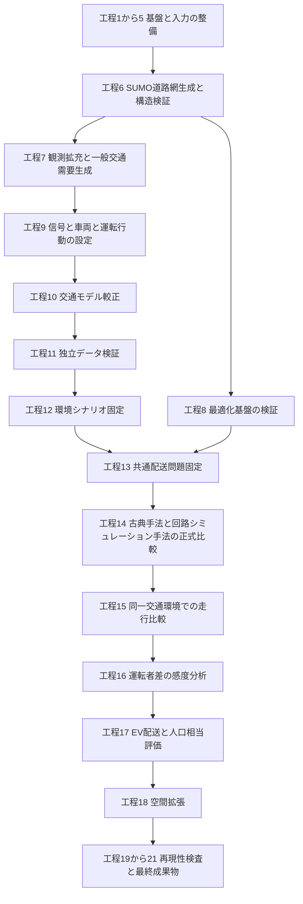
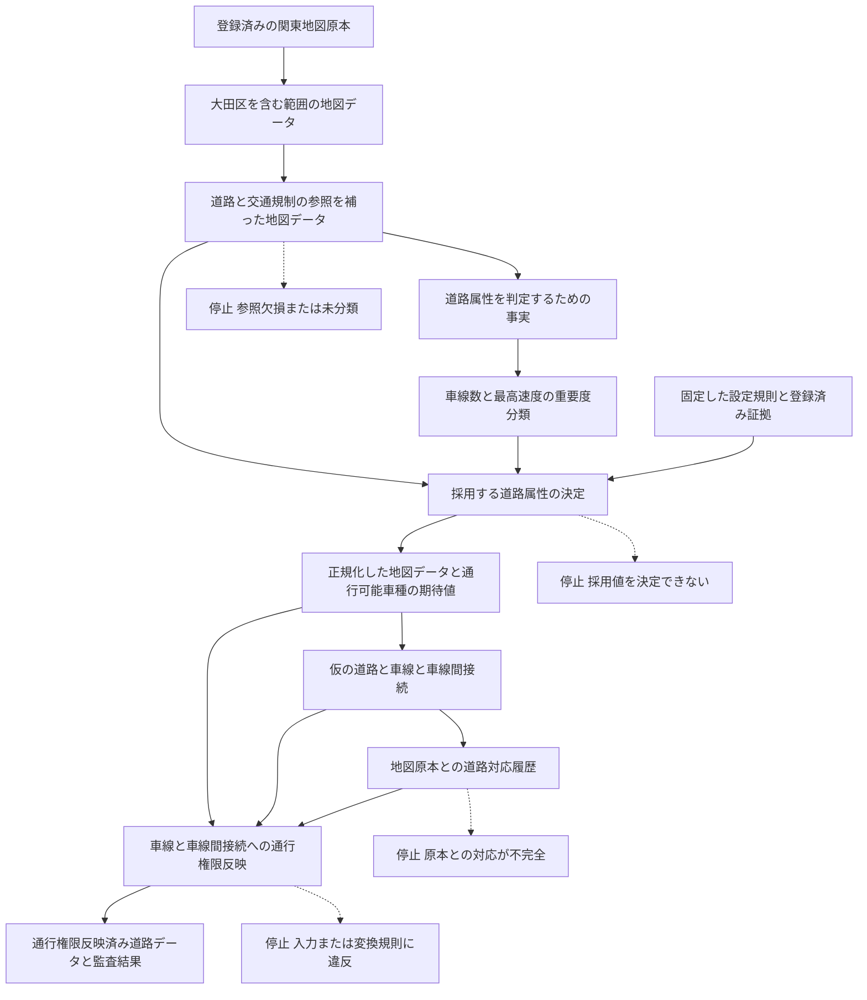

# 東京交通・EV配送研究の全工程と大田区道路網の通行権限実装手順

> **文書状態**: 現行実装手順書  
> **作成日**: 2026-07-30  
> **研究全体**: 工程1から21の目的、依存関係、現在地を整理  
> **詳細手順の中心**: 工程6「SUMO道路網生成・構造検証」  
> **詳細対象範囲**: 登録済み地図原本の確認から、SUMOの車線と車線間接続へ車種別通行権限を反映する処理の実装・受入まで  
> **基準コミット**: `68b2298`  
> **現在の到達点**: 通行権限反映処理の仕様とデータ形式は固定済み、本体と固定SUMO実行試験は未実装

## 目次

- [1. この文書の目的](#1-この文書の目的)
- [2. 研究全体の工程とこの文書の位置](#2-研究全体の工程とこの文書の位置)
- [3. 用語](#3-用語)
- [4. 完了条件](#4-完了条件)
- [5. 現在地](#5-現在地)
- [6. 全体構造](#6-全体構造)
- [7. 正本と責務](#7-正本と責務)
- [8. 再現実行の共通規則](#8-再現実行の共通規則)
- [9. 基準状態を固定する](#9-基準状態を固定する)
- [10. 地図原本と研究範囲を再現する](#10-地図原本と研究範囲を再現する)
- [11. 次版の関係データ参照補完を実装する](#11-次版の関係データ参照補完を実装する)
- [12. 道路属性を分類・解決する](#12-道路属性を分類解決する)
- [13. 正式用の道路属性解決成果物を生成する](#13-正式用の道路属性解決成果物を生成する)
- [14. 仮道路構造と道路対応履歴を生成する](#14-仮道路構造と道路対応履歴を生成する)
- [15. 通行権限反映処理の試験用固定データを作る](#15-通行権限反映処理の試験用固定データを作る)
- [16. 通行権限反映処理を実装する](#16-通行権限反映処理を実装する)
- [17. 通行権限の変換規則](#17-通行権限の変換規則)
- [18. 失敗・原子性・決定性](#18-失敗原子性決定性)
- [19. テスト構成](#19-テスト構成)
- [20. 固定SUMO実行試験](#20-固定sumo実行試験)
- [21. 新規環境での再現順序](#21-新規環境での再現順序)
- [22. 実行記録](#22-実行記録)
- [23. 完了チェックリスト](#23-完了チェックリスト)
- [24. この文書の後に続く工程](#24-この文書の後に続く工程)

## 1. この文書の目的

この文書は、東京・大田区の登録済み地図原本から、SUMO 1.24.0の道路、車線、
車線間接続へ車種別の通行権限を反映するまでの依存関係、入力、出力、コマンド、
停止条件、検証方法を、一つの再現可能な順序で説明する。

中心となる「通行権限反映処理」は、地図タグの意味を新たに判断する処理ではない。
上流の道路属性解決処理がすでに決定した、地図上の道路、進行方向、車線別の
通行可能車種を、仮生成したSUMO道路、車線、車線間接続へ正確に対応付ける処理である。

再現可能であるとは、少なくとも次を満たす状態をいう。

1. 同じコミット、登録済み入力、設定、固定コンテナから、同じ出力または同じ
   失敗コードが得られる。
2. 地図上の道路からSUMO道路・車線までの由来を、識別子と構成点の順序で説明できる。
3. 車線と車線間接続の通行可能車種を推測せず、固定した集合演算で計算する。
4. 入力不整合時には成功成果物を公開せず、監査結果または失敗報告を残す。
5. 実装コード自身から正解データを作らず、仕様から独立に作成した正解データに
   対して実装を検証する。

## 2. 研究全体の工程とこの文書の位置

本研究は21工程で管理している。機械可読な現在地の正本は
`reproducibility/config/traffic_simulation/research_stage.yml`、閲覧用表示は
リポジトリ直下の`RESEARCH_STATUS.md`である。本書へ記載した状態と正本が異なる場合、
正本を優先し、本書を同じコミットで更新する。

### 2.1 全工程の関係

次の図は研究全体の主要な依存関係を示す。工程8の最適化基盤検証は、正式交通モデルの
完成を待たずに極小合成問題で進められる。一方、正式な手法比較は、工程11の独立
データ検証と工程13の共通配送問題固定が完了するまで実行しない。



この図の矢印は作業開始の絶対的な順番ではなく、正式成果物として利用する際の
依存関係を示す。並行開発できる工程であっても、未承認の上流出力を正式結果へ
使用してはならない。

### 2.2 全21工程

状態は2026-07-30時点である。「完了」は登録済み証拠があること、「進行中」は
正式な受入条件をまだ満たしていないこと、「未着手」は正式成果物をまだ作って
いないことを表す。

| 番号 | 工程 | 目的と主な成果物 | 状態 |
|---:|---|---|---|
| 1 | Docker・リポジトリ環境 | Python処理とSUMO処理を分離し、再現可能な実行環境を固定する | 完了 |
| 2 | データ取得・来歴規約 | 出典、取得日、利用条件、加工処理、SHA-256を記録する | 完了 |
| 3 | N03大田区研究範囲 | 行政界とデータ取得用矩形範囲を固定する | 完了 |
| 4 | JARTIC・地図基礎入力 | 初期交通観測と地図原本を登録し、取得記録を残す | 完了 |
| 5 | 入力道路・観測点確認地図 | 地理範囲、道路、観測点を目視確認できる地図を生成する | 完了 |
| 6 | SUMO道路網生成・構造検証 | 道路、方向、車線、通行権限、接続、信号構造を固定し、正式道路網を監査可能にする | **進行中** |
| 7 | 観測拡充・交通需要生成 | 較正用と独立検証用の観測を分離し、一般交通需要を生成する | 未着手 |
| 8 | 最適化基盤検証・配送EV制約の段階追加 | 極小合成問題で符号化、制約、復号、古典解法、量子近似最適化アルゴリズムを検証する | 未着手 |
| 9 | 信号・車両・運転行動設定 | 信号時間、車両性能、運転行動の根拠と適用範囲を固定する | 未着手 |
| 10 | 交通モデル較正 | 較正用観測に対して需要、容量、経路選択、旅行時間等を調整する | 未着手 |
| 11 | 独立データ検証 | 較正に使っていない日時または地点でモデルの利用可能性を確認する | 未着手 |
| 12 | 天候・事故等の環境シナリオ固定 | 平常時モデルと分離して、追加条件、証拠、比較規則を固定する | 未着手 |
| 13 | 正式コスト行列・共通配送問題固定 | 検証済み交通環境から距離、時間、電力を生成し、全手法共通の問題を固定する | 未着手 |
| 14 | 古典最適化・回路シミュレーション手法の正式比較 | 同じ固定問題、制約、評価器の下で解品質と計算資源を比較する | 未着手 |
| 15 | 同一SUMO環境での走行・比較評価 | 各配送計画を同じ交通環境で実行し、距離、時間、遅延、電力を比較する | 未着手 |
| 16 | 熟練ドライバー差の感度分析 | 運転行動差に対して主要結果がどの程度変化するかを評価する | 未着手 |
| 17 | EV配送・配送需要充足人口相当評価 | 配送達成量を地域・人口単位へ集約し、モデル上の代理指標として報告する | 未着手 |
| 18 | 段階的な空間拡張 | 大田区で成立した方法だけを、検証を繰り返しながら広い地域へ適用する | 未着手 |
| 19 | 継続的検査・再現性検査 | 設定、データ形式、テスト、成果物間の不整合を自動検出する | 未着手 |
| 20 | 別計算環境での再現 | 固定環境と入力から同じ結果または同じ停止結果を再現する | 未着手 |
| 21 | 最終成果物・限界の固定 | 正式成果物、証拠、主張範囲、未検証事項、研究上の限界を確定する | 未着手 |

### 2.3 工程のまとまり

21工程は、研究上の役割により次の四つへ整理できる。

| まとまり | 対象工程 | 役割 |
|---|---:|---|
| 基盤・入力整備 | 1から5 | 実行環境、データ来歴、研究範囲、基礎入力、目視確認を成立させる |
| 交通モデルの作成・検証・妥当性確認 | 6から11 | 正式道路網、一般交通、信号・車両・運転行動を作り、較正と独立検証を行う |
| 配送・最適化の正式評価 | 12から17 | 環境条件と共通配送問題を固定し、解法、走行結果、EV配送、人口相当を評価する |
| 拡張・再現・最終化 | 18から21 | 空間拡張、継続的検査、別環境再現、最終報告を行う |

前半の工程は、後半の結果を生成するための単なる準備ではない。例えば工程6の道路方向
や通行権限が誤っていれば、工程13のコスト行列と工程17の配送可能人口相当も誤る。
そのため、各工程には独立した受入条件と、変更時に下流成果物を無効化する規則を持たせる。

### 2.4 この文書が詳述する範囲

本書が実装手順を詳述するのは工程6である。この工程は、地図をSUMOへ一度変換する
だけの作業ではない。道路属性、通行規制、交差点、車線間接続、信号を固定し、
原本との対応を監査できる正式道路網を作る工程である。

| 境界 | 内容 |
|---|---|
| 開始点 | 登録済みの関東地図原本、大田区取得範囲、固定設定、道路種別対応表が存在する状態 |
| 上流処理 | 関係データの参照補完、道路属性の判定事実生成、重要度分類、採用値の決定 |
| 中心処理 | 仮SUMO道路と地図原本の対応を確定し、車種別通行権限を車線と車線間接続へ反映する |
| この文書の終了点 | 小型固定データを固定SUMO 1.24.0で実行し、反映結果、停止動作、決定性を受理した状態 |
| この後の工程 | 実データ全件処理、信号構造確認、最終道路網生成、生成後監査 |

したがって、この文書の完了は正式SUMO道路網の承認ではない。正式道路網を作る前に
必要な「車種別通行権限を、由来を失わずSUMOへ反映できること」の実装・検証完了を
意味する。工程7以降の詳細なV&Vは
`05_src/traffic_simulation/simulation_model_development_and_vv.md`、個別の較正は
`05_src/traffic_simulation/traffic_calibration_protocol.md`、最適化比較は
`05_src/traffic_simulation/optimization_comparison_protocol.md`を参照する。

## 3. 用語

本文では日本語名を主に使う。括弧内は、既存の仕様書、設定、ファイル名、コードで
使用している識別名である。識別名は実装との照合に必要な場合だけ残す。

| 本文の名称 | 実装上の表記 | 意味 |
|---|---|---|
| 道路交通シミュレーター | SUMO | 道路、車線、信号、車両移動を表現し、交通状態を計算するソフトウェア |
| コンテナ実行環境 | Docker | 使用するソフトウェアと依存関係をまとめ、異なる端末でも同じ環境を再現する仕組み |
| 道路交通情報 | JARTIC | 日本道路交通情報センターが提供する交通量、速度、渋滞等の情報 |
| 国土数値情報の行政区域データ | N03 | 大田区の行政界と研究範囲を決めるために使用する国土交通省データ |
| 構造化データ形式 | XML | SUMOの道路、車線間接続、信号などを要素と属性で記録するテキスト形式 |
| 構造化記録形式 | JSON | 設定、期待値、監査結果などを項目名付きで記録するテキスト形式 |
| ファイル内容の識別値 | SHA-256 | 入力、設定、出力が登録時から変化していないかを確認するための値 |
| 電気自動車 | EV | 電池残量、電力消費、充電条件を持つ配送車両 |
| 量子近似最適化アルゴリズム | QAOA | 配送問題を二次制約なし二値最適化問題へ変換して評価する比較対象手法 |
| 地図原本 | OpenStreetMap、OSM | 道路形状、属性、通行規制を含む本研究の道路網原本 |
| 地図原本ファイル | PBF | 大量の地図データを圧縮保存する形式 |
| 地図上の構成点 | node | 道路形状や交差点を構成する緯度・経度付きの点 |
| 地図上の道路 | way | 順序を持つ構成点と道路属性からなる地図上の線 |
| 地図要素間の関係 | relation | 道路や構成点を参照して右左折規制などを表すデータ |
| 関係データ参照補完 | relation closure | 交通規制が参照する不足要素を登録済み原本から補う処理 |
| 判定事実生成処理 | Predicate Generator | 道路属性の重要度を判定するための事実を生成する処理 |
| 重要度分類処理 | Classifier | 車線数と最高速度の重要度および適用規則を決める処理 |
| 道路属性解決処理 | Resolver | 道路方向、車線数、速度、通行可能車種の採用値または停止理由を決める処理 |
| 仮道路構造生成 | Provisional Build | SUMOの仮道路、車線、車線間接続と地図原本への対応履歴を作る処理 |
| 通行権限反映処理 | Permission Materializer | 決定済み通行可能車種をSUMOの車線と車線間接続へ書き込む処理 |
| SUMO中間XML | SUMO plain XML | 最終道路網を作る前に道路、車線間接続、信号などを別々に保持するXML |
| 道路対応履歴 | edge provenance | SUMO道路がどの地図上の道路と構成点順序から作られたかを記録したもの |
| 試験用固定データ | fixture | 小さな入力、正解、停止結果を固定したテストデータ |
| 正解データ | oracle | 実装出力と比較する、仕様から事前に作成した期待結果 |
| 正式用 | formal | 研究結果に使用できる候補を生成する厳格な実行区分 |
| 構造確認用 | structural | 形状や接続確認だけに使い、研究結果には使わない実行区分 |
| SUMO道路 | edge | SUMO上で車両が一方向に進む道路区間 |
| 車線 | lane | SUMO道路を構成する個別の走行帯 |
| 車線間接続 | connection | ある道路の特定車線から別道路の特定車線へ移れる関係 |
| 管理対象車種 | governed vClass | 本研究が通行可否を明示的に管理するSUMO車種 |
| 実行台帳 | manifest | 入力、設定、環境、コマンド、出力、識別値を一実行単位で記録したもの |
| 失敗コード | Failure Code | 推測で続行せず停止した理由を機械可読に表す番号 |

## 4. 完了条件

「通行権限反映処理を実装した」と判定するには、Pythonファイルが存在する
だけでは不十分である。次をすべて満たす必要がある。

| 項目 | 完了条件 |
|---|---|
| 本体 | 登録済みのコマンド操作窓口から変換を実行できる |
| 入力 | `permission_expectations.json` v2、`edge_provenance.json` v1、仮生成した`.edg.xml`・`.con.xml`を検証する |
| 出力 | `governed_permissions.edg.xml`と`governed_permissions.con.xml`を生成する |
| 監査 | 通行権限反映監査、集計、失敗報告をデータ形式規則に適合させて生成する |
| 変換規則 | PM-REQ-001からPM-REQ-011を実装する |
| 試験用固定データ | PM-TST-001からPM-TST-011を実装コードと独立した正解データで検証する |
| 固定SUMO試験 | 内容識別値で固定したSUMO 1.24.0でXML検査、`netconvert`再入力、SUMO読込みを確認する |
| 決定性 | 同一入力の再実行で同一バイトまたは規定した正規化内容を得る |
| 原子性 | 失敗時に部分的な成功XMLを残さず、既存出力を上書きしない |
| 状態更新 | `sumo_network.yml`と要件追跡表を実測結果に合わせる |

この完了は通行権限反映処理単体の完了であり、正式用`net.xml`の承認ではない。
通行権限反映後に信号構造確認、最終道路網生成、生成後監査が残る。

## 5. 現在地

2026-07-30時点の状態は次のとおりである。

| 対象 | 状態 | 根拠 |
|---|---|---|
| 固定地図原本の取得 | 完了 | Geofabrik関東2026-07-16、SHA-256登録済み |
| 大田区を含む矩形範囲の抽出 | 完了 | `fetch_osm.py`と取得記録 |
| v15関係データ参照補完 | 実行済みだが正式用には不適格 | `restriction:bus` 3件を除外 |
| v16関係データ参照補完 | 受理済み | 通常規制581件、バス規制3件、参照欠損・循環・重複0件 |
| v15道路属性解決の全件試行 | 完了 | 続行阻害項目46,056件、正規化地図データ未公開 |
| 判定事実生成処理 | 実装済み | 合成試験用固定データと異常時停止テストあり |
| v15属性例外の排他的分類 | 実装・全件検証済み | 20規則、独立正解、307行一意一致、未知・重複一致は停止 |
| 重要度分類処理 | 未実装 | 重要度と適用規則だけを決める処理が必要 |
| 次版道路属性解決統合 | 未実装 | 分類結果と解決結果の成果物入力が必要 |
| `build_sumo_network.py prepare` | 実装・実データ実行済み | v16固定出力を再実行して同一SHA-256を確認 |
| 仮SUMO中間XML生成 | 小型確認のみ | 正式用の道路対応履歴と車線間接続の試験用固定データは未完了 |
| `edge_provenance.json`生成 | 未実装 | データ形式規則だけ存在 |
| 通行権限反映処理 | 未実装 | 仕様とデータ形式規則だけ存在 |
| 固定SUMO実行試験 | 未実行 | 要件追跡状態は`specified_not_implemented` |
| Python検証一式 | 合格 | 従来331件と例外分類4件を含む現在335件はいずれも不合格0件 |

したがって、実データへ通行権限反映処理を直ちに実行することはできない。先に、
受理済みv16入力へ重要度分類処理と道路属性解決処理を接続し、仮道路構造の
対応履歴生成を実装する必要がある。一方、小型の通行権限反映用試験データと本体の開発は、
実データ前提工程と並行して進められる。

### 5.1 実装前に追加で固定する事項

通行権限反映処理の集合演算は仕様化されているが、次はまだ機械可読な正本で完全には
固定されていない。試験用固定データ本体を作る前に決定し、設定、仕様、失敗コード、
テストを同じコミットで更新する。

| 未固定事項 | 決める内容 | 推奨方針 |
|---|---|---|
| 実装モジュール・コマンド名 | 実行入口 | `materialize_sumo_permissions.py`を設定へ登録 |
| XML検査境界 | `analysis`環境から固定SUMOのXSDをどう使うか | `sumo`環境で独立事前検査を実行し、XSD識別値と結果を実行台帳へ渡す |
| 終了コード | 成功、規定された失敗、失敗報告の公開失敗 | 道路属性解決処理と同じ`0`、`2`、`3`を候補として規範化 |
| XML属性順 | 決定的なXML出力の属性順 | ルート、道路、車線、車線間接続ごとの順序表を仕様化 |
| 道路対応履歴の生成責任 | SUMO中間XML出力と由来記録の責任モジュール | 仮道路構造生成が同一処理単位で生成 |
| 実行ディレクトリ規則 | 一時領域、最終出力先、既存出力先の扱い | 一意の実行識別子、空ディレクトリ、正式用の上書き禁止 |
| 試験用固定データの識別 | 実行台帳、正解データ、事例命名 | PM-TSTとPM失敗コードを一対一で追跡 |

推奨方針はまだ規範ではない。採用時に`sumo_network.yml`、
`03_permission_materializer_specification.md`、要件追跡表へ
反映して初めて実装契約となる。

## 6. 全体構造



実線は成果物の直接の由来を示す。破線は、その段階で満たせなければ成功成果物を
公開せず停止する検査を示す。通行権限反映済み道路データは、通行可能車種の期待値
だけから作られるのではない。仮道路構造と、地図原本への正確な対応履歴も必要である。

### 6.1 成果物の由来

同じ成果物に複数の由来がある場合、それらをすべて検査してから生成する。

| 作られるもの | 直接の由来 | 適用する定義・規則 | 作る処理 |
|---|---|---|---|
| 大田区を含む範囲の地図データ | 登録済み関東地図原本、大田区行政界から計算した矩形範囲 | 取得日、入力ファイルのSHA-256、道路全体を保持する抽出規則 | 地図データ取得・抽出処理 |
| 道路と交通規制の参照を補った地図データ | 大田区を含む範囲の地図データ、登録済み関東地図原本 | 保持する交通規制の種類、参照先の再帰補完、欠損時の停止規則 | 関係データ参照補完 |
| 道路属性を判定するための事実 | 参照を補った地図データ、判定に使う情報源の登録表 | 事実の導出規則、情報源のSHA-256、同一入力から同一結果を作る規則 | 判定事実生成処理 |
| 車線数と最高速度の重要度分類 | 道路属性を判定するための事実 | 重要度の段階、判定規則の優先順位 | 重要度分類処理 |
| 正規化した地図データ | 参照を補った地図データ、重要度分類、登録済み証拠 | 明示値、外部証拠、モデル値、代替値を採用する順序と停止条件 | 道路属性解決処理 |
| 通行可能車種の期待値 | 地図上の通行規制、方向・車線情報、管理対象車種 | 道路・方向・車線別に通行可能車種を決める規則 | 道路属性解決処理 |
| 仮の道路・車線・車線間接続 | 正規化した地図データ、道路種別対応表、確認済み交差点結合 | 左側通行、道路種別、交差点と車線間接続の仮生成規則 | 仮道路構造生成 |
| 道路対応履歴 | 正規化した地図データ、仮の道路・車線 | 地図上の道路識別子と構成点順序を、仮道路の各方向へ一意に対応させる規則 | 仮道路構造生成 |
| 通行権限反映済み道路データ | 通行可能車種の期待値、仮の道路・車線・車線間接続、道路対応履歴 | 車線位置の対応式、通行可能車種集合の共通部分、空車線・空道路・空接続の処理規則 | 通行権限反映処理 |
| 監査結果 | 上記の全入力、変換中の判断、生成結果 | 入出力件数の一致、停止理由、SHA-256、決定性と原子的公開の規則 | 通行権限反映処理 |

ここで「登録済み証拠」とは、その場で検索して得た情報ではなく、出典、対象範囲、
版、取得日、SHA-256を事前に固定した資料を指す。「固定した設定規則」は
`sumo_network.yml`と各仕様書に記録された規則であり、実行結果を見て都合よく
変更する値ではない。

### 6.2 各処理の責務

各処理の責務境界は次のとおりである。

| 処理 | 決める内容 | 決めてはいけない内容 |
|---|---|---|
| 関係データ参照補完 | 分類対象となる道路集合と、交通規制が参照するデータの完全性 | 車線数、最高速度、通行可能車種 |
| 判定事実生成処理 | 重要度判定に必要な事実 | 重要度、採用する道路属性値 |
| 重要度分類処理 | 重要度と適用した判定規則 | 採用する道路属性値、車線への通行権限反映 |
| 道路属性解決処理 | 地図属性の採用値と通行可能車種の期待値 | SUMO道路方向の推測 |
| 仮道路構造生成 | SUMO道路構造と地図原本への正確な対応履歴 | 地図上の通行規制の再解釈 |
| 通行権限反映処理 | 決定済み通行可能車種を車線と車線間接続へ対応付けること | 地図タグの再解釈、存在しない右左折接続の生成、信号制御の確定 |

## 7. 正本と責務

実装時は、説明文ではなく次の正本を優先する。

| 内容 | 正本 |
|---|---|
| 全設定・状態 | `reproducibility/config/traffic_simulation/sumo_network.yml` |
| 設定のデータ形式 | `reproducibility/config/traffic_simulation/sumo_network.schema.json` |
| 全体責務 | `05_src/traffic_simulation/specifications/01_network_build_architecture.md` |
| 道路属性解決処理 | `05_src/traffic_simulation/specifications/02_resolver_specification.md` |
| 通行権限反映処理 | `05_src/traffic_simulation/specifications/03_permission_materializer_specification.md` |
| 試験用固定データ | `05_src/traffic_simulation/specifications/07_fixture_specification.md` |
| 失敗コード | `05_src/traffic_simulation/specifications/08_failure_taxonomy.md` |
| 要件対応 | `reproducibility/config/traffic_simulation/requirements_traceability.yml` |
| 通行可能車種期待値のデータ形式 | `reproducibility/config/traffic_simulation/schemas/permission_expectations.schema.json` |
| 道路対応履歴のデータ形式 | `reproducibility/config/traffic_simulation/schemas/edge_provenance.schema.json` |
| 監査結果のデータ形式 | `reproducibility/config/traffic_simulation/schemas/permission_materialization_audit.schema.json` |
| 集計結果のデータ形式 | `reproducibility/config/traffic_simulation/schemas/materialization_summary.schema.json` |
| 取得記録 | `03_data/metadata/acquisition/20260717_osm_ota_ward_acquisition.md` |
| v15全件試行記録 | `03_data/metadata/acquisition/20260723_ota_ward_v15_resolver_dry_run.md` |

この文書と正本が矛盾する場合は正本を優先し、この文書を同じコミットで修正する。

## 8. 再現実行の共通規則

すべてのコマンドはリポジトリ直下で実行する。端末固有の絶対パスは成果物へ
保存しない。

### 8.1 実行環境

- Python・osmium処理: `analysis`実行環境
- `netconvert`・SUMO処理: `sumo`実行環境
- SUMOコンテナ画像:
  `ghcr.io/eclipse-sumo/sumo@sha256:a49874e6e5e355de055e6a10eefd819d48fab8f0047c3130f782a7dfdf1cc189`
- 期待するSUMO・netconvert版: `1.24.0`
- 実行基盤: `linux/amd64`

`netconvert`を端末環境から実行してはいけない。`analysis`実行環境へ
`netconvert`を追加することも、環境責務を変えるため禁止する。

### 8.2 毎回記録する内容

```bash
git rev-parse HEAD
git status --short
docker compose config
docker compose images
docker compose run --rm -T analysis python --version
docker compose run --rm -T analysis osmium --version
docker compose run --rm -T sumo netconvert --version
docker compose run --rm -T sumo sumo --version
```

正式実行では、上記表示だけでなく、コンテナ画像の内容識別値、設定・入力・出力の
SHA-256、言語・地域設定、実行基盤、開始・終了UTC、終了コード、実行記録のSHA-256を
実行台帳へ
保存する。

### 8.3 実装済みと未実装の表記

本書のコマンドには次の区別を付ける。

- **実行可能**: 現在のリポジトリにコマンド操作窓口が存在する。
- **実装後に実行**: 将来のコマンド契約例であり、現時点では実行してはいけない。
- **履歴再現用**: v15の事実を再現するが、次版の正式用入力を作らない。

## 9. 基準状態を固定する

### 9.1 コミットと未変更状態の確認

```bash
git fetch --all --tags
git checkout --detach <recorded-commit>
git status --short
git rev-parse HEAD
```

再現対象コミットを明記する。未コミット変更がある状態を正式実行のソース識別として
使用しない。`68b2298`は本書作成時のローカル基準点だが、リモートへ送信されるまでは
新規取得環境から参照できるコミットとはみなさない。

### 9.2 コンテナ準備

```bash
docker compose build analysis
docker compose pull sumo
docker compose run --rm -T sumo netconvert --version
docker compose run --rm -T sumo sumo --version
```

版が`1.24.0`でない場合は停止する。新しいSUMO版へ自動移行しない。

### 9.3 設定とテスト

```bash
docker compose run --rm -T analysis \
  python -m traffic_simulation.network.validate_sumo_network_config

docker compose run --rm -T analysis \
  python -m pytest 05_src/traffic_simulation/validation -q

docker compose run --rm -T analysis \
  python -m traffic_simulation.validation.build_attribute_classification_fixture_collection \
  --check

docker compose run --rm -T analysis \
  python -m traffic_simulation.research_stage --check
```

一つでも失敗した場合は次工程へ進まない。pytest件数だけを証拠にせず、コミット、
実行コマンド、終了コード、実行記録の内容識別値を記録する。

## 10. 地図原本と研究範囲を再現する

### 10.1 登録済み入力

| 成果物 | パス | SHA-256 |
|---|---|---|
| 関東地図原本 | `03_data/raw/traffic_simulation/osm/kanto-260716.osm.pbf` | `aef890f28b652ed7bd2b0d77e86f263219b479fe3eedbdd8610dcfc1572c420d` |
| 大田区を含む矩形範囲の地図原本 | `03_data/processed/traffic_simulation/road_network/osm_extracts/osm_ota_ward_20260716.osm.pbf` | `10d554a13e89b815ca416c272d23d9477d52e312fa3d299f466fb3c01cf9d041` |
| 行政界設定 | `reproducibility/config/traffic_simulation/study_areas.yml` | 実行時に記録 |

### 10.2 取得・抽出

以下は**実行可能**である。

```bash
docker compose run --rm -T analysis \
  python -m traffic_simulation.network.fetch_osm \
  --region ota_ward \
  --snapshot-date 20260716
```

このコマンドは日付を固定したGeofabrik取得先を使い、N03大田区行政界から取得用の
矩形範囲を機械生成し、`complete_ways`規則で抽出する。ブラウザーからの手動出力、
任意の矩形範囲、別日データへの自動切替は使用しない。

### 10.3 検証

```bash
shasum -a 256 \
  03_data/raw/traffic_simulation/osm/kanto-260716.osm.pbf \
  03_data/processed/traffic_simulation/road_network/osm_extracts/osm_ota_ward_20260716.osm.pbf
```

大田区を含む矩形範囲は取得範囲であり、分析対象の行政界そのものではない。
矩形範囲外への参照構成点や境界外接続道路が存在しても、それだけで異常とは判定しない。

## 11. v16の関係データ参照補完

### 11.1 v15をそのまま使えない理由

v15は`type=restriction`だけを保持し、次の`type=restriction:bus`を除外した。

- `16016504`
- `16016506`
- `16026064`

`bus`は管理対象車種であるため、これらを無関係として除外できない。v15の
26,220道路母集団は履歴上の基準値であり、正式用の通行権限反映入力には使わない。

### 11.2 実装した処理

`build_sumo_network.py prepare`は、次を一つの処理単位として実装している。

1. 登録済み原本ファイルと矩形範囲抽出ファイルのSHA-256を検査する。
2. `type=restriction`を保持する。
3. `type=restriction:bus`を管理対象車種へ対応付けて保持する。
4. 未分類だが道路交通へ影響し得る関係データ種別で停止する。
5. 登録済み関東地図原本から参照構成点、道路、関係データを再帰補完する。
6. 循環参照、参照先欠損、重複識別子を検査する。
7. 道路構造を成立させるためだけに保持する要素と、最終分析対象道路の候補を区別する。
8. 参照補完済みPBF、OSM XML、実行台帳を原子的に公開する。

### 11.3 必須実行台帳

実行台帳には次を含める。

- 設定識別子・版・実行識別子
- 情報源登録表の識別子
- 原本・抽出・参照補完の入力と出力のパス・SHA-256
- 正確な実行コマンドと使用ツールの版
- 関係データ種別ごとの保持・除外・停止件数
- 補完した構成点・道路・関係データの識別子
- v15から追加・削除・不変となった識別子
- 参照先欠損と循環参照の検査結果
- 分類対象道路の再集計

### 11.4 受入結果

3件のバス向け右左折規制の保持、参照先欠損ゼロ、決定的な再実行、構造維持要素の
識別、候補母集団の再集計、新しい設定識別子・パス・SHA-256を確認した。
属性解決候補は26,220 way、最終分析対象は13,494 way、構造維持用は555 wayで
ある。正本は
`03_data/metadata/acquisition/20260730_ota_ward_relation_closure_v16.md`
とする。次の停止条件は、判定事実生成・Classifier・Resolverがv16入力hashを
完全被覆していないことである。

## 12. 道路属性を分類・解決する

### 12.1 欠損状況の基準監査

以下は**実行可能**である。

```bash
docker compose run --rm -T analysis \
  python -m traffic_simulation.network.analyze_osm_attributes \
  --config reproducibility/config/traffic_simulation/sumo_network.yml
```

基準監査は欠損状況を数える処理であり、値を採用しない。地図データの暗黙規則、
外部証拠、SUMO通行権限も解釈しない。

### 12.2 判定事実生成処理

判定事実生成処理は**実装済み**である。次版で受理した道路母集団と
情報源登録表を入力する。

```bash
docker compose run --rm -T analysis \
  python -m traffic_simulation.network.generate_attribute_classification_predicates \
  --osm <accepted-relation-closed.osm.xml> \
  --source-registry <predicate-source-registry.json> \
  --policy reproducibility/config/traffic_simulation/sumo_network.yml \
  --output <attribute-classification-predicates.json>
```

山括弧のパスは未実装の次版準備処理が生成するため、現時点では置換せず実行しない。

### 12.3 重要度分類処理

重要度分類処理は未実装である。責務は次に限定する。

- 重要度を表す`criticality_level`
- 採用規則を表す`selected_rule_id`
- 条件に一致した全規則を表す`matched_rule_ids`

重要度分類処理は値を補完せず、`resolution_action`を決めない。車線数はL0-L3、
最高速度はS0-S3を、設定に登録した優先順位で決める。

### 12.4 道路属性解決処理

道路属性解決処理は、分類結果、地図上の明示値、外部証拠、モデル値、
代替値の採用規則から次を決める。

- 採用・停止などの処置を表す`resolution_action`
- 適用した解決規則を表す`resolution_rule_id`
- 値の状態を表す`value_state`
- 採用値を表す`resolved_value`
- 使用する証拠
- 矛盾、確認、停止の状態

独立した人間による試験用固定データの確認は研究責任者判断で省略しているが、
正解データを実装コードから生成しない規則、内容識別値の検査、意味上の整合検査、
異常時停止テストは維持する。研究報告では独立した人間による受入確認を実施して
いないことを開示する。

## 13. 正式用の道路属性解決成果物を生成する

通行権限反映処理は`complete=false`の期待値を受け付けない。したがって、
正式用の道路属性解決実行は次を満たす必要がある。

- 分類・解決結果の組が全対象道路・属性を被覆する。
- `oneway`、方向別車線数、`maxspeed`、通行可能車種が解決済みである。
- 構造確認用代替値を含まない。
- 続行阻害項目がゼロである。
- 正規化した地図データを同じ処理単位で公開する。

道路属性解決コマンド自体は存在するが、次版分類処理を統合する前の実データ実行は
**正式成果物を公開しない全件試行に限る**。

```bash
docker compose run --rm -T analysis \
  python -m traffic_simulation.network.resolve_osm_attributes \
  --profile formal \
  --input-osm <accepted-relation-closed.osm.xml> \
  --output-osm <run-root>/normalized.osm.xml \
  --audit-csv <run-root>/road_attribute_audit.csv \
  --permission-expectations-json <run-root>/permission_expectations.json \
  --imputation-summary-json <run-root>/imputation_summary.json \
  --failure-report-json <run-root>/resolver_failure_report.json \
  --criticality-csv <run-root>/attribute_classification.csv
```

成功時に必要な通行権限反映処理の入力は次の二つである。

1. `normalized.osm.xml`
2. `permission_expectations.json` v2、`profile=formal`、`complete=true`、
   `blockers=[]`

失敗時には正規化した地図データを公開しない。失敗報告だけを見て手作業で
OSM XMLを修正してはならない。決定表、試験用固定データ、実装を更新して全件再実行する。

## 14. 仮道路構造と道路対応履歴を生成する

### 14.1 仮道路構造生成の目的

仮道路構造生成は、通行権限確定前のSUMO道路構造、車線、車線間接続、
信号候補をSUMO中間XMLとして取り出す。これは最終道路網ではない。

固定オプションは次のとおりである。

```text
--plain-output-prefix governed_provisional
--plain-output.lanes true
--output.original-names true
--lefthand true
--osm.lane-access true
```

必要な出力は次である。

- `governed_provisional.nod.xml`
- `governed_provisional.edg.xml`
- `governed_provisional.con.xml`
- `governed_provisional.tll.xml`
- `edge_provenance.json`

### 14.2 未実装部分

現時点では、正式用の`build_sumo_network.py prepare`と道路対応履歴生成処理が
存在しない。小型確認はSUMO中間XMLの出力機能と車線の`origId`出力だけを確認して
おり、車線順序、車線間接続規則、正式用としての適格性を証明しない。

### 14.3 道路対応履歴

変換処理が生成した各SUMO道路について、少なくとも次を記録する。

- `sumo_edge_id`
- `osm_way_id`
- `sumo_type_id`
- SUMO上の始点・終点の構成点識別子
- 元の地図構成点を順序付きで表す`source_osm_node_ids`
- `source_start_index`・`source_end_index`
- `direction`
- `lane_count`
- 確認済み交差点結合を使った場合の由来識別子

方向は次だけで決める。

```text
start_index < end_index  -> forward
start_index > end_index  -> backward
start_index = end_index  -> PM008で停止
```

SUMO道路識別子の符号、座標最近傍、`origId`だけを正式な方向証拠にしてはならない。
`origId`は照合用であり、完全な道路対応履歴の代替ではない。

## 15. 通行権限反映処理の試験用固定データを作る

実装コードを書く前に、独立した正解データを持つ試験用固定データ一式を作る。
一つの巨大ファイルにせず、PM-TSTごとに検証目的を分ける。

### 15.1 必須道路構造

- 左側通行の一方向2車線道路
- 順方向と逆方向で車線別通行可能車種が異なる双方向道路
- 一つの地図上の道路が複数のSUMO道路へ分割される例
- 確認済み交差点結合を持つ道路
- 複数車種、一車種、空集合になる車線間接続
- 一部車線だけ通行可能車種が空になる道路
- 全車線の通行可能車種が空になる一方向道路
- `prohibition`または`delete`
- 仮信号情報を持つ信号交差点

### 15.2 試験用固定データの入力

- 正規化した試験用地図データ
- 完全な正式用`permission_expectations.json`
- 仮生成した`.nod.xml`・`.edg.xml`・`.con.xml`・`.tll.xml`
- `edge_provenance.json`
- 通行権限の正解データである`.edg.xml`・`.con.xml`
- 監査・集計の正解データまたは期待する失敗コード
- 実行台帳と全SHA-256

正解データを通行権限反映処理の出力からコピーして作ってはならない。仕様の集合演算を
試験用固定データの作成手順で計算し、実装コードと分離する。

## 16. 通行権限反映処理を実装する

### 16.1 推奨するコード境界

実装パスはまだ設定正本へ登録されていない。実装前にパスとコマンド名を
`sumo_network.yml`へ登録する。推奨構成は次である。

```text
05_src/traffic_simulation/network/
  materialize_sumo_permissions.py

05_src/traffic_simulation/validation/
  test_materialize_sumo_permissions.py
  fixtures/permission_materializer/
```

一つのモジュール内でも、次の処理を分離する。

1. JSON・XML・内容識別値の事前条件検査
2. 通行可能車種表記の正規化
3. SUMO道路方向の正確な対応付け
4. 車線番号の対応付け
5. 車線別通行可能車種の共通部分計算
6. 通行可能車種が空の車線・道路の処理
7. 車線間接続の識別と通行可能車種の処理
8. 監査・集計の生成
9. 決定的なXML出力
10. 原子的な公開と失敗時の一時出力削除

### 16.2 推奨コマンド契約

以下は**実装後に実行するコマンド例**であり、現時点では存在しない。

```bash
docker compose run --rm -T analysis \
  python -m traffic_simulation.network.materialize_sumo_permissions \
  --permission-expectations <run-root>/permission_expectations.json \
  --edge-provenance <run-root>/edge_provenance.json \
  --provisional-edges <run-root>/governed_provisional.edg.xml \
  --provisional-connections <run-root>/governed_provisional.con.xml \
  --output-edges <run-root>/governed_permissions.edg.xml \
  --output-connections <run-root>/governed_permissions.con.xml \
  --audit <run-root>/permission_materialization_audit.json \
  --summary <run-root>/materialization_summary.json \
  --failure-report <run-root>/permission_materialization_failure.json
```

`--overwrite`は正式用コマンドへ設けない。開発用に必要なら明示的な別実行区分とし、
正式な一連処理では新しい実行識別子と空の出力ディレクトリを使う。

## 17. 通行権限の変換規則

### 17.1 事前条件

変換開始前に次をすべて検査する。

- 通行可能車種期待値のデータ形式v2
- `complete=true`
- 続行阻害項目ゼロ
- `profile=formal`
- 道路対応履歴のデータ形式v1
- 仮生成した道路・車線間接続XMLのXSD適合
- 設定識別子と版の一致
- 全入力のSHA-256一致
- 道路種別対応表の方針と管理対象車種全体の一致

不合格ならXML成功出力を一つも作らない。

### 17.2 通行可能車種表記の正規化

管理対象とする車種全体は次の7種類である。

```text
bus coach delivery motorcycle passenger taxi truck
```

SUMO中間XMLの実効的な通行可能車種集合は次のように正規化する。

| 入力 | 仮道路構造上の実効集合 |
|---|---|
| `allow`も`disallow`もない | 管理対象車種全部 |
| `allow="all"` | 管理対象車種全部 |
| `disallow="all"` | 空集合 |
| 明示的な`allow` | 記載された車種 |
| 明示的な`disallow` | 管理対象車種全体から記載車種を引く |

空の車種表記、未知の車種、管理対象外車種、`allow`と`disallow`の同時指定は停止する。

### 17.3 車線位置の対応

道路属性解決処理が記録する車線位置`p`は、進行方向から見て左から右である。
SUMOの車線番号0は右端である。方向別車線数を`n`とすると、順方向・逆方向の
両方で次を使う。

```text
sumo_lane_index = n - 1 - p
```

車線番号は`0..n-1`の連続値で一意でなければならない。期待値の車線数、
道路対応履歴の車線数、SUMO中間道路の`numLanes`、車線要素数が一致しない場合は
停止する。

### 17.4 車線別通行可能車種

最終的な車線別通行可能車種は次の共通部分である。

```text
final_lane_allow
  = resolver_expected_allow
    intersect typemap_baseline
    intersect governed_universe
    intersect effective_provisional_lane_allow
```

非空集合は辞書順の`allow`として書き、`disallow`を除去する。空集合は、
同じ一方向道路に通行可能な車線が残る場合だけ`disallow="all"`として保持する。
全車線が空なら道路全体と、その道路へ接続する候補車線間接続を除去し、
`zero_permission_edge`として監査する。

### 17.5 車線間接続の通行可能車種

候補は仮生成した`.con.xml`に存在する明示的な車線間接続だけである。一意な識別には
次の4項目の組を使う。

```text
(from, to, fromLane, toLane)
```

最終集合は次である。

```text
connection_allow
  = from_lane_allow
    intersect to_lane_allow
    intersect effective_provisional_connection_allow
```

非空なら辞書順の`allow`を設定する。空なら車線間接続を除去して理由を監査する。
仮道路構造に存在しない右左折接続を生成してはならない。

### 17.6 車線間接続以外の要素

- `prohibition`・`delete`: 参照道路が残る場合だけ保存し監査する。
- `crossing`・`walkingArea`: 自動車系通行権限の反映入力では停止する。
- 未知の要素: PM023で停止する。
- 信号情報: 仮生成した`.tll.xml`は証拠として読むだけで、通行権限反映処理の出力にしない。

## 18. 失敗・原子性・決定性

### 18.1 成果物の公開

1. 全入力を検証する。
2. 同一ファイルシステム上の一時ディレクトリへ出力する。
3. XML、JSONデータ形式、成果物間の件数整合を検証する。
4. 全検証合格後だけ最終パスへ名前を変更する。
5. 失敗時は一時XMLを削除し、失敗報告または失敗監査だけを残す。

道路だけ成功し、車線間接続が失敗した状態を公開してはならない。

### 18.2 決定的なXML出力

- UTF-8
- XML宣言あり
- 改行コードはLF
- ファイル末尾の改行あり
- 実行時刻コメントなし
- 保持要素は入力順
- 車線は数値番号の昇順
- 車種は辞書順
- 出力処理で属性順を固定

同一入力から同一出力が得られない場合はPM025で停止する。

### 18.3 失敗コード

| 範囲 | 主な意味 |
|---|---|
| PM001-PM005 | データ形式、設定、内容識別値、XSD、管理対象車種全体の不整合 |
| PM006-PM009 | 道路対応履歴・方向の不整合 |
| PM010-PM013 | 車線番号・車線数・対応付けの不整合 |
| PM014-PM017 | 車種表記・基準通行権限・期待集合の不整合 |
| PM018 | 通行可能車種が空になる道路の処理不整合 |
| PM019-PM023 | 車線間接続の識別・参照・未対応要素 |
| PM024 | 通行権限反映処理が信号制御を決めようとした |
| PM025-PM028 | 決定性、パス、部分出力、監査件数の不整合 |

詳細は`08_failure_taxonomy.md`を正本とする。

## 19. テスト構成

### 19.1 単体・意味整合テスト

| テスト | 検証内容 |
|---|---|
| PM-TST-001 | 期待値、設定、内容識別値、XSDの事前条件 |
| PM-TST-002 | 一道路・分割道路、交差点結合の由来、方向の曖昧さ |
| PM-TST-003 | 順方向・逆方向の車線順、番号欠落、重複、車線数不一致 |
| PM-TST-004 | 通行可能車種表記の全正規化状態 |
| PM-TST-005 | 車線別通行可能車種と道路種別基準の共通部分 |
| PM-TST-006 | 一部空車線と全車線が空の道路 |
| PM-TST-007 | 複数車種・一車種・空集合になる車線間接続 |
| PM-TST-008 | `prohibition`・`delete`の保存と未対応要素 |
| PM-TST-009 | 信号制御との責務分離 |
| PM-TST-010 | 再実行、既存出力、強制失敗、部分出力削除 |
| PM-TST-011 | 監査・集計のデータ形式と全件の件数整合 |

各失敗コードは一つ以上の異常系試験用固定データを持つ。実装がコードを返せる
だけでは、試験用固定データで検証済みとはみなさない。

### 19.2 実装状態の更新

各PM要件は現在
`reproducibility/config/traffic_simulation/requirements_traceability.yml`で
`specified_not_implemented`である。次の順で更新する。

```text
specified_not_implemented
  -> implemented_fixture_pending
  -> fixture_passed
  -> pinned_runtime_passed
```

状態名を新設する場合はデータ形式、検査処理、文書、テストを同じコミットで変更する。

## 20. 固定SUMO実行試験

### 20.1 XSD

内容識別値で固定したSUMOコンテナ内の次を使う。

```text
/usr/share/sumo/data/xsd/edges_file.xsd
/usr/share/sumo/data/xsd/connections_file.xsd
/usr/share/sumo/data/xsd/tllogic_file.xsd
```

端末へコピーした未登録XSDを正式証拠にしない。使用したコンテナ画像の内容識別値と
XSDのSHA-256を実行台帳へ記録する。

### 20.2 実行順序

1. 正規化した試験用地図データから仮SUMO中間XMLを生成する。
2. 道路対応履歴を生成し、データ形式を検査する。
3. 通行権限反映処理を実行する。
4. 通行権限反映済み道路・車線間接続XMLをXSD検査する。
5. 仮構成点、通行権限反映済み道路・車線間接続を`netconvert`へ再入力する。
6. 生成した試験用`net.xml`をSUMOで読み込む。
7. 車線・車線間接続の実効的な通行可能車種を正解データと完全比較する。
8. 同一入力を別ディレクトリで再実行し、決定性を比較する。

### 20.3 合格条件

- `netconvert`の終了コードが0
- SUMO読込み成功
- 対応先のない車線が0件
- 対応先のない車線間接続が0件
- 車線別通行可能車種が正解データと完全一致
- 車線間接続の通行可能車種が正解データと完全一致
- 通行可能車種が空の車線間接続が存在しない
- 説明できない車線間接続が0件
- 未分類警告が0件
- 監査入力件数と処置件数が一致

この試験に合格しても、実データの正式道路網は承認されない。実データについて、
完全な正式用道路属性解決成果物、交差点確認、信号構造確認、最終道路網生成、
生成後監査が必要である。

## 21. 新規環境での再現順序

### 21.1 現在実行できる範囲

```bash
git clone <repository-url>
cd research
git fetch --all --tags
git checkout --detach <recorded-commit>

docker compose build analysis
docker compose pull sumo

docker compose run --rm -T analysis \
  python -m traffic_simulation.network.validate_sumo_network_config

docker compose run --rm -T analysis \
  python -m pytest 05_src/traffic_simulation/validation -q

docker compose run --rm -T analysis \
  python -m traffic_simulation.network.fetch_osm \
  --region ota_ward \
  --snapshot-date 20260716
```

`<repository-url>`は実際のリモート取得先へ置換する。地図原本ファイルがすでに
正しいSHA-256で存在する場合、取得コマンドは検証した上で再利用する。

### 21.2 実装完了後に追加する順序

```text
次版の関係データ参照補完
  -> 判定事実生成
  -> 重要度分類
  -> 正式用道路属性解決
  -> 仮SUMO中間XML生成
  -> 正確な道路対応履歴生成
  -> 通行権限反映
  -> XSD検査と試験用道路網の実行確認
```

未実装コマンドの仮引数をシェルスクリプトへ先に固定して「再現済み」と扱っては
ならない。コマンド実装、`--help`、単体テスト、失敗時動作が揃ってから正式手順へ
昇格する。

## 22. 実行記録

各実行は少なくとも次のJSONまたはMarkdown記録を持つ。

| 項目 | 内容 |
|---|---|
| `run_id` | 新規で一意な実行識別子 |
| `git_commit` | 未コミット変更がない状態のコミットSHA |
| `started_at_utc`・`ended_at_utc` | UTC時刻 |
| `analysis_image_digest` | Python処理コンテナの内容識別値 |
| `sumo_image_digest` | 固定SUMOコンテナの内容識別値 |
| `tool_versions` | Python、osmium、SUMO、netconvert |
| `config` | 設定のパス、版、SHA-256 |
| `inputs` | 全入力のパスとSHA-256 |
| `command` | 実行した正確な引数列 |
| `exit_code` | 処理終了コード |
| `stdout_sha256`・`stderr_sha256` | 実行記録の内容識別値 |
| `outputs` | 成功時のパス、データ形式版、SHA-256 |
| `failure_codes` | 失敗時の型付けしたコード |
| `test_result` | テストコマンド、件数、終了コード、実行記録の内容識別値 |

大容量XMLや`net.xml`をGit管理しない場合も、内容識別値で管理する保存場所と、
Git管理する索引を記録する。

## 23. 完了チェックリスト

### 上流処理

- [x] 次版設定識別子がv15と分離されている。
- [x] `restriction:bus` 3件を含む関係データ参照補完が受理済みである。
- [ ] 判定事実生成処理が受理済み道路母集団を完全被覆する。
- [ ] 重要度分類処理・道路属性解決処理が試験用固定データに合格する。
- [ ] 正式用道路属性解決処理が`complete=true`、続行阻害項目0件を生成する。

### 仮道路構造生成

- [ ] 構成点・道路・車線間接続・信号のSUMO中間XMLがSUMO 1.24.0で生成される。
- [ ] 道路対応履歴が生成された全SUMO道路を一意に被覆する。
- [ ] 方向が元の地図構成点の正確な順序番号から決まる。
- [ ] 車線数が期待値・道路対応履歴・SUMO中間XMLで一致する。

### 通行権限反映処理

- [ ] PM-REQ-001からPM-REQ-011が実装済みである。
- [ ] PM001からPM028の異常系試験用固定データがある。
- [ ] 出力XML、監査、集計、失敗報告がデータ形式へ適合する。
- [ ] 空車線・空道路・空車線間接続の規則が試験用固定データと一致する。
- [ ] 信号制御を出力・確定しない。
- [ ] 上書きしない原子的公開が試験済みである。
- [ ] 再実行出力が決定的である。

### 固定SUMO実行試験

- [ ] 内容識別値で固定したSUMO 1.24.0を使用した。
- [ ] 道路・車線間接続のXSD検査が合格した。
- [ ] 試験用道路網の`netconvert`処理とSUMO読込みが成功した。
- [ ] 車線・車線間接続の通行可能車種が正解データと完全一致した。
- [ ] 未分類警告、未対応車線・車線間接続がゼロである。
- [ ] 設定と要件追跡表を実測状態へ更新した。

## 24. この文書の後に続く工程

通行権限反映処理は最終地点ではない。出力後は次の順序で進む。

```text
governed_permissions.edg.xml
governed_permissions.con.xml
  -> 信号構造確認
  -> governed_reviewed.con.xml
  -> governed_reviewed.tll.xml
  -> 最終道路網生成
  -> formal.net.xml
  -> 生成後監査
  -> formal_network_accepted
```

通行権限反映後に車線間接続が変わると信号構造確認は無効になる。正式用`net.xml`は
修正対象ではなく監査対象である。不一致時は通行権限反映処理またはその上流入力を
修正し、最終道路網生成を再実行する。

本研究の配送、古典最適化、QAOA比較へ進めるのは、生成後監査が
`formal_network_accepted=true`を記録した後だけである。
