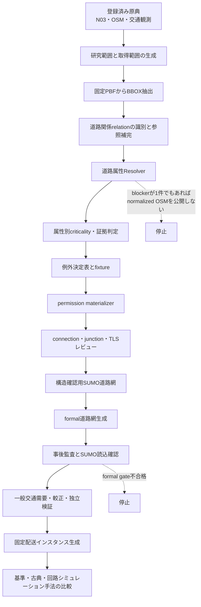

# 交通シミュレーションにおける操作・定義・数値設定の全体像

## 目次

- [1. この文書の役割](#1-この文書の役割)
- [2. 四種類の決定を区別する](#2-四種類の決定を区別する)
- [3. 全体の流れ](#3-全体の流れ)
- [4. 工程ごとの操作・定義・数値](#4-工程ごとの操作定義数値)
- [5. 現在固定されている主要な数値](#5-現在固定されている主要な数値)
- [6. まだ決めていない数値](#6-まだ決めていない数値)
- [7. 定義と数値を決める手順](#7-定義と数値を決める手順)
- [8. 現在の判断状態](#8-現在の判断状態)
- [9. 正本と閲覧用文書の対応](#9-正本と閲覧用文書の対応)
- [10. 次に行うこと](#10-次に行うこと)

## 1. この文書の役割

この文書は、東京・大田区の交通シミュレーションを構築する際に、
何を操作し、何を研究上の規則として定義し、どの数値をどの根拠で
固定するかを一つの流れとして確認するための閲覧用案内である。

この文書自体は設定の正本ではない。機械可読な正本は
`reproducibility/config/traffic_simulation/`以下のYAML・XML・JSON
Schemaであり、コンポーネントの必須条件は
`05_src/traffic_simulation/specifications/`以下にある。この文書と正本が
異なる場合は正本を優先し、この文書を更新する。

## 2. 四種類の決定を区別する

本研究では、次の四種類を混同しない。

| 種類 | 意味 | 例 |
|---|---|---|
| 操作 | 入力を読み、別の成果物を生成・検証する処理 | PBF抽出、relation closure、Resolver、`netconvert`、事後監査 |
| 定義 | 入力の意味、対象範囲、優先順位、停止条件を決める規則 | 自動車系車種、`oneway`解釈、証拠順位、formal gate |
| 数値設定 | 閾値、探索幅、seed、評価期間などを固定する判断 | 最小標本数30、mode share 0.50、junction候補探索幅10 m |
| 観測・導出値 | 原典または機械処理から得られ、研究者が任意に選ばない値 | PBF SHA-256、N03境界、BBOX座標、欠損件数 |

例えば、`10 m`はjunction統合の採否を決める定義ではなく、候補を抽出する
ための数値設定である。`26,220 ways`は採用目標ではなく、固定入力とv15規則
から得られたDry Runの観測値である。

## 3. 全体の流れ

矢印は処理上の依存順序を示す。社会的因果関係や技術効果の波及を示す図では
ない。

## 4. 工程ごとの操作・定義・数値

| 工程 | 主な操作 | 先に決める定義 | 固定・導出する数値 | 主な成果物 | 現在の状態 |
|---|---|---|---|---|---|
| 研究範囲 | N03から大田区を選択し統合する | 分析範囲は行政界、取得範囲は外接BBOX | 行政区域コード、CRS、BBOX座標、面積 | 境界Parquet、品質要約 | 完了 |
| OSM取得 | 日付固定関東PBFを取得しBBOX抽出する | `complete_ways`、任意BBOX禁止、原本不変 | snapshot日、SHA-256、PBF表現許容差 | 原本PBF、抽出PBF、取得記録 | 完了 |
| relation closure | 必要なrelationと参照要素を地域PBFから補う | 対象relation型、support elementと最終道路の区別 | 保持・除外relation数、追加node・way数 | closure ID、PBF、OSM XML、manifest | v16受理済み、Resolverへの接続は未完了 |
| 道路採用 | typemap whitelistで道路型と車種を限定する | 自動車系のみ、moped除外、bus専用道路保持 | 道路型数、対象SUMO vClass | typemap XML | v15固定、runtime fixtureに未解決あり |
| Resolver | `oneway`、lane、speed、accessを解釈する | 証拠優先順位、値状態、停止規則、profile差 | 明示値、導出値、欠損・例外件数 | audit、permission期待値、failure report | 全件Dry Run実行済み、46,056 blocker |
| criticality | way・属性・profile単位で影響レベルを分類する | laneはL0-L3、speedはS0-S3、昇格・失効規則 | 各レベルの件数、証拠有無 | 将来のclassification artifact | 語彙と順序を仕様化、schema・実装未完了 |
| 例外処理 | 例外を決定表へ排他的に割り当てる | 未知・重複一致は停止、分類は値を採用しない | 307属性例外の内訳 | decision table YAML、fixture、独立正解、全件照合結果 | 20規則を実装し、307行の排他的分類に合格。従来331件・現在335件の検証は全件合格。値解決は保留 |
| permission materialization | way・方向・lane期待値をSUMO plain XMLへ移す | lane index、typemapとの積集合、空lane・connection処理 | lane数、connection数、クラス集合 | `.edg.xml`、`.con.xml`、監査 | 仕様のみ、未実装 |
| junction・TLS | 統合候補を抽出し、採否と信号構造をレビューする | 幾何交差と接続を区別、自動統合禁止 | 候補探索幅、link index、phase長 | review CSV、`.nod.xml`、`.tll.xml` | 未実装 |
| 構造道路網 | 構造確認用`netconvert`を実行する | structural用途は接続確認に限定 | node・edge・lane・connection・成分数 | structural `net.xml`、ログ | blockerにより未生成 |
| formal道路網 | 承認済み入力だけで再生成する | formal readiness、禁止オプション、原子的公開 | tool版、digest、全入力hash | formal `net.xml`、manifest | 未承認 |
| 事後監査 | XSD、SUMO load、接続、permission、左側通行を検証する | 合格条件とfailure code | 閾値、警告件数、孤立成分等 | post-build audit | 未実装 |
| 較正・検証 | 需要・信号・交通流を較正し別データで検証する | 較正用と検証用を分離 | seed、warm-up、集計間隔、合格閾値 | 較正結果、独立検証結果 | 数値未決定 |
| 配送比較 | 同一入力で基準・古典・QAOAを比較する | 固定インスタンス、共通評価、計算資源は別軸 | 顧客数、車両数、seed、shots、反復・予算 | 解、走行結果、評価表 | 未実装 |

## 5. 現在固定されている主要な数値

### 5.1 原典または機械処理から得た値

| 数値 | 現在値 | 由来 | 恣意性の管理 |
|---|---:|---|---|
| OSM snapshot | 2026-07-16 | Geofabrik日付固定関東PBF | URL、取得日、SHA-256を記録 |
| 大田区境界の原地物 | 6 | N03属性条件による選択 | コード・都道府県名・自治体名を固定 |
| 大田区境界面積 | 約61.8444 km² | N03境界をEPSG:6677で計算 | 手入力しない |
| BBOX west | 139.652974773 | N03境界の外接矩形 | 丸め・buffer追加をしない |
| BBOX south | 35.528198081 | 同上 | 同上 |
| BBOX east | 139.826027782 | 同上 | 同上 |
| BBOX north | 35.613210171 | 同上 | 同上 |
| v16属性解決候補way | 26,220 | BBOX内候補26,204とclosure追加16 | v15と全way IDが同一でもrelation集合と入力hashは異なる |
| v16最終分析対象way | 13,494 | governed wayとN03大田区境界の交差判定 | BBOX内候補数と区別 |
| v16構造維持用way | 555 | 保持relationのmemberで最終分析対象外 | 配送分析対象と解釈しない |
| closure追加node | 59 | restriction member補完 | IDと出力hashを保存 |
| closure追加way | 16 | restriction member補完 | support elementとして別管理が必要 |
| 保持した`type=restriction` | 581 | v16 `REL-ORDINARY-001` | 通常規制として別集計 |
| 保持した`restriction:bus` | 3 | v16 `REL-BUS-001` | バス規制として別集計 |
| blocker row | 46,056 | Resolver全件Dry Run | 許容値ではなく停止理由 |
| blockerを持つway | 24,346 | distinct way集計 | blocker rowと混同しない |
| bulk missing | 45,749 | `value_state=missing`のstop row | criticality適用前の値 |
| rule/data exception | 307 | 例外状態のstop row | 決定表で全件を排他的分類 |

### 5.2 研究設計として固定した値

| 数値 | 現在値 | 用途 | 注意 |
|---|---:|---|---|
| SUMO対象版 | 1.24.0 | typemap・fixture・formal build | ツール更新時は別の検証単位 |
| OSM PBF header許容差 | `5e-8`度 | osmiumの座標表現差だけを許容 | 取得範囲を広げるbufferではない |
| structural lane mode最小標本数 | 30 ways | 候補placeholderの証拠量 | placeholder値自体は未決定 |
| structural lane mode最小構成比 | 0.50 | unique mode採用条件 | tie・不足時は停止 |
| structural speed mode最小標本数 | 30 ways | 候補placeholderの証拠量 | formal利用は禁止 |
| structural speed mode最小構成比 | 0.50 | unique mode採用条件 | 隣接道路種別へ自動fallbackしない |
| junction候補探索幅 | 10.0 m | 近接nodeのレビュー候補抽出 | 統合の採否基準ではない |

これらは自然定数や東京全体の真値ではない。研究目的に対する設定であり、根拠、
適用範囲、感度分析の要否を設定と仕様へ残す。

## 6. まだ決めていない数値

未決定値をSUMOやライブラリの既定値へ暗黙に委ねてはならない。

| 未決定項目 | 決定前に必要なもの | 決定後の記録 |
|---|---|---|
| 道路種別別のstructural lane値 | criticality classifier、donor集計、標本数・構成比判定 | 分布、採用値、rule ID、感度状態 |
| 道路種別別のstructural speed値 | 対応可能な明示値、法的表現の分類、donor集計 | km/h、分布、証拠hash |
| formal lane・speed補完値 | 公的証拠、照合規則、検証済みモデル | source、reference date、match quality |
| 構造品質gate閾値 | metric定義、baseline、結果を見ない事前登録 | threshold、根拠、登録日時 |
| 較正・独立検証の合格閾値 | 指標、時間集計、較正・検証データ分離 | 指標ごとの合否規則 |
| warm-up・評価時間 | 需要と交通状態の設計 | 秒数、対象時間帯、除外区間 |
| seed集合 | 分散評価設計 | 役割別seedと共通乱数規則 |
| 配送顧客数・車両数 | 計算可能性と実験シナリオ | instance ID、入力hash |
| QAOA shots・reps・反復予算 | 小規模fixture、計算資源比較方針 | algorithm-specific設定と予算 |
| EV・充電数値 | 車両型式、出典日、charger scenario | 容量、消費、出力、待ち条件 |

「未決定」は作業漏れではなく、必要な証拠や評価設計が揃うまで値を採用しない
という状態である。

## 7. 定義と数値を決める手順

定義または数値は、次の順序で採用する。

1. 何のための値か、どのprofileと評価指標へ影響するかを記述する。
2. 観測値、法的値、技術的許容差、研究シナリオ値のどれかを分類する。
3. 適用単位、証拠順位、競合時の停止規則を仕様化する。
4. 機械可読な設定または決定表へrule ID付きで登録する。
5. 正常、停止、競合、境界値を独立fixtureで固定する。
6. 実装し、固定入力の全件Dry Runを行う。
7. 前回から解消、新規、継続、failure code変更、導出方法変更を比較する。
8. 結果を見る前に合格閾値と感度分析を登録する。
9. gateを満たした成果物だけを次工程へ公開する。

実データの一件だけを直接修正し、後から理由を付ける方法は採用しない。

## 8. 現在の判断状態

### 決定済み

- 研究対象はN03大田区行政界であり、BBOXは取得範囲である。
- 初期から一貫して自動車系交通のみを扱い、歩行者・自転車を交通主体として
  生成しない。
- governed vClassは`passenger`、`taxi`、`bus`、`coach`、`delivery`、
  `truck`、`motorcycle`であり、`moped`は除外する。
- 欠損`oneway`は最頻値補完せず、明示値、OSM implicit rule、通常道路規則の
  順に解釈する。
- unsupported、conditional、conflict、invalidを通常のmissingと同じ方法で
  補完しない。
- blockerが一件でも残るResolver runからnormalized OSMを公開しない。
- structural道路網をtravel time、capacity、delivery、QAOA比較へ使用しない。

### 定義済みだが未実装

- laneとspeedの属性別criticality。
- permission materializer、connection、TLS、final build、post-build auditの契約。
- `oneway=-1`を元OSMの意味を保存して逆向きSUMO edgeへ写す方針。
- `type=restriction:bus`を通常規制と分けて保持するv16 closure。

### 実装済みだが値解決は保留

- 307件の属性例外に対する20規則の排他的照合。
- 通常、異常、境界の固定データと、production codeから独立した正解結果。
- 一致なしまたは複数一致を停止する分類器と、全307行の一意一致試験。

### 未決定

- lane・speedの具体的なstructural placeholder値。
- formal道路属性に使う外部証拠の全件照合結果。
- junction統合の採用対象。
- formal networkの定量的品質閾値。
- 較正・検証の時間条件、seed、合格閾値。
- 配送・EV・QAOA正式実験の規模と計算予算。

## 9. 正本と閲覧用文書の対応

| 確認したい内容 | 正本または主要記録 |
|---|---|
| 現在の研究工程 | `reproducibility/config/traffic_simulation/research_stage.yml` |
| 道路網の全設定とreadiness | `reproducibility/config/traffic_simulation/sumo_network.yml` |
| 設定の型と必須項目 | `reproducibility/config/traffic_simulation/sumo_network.schema.json` |
| 現在仕様の短い要約 | `05_src/traffic_simulation/network_current_specification.md` |
| Resolverの必須条件 | `05_src/traffic_simulation/specifications/02_resolver_specification.md` |
| Resolverの必須条件・日本語版 | `05_src/traffic_simulation/specifications/ja/02_resolver_specification_ja.md` |
| criticalityと証拠順位 | `05_src/traffic_simulation/specifications/attribute_criticality_and_evidence_specification.md` |
| criticalityと証拠順位・学習用日本語版 | `05_src/traffic_simulation/learning/attribute_criticality_and_evidence_specification_ja.md` |
| 307件の例外とrelation scope | `reproducibility/config/traffic_simulation/resolver_exception_decision_table.yml` |
| 日本・東京の例外分類規則 | `05_src/traffic_simulation/specifications/japan_tokyo_osm_exception_classification_rules.md` |
| failure code | `05_src/traffic_simulation/specifications/08_failure_taxonomy.md` |
| fixture要件 | `05_src/traffic_simulation/specifications/07_fixture_specification.md` |
| v15全件Dry Runの事実 | `03_data/metadata/acquisition/20260723_ota_ward_v15_resolver_dry_run.md` |
| v16 relation closureの事実 | `03_data/metadata/acquisition/20260730_ota_ward_relation_closure_v16.md` |
| v16 relation closure設定 | `reproducibility/config/traffic_simulation/relation_closure_v16.yml` |
| 実装順序と後続実験 | `05_src/traffic_simulation/implementation_plan.md` |
| 変更履歴と判断理由 | `03_data/metadata/acquisition/20260718_sumo_tokyo_motorized_typemap_design.md` |

## 10. 次に行うこと

1. 実装済みPredicate Generatorを固定fixtureで再検証し、独立human reviewを
   省略した判断を保持したまま、決定的出力と
   fail-closed failureを保存する。
2. predicateから`criticality_level`、`selected_rule_id`、
   `matched_rule_ids`だけを決めるClassifierを実装する。
3. classification、明示OSM値、外部証拠、model、placeholder ruleから
   resolution action、値、evidence、conflict、review・stop状態を決める
   Resolver stageを実装する。
4. 固定fixtureでClassifier・Resolverを検証する。production outputに合わせて
   oracleを書き換えてはならない。
5. 受理済みv16 relation closureをClassifier・Resolverへ接続する。
6. v16母集団からstructural・formalを別artifactとして全件分類・解決し、
   stop recordを保持してsemantic validation後にatomic publishする。
7. 分類済み307件について各規則の値解決条件を実装し、停止を解消して
   permission materializerへ進む。
8. 全件Dry Runを再実行し、v15との差分を自動生成する。

この段階ではformal SUMO道路網、較正済み交通、配送走行、QAOA比較の数値を
生成しない。

criticalityのschemaとsynthetic fixtureは次版closureと並行して開発できる。
ただし、実データ分類の入力母集団は
`02_resolver_specification.md`の
`Relation Closure Before Attribute Classification` gateが通過するまで確定
しない。closure変更後はaudit、permission期待値、imputation分布、例外queue、
criticality coverageをすべて新しい入力hashから再生成する。
