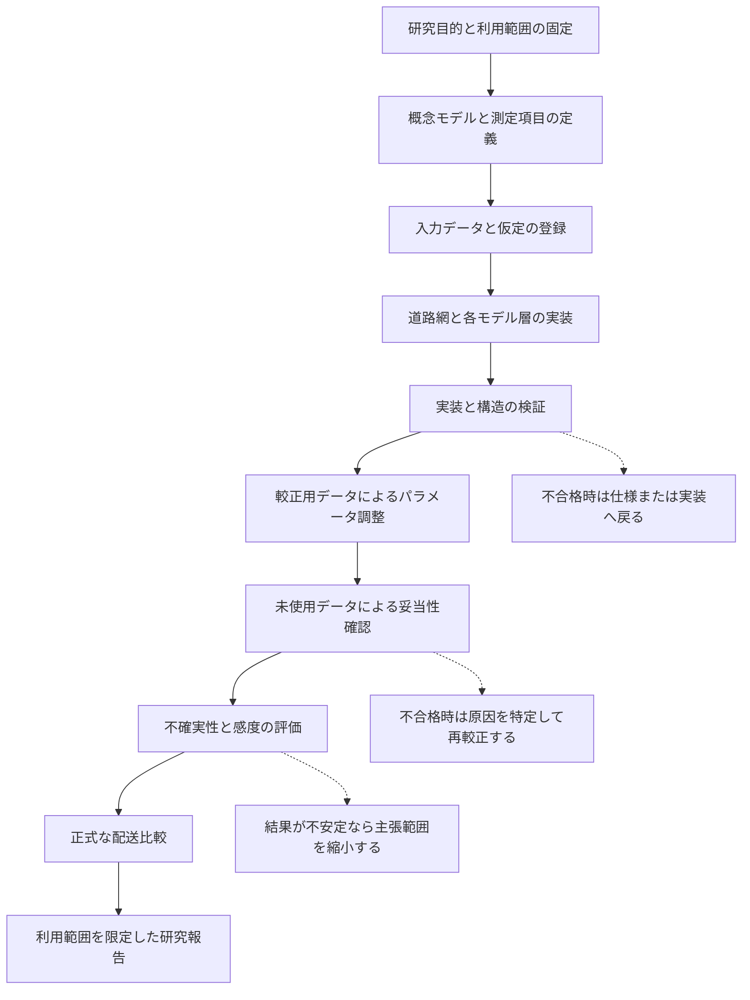

# シミュレーションモデルの作成・検証・妥当性確認

> **文書状態**: 現行方針  
> **作成日**: 2026-07-30  
> **対象**: 東京・大田区を起点とするSUMO交通シミュレーション、EV配送評価、古典手法と回路シミュレーション手法の比較  
> **現在地**: 道路網の作成と構造検証が進行中。交通モデルの較正、独立データによる妥当性確認、正式な配送比較は未実施

## 目次

- [1. この文書の目的](#1-この文書の目的)
- [2. V&Vの意味](#2-vvの意味)
- [3. 評価対象となるモデルの層](#3-評価対象となるモデルの層)
- [4. モデル作成とV&Vの全体像](#4-モデル作成とvvの全体像)
- [5. 研究目的と利用目的の固定](#5-研究目的と利用目的の固定)
- [6. 概念モデルの作成](#6-概念モデルの作成)
- [7. 入力データと仮定の統制](#7-入力データと仮定の統制)
- [8. 実装のVerification](#8-実装のverification)
- [9. 道路網のVerification](#9-道路網のverification)
- [10. 交通モデルの較正](#10-交通モデルの較正)
- [11. 独立データによるValidation](#11-独立データによるvalidation)
- [12. 配送・EV・最適化評価のV&V](#12-配送ev最適化評価のvv)
- [13. 指標と合格基準](#13-指標と合格基準)
- [14. 不確実性と感度分析](#14-不確実性と感度分析)
- [15. 変更時の無効化規則](#15-変更時の無効化規則)
- [16. 証拠と再現性](#16-証拠と再現性)
- [17. 現在のVerification State](#17-現在のverification-state)
- [18. 正式評価へ進む条件](#18-正式評価へ進む条件)
- [19. 本研究で主張できることとできないこと](#19-本研究で主張できることとできないこと)
- [20. 関連文書](#20-関連文書)

## 1. この文書の目的

この文書は、本研究のシミュレーションモデルをどの順序で作成し、何を根拠として
正しく実装されたと判断し、どの範囲で現実の交通・配送を表すモデルとして利用するかを
整理する。対象はSUMOの道路網だけではない。一般交通、信号、車両、運転行動、
EVの電力消費、配送需要、配送計画、評価指標までを、相互に依存する複数のモデル層
として扱う。

本書の役割は、個別仕様を置き換えることではない。個別の変換規則、データ形式、
失敗コード、較正手順は各仕様書と設定ファイルを正本とする。本書は、それらが
シミュレーションモデル全体の作成とV&Vのどこに位置するかを示す上位整理である。

本書では、次の混同を避ける。

- プログラムのテスト合格だけで、現実を十分に表すモデルとは判断しない。
- 観測値へ近づくようにパラメータを調整しただけで、独立した妥当性確認が済んだとは判断しない。
- 一つの道路や一つの時点が一致しただけで、大田区全域または東京全域へ一般化しない。
- シミュレーション内の配送完了を、実際の配送人数や社会厚生と同一視しない。
- Qiskit Aerによる回路シミュレーションを、量子ハードウェア上の性能実証と解釈しない。

## 2. V&Vの意味

本研究では、V&VをVerification and Validationの略称として使用する。ただし、
本文では意味が分かるよう、原則として「実装・構造の検証」と「利用目的に対する
妥当性確認」と書き分ける。

この文書で使用する主な英語表記と略称は次のとおりである。

| 表記 | 日本語での意味 | 本研究で指す内容 |
|---|---|---|
| V&V | 検証と妥当性確認 | 仕様どおりの実装確認と、利用目的に対する現実との比較を組み合わせた評価 |
| Verification | 実装・構造の検証 | 決めた式、規則、データ変換、道路構造が正しく実装されているかの確認 |
| Validation | 利用目的に対する妥当性確認 | モデル出力を未使用の観測や独立した根拠と比較し、定めた用途に使用できるかを判断すること |
| Calibration | 較正 | 較正用観測との誤差を小さくするよう、調整可能なモデル値を定めること |
| SUMO | 道路交通シミュレーター | 道路、車線、信号、車両移動を表現し、配送計画を交通環境内で実行するソフトウェア |
| EV | 電気自動車 | 電池残量、電力消費、充電条件を持つ配送車両 |
| QAOA | 量子近似最適化アルゴリズム | 配送問題をQUBOへ変換し、Qiskit Aer上の回路シミュレーションで評価する手法 |
| Qiskit Aer | 量子回路シミュレーター | 古典計算機上で量子回路を模擬する実行環境。量子ハードウェアではない |
| SHA-256 | ファイル内容の識別値 | 入力、設定、出力が登録時から変わっていないかを確認するための値 |

### 2.1 Verification

Verificationは、決めた仕様どおりにモデル、データ処理、プログラム、道路網が
作られているかを確認することである。問いは次のように表せる。

> 決めたモデルを正しく作ったか。

対象には、計算式、単位、データ形式、道路方向、車線対応、通行権限、車線間接続、
信号リンク、乱数、集計処理、制約判定、復号処理が含まれる。

Verificationに合格しても、現実との一致は保証されない。例えば、最高速度を常に
時速30キロメートルとするプログラムが仕様どおり動いていても、その仕様が東京の
対象道路を適切に表すとは限らない。

### 2.2 Validation

Validationは、作成したモデルが、定めた利用目的に対して必要な精度と振る舞いを
持つかを、現実の観測または独立した根拠と比較して確認することである。問いは
次のように表せる。

> このモデルは、定めた研究目的に使用できる程度に現実を表しているか。

Validationは「現実を完全に再現した」という証明ではない。対象地域、時間帯、
天候、交通状態、車種、評価指標、許容誤差を限定した上で、その用途に対して利用
可能かを判断する。

### 2.3 Calibration

Calibrationは、観測値とモデル出力の差が小さくなるように、需要、容量、経路選択、
信号時間、車両挙動などの調整可能なパラメータを定めることである。日本語では
「較正」と表記する。

較正はValidationではない。同じ観測データを使って値を調整し、その同じデータへの
一致だけを根拠に妥当と判断すると、過適合を検出できない。そのため、較正用データと
独立検証用データを、結果を見る前に日時または地点で分離する。

### 2.4 利用可否判断

VerificationとValidationの結果を用いて、正式な研究評価に使えるかを判断する。
合格はモデル一般に対して与えるのではなく、次の組合せに対して与える。

- 対象地域
- 対象期間と時間帯
- 交通・天候・事故などの条件
- 使用するモデル版と設定版
- 評価対象となる指標
- 許容誤差
- 利用目的

条件が変われば、以前の合格状態をそのまま流用できるとは限らない。

## 3. 評価対象となるモデルの層

本研究のシミュレーションは一つのモデルではなく、次の層から構成される。上流の
誤りは下流の結果へ引き継がれるため、層ごとに検証してから統合する。

| モデル層 | 主な内容 | 主な確認事項 |
|---|---|---|
| 研究目的・概念モデル | 何を比較し、何を対象外とするか | 研究質問、境界、因果と代理指標の区別 |
| 地理・道路網 | 道路形状、方向、車線、通行規制、接続、信号 | 原本との対応、左側通行、接続性、通行可能性 |
| 一般交通需要 | 時間帯別流入、起終点、車種構成、経路選択 | 観測交通量、空間・時間分布、保存則 |
| 信号・車両・運転行動 | 信号現示、加減速、車間時間、車線変更 | 根拠、単位、許容範囲、観測との整合 |
| EV配送 | 車両、積載、電池、充電、配送地点、時間制約 | 状態推移、エネルギー収支、制約充足 |
| 配送計画 | 未最適化基準、古典手法、回路シミュレーション手法 | 同一問題、同一制約、復号、実行可能性 |
| 評価・集計 | 距離、時間、遅延、電力、配送完了量、人口相当 | 定義、集計単位、欠損処理、不確実性 |

道路網が正しくても、需要や信号が妥当でなければ旅行時間は妥当にならない。また、
交通モデルが妥当でも、EVの電力式や配送制約が誤っていれば配送評価には使用できない。
したがって、「SUMOが起動した」ことを、シミュレーション全体のV&V完了とは扱わない。

## 4. モデル作成とV&Vの全体像

次の図は、モデル作成と評価の管理関係を示す。矢印は、後段の判断が前段の成果物を
前提とすることを表す。結果が基準を満たさない場合は、原因が属する上流の定義、
データまたは実装へ戻る。

この流れは、一度だけ直線的に実行する工程ではない。修正により上流成果物の内容や
識別値が変わった場合、影響を受ける下流の較正、妥当性確認、正式評価を無効化して
再実行する。

## 5. 研究目的と利用目的の固定

モデル作成前に、少なくとも次を固定する。

1. 比較対象は、未最適化基準、古典最適化手法、Qiskit Aer上のQAOAである。
2. 各手法には、同じ配送地点、需要、車両、交通条件、距離・時間・電力コスト、
   目的関数、制約、実行可能性判定を与える。
3. 配送問題は、最適化開始後に新しい情報が到着しない固定インスタンスを基本とする。
4. 交通シミュレーションは、配送計画を道路上で実行した場合の運行結果を評価する。
5. 配送可能人口相当は、配送達成範囲を人口単位へ換算したモデル上の代理的概念であり、
   実際の受取人数を示さない。
6. 現時点では、排出量、顧客満足度、社会厚生、地域公平性、配送費用、収益を正式な
   評価対象に含めない。

利用目的を変更した場合、既存のValidation結果を自動的に引き継がない。例えば、
平常時の日次配送を対象として妥当性確認したモデルを、事故発生時の即時再配送や
豪雨時の運転安全性評価へそのまま使用しない。

## 6. 概念モデルの作成

概念モデルは、現実の何を残し、何を単純化し、何を対象外とするかを定義した
シミュレーション実装前のモデルである。少なくとも次を文章と表で固定する。

- 対象地域と境界外道路を保持する理由
- 対象時間帯、準備時間、評価時間
- 道路、交差点、信号、車線間接続の表現
- 一般交通と配送車両の関係
- 配送需要、車両台数、積載、電池、充電の表現
- 時間依存情報として事前に与えるもの
- 最適化開始後には更新しない情報
- 観測値、外部証拠、モデル値、構造確認用代替値の区別
- 最終的な指標へ集約する規則

概念モデルのレビューでは、必要な現象が欠けていないかだけでなく、研究目的に不要な
要素を含めていないかも確認する。不要な自由度は較正時の識別性を低下させ、複数の
誤りが相互に相殺される可能性を高める。

## 7. 入力データと仮定の統制

すべての入力を次の区分で記録する。

| 区分 | 内容 | 例 |
|---|---|---|
| 観測値 | 対象地域・日時において測定された値 | JARTIC交通量・速度 |
| 公式・外部資料 | 法令、仕様、統計、車両資料などから採用する値 | 車両寸法、電池容量 |
| 地図明示値 | OpenStreetMapに明示された属性 | 一方通行、車線数、最高速度 |
| 規則による導出値 | 登録済み入力へ固定規則を適用した値 | 行政界から計算した取得範囲 |
| モデル値 | 現実を単純化して表すために採用した値 | 運転行動分布、充電処理 |
| 構造確認用代替値 | 正式評価には使用しない仮の値 | 非重要道路の仮車線数 |

各値について、出典、取得日、対象期間、対象地域、単位、加工処理、ファイルの
SHA-256、既知の限界を記録する。欠損値を補う場合は、補完可能な条件、使用する証拠、
優先順位、停止条件を事前に固定する。

入力データの形式が正しいことは、モデルのValidationとは別である。例えば、交通量
CSVがSchemaへ適合しても、その観測地点がSUMO道路へ正しく対応していることや、
観測期間が評価対象を代表することは別途確認する必要がある。

## 8. 実装のVerification

実装検証では、モデルの意図がコードへ正しく変換されていることを確認する。

### 8.1 単体検証

- 単位変換と座標変換
- 車線位置とSUMO車線番号の対応
- 方向別通行権限の集合演算
- EVの電力消費と充電量の状態更新
- 積載量、時刻、配送完了の状態更新
- 目的関数、制約違反、ペナルティの計算
- 解の符号化、復号、修復処理
- 指標の集計と人口単位への換算

### 8.2 境界・失敗検証

正常例だけでなく、空集合、最小値、最大値、方向反転、参照欠損、重複、矛盾、
未知の値、単位不一致を与える。処理を継続できない場合は、暗黙の既定値で続行せず、
型付けした失敗コードと対象を記録して停止する。

### 8.3 固定された小型試験データ

小さな入力と期待結果を固定し、実装コードとは独立して正解データを作る。実装出力
から正解データを生成してはならない。固定SUMO 1.24.0環境でXML適合、道路網変換、
SUMO読込みまで確認する。

### 8.4 統合検証

個別処理が合格した後、入力取得、属性解決、道路網生成、信号構造、需要生成、
シミュレーション、結果抽出までを接続する。処理境界ごとにSchema、設定版、
入力SHA-256、出力件数を検査する。

## 9. 道路網のVerification

道路網は、形状が地図らしく見えることだけでは合格しない。少なくとも次を検証する。

| 対象 | 確認内容 |
|---|---|
| 地理範囲 | 大田区行政界、取得用矩形範囲、境界外接続道路の区別 |
| 道路保持 | 対象道路種別の件数と延長、除外理由 |
| 方向 | 一方通行、逆方向指定、左側通行、方向別道路の対応 |
| 車線 | 車線数、方向別配分、車線番号、明示的な車線通行権限 |
| 交差点 | 平面交差、立体交差、結合・非結合、右左折接続 |
| 交通規制 | 一般車、配送車、バス等の通行可否と右左折規制 |
| 信号 | 制御対象接続、信号リンク番号、現示長の整合 |
| 接続性 | 最大走行可能成分、主要道路間、車庫・顧客・充電地点間の往復到達性 |
| 来歴 | 各SUMO道路・車線から元の地図道路と構成点順序を追跡できること |
| 実行 | XML検査、`netconvert`成功、SUMO読込み、未分類警告ゼロ |

構造確認用道路網と正式用道路網を分ける。構造確認用代替値を含む道路網は、可視化、
接続確認、変換処理の開発には使えるが、較正、配送コスト行列、正式比較には使わない。

## 10. 交通モデルの較正

較正は、正式道路網と信号構造が承認された後に実施する。道路網の誤りを、需要量や
運転行動パラメータの調整で吸収してはならない。

較正順序は次のとおりとする。

1. 道路、車線、接続、信号構造を固定する。
2. 観測可能な一般交通需要を調整する。
3. 容量と飽和交通流を調整する。
4. 経路選択を調整する。
5. 旅行時間、速度、待ち行列を調整する。
6. 必要な範囲だけ局所パラメータを調整する。

一度にすべてのパラメータを自由にすると、異なる原因が同じ出力誤差を説明でき、
採用値を識別できなくなる。各パラメータについて、初期値、探索範囲、根拠、
目的指標、固定条件、停止規則を、結果を見る前に登録する。

複数の乱数シードを使用し、平均だけでなく分散または信頼区間を報告する。準備時間、
集計時間、反復回数、観測欠損の除外規則も事前に固定する。

## 11. 独立データによるValidation

較正に使用していない日時または地点を用いて、次を評価する。

- 観測地点別交通量
- 平均速度と速度分布
- 旅行時間
- 時間帯内の変化
- 主要道路別の精度
- 待ち行列または渋滞長
- 流入・流出の保存
- 到達不能車両、テレポート、異常終了
- 乱数シード間の変動

指標の定義、集計単位、重み、合格基準はValidation結果を見る前に固定する。
同一データを較正と独立検証の両方へ使用しない。

独立検証が不合格の場合、道路構造、観測地点対応、需要、信号、経路選択、
パラメータ識別性のどこに原因があるかを分けて確認する。検証データへ合わせて
パラメータを変更した場合、そのデータは以後、独立検証データではなく較正データ
として扱う。新たな未使用データで再度Validationを行う。

## 12. 配送・EV・最適化評価のV&V

### 12.1 配送状態とEV状態

配送シミュレーションでは、各車両について少なくとも位置、時刻、積載量、電池残量、
充電、訪問済み顧客を追跡する。各移動後に保存則と制約を検査する。

- 積載量が負または容量超過にならない。
- 電池残量が負または容量超過にならない。
- 充電量と充電時間の関係が採用モデルと一致する。
- 同一顧客を意図せず重複配送しない。
- 配送完了と未完了の判定が全手法で同一である。
- 到達不能、時間超過、電池切れを成功として数えない。

### 12.2 配送計画手法

未最適化基準、古典手法、QAOAには同じ固定配送インスタンスを与える。解法ごとに
都合のよい制約緩和、経路修復、充電救済、出発時刻変更を行わない。修復を使う場合は、
生の解と修復後の解を両方保存し、全手法へ同じ最終実行可能性判定を適用する。

極小問題では全列挙または厳密解と比較し、目的値、制約、QUBO係数、ビット順序、
復号結果を検証する。交通モデルが未較正の段階で生成したコスト行列は、最適化実装の
検証には使えても、正式な手法比較結果には使わない。

### 12.3 シミュレーション結果と計算結果の分離

道路上で実現した距離、旅行時間、遅延、電力、配送完了量は運用評価である。一方、
目的値、実行可能解率、計算時間、変数量、回路深さ、測定回数は解法と計算資源の
評価である。両者を別の評価系統として報告する。

## 13. 指標と合格基準

指標は、何を測るか、どの単位で集計するか、どの誤差を許容するかを事前に定義する。

| 評価層 | 指標例 | 解釈 |
|---|---|---|
| 道路網構造 | 道路保持率、道路延長保持率、最大接続成分、到達成功率 | 道路構造と移動可能性の完全性 |
| 交通流 | 交通量、速度、旅行時間、待ち行列、GEH、RMSE、MAE、MAPE | 観測交通に対するモデルの一致 |
| シミュレーション健全性 | 到達不能、テレポート、警告、保存則違反 | 結果を歪める実行異常 |
| EV運行 | 電力消費、最低電池残量、充電回数、電池切れ | EV配送の運行可能性 |
| 配送達成 | 配送完了量、未完了量、遅延、走行距離、所要時間 | 所与条件下の配送達成性能 |
| 社会的代理表現 | 配送可能人口相当 | 配送達成範囲を人口単位へ換算したモデル上の値 |
| 解品質 | 目的値、最適値との差、実行可能解率 | 配送計画手法の計算上の性能 |
| 計算資源 | 実行時間、変数量、補助変数量、回路深さ、測定回数 | 解法実行に必要な計算資源 |

数値の合格基準は、結果を見てから決めない。現時点で未決定の基準は
「今後決める値」ではなく、正式評価を停止する未解決事項として記録する。

## 14. 不確実性と感度分析

シミュレーション結果には、入力測定誤差、地図欠損、パラメータ推定誤差、乱数、
モデル単純化が影響する。少なくとも次を分けて評価する。

- 乱数シード間の変動
- 交通需要の変動
- 速度・旅行時間観測の誤差
- 車両性能と電力消費パラメータの範囲
- 充電条件の範囲
- 運転行動パラメータの範囲
- 配送需要分布、顧客数、車両数の変化
- 時間窓の厳しさ
- 道路属性の証拠水準または許容範囲

感度分析は、都合のよい一つの設定を選ぶためではなく、結論がどの仮定に依存するかを
示すために行う。小さな入力変化で手法順位や主要結論が変わる場合、その不安定性を
結果として報告し、一般化範囲を縮小する。

## 15. 変更時の無効化規則

上流成果物を変更した場合、影響を受ける下流証拠を無効化する。

| 変更対象 | 原則として再実行する対象 |
|---|---|
| 地図原本、道路属性、道路種別対応表 | 道路網生成、構造検証、信号確認、較正、独立検証、コスト行列、正式比較 |
| 車線間接続 | 通行権限反映、信号リンク確認、最終道路網、較正以降 |
| 信号構造・時間制御 | 交通較正、独立検証、旅行時間・電力コスト、正式比較 |
| 一般交通需要 | 交通較正、独立検証、正式交通シナリオ、コスト行列 |
| 車両・運転行動 | 影響する交通較正、独立検証、運行結果 |
| EV電力モデル | EV検証、コスト行列、配送実行可能性、正式比較 |
| 配送制約・目的関数 | 全手法の問題生成、実行可能性評価、正式比較 |
| 指標定義 | 集計処理、過去結果の再集計、合格判定 |

生成済み`net.xml`や結果CSVを直接修正して整合させてはならない。正本となる上流入力
または処理を修正し、同じ生成手順を再実行する。

## 16. 証拠と再現性

V&Vの合格は、文章で「確認した」と記載するだけでは成立しない。各実行について
次を保存する。

- Gitコミット識別値と作業ツリーの状態
- 入力、設定、仕様、出力の相対パスとSHA-256
- Python、SUMO、`netconvert`、依存パッケージの版
- コンテナ画像の固定識別値
- 実行した正確なコマンドと引数
- 開始・終了日時、終了コード、標準出力・標準エラー
- 乱数シードとその役割
- 使用した観測データが較正用か独立検証用か
- 指標、集計期間、合格基準
- 合格、不合格、保留、無効化の状態
- 失敗コード、警告分類、既知の限界

静的検査、単体テスト、小型固定データ試験、固定SUMO実行試験、実データ全件処理、
観測比較を区別する。上位の実行証拠を、下位の静的検査だけで代替しない。

## 17. 現在のVerification State

2026-07-30時点の状態は次のとおりである。

| 対象 | 状態 | 現在の意味 |
|---|---|---|
| 実行環境 | 完了 | Docker構成と基礎依存関係を固定済み |
| データ取得・来歴 | 完了 | 基礎入力と取得記録を登録済み |
| 大田区研究範囲 | 完了 | 行政界と取得範囲を区別して固定済み |
| 入力可視化 | 完了 | 道路と観測点の確認用地図を生成可能 |
| SUMO道路網 | 進行中 | v15属性解決Dry Runは完了したが、未解決項目と正式生成工程が残る |
| 道路属性分類 | 一部実装済み | Schema、判定事実生成、固定試験データ、意味検証は存在する |
| 重要度分類と属性解決の統合 | 未完了 | 固定試験データおよび実データに対する正式実行証拠がない |
| バス向け交通規制を含む参照補完 | 未完了 | v15母集団は正式分類へ使用できない |
| 通行権限反映 | 未実装 | 仕様とSchemaはあるが、固定SUMO実行試験がない |
| 信号構造確認 | 未実施 | 最終的な車線間接続が未確定 |
| 正式道路網の生成後監査 | 未実施 | 正式道路網は未承認 |
| 一般交通需要・観測拡充 | 未着手 | 較正と独立検証に必要な観測が不足 |
| 交通モデル較正 | 未着手 | 正式道路網が前提 |
| 独立データValidation | 未着手 | 較正用と分離したデータが必要 |
| 正式配送・QAOA比較 | 実行不可 | 独立検証済みの交通環境と正式コスト行列がない |

現在の主作業は、シミュレーション全体のValidationではなく、道路網モデルの
Verificationである。現段階の可視化や小型試験結果を、東京交通モデルの妥当性を
示す証拠として使用してはならない。

## 18. 正式評価へ進む条件

正式な配送比較へ進むには、少なくとも次を順に満たす。

1. 道路属性、通行権限、交差点、信号を含む正式道路網を生成する。
2. 生成後監査で入力との一致、接続性、SUMO読込み、警告分類に合格する。
3. 一般交通需要、信号時間、車両、運転行動の設定と出典を固定する。
4. 較正用データで交通モデルを較正する。
5. 未使用の日時または地点で独立Validationに合格する。
6. 環境シナリオ、地点間距離・旅行時間・電力コストを固定する。
7. 共通配送問題、目的関数、制約、シード、評価指標を固定する。
8. 未最適化基準、古典手法、QAOAを同じ条件で実行する。
9. 運用結果、解品質、計算資源、不確実性を分けて報告する。

いずれかが不合格または未決定の場合、後段の出力は開発用または探索用と明記し、
正式な研究結果へ含めない。

## 19. 本研究で主張できることとできないこと

V&V完了後も、主張は妥当性確認した条件と指標に限定する。

主張可能な内容は、固定した大田区の道路・交通・配送条件において、各配送計画手法が
シミュレーション上で示した相対的な解品質、運行結果、配送達成性能、および
配送可能人口相当の差である。

次の内容は、本研究のシミュレーション結果だけからは主張しない。

- 東京全域または他都市で同じ性能が得られること
- 実際の配送人数、顧客満足度、社会厚生、経済便益
- 事故、悪天候、突発注文を含む実時間配送性能
- 量子ハードウェア上の高速化または量子優位性
- 現実の交通・人間行動・電力消費を完全に再現したこと

## 20. 関連文書

| 内容 | 文書または設定 |
|---|---|
| 研究シミュレーションの正式利用要件 | `specifications/00_research_simulation_requirements.md` |
| 道路網生成と検証 | `network_build_and_validation_protocol.md` |
| 道路網構成要素の責務 | `specifications/01_network_build_architecture.md` |
| 道路属性の採用規則 | `specifications/02_resolver_specification.md` |
| 通行権限反映規則 | `specifications/03_permission_materializer_specification.md` |
| 信号構造確認 | `specifications/04_tls_review_specification.md` |
| 最終道路網生成 | `specifications/05_final_build_specification.md` |
| 生成後監査 | `specifications/06_post_build_audit_specification.md` |
| 交通モデル較正 | `traffic_calibration_protocol.md` |
| 配送手法の比較条件 | `optimization_comparison_protocol.md` |
| 全体実装計画 | `implementation_plan.md` |
| 機械可読な研究現在地 | `../../reproducibility/config/traffic_simulation/research_stage.yml` |
| 閲覧用研究ダッシュボード | `../../RESEARCH_STATUS.md` |

設定値と実装状態は`sumo_network.yml`および`research_stage.yml`を正本とする。
本書と正本が矛盾する場合は正式実行を停止し、同じコミットで文書または正本を
修正して整合させる。
