# Tokyo Traffic × Quantum Routing Research

This repository builds a public-data-based traffic approximation for Ota Ward, Tokyo, and compares a non-optimizing baseline, classical optimization, and QAOA on Qiskit Aer using the same synthetic electric-vehicle delivery problem.

**References:** [Reference list with direct links](02_literature/references/reference_inventory.md) · [Detailed paper registry](02_literature/references/papers.csv) · [BibTeX bibliography](02_literature/references/references.bib)

> **Primary research question**
>
> Under identical vehicles, capacity, battery, departure time, demand, traffic, weather, and evaluation conditions, how much does route-order optimization change population-equivalent demand fulfillment, and how do classical optimization and Aer-based QAOA differ in outcome and computational resources?

## Research objective

This research builds a reproducible traffic-simulation and route-optimization framework for Ota Ward that:

- constructs a governed road environment from date-pinned OSM data and the official N03 administrative boundary;
- calibrates and independently validates traffic conditions with public observations;
- generates traceable population-based delivery demand and EV delivery scenarios;
- compares a non-optimizing baseline, classical optimization, and Qiskit Aer QAOA under identical conditions; and
- quantifies how route optimization changes population-equivalent demand fulfillment, operational outcomes, solution quality, and computational-resource requirements.

## Study design

1. Fix the Docker environments and data-provenance rules.
2. Derive the Ota Ward boundary from Japan's National Land Numerical Information N03 dataset.
3. Acquire road geometry and connectivity candidates from a date-pinned OpenStreetMap PBF snapshot.
4. Convert the governed OSM input into a SUMO network and validate its structure.
5. Calibrate general traffic with multiple observations, including JARTIC data, and validate it on separate observations.
6. Build synthetic delivery demand from population meshes and public aggregate statistics.
7. Give the same frozen delivery problem to the non-optimizing baseline, a classical solver, and Aer-based QAOA.
8. Convert each visit order into road paths using the same rules and run them in the same SUMO environment.
9. Compare population-equivalent demand fulfillment, driving outcomes, solution quality, runtime, and QAOA resources.
10. Add EV constraints, driver-experience effects, weather, and incidents incrementally so that their effects remain separable.

The classical and QAOA branches must share the same frozen problem instance, road network, vehicle constraints, traffic conditions, route-conversion rules, and simulation seeds. Raw solver output, decoded solutions, repaired solutions, and SUMO outcomes are stored separately.

### Pros and cons of the frozen-instance design

Here, *frozen instance* means that the experimental inputs remain unchanged across the solver branches. It is distinct from a *static delivery formulation*, in which no new information arrives after optimization begins. Freezing an instance is an experimental control; using an offline static formulation defines the initial operational scope.

**Advantages**

- Giving the non-optimizing baseline, classical solver, and QAOA the same instance enables a controlled comparison under common input conditions. It does not by itself guarantee complete fairness because computational budgets, stopping criteria, and hyperparameters may differ.
- Fixing demand, vehicles, constraints, traffic conditions, cost matrices, and seeds makes the experiments easier to reproduce and audit.
- Common inputs allow differences in solution quality and constraint satisfaction to be analyzed primarily in relation to the solution method and formulation.
- A static formulation can still represent time windows, arrival times, known time-dependent travel costs, vehicle loads, and route-level SOC transitions.
- Fixed instances make it easier to validate QUBO conversion, constraint penalties, decoding, and feasibility checks in controlled stages.
- Changing one governed condition at a time helps separate its effect on solution quality, feasibility, and computational scale.
- Different demand distributions and traffic conditions can be represented as separate frozen instances, allowing comparison across multiple scenarios without requiring online simulation updates.

**Scope and limitations**

- The initial formal comparison will not update a plan in response to orders or cancellations received after optimization begins.
- It will not reoptimize in response to subsequently observed congestion, incidents, vehicle failures, or charger-status changes.
- Traffic conditions will be supplied as exogenous costs, so the initial comparison will not model feedback in which delivery-route choices change congestion and the changed congestion then alters the delivery plan.
- Any state represented by an aggregate or precomputed value will not reproduce the corresponding detailed within-route evolution. The implemented formulation must report which states, if any, receive this treatment.
- The evaluation will not include the online cost of regenerating a QUBO, converting it to an Ising model, rebuilding or transpiling a circuit, or retuning QAOA parameters after an information update.
- It will not establish end-to-end real-time performance including repeated measurements, classical-quantum data transfer, decoding, and decision latency.
- Solution quality for an offline frozen instance cannot by itself establish performance in an online delivery operation with sequential information updates.

**External validity**

- Results may depend on the selected demand distribution, study area, traffic conditions, vehicle assumptions, model parameters, and seeds.
- External validity therefore requires evaluation on multiple governed instances that vary demand distributions, customer and vehicle counts, time-window tightness, charging conditions, and traffic scenarios, including held-out instances where applicable.

## Methodology overview

```mermaid
%%{init: {"theme": "dark", "themeVariables": {"background": "#0d1117", "lineColor": "#8b949e", "textColor": "#ffffff"}}}%%
flowchart TD
    D1["1. Open data<br/>N03 · OSM · JARTIC · census · public statistics"]
    D2["2. Provenance control<br/>date · license · version · SHA-256"]
    D3["3. Common research inputs<br/>Ota boundary · governed roads · synthetic demand"]
    D4["4. Validated traffic environment<br/>SUMO network · calibration · independent validation"]
    D5["5. Frozen delivery problem<br/>same demand · vehicles · constraints · seeds"]

    M1["6A. Non-optimizing baseline"]
    M2["6B. Classical optimization"]
    M3["6C. Qiskit Aer QAOA"]

    D6["7. Visit order → common road-path conversion"]
    D7["8. Same SUMO environment"]
    E1["9A. Operational and social-proxy measures<br/>distance · time · energy · completed demand · population-equivalent demand fulfillment"]
    E2["9B. Computational resources<br/>runtime · solution quality · QUBO and circuit indicators"]
    D8["10. Final comparison<br/>population-equivalent demand fulfillment ↔ computational resources"]

    D1 --> D2 --> D3 --> D4 --> D5
    D5 --> M1
    D5 --> M2
    D5 --> M3
    M1 --> D6
    M2 --> D6
    M3 --> D6
    D6 --> D7 --> E1 --> D8
    M1 --> E2
    M2 --> E2
    M3 --> E2
    E2 --> D8

    classDef textOnly fill:none,stroke:none,color:#ffffff;
    class D1,D2,D3,D4,D5,M1,M2,M3,D6,D7,E1,E2,D8 textOnly;
    linkStyle default stroke:#8b949e,stroke-width:2px;
```

The diagram separates the two final lines of evidence. The common SUMO runs measure operational and social effects, while the solver records measure computational effort. Their final relationship is evaluated without treating a simulated QAOA resource indicator as a confirmed physical-hardware requirement or quantum advantage. Delivery constraints and EV constraints are added in controlled stages only after the preceding problem formulation passes feasibility, decoding, and small-instance validation.

### Conceptual correspondence among technical, operational, and population-proxy measures

The following diagram relates technical aspects of the modeled delivery system and operational evaluation concepts to one final population proxy: population-equivalent demand fulfillment. It is not a causal model, a temporal sequence, a software or data-processing flow, a research workflow, or evidence of policy effects or social benefits. Undirected lines identify measurement, decision, and aggregation correspondences; the left-to-right layout only organizes concepts at different analytical levels around a single aggregate proxy.

Operational measurements are not monetized. Population-equivalent demand fulfillment is a model-based conversion of completed synthetic demand into population units under a prespecified demand-conversion rule; it is not the number of people who received a delivery. An increase in this proxy must not be interpreted as an increase in social welfare or economic benefit. Emissions, customer satisfaction, social welfare, regional equity, delivery costs, and revenue are outside the current evaluation scope. Solution quality and computational resources are assessed through a separate evaluation stream.

[Detailed Japanese conceptual framework, terminology review, and interpretation limits](05_src/traffic_simulation/impact_propagation/operational_impact_propagation_ja.md)

```mermaid
flowchart LR
    subgraph premises["Evaluation and interpretation premises for the entire diagram"]
        conditions["Demand · roads and traffic · time · vehicles<br/>Battery · charging · evaluation period · conversion rule"]
    end

    subgraph technical["Technical aspects"]
        planning["Delivery-plan feasibility"]
        driving["Delivery-driving characteristics under<br/>road and traffic conditions"]
        ev["EV-delivery<br/>energy feasibility"]
    end

    subgraph operational["Operational concepts<br/>Not monetized"]
        movement["Delivery travel quantities"]
        energy["EV energy-use quantities"]
        completion["Delivery-demand<br/>completion status"]
        amount["Completed delivery-demand volume"]
    end

    subgraph social["Regional and population-unit concepts"]
        regional_amount["Regional completed<br/>delivery-demand volume"]
        regional_rate["Regional delivery-demand<br/>fulfillment"]
        regional_population["Regional population-equivalent<br/>demand fulfillment"]
        population["Population-equivalent<br/>demand fulfillment<br/>Not actual recipients"]
    end

    driving ---|Distance, time, and delay components are aggregated| movement
    ev ---|Electricity and charging components are aggregated| energy
    planning ---|Plan-stage constraint status is referenced| completion
    driving ---|Arrival, deadline, and return values are referenced| completion
    ev ---|Battery and charging conditions are referenced| completion
    completion ---|Demand volume in the completed state is summed| amount
    amount ---|Separated by each demand's regional assignment| regional_amount
    regional_amount ---|Compared with assigned regional demand| regional_rate
    regional_amount ---|Converted with per-person demand| regional_population
    regional_population ---|Summed across nonoverlapping regions| population

    conditions ~~~ planning
```



The invisible link between the premise box and the technical layer is used only for diagram layout. The premises apply to the entire framework and are not depicted as causes. Regional fulfillment is used for regional comparison, but the final population proxy is calculated from regional completed demand, not from the regional fulfillment ratio. Spatial mapping remains supplementary.

| Concept | One-sentence definition | Study operationalization | Observation unit | Measurement unit | Aggregation unit | Decision or calculation rule | Difference from adjacent concepts | Interpretation caution |
|---|---|---|---|---|---|---|---|---|
| Delivery-plan feasibility | The delivery plan satisfies every mandatory planning constraint. | Inspect decoded assignments, visit orders, routes, capacities, continuity, endpoints, returns, and planning-time constraints. | Plan | Binary | Plan, method | Assign one only if every mandatory constraint passes; retain violation counts and per-constraint rates as supplementary values. | It concerns the plan before traffic simulation and differs from objective quality and demand-completion status. | It is not solver termination, simulated drivability, or real-world feasibility. |
| Delivery-driving characteristics under road and traffic conditions | These are the distance, time, and delay characteristics of delivery vehicles under specified network and traffic conditions. | Use SUMO to measure distance, travel time, traffic and signal delay, departure, completion, and return time. | Vehicle, run | km, minutes, timestamp | Vehicle, run, method | Record route-generation, insertion, or simulation failure rather than zero distance or time. | Delivery travel quantities aggregate components of these characteristics; EV energy conditions are separate. | They are not observed real-world records or a general measure of Tokyo traffic. |
| EV-delivery energy feasibility | The delivery run satisfies every mandatory battery-state and charging condition. | Inspect charge state at key events, depletion, permitted charging, and completion within the evaluation time. | Vehicle, run | Binary | Vehicle, run, method | Assign zero if charge falls below the minimum, depletion occurs, charging violates the rules, or the run does not finish in time. | EV energy-use quantities explain use; this concept expresses whether mandatory conditions were satisfied. | It does not validate real-vehicle efficiency, battery degradation, charger availability, or cost. |
| Delivery travel quantities | These are the vehicle movement and vehicle-time quantities associated with delivery operation. | Retain distance, travel time, traffic delay, and signal delay separately. | Vehicle, run | km, minutes | Vehicle, run, method | Sum only like components across vehicles and do not combine distance and time into one value. | It excludes electricity and charging quantities and does not express completion status. | It is not delivery efficiency, monetary cost, or economic value. |
| EV energy-use quantities | These are the electricity and charging-use quantities associated with EV delivery operation. | Retain electricity use, charging events, charging time, and charging waits separately. | Vehicle, charging event, run | kWh, events, minutes | Vehicle, run, method | Count actual charging starts and sum each like component without combining different units. | It expresses use rather than EV energy feasibility. | It is not battery degradation, charging cost, or economic value. |
| Delivery-demand completion status | Each delivery demand satisfies every mandatory completion condition. | Inspect each frozen demand identifier for arrival, deadline, capacity, battery, charging, duplicate, and undelivered status. | Delivery demand | Binary | Demand, vehicle, run, method | Assign one only when every mandatory condition passes; fix whether return is a demand-level or run-level condition before formal experiments. | Completed delivery-demand volume sums demand in the completed state. | Partial compliance and single-run completion are not overall system validity or cross-run stability. |
| Completed delivery-demand volume | This is the parcel-equivalent quantity of demand in the completed state within one run. | Sum each completed frozen demand identifier's assigned parcel-equivalent amount. | Delivery demand | Parcel-equivalent units | Run, method | Count each demand identifier once and exclude incomplete, duplicated, route-failed, and simulation-failed demand. | It is a study-area total before regional disaggregation. | It is not actual parcels, orders, customers, stops, weight, population, or maximum capacity. |
| Regional completed delivery-demand volume | This is completed parcel-equivalent demand assigned to each region. | Assign each demand identifier to one population mesh and sum completed demand within that mesh. | Region, delivery demand | Parcel-equivalent units | Region, run, method | Treat assignment to multiple regions as an error and count each demand identifier once. | It is a quantity, not a ratio or population conversion. | Population mesh is an operationalization of region, not the concept itself. |
| Regional delivery-demand fulfillment | This is the share of assigned regional demand that is completed. | Divide regional completed demand by regional assigned demand. | Region | Ratio | Region, run, method | Use a zero-to-one range, label zero-demand regions as no demand, and treat completed demand above assigned demand as an error. | It is used for regional comparison and is not used to calculate the final population proxy. | It is not observed-order fulfillment, administrative performance, or regional equity. |
| Regional population-equivalent demand fulfillment | This is regional completed demand expressed in population-equivalent units. | Convert regional completed demand with per-person demand over the evaluation period and public regional population. | Region, run | Person-equivalent | Region, run, method | Cap the unrounded converted value at regional population. | It is a population-unit value, unlike regional completed demand and the regional fulfillment ratio. | It is not recipients, beneficiaries, future deliverable population, or service availability. |
| Population-equivalent demand fulfillment | This is the study-area aggregate of regional population-equivalent demand fulfillment. | Sum values across nonoverlapping regions for each run and method. | Run | Person-equivalent | Run, method, study area | Sum unrounded regional values, round only the displayed result under a prespecified rule, and require a value between zero and total public population. | It is the sole final population proxy in this concept system. | It is not recipients, road accessibility, maximum capacity, welfare, or economic benefit. |

Completed demand appears at several levels but has a different analytical unit in each: study-area parcel-equivalent demand, regional parcel-equivalent demand, the regional fulfillment ratio, regional person-equivalent values, and the final study-area person-equivalent aggregate. Population mesh is the study's spatial operationalization, not the general concept. Spatial maps remain supplementary.

Solution quality and computational resources remain a separate method-comparison stream. Delivery-plan feasibility asks whether all mandatory planning constraints were met; solution quality asks how good that feasible plan is under the objective; computational resources describe what was required to obtain it. A better objective value does not necessarily imply shorter realized travel time, more completed demand, or greater population-equivalent demand fulfillment. Circuit-simulation resource indicators are not evidence of physical-hardware requirements or quantum advantage.

## Current status

The current stage, blockers, next actions, and research-use decisions are shown in the generated [`RESEARCH_STATUS.md`](RESEARCH_STATUS.md) dashboard. Its sole machine-readable source of truth is [`research_stage.yml`](reproducibility/config/traffic_simulation/research_stage.yml); the dashboard must not be edited directly.

| Status | Stage |
|---|---|
| Complete | Docker and repository environments |
| Complete | Data acquisition, SHA-256, and provenance rules |
| Complete | N03 Ota Ward study boundary |
| Complete | Baseline JARTIC and date-pinned OSM inputs |
| Complete | Review maps for roads, observations, population, and synthetic demand |
| **In progress** | **SUMO network generation and structural validation** |
| Planned | Observation expansion, general traffic demand, calibration, and independent validation |
| Planned | Formal delivery problem, classical optimization, and Qiskit Aer QAOA |
| Planned | Common-SUMO driving comparison, EV evaluation, and driver-experience sensitivity |

The formal QAOA comparison has not yet been implemented or executed. The current phase governs and validates the road-network inputs required before optimization results can be interpreted.

## Open-data inputs

The study uses public sources for different, explicitly separated roles. A source used for geometry is not automatically treated as evidence for speed, demand, or legal traffic restrictions.

| Open-data snapshot | Provider | Research role | Current treatment |
|---|---|---|---|
| N03 administrative boundaries, 2026 | MLIT National Land Numerical Information | Define the Ota Ward study boundary | Select Ota Ward by municipality code and names, dissolve the six source features, and preserve the resulting geometry without smoothing, simplification, or buffering |
| Kanto OpenStreetMap PBF, dated 2026-07-16 | Geofabrik / OpenStreetMap contributors | Base road geometry, connectivity, and candidate road attributes | Pin the regional PBF by date and SHA-256, then extract the acquisition BBOX mechanically derived from the N03 boundary |
| One-hour road-type-3 traffic observations, 2026-07-04 22:00 JST | JARTIC / MLIT xROAD | Initial traffic observation and processing validation | Preserve source directions and anomaly flags; use observed traffic and speed for calibration or validation, never as an unqualified legal speed limit |
| 2020 census 500 m population mesh, JGD2011 mesh 5339 | Statistics Bureau of Japan / e-Stat | Spatial distribution for synthetic demand | Read the exact official ZIP member, decode the documented fields, intersect it with the N03 boundary, and area-weight boundary meshes |
| Ota Ward population, 2024-04-01 | Ota City open data | Target total for the 2024 population distribution | Rescale the area-weighted 2020 mesh distribution to the published ward total of 736,652 |
| Japan total population, 2024-10-01 | Statistics Bureau of Japan | Denominator for the national parcel-equivalent rate | Read the published total of 123,802,000 using the source unit conversion recorded in configuration |
| FY2024 national parcel-delivery total | MLIT | Numerator for the national parcel-equivalent rate | Use 5,031,470,000 parcels as a national aggregate; do not reinterpret it as observed Ota Ward orders or stops |

The machine-readable registry is [`traffic_simulation_sources.csv`](03_data/metadata/traffic_simulation_sources.csv). It records provider URLs, acquisition dates, source periods and areas, licenses, original filenames, SHA-256 values, processing scripts, derived outputs, and known limitations. Human-readable acquisition records document the actual download and verification operations:

- [JARTIC traffic observation](03_data/metadata/acquisition/20260717_jartic_traffic_volume_acquisition.md)
- [N03 Tokyo administrative boundary](03_data/metadata/acquisition/20260717_mlit_n03_2026_tokyo_acquisition.md)
- [OSM PBF and Ota Ward extraction](03_data/metadata/acquisition/20260717_osm_ota_ward_acquisition.md)
- [Population and parcel statistics](03_data/metadata/acquisition/20260718_ota_baseline_open_statistics_acquisition.md)

Raw source files are stored under `03_data/raw/traffic_simulation/` and excluded from Git. Their recorded hashes, not filenames alone, identify the governed snapshots used by the study.

### Planned and conditional data inputs

The following sources are planned or under consideration but are not part of the current completed input set. Each source must pass license, coverage, reference-date, schema, and SHA-256 checks before it can enter a formal experiment.

| Planned source | Intended use | Admission rule and limitation |
|---|---|---|
| Additional JARTIC 5-minute and one-hour observations | Represent weekdays, weekends, and morning, daytime, evening, and night periods; split calibration and validation observations | Acquire multiple dates before the retention window expires; preserve missing and anomaly states and do not treat partial road coverage as ward-wide observation |
| 2021 Road Traffic Census, Tokyo section and hourly tables | Supplement traffic counts, travel speed, road width, lanes, road class, and candidate legal-speed or direction evidence | Match survey sections to OSM using geometry and road identity, check changes between survey and OSM dates, and never overwrite OSM automatically |
| Metropolitan Police Department traffic-count statistics | Add major-intersection, screenline, prefectural-border, and other static traffic observations | Register the original ZIP and attribution terms; use as an independent public observation rather than as individual vehicle OD |
| JARTIC traffic-regulation information | Candidate evidence for designated speed, one-way rules, closures, vehicle restrictions, direction, and conditional regulations | Confirm content and reuse terms first; distinguish regulation data from live traffic and do not interpret an absent record as proof that no regulation exists |
| N13 road data, road ledgers, and the National Road Facility Inspection Database | Review road class, width category, vertical relationships, bridges, tunnels, and other critical structures | Use as supporting evidence on important roads; do not replace the OSM topology or infer an exact lane count from a width category |
| Scoped aerial imagery | Review ambiguous carriageways, side roads, medians, elevated and surface roads, bridge approaches, and complex junction geometry | Restrict review to critical or ambiguous roads; record capture date and review lineage and never infer legal restrictions, signal timing, or exact lane connections from imagery alone |
| National Freight Flow Survey, P31 logistics hubs, and N12 important logistics roads | Constrain aggregate freight generation, depot candidates, and freight-corridor scenarios | Treat published aggregates and candidate facilities as scenario evidence, not customer-level destinations, operator routes, or observed delivery OD; P31's age must be recorded |
| Population, household, land-use, and public-transport-supply data | Constrain the spatial and temporal distribution of synthetic background traffic | Preserve the distinction between aggregate constraints and generated vehicle trips; do not label the resulting OD as observed OD |
| Open Charge Map and manufacturer EV specifications | Define candidate chargers, vehicle, battery, payload, range, energy, and charging scenarios | Verify API terms and model-specific specification dates; charger existence, power, status, availability, and waiting time are not guaranteed by the candidate record |
| Toei Bus GTFS or GTFS-JP | Optional representation of scheduled bus supply in background traffic | Reacquire and register the original feed before use; schedules do not directly observe road traffic volume or delivery demand |
| Japan Meteorological Agency weather observations | Join rainfall, temperature, wind, snow, or visibility to matching traffic-observation dates | Add only after the normal-weather traffic model passes calibration and independent validation; estimate effects from evidence and keep hypothetical coefficients separate |
| Public incident, construction, lane-restriction, and closure records | Build time-dependent observed disruption scenarios | Record location and start/end time; implement events through SUMO additional files, rerouters, or TraCI rather than rewriting static road geometry |
| Heterogeneous driving-behavior evidence | Test how a mixed population of driving profiles changes traffic friction, energy use, and delivery outcomes | Overseas evidence may define relative source-group and individual differences only; it does not identify the composition or absolute behavior of Tokyo drivers |

Actual carrier customer OD, delivery-vehicle GPS trajectories, depot fleet schedules, charger occupancy, complete curbside loading activity, full-network real-time speed, and intersection-level signal phases are not assumed to be publicly available. If they remain unavailable, the study uses documented synthetic inputs or explicit scenarios and keeps `observed`, `estimated`, and `assumed` values separate. Planned data do not become formal inputs merely by being listed here; accepted snapshots must also be added to the source registry and an acquisition record.

### Planned heterogeneous driving-behavior evidence

No overseas dataset below is currently an accepted formal input. The primary reference is the [Expert Driving Dataset](https://www.nature.com/articles/s41597-026-07223-1), with its [Figshare release](https://springernature.figshare.com/articles/dataset/29664056) and [processing repository](https://github.com/AIR-DISCOVER/ExpertDrivingDataset). It contains instrumented runs by 10 source-labelled expert and 10 source-labelled novice drivers in the same Lincoln MKZ on a fixed 5.7 km urban route under 13 reported conditions. The effective independent sample is 20 drivers, not 260 condition rows. The study will preserve the labels `source_expert` and `source_novice`; they describe groups in the source experiment and do not establish Tokyo driver classes, delivery-driver experience, population shares, gender-general behavior, or vehicle-type effects. Eye-tracking analyses are further limited by the smaller available eye-tracking subset.

The evidence roles are deliberately separated:

| Evidence | Admitted role | Prohibited interpretation |
|---|---|---|
| Expert Driving Dataset CAN, GNSS, condition, and visual-scene records | Primary reference for relative operational differences and within-group heterogeneity; estimate context-adjusted speed, acceleration, braking, stop, harsh-event, and variability outcomes | The Traffic Recorder output is visual traffic exposure, not measured traffic volume; the passenger comfort score is a trip-level pre/post evaluation and is not duplicated across conditions |
| [inD](https://www.ind-dataset.com/) and [INTERACTION](https://interaction-dataset.com/) | Soft plausibility reference for urban intersections, yielding, following, and lane changes | No experience label and no direct transfer of foreign absolute values to Tokyo |
| [highD](https://www.highd-dataset.com/) | Soft distribution-distance reference for highway following and lane-changing behavior | Not a binary acceptance gate and not the primary urban reference |
| [Honda HRI Driving Dataset](https://usa.honda-ri.com/hdd) | Semantic maneuver and event-extraction support | No source experience grouping for estimating an expertise effect |
| [PSAD](https://github.com/Shun-Gan/PSAD-dataset) | Bound incident-perception and response-delay sensitivity scenarios | Responses to accident-video stimuli are not actual on-road braking, steering, or collision-avoidance trajectories |

The integration is governed as follows:

1. Register the exact release, access terms, acquisition date, source files, and SHA-256 before analysis. Raw or restricted records remain outside Git.
2. Keep the canonical condition-level table separate from trip-level evaluations. Store visual traffic exposure under that name, never as traffic volume.
3. Estimate source-group effects with driver random effects and condition covariates. Use driver-cluster bootstrap or hierarchical Bayesian intervals and partial pooling; do not create fixed profiles from accidental differences among 20 people.
4. Separate free-flow-like segments from signal, lead-vehicle, pedestrian, curve, and stop-control effects where the data permit. Express harsh events as normalized rates per time or distance rather than raw counts.
5. Validate timestamps before calculating jerk, resample to a declared regular grid, document missing-data and smoothing rules, and test sensitivity to preprocessing choices.
6. Transfer relative deviations by variable type: log ratios for positive variables, additive or standardized deviations for signed variables, logits for proportions, normalized-rate ratios for counts, and log standard-deviation ratios for variability. A preregistered `lambda` is a transfer-sensitivity parameter, not a data-estimated Tokyo coefficient.
7. Do not assign observed outputs one-to-one to SUMO parameters. Select the car-following model first, generate candidate parameter sets, simulate the source contexts, and estimate parameters by joint multi-output distribution distance. In particular, `sigma` is not a general jerk control, `actionStepLength` is not an observed response frequency, `tau` is not itself reaction time, and ordinary `accel`/`decel` choices must remain distinct from `emergencyDecel`.
8. Avoid double-counting delayed response through both `actionStepLength` and the SUMO Driver State device. Initially represent PSAD-derived incident response through one explicit TraCI delayed-action mechanism and evaluate it only as a bounded sensitivity scenario.
9. Compare a parameter-mean-matched homogeneous control and a low-density output-matched homogeneous control with three experiment families: `M` changes profile composition for total effects, `V` changes variance while holding the mean approximately fixed, and `C` changes mean capability while holding variance approximately fixed.
10. Fix profile-generation, vehicle-assignment, departure, route, incident, and simulation seeds. Use common random numbers across paired scenarios.

For the initial classical-versus-QAOA comparison, the frozen point-to-point cost matrix is exogenous to each optimizer and SUMO supplies the common post-optimization evaluation environment. This phase therefore does not claim congestion-aware optimization. An optimize–simulate–update-cost–reoptimize feedback loop is a separate later experiment.

## Transformation rules

### Boundary and coordinate systems

- Ota Ward is selected from N03 using municipality code `13111` together with the recorded prefecture, municipality, and ward names.
- The six N03 source features are dissolved into one study boundary without manually adjusting the shape to improve later results.
- Source coordinates use JGD2011 (`EPSG:6668`), web/API exchange uses WGS 84 (`EPSG:4326`), and area and distance calculations use Japan Plane Rectangular CS IX (`EPSG:6677`).
- The OSM acquisition BBOX is the minimum rectangle derived from the boundary. It controls data acquisition only; the N03 polygon remains the analysis boundary.
- N03 supplies only the administrative study boundary; it supplies no road geometry, connectivity, lane count, direction, or speed attribute. Those road-network roles begin with OSM and the governed supplementary evidence below.

### Road geometry, attributes, and SUMO conversion

- Date-pinned OSM supplies the base geometry and connectivity. The governed workflow uses a regional PBF, not Overpass.
- The PBF is clipped to the recorded acquisition BBOX, converted to OSM XML with a fixed tool version, and then passed to the digest-pinned SUMO `netconvert` service. Python validation and preprocessing remain in the separate `analysis` service.
- SUMO uses left-hand traffic. Internal junction links are retained, U-turns are limited to dead ends, and isolated edges are reported rather than silently deleted.
- Missing, supplemented, unresolved, and conflicting OSM attributes are reported with their source, derivation, date, and confidence. They are not silently delegated to SUMO or typemap defaults.
- `oneway` is checked in this order: explicit OSM value, OSM implicit rule, public regulation data, and road-census evidence. A general road with no applicable evidence is interpreted as bidirectional under OSM data-consumption rules and labelled as a derived value, not a field-confirmed fact.
- `lanes` is checked using explicit and directional OSM tags, road-census data, road ledgers, limited aerial-image review, and finally a versioned structural placeholder only where permitted.
- `maxspeed` is checked using explicit, directional, and conditional OSM tags followed by public regulation information, road-census evidence, official documents, and dated legal derivation rules. Observed travel speed is not substituted for a legal speed limit.
- External road attributes are not joined by nearest distance alone. Matching considers distance, direction, overlap, road name or number, road class, and vertical layer. Ambiguous elevated roads, surface roads, carriageways, side roads, and complex junctions receive lower confidence and require review when they are critical.
- Structural-review networks may use documented placeholders on noncritical roads for connectivity and visualization checks. Formal experimental networks stop when critical route, calibration, or validation roads contain unresolved attributes, conflicts, low-confidence matches, or unrecorded manual values.
- Junction heuristics may generate candidates, but formal conversion uses a reviewed integration table; automatic junction merging is disabled for the formal network.

The authoritative policy and the current SUMO configuration are [`network_attribute_governance.md`](05_src/traffic_simulation/network_attribute_governance.md) and [`sumo_network.yml`](reproducibility/config/traffic_simulation/sumo_network.yml). The formal SUMO network has not yet been generated, so the rules above distinguish implemented input governance from the next conversion stage.

### Traffic observations

- A JARTIC observation site is expanded into source-defined directional rows only when the source contains those directions; the procedure does not invent an up/down split.
- Loop, ultrasonic, power-outage, and missing-data flags are preserved. Invalid observations remain invalid or missing rather than being imputed silently.
- Calibration observations and independent-validation observations must be separated by location or period before model fitting.

## Governed synthetic demand

The implemented baseline converts public population and parcel statistics into a reproducible one-day, population-proportional demand surface. The operation is fixed by [`baseline_demand.yml`](reproducibility/config/traffic_simulation/baseline_demand.yml) and performed by [`prepare_baseline_demand.py`](05_src/traffic_simulation/demand/prepare_baseline_demand.py).

The processing sequence is:

1. Verify the configured source filenames and SHA-256 values before reading any data.
2. Read only the recorded census ZIP member using its documented CP932 encoding and population field.
3. Reconstruct the official nine-digit JGD2011 500 m mesh geometries for mesh 5339.
4. Intersect the meshes with the unmodified N03 Ota Ward boundary. Fully contained meshes retain their population; boundary meshes receive an area ratio calculated in `EPSG:6677`.
5. Rescale the area-weighted 2020 spatial distribution to the official Ota Ward population on April 1, 2024.
6. Allocate whole people with the largest-remainder method. Equal remainders are resolved by ascending mesh code, making the result deterministic.
7. Derive the national daily parcel-equivalent rate as `5,031,470,000 / 123,802,000 / 365`.
8. Multiply each mesh's allocated population by that rate, then allocate the one-day integer demand with the same largest-remainder and tie-breaking rules.
9. Write a GeoParquet demand surface and a JSON quality summary only after total, geometry, boundary, and lineage checks pass.

The resulting rate is `0.111345933951539499` parcel-equivalents per person per day. The unrounded ward expectation is approximately `82,023.205`; deterministic integer allocation produces 82,023 parcel-equivalents.

| Item | Current generated result |
|---|---:|
| 500 m meshes intersecting Ota Ward | 191 |
| Fully contained meshes | 122 |
| Boundary-intersecting meshes | 69 |
| Area-weighted 2020 population before rescaling | 747,271.088683 |
| Allocated 2024 population | 736,652 |
| Population-normalized parcel rate | 0.111345934 parcel-equivalents/person/day |
| One-day synthetic demand | 82,023 parcel-equivalents |

The operation was validated and run in Docker as follows:

```bash
docker compose build analysis

docker compose run --rm analysis \
  pytest -q \
  05_src/traffic_simulation/validation/test_prepare_baseline_demand.py

docker compose run --rm analysis \
  python -m traffic_simulation.demand.prepare_baseline_demand

docker compose run --rm analysis \
  pytest -q 05_src/traffic_simulation/validation
```

The processor writes:

- `03_data/processed/traffic_simulation/demand/ota_ward_baseline_demand_2024_500m.parquet`
- `03_data/processed/traffic_simulation/validation/ota_ward_baseline_demand_2024_500m_quality_summary.json`

Outputs are write-once by design: the processor refuses to overwrite an existing governed result. Reproduction should use a fresh workspace, or deliberately archive and remove the old generated outputs after confirming their lineage; an overwrite flag is not provided. Generated data remain excluded from Git.

These values are not observed orders, customers, destinations, delivery stops, or household order probabilities. The national total includes multiple parcel-flow types and is used only as a population-normalized aggregate. The mesh result is therefore a governed synthetic baseline for controlled comparison, not a reconstruction of actual Ota Ward deliveries. The equations, boundary treatment, allocation rules, quality checks, and prohibited interpretations are documented in [`baseline_demand_and_comparator.md`](05_src/traffic_simulation/demand/baseline_demand_and_comparator.md).

## Compared methods

| Method | Role | Status |
|---|---|---|
| Non-optimizing baseline | Fixed-order comparator that does not reorder requests by distance or time | Specified; implementation planned |
| Classical optimization | Classical solver applied to the common delivery problem | Planned |
| Qiskit Aer QAOA | Incrementally constrained QUBO evaluated on Aer | Planned |

Delivery and EV constraints will not be introduced all at once. Each constraint stage must pass decoding, feasibility, and small-instance checks before expansion. Qiskit Aer is a simulator; its results will not be presented as evidence of physical quantum-hardware performance.

## Main evaluation

Population-equivalent demand fulfillment is calculated separately for every method and run. For each population mesh, the study first fixes the completed parcel-equivalent demand and the applicable per-person demand over the evaluation period. It divides completed demand by that per-person value to express the result in person-equivalent units, caps the result at the mesh's public population, and sums the unrounded mesh values without duplication. Only the displayed total is rounded under a rule fixed before results are inspected.

The principal conversion divides completed demand by per-person demand; it does not multiply regional population by an integer-demand fulfillment ratio. Those approaches are equivalent only when assigned regional demand equals regional population multiplied by the per-person rate and evaluation period without rounding. The study's integer allocation can break that equality, so the two approaches must not be mixed.

In addition to differences among the baseline, classical, and QAOA results, the study will store driving distance, travel time, delay, completion rate, constraint violations, energy use, charging, solution quality, runtime, QUBO size, and circuit-evaluation counts separately. Population-equivalent demand fulfillment is based on public population and synthetic demand; it is not the number of real people who received a delivery.

## Reproducible environments

Docker Compose separates responsibilities:

- `analysis`: Python 3.11 for input validation, geospatial processing, demand generation, tests, and classical methods.
- `sumo`: digest-pinned Eclipse SUMO 1.24.0 for `netconvert`, `sumo`, and `duarouter`.

Both services use `linux/amd64` as the canonical platform. Apple Silicon systems run it through Docker Desktop's architecture emulation, while AMD64 Linux systems can run it natively.

```bash
git clone <repository-url>
cd research

docker compose config
docker compose build analysis
docker compose run --rm analysis python --version
docker compose run --rm sumo sumo --version
docker compose run --rm analysis pytest -q 05_src/traffic_simulation/validation
```

Raw third-party data and generated derivatives are intentionally excluded from Git. Full regeneration therefore requires acquiring the governed source snapshots described in the acquisition records and verifying their hashes. Source URLs, acquisition dates, licenses, SHA-256 values, processing scripts, and output relationships are recorded in [`traffic_simulation_sources.csv`](03_data/metadata/traffic_simulation_sources.csv).

## Visualization

The interactive Ota Ward population and synthetic-demand map can be generated with:

```bash
docker compose run --rm analysis \
  python -m traffic_simulation.visualization.render_study_area \
  --region ota_ward \
  --baseline-demand \
  --output \
  reproducibility/outputs/traffic_simulation/visualization/ota_ward_baseline_demand.html \
  --overwrite
```

See [`visualization/README.md`](05_src/traffic_simulation/visualization/README.md) for the road, signal, and JARTIC review map, layer interpretation, display choices, and operating instructions. Generated HTML files are runtime artifacts and are not committed to Git.

## Repository guide

For a one-screen view of the intended final layout, artifact flow, Git boundaries, and not-yet-implemented locations, see the [final target repository structure](00_project_management/folder_structure.md#final-target-structure).

| Path | Contents |
|---|---|
| [`00_project_management/`](00_project_management/) | Environment, folder policy, and research management |
| [`01_research_design/`](01_research_design/) | Research design and logical structure |
| [`02_literature/`](02_literature/) | Quantum routing, benchmarking, and literature records |
| [`03_data/metadata/`](03_data/metadata/) | Data provenance, acquisition records, and source registry |
| [`05_src/traffic_simulation/`](05_src/traffic_simulation/) | Traffic environment, demand, calibration, validation, and visualization |
| [`legacy/non_sumo_route_proxy_analysis/`](legacy/non_sumo_route_proxy_analysis/) | Archived non-SUMO synthetic EVRP route-proxy data, code, figures, and reproduction package |
| [`06_outputs/`](06_outputs/) | Reviewed figures, tables, maps, and reports |
| [`07_presentations/current/`](07_presentations/current/) | Current presentation artifacts |
| [`reproducibility/config/`](reproducibility/config/) | Versioned experiment and traffic settings |
| [`reproducibility/outputs/`](reproducibility/outputs/) | Git-ignored, regenerable runtime outputs |
| [`docker/`](docker/) | Isolated Docker environments and operating notes |

## Key documents

- [Traffic-simulation research study guide](00_project_management/traffic_simulation_study_guide.md)
- [Traffic-simulation implementation plan](05_src/traffic_simulation/implementation_plan.md)
- [Road-attribute and external-data matching governance](05_src/traffic_simulation/network_attribute_governance.md)
- [Synthetic-demand and non-optimizing-baseline specification](05_src/traffic_simulation/demand/baseline_demand_and_comparator.md)
- [Traffic-simulation visualization guide](05_src/traffic_simulation/visualization/README.md)
- [Data-acquisition record policy](03_data/metadata/acquisition/README.md)
- [Docker environments and SUMO execution boundary](docker/README.md)
- [Folder structure and retention policy](00_project_management/folder_structure.md)
- [Prior reproducibility-audit notebook](legacy/non_sumo_route_proxy_analysis/reproducibility/quantum_transport_reproducibility_audit_revised.ipynb)

## Data and model governance

- Record acquisition date, version, and SHA-256 for source data, settings, and generated artifacts.
- Distinguish observations, source attributes, estimates, assumptions, and sensitivity-analysis values.
- Do not silently pass missing road attributes to SUMO defaults.
- Separate structural-review networks from formal experimental networks.
- Separate calibration observations from independent-validation observations.
- Use common roads, demand, constraints, traffic conditions, and seed sets for classical and QAOA comparisons.
- Do not commit raw data, generated networks, or runtime results.
- Do not modify boundaries, source inputs, or matching rules to improve downstream results.

The governing principle is traceability: every adopted value should identify its source or derivation, date, version, confidence, and relationship to the generated output. Low-confidence road matching and unresolved critical attributes are not silently accepted into formal experiments.

## Prior research line

The non-SUMO Tokyo synthetic EVRP route-proxy analysis that preceded the traffic-simulation extension is consolidated under [`legacy/non_sumo_route_proxy_analysis/`](legacy/non_sumo_route_proxy_analysis/). It is retained for provenance and historical reproduction and is not a source of formal SUMO results. The current traffic layer does not overwrite it or read its proxy outcomes as traffic observations.

## Limitations

- Public data cannot reconstruct all vehicle OD flows, real delivery trajectories, customer demand, or every signal phase.
- OSM road attributes contain missing and conflicting values that require external matching and manual review on critical roads.
- Population-proportional synthetic demand does not directly represent business deliveries, daytime population, regional e-commerce use, or redelivery.
- Results from Ota Ward must not be generalized directly to all of Tokyo or other regions.
- Qiskit Aer results must not be presented as physical quantum-hardware performance or proof of quantum advantage.
- Driver-experience effects remain a hypothetical sensitivity analysis until sufficient Tokyo-specific evidence is available.

See [`LICENSE`](LICENSE) for repository licensing. Third-party datasets remain subject to their own licenses and terms recorded in the source registry.
