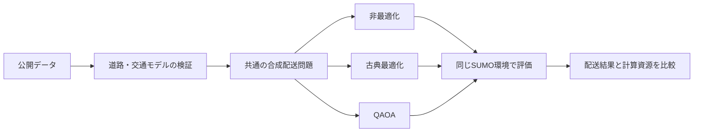

# Tokyo Traffic × Quantum Future Society

東京都大田区を対象に、交通シミュレーションと配送経路最適化を組み合わせ、古典的な最適化手法と量子アルゴリズムを公平に比較する研究

現在は、実験の土台となる道路データを検証している段階です。古典最適化と量子アルゴリズムの比較は行なっていません。

## この研究で明らかにしたいこと

本研究の中心的な問いは、次のとおりです。

> 車両、積載量、バッテリー、出発時刻、配送需要分布、交通状況、天候、運転者の運転特性などを同一条件にそろえたとき、配送順序の最適化によって配送需要の充足率はどの程度変化するか。（また、量子計算環境と交通・配送環境の発展を想定した将来シナリオに応じて、これらの条件を変化させたとき、需要の充足はどのように変化するか。）

ここでいう将来シナリオは、量子計算性能、車両・電池性能、積載条件、充電環境、出発時刻、配送需要の量や空間分布、交通情報・交通状況、気象条件、運転者の運転特性などの、根拠ある段階的な変化です。まずは、オープンデータを利用したシミュレーション結果の比較を目指します。

### ここでいう「配送需要充足率」の定義

経済性を捉えるために、充足率の定義を検討しています。

配送需要充足率は「比較対象として割り当てた合成配送需要のうち、所定の完了条件をすべて満たして配送できた需要の割合」です。

#### `parcel-equivalent`とは

`parcel-equivalent`（宅配便個数相当）は、国土交通省などが公表する全国の年間宅配便取扱個数を、人口と日数で正規化し、合成配送需要として配分するための数量単位です。

一人一日当たりの値は、次の式で求めます。

```text
一人一日当たりparcel-equivalent
  = 全国の年間宅配便取扱個数
    ÷ 日本の総人口
    ÷ 365日
```

現在の基準値は、`5,031,470,000 ÷ 123,802,000 ÷ 365 = 0.111345934 parcel-equivalent/人・日`です。この値を大田区の人口分布へ適用し、比較手法へ共通に与える合成需要量を作ります。

1 parcel-equivalentは、全国集計における宅配便1個分に数値上対応する「荷物量の換算単位」ですが、大田区で実際に観測された荷物1個を表すものではありません。また、1 parcel-equivalentを、1注文、1顧客、1配送先、1回の訪問・停止、特定の重量・容積へ直接変換しません。全国集計には複数の宅配便流動が含まれるため、個人宅向け需要だけを表す単位でもありません。

この単位を使う目的は、実注文データが存在しない状況でも、出典と計算過程を追跡できる共通尺度で、各比較手法に同じ需要量を与えることです。実際の注文や配送停止を再現するための単位ではありません。

配送需要充足率は、parcel-equivalentで表した完了需要量を、同じ単位の割当需要量で割って計算し、0から1の比率または0%から100%の百分率で示します。例えば、割当需要が1,000 parcel-equivalentで、完了需要が800 parcel-equivalentなら、配送需要充足率は0.8、すなわち80%です。

各需要は、到着、期限、積載量、バッテリー、充電、重複配送、未配送など、事前に定めた必須条件をすべて満たした場合だけ完了と判定します。一部の条件だけを満たした需要、経路生成に失敗した需要、シミュレーションに失敗した需要は分子へ含めません。各需要IDは一度だけ数え、完了需要が割当需要を上回る場合は集計エラーとします。

この指標は、公開統計から作った合成配送需要に対する充足率であり、実際の注文充足率、顧客満足度、配送を受けた人数、社会的便益を表すものではありません。また、「人口換算需要充足量」は完了需要を人口単位へ換算する別の指標であり、配送需要充足率そのものではありません。詳しい算出規則と解釈上の制限は、[合成需要仕様](05_src/traffic_simulation/demand/baseline_demand_and_comparator.md)にて記載を進めます。

#### 充足率の分母となる合成配送需要

主な処理は次のとおりです。

1. 2020年国勢調査500 m人口メッシュを大田区境界で切り出す。
2. 境界上のメッシュは、大田区内に含まれる面積の割合で人口を配分する。
3. 空間分布を、2024-04-01の大田区公表人口736,652人へ調整する。
4. 全国宅配便取扱個数と日本総人口から、一人一日当たりのparcel-equivalent率を計算する。
5. 同じ規則でメッシュごとの整数需要を決定する。

## 研究の全体像

研究は、次の順序で進めます。

1. 公開データから大田区の境界、道路、交通観測、人口分布を準備する。
2. データの取得元、取得日、バージョン、SHA-256を記録し、再現可能な入力として固定する。
3. 道路の向き、車線数、通行可否、速度などを検証し、SUMO用の道路網を作る。
4. 公開交通観測を使って交通モデルを調整し、調整に使っていない観測で妥当性を確認する。
5. 人口と宅配便統計から、個人情報を含まない合成配送需要を作る。
6. 同じ配送問題を、非最適化、古典最適化、QAOAへ入力する。
7. 各手法の配送順序を同じSUMO環境で走行させる。




## 検証と妥当性確認

本研究では、VerificationとValidationを区別します。

- **Verification（検証）:** 仕様、Schema、プログラム、データ変換、道路構造が、定めた規則どおりに作られているかを確認します。
- **Validation（妥当性確認）:** 作ったモデルが、研究目的に対して現実の交通を十分に表しているかを、観測データと比較して確認します。

現在行っているPhase 1〜14は、主に道路属性のVerificationです。Phase 14に合格しても、交通モデル全体のValidationが完了したことにはなりません。

詳細は、[シミュレーションモデル開発・V&V資料](05_src/traffic_simulation/simulation_model_development_and_vv.md)を参照してください。

## 現在の進捗

更新日は2026年8月14日です。

道路属性を検証する作業を14段階（Phase 1〜14）に分けています。現在の状況は次のとおりです。

| 範囲 | 何を行う段階か | 現在の状態 |
|---|---|---|
| Phase 1〜11 | 仕様の固定、小規模な正解データによる試験、道路方向・車線・通行可否・速度の解決処理、統合試験 | **合格** |
| Phase 12 | 大田区の対象道路全体を2回独立に処理し、成果物と再現性を検査 | **合格**（2run単体検査、5成果物一致、実行条件比較、最終化、公開が完了） |
| Phase 13 | Phase 12で停止した道路属性を、原因ごとに解消して再実行 | **未着手** |
| Phase 14 | 道路属性成果物を最終的に受け入れられるか判定 | **未着手** |

Phase 12で確認した内容と正式合格の根拠は、README後半の[「Phase 12の実行・検査詳細」](#phase-12の実行検査詳細)に記載します。

## 次に行うこと

1. **未解決項目を原因別に整理する。** 属性、停止コード、根本原因ごとに集計し、重複する下流影響を根本原因単位で把握します。
2. **Phase 13で根本原因を解消する。** 判断記録、Registry、Schema、意味規則、小型fixture、独立oracle、実装、試験の順で更新し、全母集団を再実行します。
3. **未解決項目が0件になった成果物をPhase 14で審査する。** 合格後に初めて正式なSUMO道路網の統合へ進みます。

## 使用する公開データ

現在採用している主なデータは次のとおりです。データごとに用途を限定しており、例えば観測された走行速度を法定速度として使用することはありません。

| データ | 提供元・ダウンロード元 | 本研究での用途 |
|---|---|---|
| 2026年N03行政区域 | [国土交通省 国土数値情報](https://nlftp.mlit.go.jp/ksj/gml/datalist/KsjTmplt-N03-2026.html) | 大田区の研究対象境界 |
| 2026-07-16関東OpenStreetMap PBF | [Geofabrik / OpenStreetMap contributors](https://download.geofabrik.de/asia/japan/kanto-260716.osm.pbf) | 道路形状、接続、道路属性の候補 |
| 2026-07-04 22時のJARTIC 1時間交通観測 | [JARTIC / 国土交通省 xROAD](https://www.jartic-open-traffic.org/) | 初期の交通観測処理の検証 |
| 2020年国勢調査500 m人口メッシュ | [総務省統計局 / e-Stat](https://www.e-stat.go.jp/gis/statmap-search/data?statsId=T001141&code=5339&downloadType=2) | 合成配送需要の空間分布 |
| 2024-04-01大田区人口 | [大田区 / 東京都オープンデータ](https://www.opendata.metro.tokyo.lg.jp/ota/R6/131113_R6_01_ootakunomenseki_jinkou_setaisuu.xlsx) | 人口分布の合計を736,652人へ調整 |
| 2024-10-01日本総人口 | [総務省統計局](https://www.stat.go.jp/data/jinsui/2024np/zuhyou/05k2024-1.xlsx) | 一人当たり宅配便換算率の分母 |
| 令和6年度宅配便等取扱個数 | [国土交通省](https://www.mlit.go.jp/report/press/content/001906814.pdf) | 一人当たり宅配便換算率の分子 |

提供元URL、取得日、対象期間、ライセンス、元ファイル名、SHA-256、処理プログラム、生成先、既知の制限は、[データ台帳](03_data/metadata/traffic_simulation_sources.csv)に記録しています。

第三者データの元ファイルはGitへ登録しません。再現時は各自で取得し、台帳に記録されたSHA-256と一致することを確認する必要があります。

### 今後利用を検討するデータ

次のデータは候補です。

- 曜日・時間帯を増やしたJARTIC観測
- 道路交通センサス、警視庁交通量統計、交通規制情報
- 道路台帳、道路施設データ、必要箇所に限定した航空写真
- 貨物流動、物流拠点、重要物流道路の公開集計
- 充電器情報とEVメーカー仕様
- 気象、事故、工事、車線規制、通行止めの公開記録
- 運転経験や個人差を分析するための運転行動データ


## Experienced Driverデータの扱い

運転経験差の主要な候補は、[Expert Driving Dataset論文](https://www.nature.com/articles/s41597-026-07223-1)、[Figshare公開データ](https://springernature.figshare.com/articles/dataset/29664056)、[処理コード](https://github.com/AIR-DISCOVER/ExpertDrivingDataset)です。

このデータセットでは、同じLincoln MKZと固定5.7 kmの都市ルートを使い、提供元がexpertと分類した10名、noviceと分類した10名を13条件で計測しています。独立した参加者数は20名であり、13条件を掛けた260件を独立標本として扱うことはできません。

本研究では、元データの分類を`source_expert`と`source_novice`として保持を考えています。この分類から、東京の配送ドライバーの構成比、性別一般の運転傾向、配送車両での挙動を直接推定しません。

現段階では正式入力ではなく、後続のHuman Factors分析において、運転速度、加減速、停止、急操作、個人差などの相対的な違いを検討する候補です。


## 比較する手法

QAOA（Quantum Approximate Optimization Algorithm）は、組合せ最適化問題を扱う量子アルゴリズムの一つです。本研究では、実物の量子コンピュータではなく、IBMの量子回路シミュレーターであるQiskit Aerを使用する予定です。そのため、得られる結果も、実機性能や「量子優位性」を直接証明するものではありません。

| 手法 | 内容 | 現在の状態 |
|---|---|---|
| 非最適化ベースライン | 入力された配送順序を距離や時間で並べ替えない比較対象 | 仕様作成済み、実装予定 |
| 古典最適化 | 一般的な古典計算機上のソルバーで配送順序を最適化 | 計画中 |
| Qiskit Aer QAOA | 配送問題をQUBOへ変換し、QAOAをシミュレーター上で評価 | 計画中 |

三つの手法には、同じ需要、車両、制約、交通条件、道路網、乱数seedを与えます。各手法の生出力、制約を満たす形へdecode・repairした結果、SUMO走行結果は分けて保存します。


## 再現方法

Docker Composeで実行環境を分けています。

- `analysis`: Python 3.11を使うデータ検証、地理空間処理、需要生成、試験、古典手法
- `sumo`: digestを固定したEclipse SUMO 1.24.0を使う道路網変換と交通シミュレーション

基準platformは`linux/amd64`です。

```bash
git clone <repository-url>
cd research

docker compose config
docker compose build analysis
docker compose run --rm analysis python --version
docker compose run --rm sumo sumo --version
docker compose run --rm analysis pytest -q 05_src/traffic_simulation/validation
```

元データはGit管理外であるため、完全に再現するには、[取得記録](03_data/metadata/acquisition/README.md)に従って各データを取得し、SHA-256を確認してください。

## 可視化

大田区の人口と合成需要を確認する地図は、次のコマンドで生成できます。

```bash
docker compose run --rm analysis \
  python -m traffic_simulation.visualization.render_study_area \
  --region ota_ward \
  --baseline-demand \
  --output \
  reproducibility/outputs/traffic_simulation/visualization/ota_ward_baseline_demand.html \
  --overwrite
```

道路、信号、JARTIC観測を確認する地図については、[可視化ガイド](05_src/traffic_simulation/visualization/README.md)を参照してください。生成HTMLはGitへ登録しません。

## リポジトリ構成

| ディレクトリ | 内容 |
|---|---|
| [`00_project_management/`](00_project_management/) | 研究管理、環境、フォルダ方針 |
| [`01_research_design/`](01_research_design/) | 研究設計 |
| [`02_literature/`](02_literature/) | 量子経路最適化、評価方法、参考文献 |
| [`03_data/metadata/`](03_data/metadata/) | データ台帳と取得記録 |
| [`05_src/traffic_simulation/`](05_src/traffic_simulation/) | 交通モデル、需要、検証、可視化のコードと仕様 |
| [`06_outputs/`](06_outputs/) | レビュー済みの図、表、地図、報告書 |
| [`reproducibility/config/`](reproducibility/config/) | バージョン管理された設定とSchema |
| [`reproducibility/outputs/`](reproducibility/outputs/) | Git管理外の再生成可能な実行結果 |
| [`docker/`](docker/) | Docker環境と運用方法 |
| [`legacy/non_sumo_route_proxy_analysis/`](legacy/non_sumo_route_proxy_analysis/) | SUMO導入前の旧研究。正式SUMO結果とは区別する |

## 主要資料

- [Phase 1〜14の定義・現在地・証拠・次の作業](05_src/traffic_simulation/v17_phase1_to_phase14_integrated_status.md)
- [Phase 12独立再実行の証拠](reproducibility/config/traffic_simulation/v17_phase12_independent_rerun_20260813.yml)
- [Phase 12全母集団出力契約](05_src/traffic_simulation/specifications/12_phase12_full_population_output_contract_v17.md)
- [シミュレーションモデル開発とV&V](05_src/traffic_simulation/simulation_model_development_and_vv.md)
- [研究実施ガイド](00_project_management/traffic_simulation_study_guide.md)
- [実装計画](05_src/traffic_simulation/implementation_plan.md)
- [道路属性と外部データの管理方針](05_src/traffic_simulation/network_attribute_governance.md)
- [合成需要と非最適化ベースライン仕様](05_src/traffic_simulation/demand/baseline_demand_and_comparator.md)
- [データ取得記録](03_data/metadata/acquisition/README.md)
- [Docker環境とSUMO実行境界](docker/README.md)

## データとモデルの管理原則

- データ、設定、成果物の取得日、version、SHA-256を記録する。
- 観測値、提供元属性、推定値、仮定、感度分析用の値を区別する。
- 欠損した道路属性をSUMOのdefaultへ黙って委ねない。
- 構造確認用道路網と正式実験用道路網を区別する。
- Calibrationに使用する観測と独立Validationに使用する観測を分ける。
- 比較手法間で道路、需要、制約、交通条件、seedを共通化する。
- 結果を良くする目的で、境界、元データ、照合規則を変更しない。
- 元データ、生成道路網、実行結果をGitへ登録しない。

## 主な制限・限界

- 公開データだけでは、全車両の出発地・目的地、実際の配送軌跡、顧客需要、全信号現示を再構成できない。
- OpenStreetMapの道路属性には欠損や競合があり、重要道路では外部データとの照合や人による確認が必要である。
- 人口比例の合成需要は、企業向け配送、昼間人口、地域別EC利用、再配達は表さない。
- 大田区で得た結果を、東京都全域や他地域へそのまま一般化できない。
- Qiskit Aerの結果を、物理量子コンピュータの性能や量子優位性の証拠として提示できない。

## Phase 12の実行・検査詳細

### Phase 12で確認できたこと

新しい独立した出力先で、同じ固定入力と固定実行環境から`run_1`と`run_2`を実行しました。確認内容を、成果物、run単体検査、2run比較の順に示します。

#### 1. 各runで生成した主要5成果物

`{run_id}`には`run_1`または`run_2`が入ります。

- **Structural全母集団成果物（`structural_full_population`）:** `runs/{run_id}/structural/full_population.json`。構造確認を目的とし、登録済みのmodel assumptionを許可したprofileについて、道路区間、方向別車線、通行規則、最終通行権限、速度、停止recordを保存する。
- **Formal全母集団成果物（`formal_full_population`）:** `runs/{run_id}/formal/full_population.json`。model assumptionを正式値として許可しないprofileについて、同じ処理段階の解決値と停止recordを保存する。将来の正式道路網候補の基礎となるが、blockerが残る現状ではbuild-readyではない。
- **完全blocker inventory（`complete_blocker_inventory`）:** `runs/{run_id}/formal/blocker_inventory.json`。formal処理で停止したrecordを、属性、stop code、選択strategy、根本原因、関連IDとともに一意に収録する。
- **除外manifest（`exclusion_manifest`）:** `runs/{run_id}/formal/exclusion_manifest.json`。承認済み規則に基づいてformal母集団から除外するrecordと、その理由・根拠を保存する。除外が0件の場合も空の監査証拠として生成する。
- **母集団accounting（`population_accounting`）:** `runs/{run_id}/population_accounting.json`。処理段階ごとの入力、統制対象、除外、解決状態の件数、structural/formal差、blockerの根本原因関係、除外の監査・network影響を保存する。

#### 2. 各runで実行した8種類の検査

括弧内はmanifestへ記録するvalidator IDです。

- **必須成果物検査（`required_artifacts`）:** 主要5成果物が、契約で定めた場所にすべて存在することを確認する。
- **Schema検査（`schema`）:** 各成果物が、対応するJSON Schemaの必須項目、型、列挙値、形式を満たすことを確認する。
- **Semantic hash検査（`semantic_hash`）:** 各成果物の内容からsemantic SHA-256を再計算し、成果物内に記録された値と一致することを確認する。
- **意味的整合性検査（`semantic`）:** structuralとformalで構成ID、母集団version、scenario、入力hashが一致し、各処理段階のprofile、件数、上流成果物への参照関係が整合することを確認する。
- **ID一意性検査（`identity_uniqueness`）:** 道路区間、車線位置、通行権限、速度、blocker、除外、母集団単位、根本原因などのIDが、それぞれの定義域で重複していないことを確認する。
- **母集団保存則検査（`population_accounting`）:** `input = governed + excluded`および`governed = resolved + unresolved + conflict + invalid + valid_but_unsupported`が成立し、structuralとformalのrecord差が登録済み仮定で説明されることを確認する。
- **登録値検査（`registered_values`）:** resolution status、stop code、assumption ID、exclusion rule IDがRegistryまたは承認済みpolicyに登録され、使用profileの条件を満たすことを確認する。
- **Blocker・除外整合性検査（`blocker_exclusion`）:** formal成果物内の停止recordとblocker inventoryが一致し、permission blockerに根本原因があり、因果edge、抑制候補、除外record、除外によるnetwork影響の記録が相互に整合することを確認する。

#### 3. 検査と2run比較の結果

- `run_1`と`run_2`は、いずれも終了コード0で完了した。
- 両runとも8種類の検査をすべて完了し、失敗件数は0だった。
- 主要5成果物の内容を表すsemantic SHA-256は、2runで一致した。
- 実行コマンド、実際のCLI引数、各validatorのコマンド、終了コード、ログ、ログのSHA-256を各runのmanifestへ記録した。
- 正式runでは、未固定または形式不正のcontainer digestを実行前に拒否し、使用したcontainer digestと実行環境をmanifestへ記録した。

この結果に基づいて`finalize()`を実行し、2runの実行条件比較と主要5成果物の決定論的一致が合格しました。`determinism_report.json`を生成し、`run_1`の7ファイルを`published/`へ原子的に公開しました。公開ファイルはすべて`run_1`とbyte単位で一致しています。

### Phase 12全体の判定

**Phase 12全体の判定は`passed`です。** 実CLI引数は各manifestへそのまま保存し、2run比較時だけ、各run自身のIDと一致する`--run-id`の値を`<run_id>`へ置換しました。それ以外の引数・実行条件は正規化せず、すべて一致しています。

合格根拠は[Phase 12完了記録](reproducibility/config/traffic_simulation/v17_phase12_completion.yml)と[Phase 12独立再実行記録](reproducibility/config/traffic_simulation/v17_phase12_independent_rerun_20260813.yml)に記録しています。

ただし、形式的な道路網へ採用できない未解決項目が108,189件残っているため、`formal_build_ready`は`false`です。この件数には車線、通行可否、速度など異なる単位の停止記録が含まれ、「道路の108,189か所が誤っている」という意味ではありません。Phase 12は停止項目を完全に保存・集計する工程であり、その解消はPhase 13、最終受入はPhase 14で行います。

Phase 1〜14の詳しい定義、証拠、未完了事項は、[Phase 1〜14統合資料](05_src/traffic_simulation/v17_phase1_to_phase14_integrated_status.md)にまとめています。

本リポジトリのライセンスは[`LICENSE`](LICENSE)を参照してください。第三者データには、それぞれの提供元が定めるライセンスと利用条件が適用されます。
