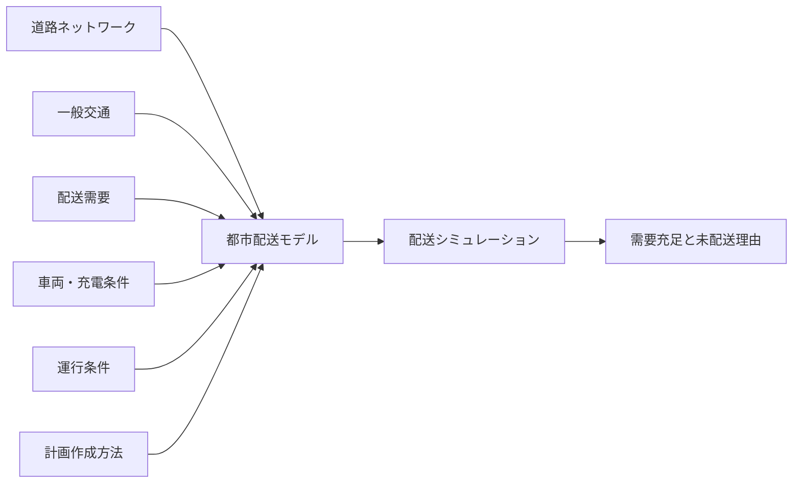

# Tokyo Urban Delivery × Quantum Future Society

東京都大田区を対象に、実データに基づく都市配送モデルを構築し、配送計画の作成方法と将来の配送条件が都市配送需要の充足へ与える影響を評価する修士研究です。

## 研究目的

> **量子計算が、都市配送需要の充足に与える影響を検討可能な枠組みを提案する。**

## 研究の問い

> **量子計算を用いた配送計画は、古典計算や過去の統計情報に基づく配送計画と比較して、都市配送需要の充足にどのような差をもたらすか。**

ここでいう「影響」は、配送需要の発生から配送完了までを構成する条件が変化し、その変化が最終的な配送完了へどう現れるかを指します。本研究では、量子計算の影響を次の二つの経路に分けます。

1. 配送計画の作成方法として量子計算を用いることによる変化
2. 将来の技術条件が車両・運用条件を介して配送へ波及することによる変化

## まず確認する資料

| 順序 | 資料 | 役割 |
|---:|---|---|
| 1 | [研究全体の構造・現在地・作業管理規則](00_project_management/0-2-A_20260823_COMPLETE_研究全体構造と作業管理規則.md) | 研究工程、作業番号、本線・派生ルートの管理正本 |
| 2 | [研究の現状と今後の設計案件](0-2_20260823_CURRENT_研究現状と設計案件.md) | 道路、交通、配送、最適化を横断した現在地と優先順位 |
| 3 | [交通量較正](2-3_20260823_CURRENT_交通量較正.md) | 一般交通需要、較正結果、受入判定、残課題 |
| 4 | [シミュレーションモデル開発とV&V](05_src/traffic_simulation/simulation_model_development_and_vv.md) | 実装検証と現実に対する妥当性確認の境界 |
| 5 | [合成需要と非最適化ベースライン仕様](05_src/traffic_simulation/demand/baseline_demand_and_comparator.md) | 配送需要、比較器、評価指標の現行仕様 |
| 6 | [データ台帳](03_data/metadata/traffic_simulation_sources.csv) | 入力データ、取得日、SHA-256、用途、制限 |
| 7 | [Hayate native環境](reproducibility/environment/README.md) | 正本実行環境、再構築、検証手順 |

READMEは入口です。完了判定、数値、入力、実行条件についてREADMEと個別記録が矛盾する場合は、最新の完了記録、実行manifest、データ台帳を優先します。

## 研究の全体構造

本研究の中心は、単一の都市配送モデルを使った配送計画比較と将来シナリオ分析です。

```text
実データ
  ↓
都市配送モデルの構築
  ↓
【第1段階】配送計画手法の比較
  ↓
【第2段階】将来社会シナリオ分析
  ↓
【第3段階】バッテリー発展に基づくケース分析
  ↓
都市配送需要の充足への影響を解釈
```

都市配送モデルは、道路、一般交通、配送需要、車両・充電、運行条件を受け取り、配送計画をSUMO上で実行して配送完了状況を出力します。



### 第1段階：配送計画手法の比較

同一の道路、交通、需要、車両、制約、乱数条件で、次の計画作成方法を比較します。

- 過去の統計情報に基づく配送計画
- 古典計算を用いた配送計画
- 量子計算を用いた配送計画

この段階では、計画作成方法以外を可能な限り共通にし、solverの違いが需要充足へ与える効果を分離します。

### 第2段階：将来社会シナリオ分析

第1段階と同じ都市配送モデルへ、人口・世帯構造とEC利用の将来条件を入力し、配送需要の変化を評価します。

```text
将来人口・世帯構造
  ↓
EC利用シナリオ
  ↓
宅配需要
  ↓
都市配送モデル
```

### 第3段階：バッテリーケース分析

量子計算を用いた材料・化学研究の知見を、バッテリー性能へ直接同一視せず、根拠付きの到達可能範囲として車両・運用条件へ接続します。

```text
材料・化学研究の知見
  ↓
材料特性または性能範囲
  ↓
バッテリー条件
  ├─ 航続距離
  └─ 充電所要時間
  ↓
都市配送モデル
  ↓
需要充足への波及
```

将来社会シナリオとバッテリーケースの組合せは、基準分析を固定した後の拡張とします。

## 現在地

更新基準日: **2026-08-25**

```text
0-1 社会科学としての問い                    [FIXED / documentation update]
0-2 研究設計                                [CURRENT]
0-3 方法論                                  [CURRENT]
  ├─ 正本実行環境のHayate移行               [PARTIAL]
  │   ├─ Mac側Git整理                       [COMPLETE]
  │   └─ Hayate Conda正本化                 [COMPLETE]
  ├─ 1. 道路・交通条件                      [PARTIAL]
  ├─ 2. 交通状態                            [CURRENT]
  │   ├─ 公式観測の取得・道路対応           [COMPLETE]
  │   ├─ 測定断面・検出位置固定             [COMPLETE]
  │   ├─ 交通量較正                         [CURRENT]
  │   └─ 2024年観測による独立確認           [BLOCKED]
  ├─ 3. 配送条件                            [PARTIAL]
  ├─ 4. 配送シミュレーション                [PARTIAL]
  ├─ 5. 配送最適化問題                      [NOT STARTED]
  └─ 6. 計算手法比較                        [NOT STARTED]
```

### できるようになったこと

- Hayate上のPython 3.11.15、SUMO 1.24.0、固定Python依存を正本実行環境として定義した。
- Hayate native環境で交通シミュレーション検証の全回帰 `794 passed` を確認した。
- 大田区の道路方向、通行権限、車線欠測を、元データの事実とモデル仮定を分けて処理できる。
- 低容量・基準・高容量の車線仮定で予備走行し、車線仮定が配送結果へ非単調に影響し得ることを確認した。
- 国土交通省2021年・警視庁2023年を較正用、警視庁2024年を独立確認用として分離した。
- 公式PT小ゾーン本人運転ODにより、固定27測定群すべてへ経路上の空間的支持を確保した。
- 第6回東京都市圏物資流動調査の宅配関連表を取得し、将来の配送需要・再配達・受取条件を検討する原資料として登録した。

### まだできないこと

- 一般交通の最初の較正候補は観測交通量を大幅に下回り、不受理である。
- 大田区を通過する区外→区外交通の本人運転OD統合と再較正は完了していない。
- 警視庁2024年データによる独立した妥当性確認には進んでいない。
- 接続不能と強制移動が残る予備道路網の配送結果を正式評価へ使用できない。
- 宅配便個数相当を、配送停止、時間分布、車両、積載、稼働時間、充電条件へ変換する共通配送問題は未固定である。
- 古典最適化とQAOAの正式比較は実施していない。

## パラメータ別の進捗

以下は、都市配送モデルを構成する主要パラメータについて、これまでに行ったことと現在の状態を整理したものです。ここで「行ったこと」は研究工程全体の完了を意味せず、仕様化、データ取得、実装、検証、予備分析など、現時点までに実施した内容を指します。

| パラメータ | これまでに行ったこと |
|---|---|
| **道路ネットワーク** | **大田区のOSM道路データをSUMOで# Tokyo Urban Delivery × Quantum Future Society

東京都大田区を対象に、実データに基づく都市配送モデルを構築し、配送計画の作成方法と将来の配送条件が都市配送需要の充足へ与える影響を評価する修士研究です。

## 研究目的

> **量子計算が、都市配送需要の充足に与える影響を検討可能な枠組みを提案する。**

## 研究の問い

> **量子計算を用いた配送計画は、古典計算や過去の統計情報に基づく配送計画と比較して、都市配送需要の充足にどのような差をもたらすか。**

ここでいう「影響」は、配送需要の発生から配送完了までを構成する条件が変化し、その変化が最終的な配送完了へどう現れるかを指します。本研究では、量子計算の影響を次の二つの経路に分けます。

1. 配送計画の作成方法として量子計算を用いることによる変化
2. 将来の技術条件が車両・運用条件を介して配送へ波及することによる変化

## まず確認する資料

| 順序 | 資料 | 役割 |
|---:|---|---|
| 1 | [研究全体の構造・現在地・作業管理規則](00_project_management/0-2-A_20260823_COMPLETE_研究全体構造と作業管理規則.md) | 研究工程、作業番号、本線・派生ルートの管理正本 |
| 2 | [研究の現状と今後の設計案件](0-2_20260823_CURRENT_研究現状と設計案件.md) | 道路、交通、配送、最適化を横断した現在地と優先順位 |
| 3 | [交通量較正](2-3_20260823_CURRENT_交通量較正.md) | 一般交通需要、較正結果、受入判定、残課題 |
| 4 | [シミュレーションモデル開発とV&V](05_src/traffic_simulation/simulation_model_development_and_vv.md) | 実装検証と現実に対する妥当性確認の境界 |
| 5 | [合成需要と非最適化ベースライン仕様](05_src/traffic_simulation/demand/baseline_demand_and_comparator.md) | 配送需要、比較器、評価指標の現行仕様 |
| 6 | [データ台帳](03_data/metadata/traffic_simulation_sources.csv) | 入力データ、取得日、SHA-256、用途、制限 |
| 7 | [Hayate native環境](reproducibility/environment/README.md) | 正本実行環境、再構築、検証手順 |

READMEは入口です。完了判定、数値、入力、実行条件についてREADMEと個別記録が矛盾する場合は、最新の完了記録、実行manifest、データ台帳を優先します。

## 研究の全体構造

本研究の中心は、単一の都市配送モデルを使った配送計画比較と将来シナリオ分析です。

```text
実データ
  ↓
都市配送モデルの構築
  ↓
【第1段階】配送計画手法の比較
  ↓
【第2段階】将来社会シナリオ分析
  ↓
【第3段階】バッテリー発展に基づくケース分析
  ↓
都市配送需要の充足への影響を解釈
```

都市配送モデルは、道路、一般交通、配送需要、車両・充電、運行条件を受け取り、配送計画をSUMO上で実行して配送完了状況を出力します。


### 第1段階：配送計画手法の比較

同一の道路、交通、需要、車両、制約、乱数条件で、次の計画作成方法を比較します。

- 過去の統計情報に基づく配送計画
- 古典計算を用いた配送計画
- 量子計算を用いた配送計画

この段階では、計画作成方法以外を可能な限り共通にし、solverの違いが需要充足へ与える効果を分離します。

### 第2段階：将来社会シナリオ分析

第1段階と同じ都市配送モデルへ、人口・世帯構造とEC利用の将来条件を入力し、配送需要の変化を評価します。

```text
将来人口・世帯構造
  ↓
EC利用シナリオ
  ↓
宅配需要
  ↓
都市配送モデル
```

### 第3段階：バッテリーケース分析

量子計算を用いた材料・化学研究の知見を、バッテリー性能へ直接同一視せず、根拠付きの到達可能範囲として車両・運用条件へ接続します。

```text
材料・化学研究の知見
  ↓
材料特性または性能範囲
  ↓
バッテリー条件
  ├─ 航続距離
  └─ 充電所要時間
  ↓
都市配送モデル
  ↓
需要充足への波及
```

将来社会シナリオとバッテリーケースの組合せは、基準分析を固定した後の拡張とします。

## 現在地

更新基準日: **2026-08-25**

```text
0-1 社会科学としての問い                    [FIXED / documentation update]
0-2 研究設計                                [CURRENT]
0-3 方法論                                  [CURRENT]
  ├─ 正本実行環境のHayate移行               [PARTIAL]
  │   ├─ Mac側Git整理                       [COMPLETE]
  │   └─ Hayate Conda正本化                 [COMPLETE]
  ├─ 1. 道路・交通条件                      [PARTIAL]
  ├─ 2. 交通状態                            [CURRENT]
  │   ├─ 公式観測の取得・道路対応           [COMPLETE]
  │   ├─ 測定断面・検出位置固定             [COMPLETE]
  │   ├─ 交通量較正                         [CURRENT]
  │   └─ 2024年観測による独立確認           [BLOCKED]
  ├─ 3. 配送条件                            [PARTIAL]
  ├─ 4. 配送シミュレーション                [PARTIAL]
  ├─ 5. 配送最適化問題                      [NOT STARTED]
  └─ 6. 計算手法比較                        [NOT STARTED]
```

### できるようになったこと

- Hayate上のPython 3.11.15、SUMO 1.24.0、固定Python依存を正本実行環境として定義した。
- Hayate native環境で交通シミュレーション検証の全回帰 `794 passed` を確認した。
- 大田区の道路方向、通行権限、車線欠測を、元データの事実とモデル仮定を分けて処理できる。
- 低容量・基準・高容量の車線仮定で予備走行し、車線仮定が配送結果へ非単調に影響し得ることを確認した。
- 国土交通省2021年・警視庁2023年を較正用、警視庁2024年を独立確認用として分離した。
- 公式PT小ゾーン本人運転ODにより、固定27測定群すべてへ経路上の空間的支持を確保した。
- 第6回東京都市圏物資流動調査の宅配関連表を取得し、将来の配送需要・再配達・受取条件を検討する原資料として登録した。

### まだできないこと

- 一般交通の最初の較正候補は観測交通量を大幅に下回り、不受理である。
- 大田区を通過する区外→区外交通の本人運転OD統合と再較正は完了していない。
- 警視庁2024年データによる独立した妥当性確認には進んでいない。
- 接続不能と強制移動が残る予備道路網の配送結果を正式評価へ使用できない。
- 宅配便個数相当を、配送停止、時間分布、車両、積載、稼働時間、充電条件へ変換する共通配送問題は未固定である。
- 古典最適化とQAOAの正式比較は実施していない。

## パラメータ別の進捗

以下は、都市配送モデルを構成する主要パラメータについて、これまでに行ったことと現在の状態を整理したものです。ここで「行ったこと」は研究工程全体の完了を意味せず、仕様化、データ取得、実装、検証、予備分析など、現時点までに実施した内容を指します。

| パラメータ | これまでに行ったこと |
|---|---|
| **道路ネットワーク** | **大田区のOSM道路データをSUMOで利用するための道路網生成・検証系を構築した。**<br>2026-07-16時点のOpenStreetMapを基礎入力として、道路方向、通行権限、車線数、速度等を属性ごとに解決する処理を段階的に実装した。道路属性の事実、規則導出値、モデル仮定を区別し、明示的な矛盾を自動補完しない方針を導入した。道路属性VerificationをPhase単位で実施し、全母集団に対する検査、fixture、oracle、Schema、Invariant、自動テストを整備した。 | **PARTIAL**。道路属性処理は進んでいるが、接続不能と強制移動が残るため、現時点の道路網は正式な配送評価には使用できない。 |
| **道路方向・通行権限** | **OSM属性から一方通行・双方向通行と配送車両の通行可否を解決する処理を実装した。**<br>`oneway`、`access`、`vehicle`、`motor_vehicle`、`motorcar`等の属性を階層的に扱い、未解決条件を推測で許可せず停止させるfail-closed型の処理を採用した。`bicycle`、`foot`、`mofa`、`moped`、`horse`、`psv`、`private authorization`、`motorcar`等について、OSMとSUMOの意味対応を個別に検討し、Registry、Invariant、fixture、oracle、resolver、testへ反映した。 | **PARTIAL / Verification継続中**。基本処理は構築済みであるが、道路接続・到達性を含めた正式受入には至っていない。 |
| **車線数・車線欠測** | **OSMの`lanes`等から方向別車線構成を決定する処理と、欠測時のモデル化方法を検討した。**<br>明示値と欠測を分離し、欠測について低容量・基準・高容量の仮定を設定して予備走行を実施した。その結果、車線仮定の変更が配送結果へ単調ではない影響を与え得ることを確認した。 | **PARTIAL**。欠測を事実として補完せず、由来付きのモデル仮定と感度条件として扱う方針で継続中である。 |
| **一般交通需要（OD）** | **東京都市圏PT本人運転ODを用いて、大田区内の一般交通需要の空間分布を構築した。**<br>2018年東京都市圏PT小ゾーン本人運転ODを道路網へ接続し、固定27測定群すべてについて経路上の空間的支持が存在することを確認した。一方、大田区を通過する区外→区外交通が不足する可能性を特定し、外外OD候補の取得・統合方法を検討している。 | **CURRENT**。区外→区外交通の統合が未完了であり、一般交通需要は正式固定前である。 |
| **交通量・交通状態** | **較正用と独立Validation用の観測交通量を分離して取得・道路対応した。**<br>国土交通省2021年道路交通センサスと警視庁2023年交通量をCalibration用、警視庁2024年交通量を独立Validation用として事前に分離した。測定断面・検出位置を固定し、PT ODから生成した交通需要を用いて初期較正を実施した。最初の較正候補では需要倍率を上限1.5まで増加させても重み付き絶対誤差率87.07%となり、不受理と判定した。 | **CURRENT**。初期較正は不受理。区外通過交通を統合した再較正が必要である。独立Validationは**BLOCKED**である。 |
| **配送需要量** | **公開統計から共通の合成配送需要量を定義した。**<br>全国宅配便取扱個数5,031,470,000個、日本総人口123,802,000人を用いて、人口換算原単位`0.111345934 parcel-equivalent/人・日`を算出した。大田区人口736,652人へ適用した基準期待需要として約`82,023 parcel-equivalent/日`を算出した。`parcel-equivalent`を実注文、実顧客、実配送先、実停止と直接同一視しないことを明示した。 | **PARTIAL**。区全体の需要尺度は定義したが、正式な配送停止数や配送要求への変換は未固定である。 |
| **配送需要の空間分布** | **2020年国勢調査500m人口メッシュを用いた基準空間分布を設計した。**<br>大田区境界と交差するメッシュを面積按分し、2024年4月1日の大田区人口736,652人へ比例調整する方法を定義した。整数人口・整数需要は最大剰余法で配分する規則を定めた。また、第6回東京都市圏物資流動調査の宅配関連表を取得し、配送需要、再配達、荷物量、時間・空間分布を検討する原資料として登録した。 | **PARTIAL**。人口比例の基準分布は定義しているが、実配送停止、時間分布、再配達等を含む正式な需要モデルは未固定である。 |
| **将来配送需要** | **将来人口・世帯構造とEC利用を介して宅配需要を変化させる基本構造を定義した。**<br>`D_t = H_t × p_t^EC × r_t`として、将来世帯数、EC利用率、EC利用世帯当たり宅配需要係数から需要を設定する考え方を整理した。EC利用率は確定予測ではなく、Low・Base・High等のシナリオとして扱う方針とした。 | **設計中**。基準分析を固定した後に実施する拡張であり、正式シナリオ値は未固定である。 |
| **配送先・配送停止数** | **計算規模確認のため、配送先数`25・50・100`を予備条件として検討した。**<br>ただし、これらは82,023 parcel-equivalent/日から導出した実都市配送停止数ではなく、計算可能性を確認するための予備的な問題サイズとして区別した。 | **未固定**。parcel-equivalentを配送停止へ変換する根拠付きの最小モデルが必要である。 |
| **配送拠点** | **物流施設・充電設備等の位置データを候補入力として扱ってきた。**<br>国土数値情報P31等を使用した実績はあるが、正式比較で用いる配送拠点の位置、数、担当区域、再積載可否はまだ固定していない。 | **未固定**。配送需要・車両能力と合わせて共通配送問題として定義する必要がある。 |
| **車両数** | **予備条件として`1・3・5台`を用いて問題規模と挙動を確認する設計を行った。**<br>一方で、車両数は配送需要充足率の上限を直接支配する供給能力であるため、単独の任意パラメータとして扱わず、積載量、再積載回数、稼働時間、旅行時間、サービス時間等と統合した「需要／車両能力比」として管理する必要性を整理した。 | **未固定**。実運用資料・物資流動調査等を根拠候補として基準条件を決め、低供給・基準・高供給の感度条件を事前固定する必要がある。 |
| **積載量・再積載** | **配送完了条件と車両供給能力を構成する主要パラメータとして位置付けた。**<br>積載量不足とsolverの計画品質不足を区別する必要性を整理し、車両数・再積載回数・稼働時間と組み合わせて能力を評価する方針を定めた。 | **未固定**。parcel-equivalentまたは配送停止との対応、1運行の容量、拠点帰還・再積載規則を定義する必要がある。 |
| **稼働時間・サービス時間・時間窓** | **配送完了判定と需要充足率へ影響する運行条件として整理した。**<br>走行時間だけでなく、停止当たり荷役時間、運行可能時間、配送期限・時間窓が必要であり、これらが未設定だと経路短縮が配送完了へどの程度転換されるか評価できないことを明確化した。 | **未固定**。実運用資料等を根拠に共通配送問題へ組み込む必要がある。 |
| **出発時刻** | **同時出発・分散出発を交通条件と配送計画双方へ影響する感度軸として整理した。**<br>同時出発による人工的な交通集中を避ける必要性を明示し、solver間で共通化する条件として位置付けた。 | **未固定**。基準時刻と感度条件を実行前に固定する必要がある。 |
| **EV・バッテリー条件** | **バッテリー容量、初期SOC、電費、航続距離、充電速度を配送モデルへ入力する構造を整理した。**<br>量子計算を用いた材料・化学研究の知見をバッテリー性能へ直接同一視せず、根拠付きの性能範囲として車両・運用条件へ接続する第3段階のケース分析を設計した。 | **未固定 / 将来拡張**。基準値と感度範囲、充電場所・充電規則を定義する必要がある。 |
| **計画作成方法（非最適化）** | **統計情報に基づく非最適化基準の仕様を作成した。**<br>`fixed_hash_no_reordering`として、demand manifest SHA-256とrequest ID等から決定論的な優先順序を作り、距離、時間、交通状態、目的関数を使って訪問順を改善しない比較器を定義した。実在事業者の運行を表すものではなく、最適化による改善量を見るための帰無比較器として位置付けた。 | **仕様作成済み、正式実装前**。正式な配送要求・車両条件が固定された後に実行する。 |
| **計画作成方法（古典最適化）** | **第1段階の比較対象として、古典計算機上のsolverによる参照解・近似解を置く設計を整理した。**<br>非最適化・QAOAと同一の需要、車両、道路、交通、制約、乱数条件を与えること、solver出力・復号後・修復後・SUMO実行結果を分離して保存することを定めた。 | **NOT STARTED / 計画中**。共通配送問題と比較規約の固定が先である。 |
| **計画作成方法（QAOA）** | **Qiskit Aer QAOAを小規模配送最適化問題の比較対象として位置付けた。**<br>QUBOへの変換、回路生成、サンプリング、復号、修復、SUMOでの実行を区別し、計算時間も記録する設計を整理した。また、Qiskit Aerは古典計算機上の量子回路シミュレータであり、結果を物理量子コンピュータの性能や量子優位性の証拠として扱わないことを明示した。 | **NOT STARTED / 計画中**。古典参照解、計算予算、復号・修復規約等の固定が必要である。 |
| **評価指標** | **主指標として配送需要充足率を定義した。**<br>`完了条件を満たした合成配送需要 ÷ 割り当てた合成配送需要`とし、到着、期限、積載量、バッテリー、充電、重複配送等を満たした場合のみ完了と判定する方針を定めた。また、車両不足、積載不足、稼働時間不足、バッテリー不足、渋滞・道路到達不能、計画品質不足等の未配送理由を別に保存する設計とした。 | **仕様整理中**。正式配送問題の完了条件と各未配送理由の判定規則を固定する必要がある。 |
| **Verification / Calibration / Validation** | **実装・構造のVerification、観測に合わせるCalibration、独立観測によるValidationを明確に分離した。**<br>テスト合格を現実妥当性と同一視せず、較正用観測と独立Validation用観測を結果を見る前に分ける原則を採用した。道路属性・構造検証、自動テスト、交通観測との対応付け、初期較正まで実施している。 | **Verification継続 / Calibration CURRENT / Validation BLOCKED**。再較正が受理されるまで独立Validationには進まない。 |
| **再現環境・来歴管理** | **Hayate上のnative Condaを正本実行環境として固定し、データと実行条件の来歴管理を整備した。**<br>Python 3.11.15、SUMO 1.24.0、固定Python依存を正本化し、traffic simulation validationの全回帰`794 passed`を確認した。入力データについて提供元URL、取得日、対象期間、元ファイル名、SHA-256、用途、制限を台帳管理し、過去成果物を上書きせず実行条件と識別値を残す方針を採用した。 | **運用中**。後続のCalibration、Validation、配送比較でも同じ再現性管理を維持する。 |
## 現在の主要ボトルネック

| 優先度 | 問題 | 現在の状態 | 下流への影響 |
|---|---|---|---|
| 最優先 | 区外通過交通を含む一般交通需要 | 外外OD候補の取得・統合途中 | 交通量、渋滞、旅行時間を過小評価する可能性 |
| 最優先 | 交通量較正 | 最初の候補は不受理 | 交通条件を正式な配送比較に使えない |
| 最優先 | 独立Validation | 2024年観測を隔離中 | 過適合を検出できない |
| 高 | 道路接続・配送到達性 | 接続不能と強制移動が残る | 配送失敗をsolver性能と区別できない |
| 高 | 配送停止への変換 | 82,023個相当／日は停止数ではない | 正式配送問題と充足率の分母が定まらない |
| 高 | 車両数 | `1・3・5台`は予備条件で、実運用または需要規模との対応根拠が未固定 | 充足率をsolver以上に直接支配し、車両不足と解品質を分離できない |
| 高 | 配送先・配送停止数 | `25・50・100地点`は計算規模の予備条件で、82,023個相当／日からの変換根拠が未固定 | 問題規模と需要密度が恣意的になり、手法間差の解釈が変わる |
| 高 | 需要／車両能力比 | 車両数、積載量、再積載回数、稼働時間を統合した能力指標が未定義 | 資源過剰では全手法が100%、不足では全手法が低水準へ飽和する |
| 高 | 配送拠点 | 位置、数、担当区域、再積載の可否が未固定 | 総距離、到達性、必要車両数、充電機会が変わる |
| 高 | 積載量・再積載 | 荷物量との対応、1運行の容量、拠点への帰還規則が未固定 | 容量不足と経路計画の品質を区別できない |
| 高 | 稼働時間・サービス時間 | 運行可能時間、停止当たり荷役時間、時間窓が未固定 | 走行時間短縮が配送完了へ変換される割合を評価できない |
| 高 | 出発時刻 | 同時出発と分散出発の基準が未固定 | 人工的な交通集中と待ち時間が生じる可能性 |
| 高 | EV・充電条件 | 基準値と感度範囲が未固定 | 航続距離・充電制約の効果を評価できない |
| 高 | 比較規約 | 古典参照解、計算予算、QAOA復号・修復が未固定 | solver間の公平な比較が成立しない |

道路属性の未解決件数をゼロにすること自体を目的にしません。欠測は由来付きのモデル仮定と感度分析で扱い、明示的な矛盾は自動補完せず、研究結論へ影響する主要ボトルネックを優先します。

### 車両数は独立した主要ボトルネック

車両数は単なる実験パラメータではなく、配送需要充足率の上限を決める供給能力です。現在の`1・3・5台`は問題規模を確認する予備条件であり、大田区の配送需要、実在事業者の運用、拠点の担当区域から導いた正式値ではありません。

車両数だけを独立に設定せず、少なくとも次の関係として扱います。

```text
割当配送需要
  ÷
（車両数 × 1台当たり積載量 × 再積載可能回数 × 稼働可能時間内の実行能力）
  ↓
需要／車両能力比
```

実際の実行能力には、道路旅行時間、渋滞、停止当たりサービス時間、時間窓、充電、拠点への帰還が影響します。そのため、同じ車両数でも他の仮定によって供給能力は変化します。

正式比較では、次の三つを分離します。

1. **資源不足:** どの計画でも完了不可能な需要
2. **計画品質不足:** 実行可能な資源があるが、計画が悪いため完了できない需要
3. **交通・運用上の失敗:** 渋滞、到達不能、充電、サービス時間等による未完了

車両条件は、結果を見てsolver差が最大になる値を選びません。公的統計、物資流動調査、実運用資料等から設定できる基準条件と、低供給・基準・高供給の感度条件を実行前に固定します。直接根拠が得られない場合は、観測事実ではなく`model_assumed`として記録します。

## 評価対象

主な評価対象は、都市配送需要の充足率です。

> **配送需要充足率 = 完了条件を満たした合成配送需要 ÷ 割り当てた合成配送需要**

各需要は、到着、期限、積載量、バッテリー、充電、重複配送等の必須条件を満たした場合だけ完了と判定します。経路生成またはシミュレーションに失敗した需要は完了へ含めません。

充足率だけでは未配送理由を区別できないため、少なくとも次を別に記録します。

- 車両不足
- 積載量不足
- 稼働時間不足
- バッテリー不足
- 充電時間
- 渋滞・道路到達不能
- 配送計画の実行不能または品質不足
- 計算時間制約

この充足率は公開統計から作る合成需要に対する指標であり、実注文充足率、顧客満足度、配送を受けた人数、社会的便益を表しません。

## 配送需要

### 現在の基準尺度

`parcel-equivalent`（宅配便個数相当）は、全国の年間宅配便取扱個数を人口と日数で正規化し、各比較手法へ同じ合成需要量を与えるための尺度です。

```text
一人一日当たりparcel-equivalent
  = 全国の年間宅配便取扱個数
    ÷ 日本の総人口
    ÷ 365日
```

現在の基準値は `0.111345934 parcel-equivalent/人・日`、大田区の期待需要は約 `82,023 parcel-equivalent/日` です。

1 parcel-equivalentは、実際の1注文、1顧客、1配送先、1停止、特定の重量・容積を意味しません。全国宅配便統計には個人宅向け以外の流動も含まれます。

基準分布では、2020年国勢調査500 m人口メッシュを2024年4月1日の大田区人口736,652人へ比例調整します。この方法は、2020年のメッシュ内人口構成が2024年まで比例的に維持されたことと、境界メッシュ内で人口が一様であることを仮定します。

### 将来需要シナリオ

第2段階では、人口だけでなく世帯数とEC利用を介して将来配送需要を設定します。

\[
D_t = H_t \times p^{EC}_t \times r_t
\]

- \(D_t\): 年 \(t\) の配送需要
- \(H_t\): 将来世帯数
- \(p^{EC}_t\): EC利用率
- \(r_t\): EC利用世帯当たりの宅配需要係数

EC利用率は確定予測として扱わず、Low・Base・Highなど上限と飽和を持つシナリオとして設定します。基準年からの需要倍率は次で表します。

\[
M_t = \frac{D_t}{D_{base}}
\]

高度な需要予測モデルを先に導入するのではなく、公的データ、仮定、変換式、シナリオを追跡可能にすることを優先します。

## 実験設計

予備条件として、配送先数 `25・50・100`、車両数 `1・3・5` が検討されています。ただし、これらは正式な実験条件ではなく、実都市需要と運用規模との対応根拠が必要です。問題サイズの系列と現実の配送能力シナリオを混同せず、配送先数は計算規模、車両数は供給能力の感度軸として管理します。

solverの効果とシナリオ条件の効果を分離するため、最終的な分析は次の多因子構造で設計します。

```text
需要条件
  × 交通条件
  × 車両・EV条件
  × 出発・運行条件
  × solver
  ↓
配送需要充足率・未配送理由・計算要求
```

少なくとも次を事前固定または感度条件として管理します。

- 需要／車両比と配送停止数
- 車両数、1台当たり積載量、再積載回数、稼働可能時間
- 配送需要の空間・時間分布
- 空いている時間帯、平常混雑、ピーク、局所混雑
- 同時出発と分散出発
- 拠点、積載量、サービス時間、時間窓
- バッテリー容量、初期SOC、電費、充電速度
- 乱数seedと反復回数

交通条件と車両資源が過剰または不足すると、全solverの充足率が同じ水準へ飽和します。結果を見て差が大きい条件だけを選ばず、条件範囲と受入基準を実行前に固定します。

## 比較する計画作成方法

| 手法 | 役割 | 現在の状態 |
|---|---|---|
| 統計情報に基づく非最適化基準 | 距離や時間で並べ替えない再現可能な比較器 | 仕様作成済み、正式実装前 |
| 古典最適化 | 古典計算機上のsolverによる参照解・近似解 | 計画中 |
| Qiskit Aer QAOA | QUBOへ変換した小規模問題の回路シミュレーション | 計画中 |

三手法には、同一の需要、車両、制約、交通条件、道路網、乱数を与えます。次を分離して保存・比較します。

1. solverの生出力
2. 復号後の解
3. 制約を満たすよう修復した解
4. SUMO上で実現した配送結果

solverが決める顧客訪問順序と、SUMOまたはルータが決める道路上の経路を区別します。QAOAの回路生成、サンプリング、復号、修復に要する時間も計算要求として記録します。

Qiskit Aerは古典計算機上の量子回路シミュレーターです。その結果を物理量子コンピュータの性能または量子優位性の証拠として扱いません。

## 使用する主なデータ

| データ | 状態 | 研究での役割 |
|---|---|---|
| 2026年N03行政区域 | 処理済み | 大田区境界 |
| 2026-07-16 OpenStreetMap | 処理済み | 道路形状、接続、道路属性の候補 |
| 国土交通省・令和3年度道路交通センサス | 処理済み | 一般交通量の較正 |
| 警視庁2023年交通量 | 処理済み | 一般交通量の較正 |
| 警視庁2024年交通量 | 道路対応済み・較正から隔離 | 独立Validation |
| 2018年東京都市圏PT本人運転OD | 使用中 | 一般交通需要の空間分布 |
| 区外→区外OD関連データ | 取得・統合確認中 | 大田区を通過する交通 |
| 第6回東京都市圏物資流動調査の宅配関連表 | 原本取得済み | 配送需要、再配達、荷物量、時間・空間分布の根拠候補 |
| 2020年国勢調査500 m人口メッシュ | 処理済み | 基準配送需要の空間分布 |
| 2024年大田区人口・日本総人口・宅配便取扱個数 | 処理済み | 基準parcel-equivalentの計算 |
| 国土数値情報P31・充電設備位置 | 使用実績あり、正式入力未固定 | 物流施設・充電場所の候補 |

提供元URL、取得日、対象期間、ライセンス、元ファイル名、SHA-256、処理、生成先、既知の制限は[データ台帳](03_data/metadata/traffic_simulation_sources.csv)と[取得記録](03_data/metadata/acquisition/README.md)で管理します。台帳に未登録の取得物は、正式入力として使用する前に原本、SHA-256、用途、制限を登録します。

第三者データの元ファイルはGitへ登録しません。再現時は取得記録に従って入手し、登録SHA-256と照合します。

## 検証と妥当性確認

本研究では、実装・構造の検証と、利用目的に対する妥当性確認を分けます。

- **Verification:** 仕様、Schema、コード、データ変換、道路構造が定めた規則どおりであることを確認する。
- **Calibration:** 較正用観測に対する誤差を小さくするよう、調整可能なモデル値を定める。
- **Validation:** 較正に使っていない観測で、定めた用途に必要な精度と振る舞いを確認する。

テストが合格しても、現実交通を十分に表すとは限りません。また、較正用観測への一致だけでValidation合格とはしません。

現時点の交通量較正候補は、固定27測定群すべてに経路上の支持がある一方、需要倍率が上限1.5へ達しても重み付き絶対誤差率が87.07%で、不受理です。区外通過交通を統合して再較正した後でなければ、2024年観測による独立Validationへ進みません。

## 再現方法

正本実行環境はHayate上のnative CondaとSUMO 1.24.0です。Dockerは任意の副次クロスチェックです。

- repository: `/home/takuma/kmd-analysis`
- Python: `/home/takuma/kmd-analysis/.conda/bin/python`（3.11.15）
- SUMO: `/home/takuma/kmd-analysis/.local/sumo-1.24.0/bin/sumo`（1.24.0）
- Python依存正本: `reproducibility/environment/requirements-analysis.txt`

```bash
cd /home/takuma/kmd-analysis
source /opt/miniconda/etc/profile.d/conda.sh
conda activate /home/takuma/kmd-analysis/.conda

export SUMO_HOME=/home/takuma/kmd-analysis/.local/sumo-1.24.0/share/sumo
export PATH=/home/takuma/kmd-analysis/.local/sumo-1.24.0/bin:$PATH
export PYTHONPATH=/home/takuma/kmd-analysis/.local/sumo-1.24.0/share/sumo/tools:${PYTHONPATH:-}
export LD_LIBRARY_PATH=/home/takuma/kmd-analysis/.conda/lib:${LD_LIBRARY_PATH:-}

bash reproducibility/scripts/hayate/verify_hayate_native_environment.sh
python -m pytest -q 05_src/traffic_simulation/validation
```

詳細は[Hayate native環境の正本手順](reproducibility/environment/README.md)を参照してください。

## リポジトリ構成

| ディレクトリ | 内容 |
|---|---|
| [`00_project_management/`](00_project_management/) | 研究管理、現在地、環境、作業規則 |
| [`01_research_design/`](01_research_design/) | 研究設計 |
| [`02_literature/`](02_literature/) | 都市配送、量子経路最適化、評価方法、参考文献 |
| [`03_data/metadata/`](03_data/metadata/) | データ台帳と取得記録 |
| [`05_src/traffic_simulation/`](05_src/traffic_simulation/) | 道路、交通、需要、配送、検証、可視化のコードと仕様 |
| [`06_outputs/`](06_outputs/) | レビュー済みの図、表、地図、報告書 |
| [`reproducibility/config/`](reproducibility/config/) | バージョン管理された設定とSchema |
| [`reproducibility/environment/`](reproducibility/environment/) | 正本環境の依存と再構築手順 |
| [`reproducibility/outputs/`](reproducibility/outputs/) | Git管理外の再生成可能な実行結果 |
| [`docker/`](docker/) | 任意の副次的Docker環境 |
| [`legacy/non_sumo_route_proxy_analysis/`](legacy/non_sumo_route_proxy_analysis/) | SUMO導入前の旧研究 |

## データとモデルの管理原則

- 観測値、公式資料、規則導出値、推定値、モデル仮定、感度値を区別する。
- 元データを都合よく書き換えず、変換規則と来歴を保存する。
- 欠測を正式な事実として補完せず、必要なら明示的な仮定と感度分析で扱う。
- 明示的な矛盾には自動fallbackを適用しない。
- 較正用観測と独立Validation用観測を結果を見る前に分ける。
- 比較手法間で需要、道路、交通、車両、制約、評価、乱数を共通化する。
- 失敗、接続不能、強制移動、警告、未配送理由を成功結果と同様に保存する。
- 過去成果物を上書きせず、入力・設定・コード・環境・出力の識別値を記録する。
- 大田区で得た結果を東京都全域や他地域へそのまま一般化しない。

## 主な制限

- 公開データだけでは、全車両の真の起終点、実配送軌跡、顧客需要、全信号現示を復元できない。
- 異なる年のPT、交通観測、人口、宅配便統計、道路データを統合するため、特定年の完全再現ではなく合成基準シナリオである。
- 人口比例の基準需要は、事業所配送、昼間人口、地域別EC利用、再配達、配送停止を直接表さない。
- 配送先数、車両数、出発時刻、サービス時間、EV・充電条件は正式固定前である。
- 道路上の経路選択と顧客訪問順序最適化を区別しないと、solverが改善した対象を誤解する。
- Qiskit Aerの結果は物理量子コンピュータの性能や量子優位性を示さない。

## 次の作業

1. 区外→区外の本人運転ODを一般則で統合し、同じ低自由度設計で交通量を再較正する。
2. 道路接続、通行権限、配送往復到達性を確認し、接続不能と強制移動を原因別に整理する。
3. 交通量較正の受入後、隔離済みの2024年観測で独立Validationを行う。
4. 物資流動調査等を根拠候補に、宅配便個数相当を配送停止・空間分布・時間分布へ変換する最小モデルを固定する。
5. 物資流動調査や実運用資料を根拠候補に、拠点、車両数、積載量、再積載、稼働時間、サービス時間、時間窓を共通配送問題として固定する。直接根拠がない車両数は仮定として明示し、低供給・基準・高供給の感度条件にする。
6. EV・充電条件を基準値と感度範囲へ分ける。
7. 小規模で古典最適解を確認できる問題から、非最適化・古典・QAOAを同じ検査器で比較する。
8. 第1段階を固定した後、将来需要シナリオとバッテリーケースへ拡張する。

## 要するに

本研究の目的と問い、都市配送モデルを中心とする三段階の分析構造は固定しました。Hayate上の再現環境、道路・交通データの基盤、交通観測の道路対応までは整っています。現在の最大課題は、区外通過交通を含む一般交通を再較正し、接続可能な道路網と正式な配送停止・車両条件を固定することです。これらが独立Validationに合格した後で、初めて古典計算とQAOAを同一条件で比較します。

本リポジトリのライセンスは[`LICENSE`](LICENSE)を参照してください。第三者データには、各提供元のライセンスと利用条件が適用されます。
利用するための道路網生成・検証系を構築した。**<br>2026-07-16時点のOpenStreetMapを基礎入力として、道路方向、通行権限、車線数、速度等を属性ごとに解決する処理を段階的に実装した。道路属性の事実、規則導出値、モデル仮定を区別し、明示的な矛盾を自動補完しない方針を導入した。道路属性VerificationをPhase単位で実施し、全母集団に対する検査、fixture、oracle、Schema、Invariant、自動テストを整備した。 | **PARTIAL**。道路属性処理は進んでいるが、接続不能と強制移動が残るため、現時点の道路網は正式な配送評価には使用できない。 |
| **道路方向・通行権限** | **OSM属性から一方通行・双方向通行と配送車両の通行可否を解決する処理を実装した。**<br>`oneway`、`access`、`vehicle`、`motor_vehicle`、`motorcar`等の属性を階層的に扱い、未解決条件を推測で許可せず停止させるfail-closed型の処理を採用した。`bicycle`、`foot`、`mofa`、`moped`、`horse`、`psv`、`private authorization`、`motorcar`等について、OSMとSUMOの意味対応を個別に検討し、Registry、Invariant、fixture、oracle、resolver、testへ反映した。 | **PARTIAL / Verification継続中**。基本処理は構築済みであるが、道路接続・到達性を含めた正式受入には至っていない。 |
| **車線数・車線欠測** | **OSMの`lanes`等から方向別車線構成を決定する処理と、欠測時のモデル化方法を検討した。**<br>明示値と欠測を分離し、欠測について低容量・基準・高容量の仮定を設定して予備走行を実施した。その結果、車線仮定の変更が配送結果へ単調ではない影響を与え得ることを確認した。 | **PARTIAL**。欠測を事実として補完せず、由来付きのモデル仮定と感度条件として扱う方針で継続中である。 |
| **一般交通需要（OD）** | **東京都市圏PT本人運転ODを用いて、大田区内の一般交通需要の空間分布を構築した。**<br>2018年東京都市圏PT小ゾーン本人運転ODを道路網へ接続し、固定27測定群すべてについて経路上の空間的支持が存在することを確認した。一方、大田区を通過する区外→区外交通が不足する可能性を特定し、外外OD候補の取得・統合方法を検討している。 | **CURRENT**。区外→区外交通の統合が未完了であり、一般交通需要は正式固定前である。 |
| **交通量・交通状態** | **較正用と独立Validation用の観測交通量を分離して取得・道路対応した。**<br>国土交通省2021年道路交通センサスと警視庁2023年交通量をCalibration用、警視庁2024年交通量を独立Validation用として事前に分離した。測定断面・検出位置を固定し、PT ODから生成した交通需要を用いて初期較正を実施した。最初の較正候補では需要倍率を上限1.5まで増加させても重み付き絶対誤差率87.07%となり、不受理と判定した。 | **CURRENT**。初期較正は不受理。区外通過交通を統合した再較正が必要である。独立Validationは**BLOCKED**である。 |
| **配送需要量** | **公開統計から共通の合成配送需要量を定義した。**<br>全国宅配便取扱個数5,031,470,000個、日本総人口123,802,000人を用いて、人口換算原単位`0.111345934 parcel-equivalent/人・日`を算出した。大田区人口736,652人へ適用した基準期待需要として約`82,023 parcel-equivalent/日`を算出した。`parcel-equivalent`を実注文、実顧客、実配送先、実停止と直接同一視しないことを明示した。 | **PARTIAL**。区全体の需要尺度は定義したが、正式な配送停止数や配送要求への変換は未固定である。 |
| **配送需要の空間分布** | **2020年国勢調査500m人口メッシュを用いた基準空間分布を設計した。**<br>大田区境界と交差するメッシュを面積按分し、2024年4月1日の大田区人口736,652人へ比例調整する方法を定義した。整数人口・整数需要は最大剰余法で配分する規則を定めた。また、第6回東京都市圏物資流動調査の宅配関連表を取得し、配送需要、再配達、荷物量、時間・空間分布を検討する原資料として登録した。 | **PARTIAL**。人口比例の基準分布は定義しているが、実配送停止、時間分布、再配達等を含む正式な需要モデルは未固定である。 |
| **将来配送需要** | **将来人口・世帯構造とEC利用を介して宅配需要を変化させる基本構造を定義した。**<br>`D_t = H_t × p_t^EC × r_t`として、将来世帯数、EC利用率、EC利用世帯当たり宅配需要係数から需要を設定する考え方を整理した。EC利用率は確定予測ではなく、Low・Base・High等のシナリオとして扱う方針とした。 | **設計中**。基準分析を固定した後に実施する拡張であり、正式シナリオ値は未固定である。 |
| **配送先・配送停止数** | **計算規模確認のため、配送先数`25・50・100`を予備条件として検討した。**<br>ただし、これらは82,023 parcel-equivalent/日から導出した実都市配送停止数ではなく、計算可能性を確認するための予備的な問題サイズとして区別した。 | **未固定**。parcel-equivalentを配送停止へ変換する根拠付きの最小モデルが必要である。 |
| **配送拠点** | **物流施設・充電設備等の位置データを候補入力として扱ってきた。**<br>国土数値情報P31等を使用した実績はあるが、正式比較で用いる配送拠点の位置、数、担当区域、再積載可否はまだ固定していない。 | **未固定**。配送需要・車両能力と合わせて共通配送問題として定義する必要がある。 |
| **車両数** | **予備条件として`1・3・5台`を用いて問題規模と挙動を確認する設計を行った。**<br>一方で、車両数は配送需要充足率の上限を直接支配する供給能力であるため、単独の任意パラメータとして扱わず、積載量、再積載回数、稼働時間、旅行時間、サービス時間等と統合した「需要／車両能力比」として管理する必要性を整理した。 | **未固定**。実運用資料・物資流動調査等を根拠候補として基準条件を決め、低供給・基準・高供給の感度条件を事前固定する必要がある。 |
| **積載量・再積載** | **配送完了条件と車両供給能力を構成する主要パラメータとして位置付けた。**<br>積載量不足とsolverの計画品質不足を区別する必要性を整理し、車両数・再積載回数・稼働時間と組み合わせて能力を評価する方針を定めた。 | **未固定**。parcel-equivalentまたは配送停止との対応、1運行の容量、拠点帰還・再積載規則を定義する必要がある。 |
| **稼働時間・サービス時間・時間窓** | **配送完了判定と需要充足率へ影響する運行条件として整理した。**<br>走行時間だけでなく、停止当たり荷役時間、運行可能時間、配送期限・時間窓が必要であり、これらが未設定だと経路短縮が配送完了へどの程度転換されるか評価できないことを明確化した。 | **未固定**。実運用資料等を根拠に共通配送問題へ組み込む必要がある。 |
| **出発時刻** | **同時出発・分散出発を交通条件と配送計画双方へ影響する感度軸として整理した。**<br>同時出発による人工的な交通集中を避ける必要性を明示し、solver間で共通化する条件として位置付けた。 | **未固定**。基準時刻と感度条件を実行前に固定する必要がある。 |
| **EV・バッテリー条件** | **バッテリー容量、初期SOC、電費、航続距離、充電速度を配送モデルへ入力する構造を整理した。**<br>量子計算を用いた材料・化学研究の知見をバッテリー性能へ直接同一視せず、根拠付きの性能範囲として車両・運用条件へ接続する第3段階のケース分析を設計した。 | **未固定 / 将来拡張**。基準値と感度範囲、充電場所・充電規則を定義する必要がある。 |
| **計画作成方法（非最適化）** | **統計情報に基づく非最適化基準の仕様を作成した。**<br>`fixed_hash_no_reordering`として、demand manifest SHA-256とrequest ID等から決定論的な優先順序を作り、距離、時間、交通状態、目的関数を使って訪問順を改善しない比較器を定義した。実在事業者の運行を表すものではなく、最適化による改善量を見るための帰無比較器として位置付けた。 | **仕様作成済み、正式実装前**。正式な配送要求・車両条件が固定された後に実行する。 |
| **計画作成方法（古典最適化）** | **第1段階の比較対象として、古典計算機上のsolverによる参照解・近似解を置く設計を整理した。**<br>非最適化・QAOAと同一の需要、車両、道路、交通、制約、乱数条件を与えること、solver出力・復号後・修復後・SUMO実行結果を分離して保存することを定めた。 | **NOT STARTED / 計画中**。共通配送問題と比較規約の固定が先である。 |
| **計画作成方法（QAOA）** | **Qiskit Aer QAOAを小規模配送最適化問題の比較対象として位置付けた。**<br>QUBOへの変換、回路生成、サンプリング、復号、修復、SUMOでの実行を区別し、計算時間も記録する設計を整理した。また、Qiskit Aerは古典計算機上の量子回路シミュレータであり、結果を物理量子コンピュータの性能や量子優位性の証拠として扱わないことを明示した。 | **NOT STARTED / 計画中**。古典参照解、計算予算、復号・修復規約等の固定が必要である。 |
| **評価指標** | **主指標として配送需要充足率を定義した。**<br>`完了条件を満たした合成配送需要 ÷ 割り当てた合成配送需要`とし、到着、期限、積載量、バッテリー、充電、重複配送等を満たした場合のみ完了と判定する方針を定めた。また、車両不足、積載不足、稼働時間不足、バッテリー不足、渋滞・道路到達不能、計画品質不足等の未配送理由を別に保存する設計とした。 | **仕様整理中**。正式配送問題の完了条件と各未配送理由の判定規則を固定する必要がある。 |
| **Verification / Calibration / Validation** | **実装・構造のVerification、観測に合わせるCalibration、独立観測によるValidationを明確に分離した。**<br>テスト合格を現実妥当性と同一視せず、較正用観測と独立Validation用観測を結果を見る前に分ける原則を採用した。道路属性・構造検証、自動テスト、交通観測との対応付け、初期較正まで実施している。 | **Verification継続 / Calibration CURRENT / Validation BLOCKED**。再較正が受理されるまで独立Validationには進まない。 |
| **再現環境・来歴管理** | **Hayate上のnative Condaを正本実行環境として固定し、データと実行条件の来歴管理を整備した。**<br>Python 3.11.15、SUMO 1.24.0、固定Python依存を正本化し、traffic simulation validationの全回帰`794 passed`を確認した。入力データについて提供元URL、取得日、対象期間、元ファイル名、SHA-256、用途、制限を台帳管理し、過去成果物を上書きせず実行条件と識別値を残す方針を採用した。 | **運用中**。後続のCalibration、Validation、配送比較でも同じ再現性管理を維持する。 |
## 現在の主要ボトルネック

| 優先度 | 問題 | 現在の状態 | 下流への影響 |
|---|---|---|---|
| 最優先 | 区外通過交通を含む一般交通需要 | 外外OD候補の取得・統合途中 | 交通量、渋滞、旅行時間を過小評価する可能性 |
| 最優先 | 交通量較正 | 最初の候補は不受理 | 交通条件を正式な配送比較に使えない |
| 最優先 | 独立Validation | 2024年観測を隔離中 | 過適合を検出できない |
| 高 | 道路接続・配送到達性 | 接続不能と強制移動が残る | 配送失敗をsolver性能と区別できない |
| 高 | 配送停止への変換 | 82,023個相当／日は停止数ではない | 正式配送問題と充足率の分母が定まらない |
| 高 | 車両数 | `1・3・5台`は予備条件で、実運用または需要規模との対応根拠が未固定 | 充足率をsolver以上に直接支配し、車両不足と解品質を分離できない |
| 高 | 配送先・配送停止数 | `25・50・100地点`は計算規模の予備条件で、82,023個相当／日からの変換根拠が未固定 | 問題規模と需要密度が恣意的になり、手法間差の解釈が変わる |
| 高 | 需要／車両能力比 | 車両数、積載量、再積載回数、稼働時間を統合した能力指標が未定義 | 資源過剰では全手法が100%、不足では全手法が低水準へ飽和する |
| 高 | 配送拠点 | 位置、数、担当区域、再積載の可否が未固定 | 総距離、到達性、必要車両数、充電機会が変わる |
| 高 | 積載量・再積載 | 荷物量との対応、1運行の容量、拠点への帰還規則が未固定 | 容量不足と経路計画の品質を区別できない |
| 高 | 稼働時間・サービス時間 | 運行可能時間、停止当たり荷役時間、時間窓が未固定 | 走行時間短縮が配送完了へ変換される割合を評価できない |
| 高 | 出発時刻 | 同時出発と分散出発の基準が未固定 | 人工的な交通集中と待ち時間が生じる可能性 |
| 高 | EV・充電条件 | 基準値と感度範囲が未固定 | 航続距離・充電制約の効果を評価できない |
| 高 | 比較規約 | 古典参照解、計算予算、QAOA復号・修復が未固定 | solver間の公平な比較が成立しない |

道路属性の未解決件数をゼロにすること自体を目的にしません。欠測は由来付きのモデル仮定と感度分析で扱い、明示的な矛盾は自動補完せず、研究結論へ影響する主要ボトルネックを優先します。

### 車両数は独立した主要ボトルネック

車両数は単なる実験パラメータではなく、配送需要充足率の上限を決める供給能力です。現在の`1・3・5台`は問題規模を確認する予備条件であり、大田区の配送需要、実在事業者の運用、拠点の担当区域から導いた正式値ではありません。

車両数だけを独立に設定せず、少なくとも次の関係として扱います。

```text
割当配送需要
  ÷
（車両数 × 1台当たり積載量 × 再積載可能回数 × 稼働可能時間内の実行能力）
  ↓
需要／車両能力比
```

実際の実行能力には、道路旅行時間、渋滞、停止当たりサービス時間、時間窓、充電、拠点への帰還が影響します。そのため、同じ車両数でも他の仮定によって供給能力は変化します。

正式比較では、次の三つを分離します。

1. **資源不足:** どの計画でも完了不可能な需要
2. **計画品質不足:** 実行可能な資源があるが、計画が悪いため完了できない需要
3. **交通・運用上の失敗:** 渋滞、到達不能、充電、サービス時間等による未完了

車両条件は、結果を見てsolver差が最大になる値を選びません。公的統計、物資流動調査、実運用資料等から設定できる基準条件と、低供給・基準・高供給の感度条件を実行前に固定します。直接根拠が得られない場合は、観測事実ではなく`model_assumed`として記録します。

## 評価対象

主な評価対象は、都市配送需要の充足率です。

> **配送需要充足率 = 完了条件を満たした合成配送需要 ÷ 割り当てた合成配送需要**

各需要は、到着、期限、積載量、バッテリー、充電、重複配送等の必須条件を満たした場合だけ完了と判定します。経路生成またはシミュレーションに失敗した需要は完了へ含めません。

充足率だけでは未配送理由を区別できないため、少なくとも次を別に記録します。

- 車両不足
- 積載量不足
- 稼働時間不足
- バッテリー不足
- 充電時間
- 渋滞・道路到達不能
- 配送計画の実行不能または品質不足
- 計算時間制約

この充足率は公開統計から作る合成需要に対する指標であり、実注文充足率、顧客満足度、配送を受けた人数、社会的便益を表しません。

## 配送需要

### 現在の基準尺度

`parcel-equivalent`（宅配便個数相当）は、全国の年間宅配便取扱個数を人口と日数で正規化し、各比較手法へ同じ合成需要量を与えるための尺度です。

```text
一人一日当たりparcel-equivalent
  = 全国の年間宅配便取扱個数
    ÷ 日本の総人口
    ÷ 365日
```

現在の基準値は `0.111345934 parcel-equivalent/人・日`、大田区の期待需要は約 `82,023 parcel-equivalent/日` です。

1 parcel-equivalentは、実際の1注文、1顧客、1配送先、1停止、特定の重量・容積を意味しません。全国宅配便統計には個人宅向け以外の流動も含まれます。

基準分布では、2020年国勢調査500 m人口メッシュを2024年4月1日の大田区人口736,652人へ比例調整します。この方法は、2020年のメッシュ内人口構成が2024年まで比例的に維持されたことと、境界メッシュ内で人口が一様であることを仮定します。

### 将来需要シナリオ

第2段階では、人口だけでなく世帯数とEC利用を介して将来配送需要を設定します。

\[
D_t = H_t \times p^{EC}_t \times r_t
\]

- \(D_t\): 年 \(t\) の配送需要
- \(H_t\): 将来世帯数
- \(p^{EC}_t\): EC利用率
- \(r_t\): EC利用世帯当たりの宅配需要係数

EC利用率は確定予測として扱わず、Low・Base・Highなど上限と飽和を持つシナリオとして設定します。基準年からの需要倍率は次で表します。

\[
M_t = \frac{D_t}{D_{base}}
\]

高度な需要予測モデルを先に導入するのではなく、公的データ、仮定、変換式、シナリオを追跡可能にすることを優先します。

## 実験設計

予備条件として、配送先数 `25・50・100`、車両数 `1・3・5` が検討されています。ただし、これらは正式な実験条件ではなく、実都市需要と運用規模との対応根拠が必要です。問題サイズの系列と現実の配送能力シナリオを混同せず、配送先数は計算規模、車両数は供給能力の感度軸として管理します。

solverの効果とシナリオ条件の効果を分離するため、最終的な分析は次の多因子構造で設計します。

```text
需要条件
  × 交通条件
  × 車両・EV条件
  × 出発・運行条件
  × solver
  ↓
配送需要充足率・未配送理由・計算要求
```

少なくとも次を事前固定または感度条件として管理します。

- 需要／車両比と配送停止数
- 車両数、1台当たり積載量、再積載回数、稼働可能時間
- 配送需要の空間・時間分布
- 空いている時間帯、平常混雑、ピーク、局所混雑
- 同時出発と分散出発
- 拠点、積載量、サービス時間、時間窓
- バッテリー容量、初期SOC、電費、充電速度
- 乱数seedと反復回数

交通条件と車両資源が過剰または不足すると、全solverの充足率が同じ水準へ飽和します。結果を見て差が大きい条件だけを選ばず、条件範囲と受入基準を実行前に固定します。

## 比較する計画作成方法

| 手法 | 役割 | 現在の状態 |
|---|---|---|
| 統計情報に基づく非最適化基準 | 距離や時間で並べ替えない再現可能な比較器 | 仕様作成済み、正式実装前 |
| 古典最適化 | 古典計算機上のsolverによる参照解・近似解 | 計画中 |
| Qiskit Aer QAOA | QUBOへ変換した小規模問題の回路シミュレーション | 計画中 |

三手法には、同一の需要、車両、制約、交通条件、道路網、乱数を与えます。次を分離して保存・比較します。

1. solverの生出力
2. 復号後の解
3. 制約を満たすよう修復した解
4. SUMO上で実現した配送結果

solverが決める顧客訪問順序と、SUMOまたはルータが決める道路上の経路を区別します。QAOAの回路生成、サンプリング、復号、修復に要する時間も計算要求として記録します。

Qiskit Aerは古典計算機上の量子回路シミュレーターです。その結果を物理量子コンピュータの性能または量子優位性の証拠として扱いません。

## 使用する主なデータ

| データ | 状態 | 研究での役割 |
|---|---|---|
| 2026年N03行政区域 | 処理済み | 大田区境界 |
| 2026-07-16 OpenStreetMap | 処理済み | 道路形状、接続、道路属性の候補 |
| 国土交通省・令和3年度道路交通センサス | 処理済み | 一般交通量の較正 |
| 警視庁2023年交通量 | 処理済み | 一般交通量の較正 |
| 警視庁2024年交通量 | 道路対応済み・較正から隔離 | 独立Validation |
| 2018年東京都市圏PT本人運転OD | 使用中 | 一般交通需要の空間分布 |
| 区外→区外OD関連データ | 取得・統合確認中 | 大田区を通過する交通 |
| 第6回東京都市圏物資流動調査の宅配関連表 | 原本取得済み | 配送需要、再配達、荷物量、時間・空間分布の根拠候補 |
| 2020年国勢調査500 m人口メッシュ | 処理済み | 基準配送需要の空間分布 |
| 2024年大田区人口・日本総人口・宅配便取扱個数 | 処理済み | 基準parcel-equivalentの計算 |
| 国土数値情報P31・充電設備位置 | 使用実績あり、正式入力未固定 | 物流施設・充電場所の候補 |

提供元URL、取得日、対象期間、ライセンス、元ファイル名、SHA-256、処理、生成先、既知の制限は[データ台帳](03_data/metadata/traffic_simulation_sources.csv)と[取得記録](03_data/metadata/acquisition/README.md)で管理します。台帳に未登録の取得物は、正式入力として使用する前に原本、SHA-256、用途、制限を登録します。

第三者データの元ファイルはGitへ登録しません。再現時は取得記録に従って入手し、登録SHA-256と照合します。

## 検証と妥当性確認

本研究では、実装・構造の検証と、利用目的に対する妥当性確認を分けます。

- **Verification:** 仕様、Schema、コード、データ変換、道路構造が定めた規則どおりであることを確認する。
- **Calibration:** 較正用観測に対する誤差を小さくするよう、調整可能なモデル値を定める。
- **Validation:** 較正に使っていない観測で、定めた用途に必要な精度と振る舞いを確認する。

テストが合格しても、現実交通を十分に表すとは限りません。また、較正用観測への一致だけでValidation合格とはしません。

現時点の交通量較正候補は、固定27測定群すべてに経路上の支持がある一方、需要倍率が上限1.5へ達しても重み付き絶対誤差率が87.07%で、不受理です。区外通過交通を統合して再較正した後でなければ、2024年観測による独立Validationへ進みません。

## 再現方法

正本実行環境はHayate上のnative CondaとSUMO 1.24.0です。Dockerは任意の副次クロスチェックです。

- repository: `/home/takuma/kmd-analysis`
- Python: `/home/takuma/kmd-analysis/.conda/bin/python`（3.11.15）
- SUMO: `/home/takuma/kmd-analysis/.local/sumo-1.24.0/bin/sumo`（1.24.0）
- Python依存正本: `reproducibility/environment/requirements-analysis.txt`

```bash
cd /home/takuma/kmd-analysis
source /opt/miniconda/etc/profile.d/conda.sh
conda activate /home/takuma/kmd-analysis/.conda

export SUMO_HOME=/home/takuma/kmd-analysis/.local/sumo-1.24.0/share/sumo
export PATH=/home/takuma/kmd-analysis/.local/sumo-1.24.0/bin:$PATH
export PYTHONPATH=/home/takuma/kmd-analysis/.local/sumo-1.24.0/share/sumo/tools:${PYTHONPATH:-}
export LD_LIBRARY_PATH=/home/takuma/kmd-analysis/.conda/lib:${LD_LIBRARY_PATH:-}

bash reproducibility/scripts/hayate/verify_hayate_native_environment.sh
python -m pytest -q 05_src/traffic_simulation/validation
```

詳細は[Hayate native環境の正本手順](reproducibility/environment/README.md)を参照してください。

## リポジトリ構成

| ディレクトリ | 内容 |
|---|---|
| [`00_project_management/`](00_project_management/) | 研究管理、現在地、環境、作業規則 |
| [`01_research_design/`](01_research_design/) | 研究設計 |
| [`02_literature/`](02_literature/) | 都市配送、量子経路最適化、評価方法、参考文献 |
| [`03_data/metadata/`](03_data/metadata/) | データ台帳と取得記録 |
| [`05_src/traffic_simulation/`](05_src/traffic_simulation/) | 道路、交通、需要、配送、検証、可視化のコードと仕様 |
| [`06_outputs/`](06_outputs/) | レビュー済みの図、表、地図、報告書 |
| [`reproducibility/config/`](reproducibility/config/) | バージョン管理された設定とSchema |
| [`reproducibility/environment/`](reproducibility/environment/) | 正本環境の依存と再構築手順 |
| [`reproducibility/outputs/`](reproducibility/outputs/) | Git管理外の再生成可能な実行結果 |
| [`docker/`](docker/) | 任意の副次的Docker環境 |
| [`legacy/non_sumo_route_proxy_analysis/`](legacy/non_sumo_route_proxy_analysis/) | SUMO導入前の旧研究 |

## データとモデルの管理原則

- 観測値、公式資料、規則導出値、推定値、モデル仮定、感度値を区別する。
- 元データを都合よく書き換えず、変換規則と来歴を保存する。
- 欠測を正式な事実として補完せず、必要なら明示的な仮定と感度分析で扱う。
- 明示的な矛盾には自動fallbackを適用しない。
- 較正用観測と独立Validation用観測を結果を見る前に分ける。
- 比較手法間で需要、道路、交通、車両、制約、評価、乱数を共通化する。
- 失敗、接続不能、強制移動、警告、未配送理由を成功結果と同様に保存する。
- 過去成果物を上書きせず、入力・設定・コード・環境・出力の識別値を記録する。
- 大田区で得た結果を東京都全域や他地域へそのまま一般化しない。

## 主な制限

- 公開データだけでは、全車両の真の起終点、実配送軌跡、顧客需要、全信号現示を復元できない。
- 異なる年のPT、交通観測、人口、宅配便統計、道路データを統合するため、特定年の完全再現ではなく合成基準シナリオである。
- 人口比例の基準需要は、事業所配送、昼間人口、地域別EC利用、再配達、配送停止を直接表さない。
- 配送先数、車両数、出発時刻、サービス時間、EV・充電条件は正式固定前である。
- 道路上の経路選択と顧客訪問順序最適化を区別しないと、solverが改善した対象を誤解する。
- Qiskit Aerの結果は物理量子コンピュータの性能や量子優位性を示さない。

## 次の作業

1. 区外→区外の本人運転ODを一般則で統合し、同じ低自由度設計で交通量を再較正する。
2. 道路接続、通行権限、配送往復到達性を確認し、接続不能と強制移動を原因別に整理する。
3. 交通量較正の受入後、隔離済みの2024年観測で独立Validationを行う。
4. 物資流動調査等を根拠候補に、宅配便個数相当を配送停止・空間分布・時間分布へ変換する最小モデルを固定する。
5. 物資流動調査や実運用資料を根拠候補に、拠点、車両数、積載量、再積載、稼働時間、サービス時間、時間窓を共通配送問題として固定する。直接根拠がない車両数は仮定として明示し、低供給・基準・高供給の感度条件にする。
6. EV・充電条件を基準値と感度範囲へ分ける。
7. 小規模で古典最適解を確認できる問題から、非最適化・古典・QAOAを同じ検査器で比較する。
8. 第1段階を固定した後、将来需要シナリオとバッテリーケースへ拡張する。

## 要するに

本研究の目的と問い、都市配送モデルを中心とする三段階の分析構造は固定しました。Hayate上の再現環境、道路・交通データの基盤、交通観測の道路対応までは整っています。現在の最大課題は、区外通過交通を含む一般交通を再較正し、接続可能な道路網と正式な配送停止・車両条件を固定することです。これらが独立Validationに合格した後で、初めて古典計算とQAOAを同一条件で比較します。

本リポジトリのライセンスは[`LICENSE`](LICENSE)を参照してください。第三者データには、各提供元のライセンスと利用条件が適用されます。
