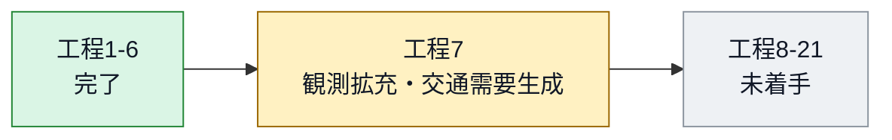

<!-- Generated from reproducibility/config/traffic_simulation/research_stage.yml. -->
<!-- Do not edit this file directly. Run the write command documented below. -->

# 研究進捗ダッシュボード

**状態更新日:** 2026-09-11

## 現在地

| 項目 | 状態 |
|---|---|
| 現在工程 | 7 / 21: **観測拡充・交通需要生成** |
| 完了工程 | 6工程 |
| 概要 | 正式道路網とRouting Baselineは受入済み。full-EVRP本線では需要・顧客・TW等の定義が未完である一方、独立したreduced route-ordering branchはR21/R22 PASS、R23 Reduced Problem baseline ACCEPTED_WITH_LIMITATIONS |



工程ごとの作業量が均等ではないため、進捗率は表示しない。

## 研究利用可否

| 対象 | 判定 | 説明 |
|---|---|---|
| 道路網仕様 | **受入済み** (`accepted`) | V18 geometry/length re-acceptanceとR12-R14 Routing Baseline validationがPASS。旧v16停止記録は履歴であり現行network gateではない |
| 正式SUMO道路網 | **受入済み** (`accepted`) | current V18 authorityでFORMAL_NETWORK_ACCEPTED=true。accepted scopeとhashはEVRP_EXECUTION_PLAN.mdを正本とする |
| 下流実験 | **scope別** (`scope_split`) | full-EVRP比較は未準備。R23既存n5 evidenceはACCEPTED_WITH_LIMITATIONSで保持。standing auditはCODE_AUDIT_FAIL / CODE_AUDIT_RESULT_NOT_REPRODUCED。I03修正完了、REMEDIATION_COMPLETED_PENDING_INDEPENDENT_REAUDIT。rank02/03未再承認、B2旧terminal-index SHA不整合6件を新gateが検出 |

## 現在の阻害事項

- full-EVRP本線ではR05-R11のcustomer sampling、demand、time window、service time、depot、EV、charging station定義が未完了
- full-EVRP R20はcapacity、time window、battery/SOC、charging、fleet、一般reachabilityを含むaccepted QUBOがなくBLOCKED
- reduced R23はroute recovery 3/3、optimizer reported success 2/3。rank01 success=false、cap reached。runtime benchmark PRELIMINARY_ONLY、n≥6非推奨。R24はNOT_AUTHORIZED_PENDING_R23_REMEDIATION
- Aer結果を量子実機性能またはquantum advantageへ一般化できない

## 次の作業

1. EVRP_EXECUTION_PLAN.mdに従いfull-EVRP本線の未完Definition stageを進める
2. R23_N5_RUNTIME_OPTIMIZATION_CODE_AUDIT_POST_REMEDIATION_RERUNを別taskで実施。I03修正とB2旧SHA不整合の検出結果をレビューし、独立PASS後のみphase closureとR24を検討する
3. R23 pilotとformal baselineを分離し、R22 Hamiltonianとlambdaを変更しない
4. full-EVRP/Hayate評価とreduced method evidenceをscope付きで統合する

## 全工程

| # | 工程ID | 工程 | 状態 | 証拠 |
|---:|---|---|---|---|
| 1 | `environment` | Docker・リポジトリ環境 | 完了 | [compose.yaml](compose.yaml)<br>[Dockerfile](docker/analysis/Dockerfile) |
| 2 | `data_governance` | データ取得・来歴規約 | 完了 | [README.md](03_data/metadata/acquisition/README.md)<br>[traffic_simulation_sources.csv](03_data/metadata/traffic_simulation_sources.csv) |
| 3 | `study_area` | N03大田区研究範囲 | 完了 | [study_areas.yml](reproducibility/config/traffic_simulation/study_areas.yml)<br>[20260717_mlit_n03_2026_tokyo_acquisition.md](03_data/metadata/acquisition/20260717_mlit_n03_2026_tokyo_acquisition.md) |
| 4 | `baseline_inputs` | JARTIC・OSM基礎入力 | 完了 | [20260717_jartic_traffic_volume_acquisition.md](03_data/metadata/acquisition/20260717_jartic_traffic_volume_acquisition.md)<br>[20260717_osm_ota_ward_acquisition.md](03_data/metadata/acquisition/20260717_osm_ota_ward_acquisition.md) |
| 5 | `input_visualization` | 入力道路・観測点レビュー地図 | 完了 | [render_study_area.py](05_src/traffic_simulation/visualization/render_study_area.py)<br>[README.md](05_src/traffic_simulation/visualization/README.md) |
| 6 | `sumo_network` | SUMO道路網生成・構造検証 | 完了 | [relation_closure_v16.yml](reproducibility/config/traffic_simulation/relation_closure_v16.yml)<br>[20260730_ota_ward_relation_closure_v16.md](03_data/metadata/acquisition/20260730_ota_ward_relation_closure_v16.md)<br>[20260730_ota_ward_v15_exception_rule_validation.md](03_data/metadata/acquisition/20260730_ota_ward_v15_exception_rule_validation.md)<br>[build_sumo_network.py](05_src/traffic_simulation/network/build_sumo_network.py)<br>[classify_resolver_exceptions.py](05_src/traffic_simulation/network/classify_resolver_exceptions.py) |
| 7 | `demand_and_observations` | **観測拡充・交通需要生成** | **進行中** | [EVRP_EXECUTION_PLAN.md](EVRP_EXECUTION_PLAN.md) |
| 8 | `optimization_implementation_validation` | 最適化基盤検証・配送EV制約の段階追加 | 未着手 | - |
| 9 | `signal_vehicle_driver` | 信号・車両・運転行動設定 | 未着手 | - |
| 10 | `calibration` | 交通モデル較正 | 未着手 | - |
| 11 | `independent_validation` | 独立データ検証 | 未着手 | - |
| 12 | `environment_scenarios` | 天候・事故等の環境シナリオ固定 | 未着手 | - |
| 13 | `delivery_instance` | 正式コスト行列・共通配送問題固定 | 未着手 | - |
| 14 | `classical_qaoa` | 古典最適化・Aer QAOA正式比較 | 未着手 | - |
| 15 | `simulation_evaluation` | 同一SUMO環境で走行・比較評価 | 未着手 | - |
| 16 | `driver_sensitivity` | 熟練ドライバー差の感度分析 | 未着手 | - |
| 17 | `ev_delivery_evaluation` | EV配送・配送需要充足人口相当評価 | 未着手 | - |
| 18 | `spatial_expansion` | 段階的な空間拡張 | 未着手 | - |
| 19 | `ci_reproducibility` | CI・再現性検査 | 未着手 | - |
| 20 | `hayate_reproduction` | hayate再現 | 未着手 | - |
| 21 | `final_artifacts` | 最終成果物・限界の固定 | 未着手 | - |

## 更新方法

状態は次のYAMLだけを編集する。成果物の存在だけで工程を自動昇格させない。

`reproducibility/config/traffic_simulation/research_stage.yml`

YAML更新後にダッシュボードを再生成する。

```bash
PYTHONPATH=05_src python -m traffic_simulation.research_stage --write
```

同期状態だけを確認する場合は次を実行する。

```bash
PYTHONPATH=05_src python -m traffic_simulation.research_stage --check
```
