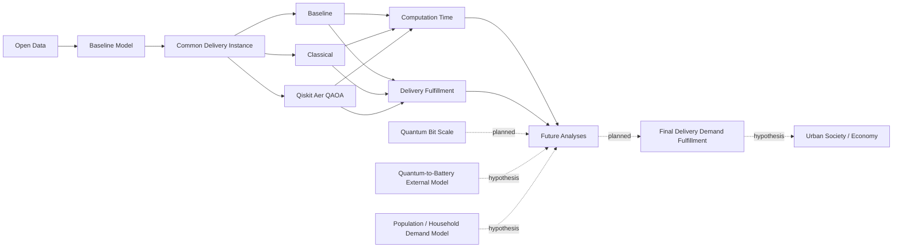

# 研究可視化ポータル 研究仕様書

文書状態: Draft  
調査基準日: 2026-08-28  
対象: `/home/takuma/kmd-analysis`  
関連UI仕様: [research_portal_ui_spec.md](research_portal_ui_spec.md)

## 1. 目的

本ポータルは、プロジェクトメンバーが研究の全体構造、現在地、モデル間関係、利用データ、変数・パラメータ、仮説、未実装部分、Evidenceを、一枚地図を入口として把握するための内部向け研究可視化サイトである。

Web表示する研究内容の唯一の正本（Single Source of Truth）は、今後導入する機械可読な `Research Portal Registry` とする。WebアプリはREADME、Markdown、ソースコード、実行成果物を走査して研究内容を推定してはならない。repository内ファイルはRegistryから参照されるEvidenceであり、Web表示の第二の正本ではない。

この仕様はRegistryとWebサイトの設計のみを定める。Registry本体、Schema、validator、Web UIは今回実装しない。

## 2. 想定利用者

- 研究代表者・研究実施者: 現在工程、依存関係、blocked要因、次に確定すべき項目を確認する。
- 共同研究者・指導者: 研究上の主張と、実装・データ・検証Evidenceの境界をレビューする。
- 実装担当者: モデル、入力、変数、出力、受入ゲート、未実装部分を追跡する。
- 新規参加者: 一枚地図から研究全体を理解し、詳細Drawerから根拠ファイルへ移動する。

一般公開者向けの説明サイト、実験実行UI、成果物ダウンロードポータルは初期対象外とする。

## 3. 基本原則

1. **Registry-only rendering**: ノード、relation、status、説明、変数、Evidence、表示順はRegistryだけから描画する。
2. **No inference**: CodexおよびWebアプリはrepositoryにない研究内容、因果、数値、完了状態を推測・追加しない。
3. **Fact / design separation**: repositoryで確認できる現状と、将来構想・仮説・外部モデルを別フィールドで明示する。
4. **Unknown preservation**: 未確定は `unknown` とし、空欄や暫定値を確定値として補完しない。
5. **Planned preservation**: 将来構築予定は `planned` とし、実装済みの見た目にしない。
6. **Traceability**: 各ノード・relation・変数・status判定から、根拠または設計意図を記録したrepository相対pathへ到達できる。
7. **Scientific readiness separation**: コードが存在することと、正式研究結果に使用可能であることを分ける。
8. **Failure visibility**: blocked、未受理、未評価、矛盾、Evidence不足を成功状態と同じく表示する。
9. **No overwrite of history**: Evidenceは履歴を上書きせず、Registryで現行採用・廃止・置換関係を管理する。

## 4. 調査で確認した研究の現状

### 4.1 現時点の中心線

```text
Open Data
  → Baseline Model（道路・一般交通・合成配送需要の基盤を構築中）
  → Common Delivery Instance（未固定）
  → Baseline / Classical / Qiskit Aer QAOA（正式比較前）
  → Computation Time / Delivery Fulfillment（正式値は未算出）
  → Future Analyses（planned / hypothesis / external model）
```

これは概念上の入口であり、全工程が直列に完了済みという意味ではない。特に2026-08-28時点では、一般交通のroute-generation設定が未凍結で、既存候補は品質ゲートを満たしていない。共通配送問題、古典比較、Aer QAOA比較、正式な配送需要充足値は未完成である。

### 4.2 初期Registryへ移す推奨ノード

次表のstatusは、調査結果を初期Registryへ転記する際の候補であり、本仕様書自体をWeb表示の正本にしてはならない。Registry作成時に研究責任者がEvidenceを再確認し、`reviewed_by` と `reviewed_at` を付けて承認する。

| 初期ID | 表示名 | node kind | status候補 | nature | repository根拠と境界 |
|---|---|---|---|---|---|
| `data.open_data` | Open Data | `dataset_group` | `implemented` | `repository_grounded` | データ台帳と取得記録が存在する。ただし各datasetの利用可否は個別statusを持つ。 |
| `model.baseline` | Baseline Model | `model` | `in_progress` | `repository_grounded` | 道路、交通、需要の一部は実装済み。一般交通route-generationは未凍結、正式較正・独立Validationは未完了。 |
| `instance.common_delivery` | Common Delivery Instance | `experiment_instance` | `planned` | `repository_grounded_design` | 同一顧客、車両、需要、cost、制約等の契約は文書化されるが、正式instanceは未固定。 |
| `method.baseline` | Baseline / fixed_hash_no_reordering | `method` | `in_progress` | `repository_grounded_design` | 合成需要の計算コードと比較器仕様がある。正式な配送点・車両・完了判定を使う比較実行は未完了。 |
| `method.classical` | Classical Optimization | `method` | `planned` | `repository_grounded_design` | 比較規約と実装計画はあるが、正式solver実装・結果は確認できない。 |
| `method.qaoa_aer` | Qiskit Aer QAOA | `method` | `planned` | `repository_grounded_design` | QUBO/QAOA/Aerの方針はあるが、正式実装・結果は確認できない。Aerは量子実機ではない。 |
| `metric.computation_time` | Computation Time | `metric` | `planned` | `repository_grounded_design` | 前処理、QUBO生成、shots、復号、修復等を含む計測境界は方針化されるが値はない。 |
| `metric.delivery_fulfillment` | Delivery Fulfillment | `metric` | `blocked` | `repository_grounded_design` | 指標概念は定義済みだが、配送停止、車両、稼働時間、道路・交通等が未固定で正式値を計算できない。 |
| `future.qubit_scale` | Quantum Bit Scale Analysis | `analysis` | `planned` | `repository_grounded_design` | qubit幅・scale gapの文献分析資産はある。配送比較結果との正式接続は将来分析。 |
| `future.battery_external_model` | Quantum-to-Battery External Model | `external_model` | `planned` | `hypothesis` | 量子材料・化学知見を性能範囲へ変換する構想はあるが、量子計算から電池性能への直接因果モデルはない。 |
| `future.demand_statistical_model` | Population / Household Demand Model | `external_model` | `planned` | `hypothesis` | 世帯・EC利用から需要を構成する式は構想として記載される。係数・推定・Validationは未確定。 |
| `future.final_fulfillment` | Final Delivery Demand Fulfillment | `outcome` | `planned` | `hypothesis` | 将来需要・車両技術・solverを統合した最終評価は未実装。 |
| `future.urban_society_economy` | Urban Society / Economy | `outcome` | `planned` | `hypothesis` | application-stage / social-requirement接続の構想はあるが、repository内に定量的な接続モデルはない。 |

### 4.3 現状と将来構想の境界

- 「Qiskit Aer QAOA」は計画された回路シミュレーション手法であり、量子実機性能または量子優位性のEvidenceではない。
- `82,023宅配便個数相当／日`は実注文数、実配送先数、実停止数、実受取人数ではない。
- 現在の人口・施設・充電器等の一部はproxyまたは合成入力であり、観測された配送運用ではない。
- Future Wheels等のscoreやconditional plausibilityは観測確率ではない。将来分析ノードの設計・不確実性Evidenceとして扱う。
- 量子計算からバッテリー性能、人口・世帯から配送需要、配送成果からUrban Society / Economyへの接続は、それぞれ独立した外部モデルまたは仮説として扱い、矢印だけで因果確定を表現しない。

## 5. 一枚地図の研究構成

### 5.1 デフォルトview



### 5.2 展開時のsubgraph

`Baseline Model` は少なくとも次へ展開できる。

- Study Area / Road Network
- General Traffic Demand and Routing
- Calibration Observations
- Independent Validation Observations
- Synthetic Delivery Demand
- Vehicle / EV / Charging Conditions
- SUMO Simulation

`Common Delivery Instance` は少なくとも次へ展開できる。

- customers / aggregated delivery requests
- depot(s)
- vehicles and capacities
- demand
- distance / travel-time / energy matrices
- constraints and objective
- feasibility checker and final evaluator
- common seeds and solver-specific seeds

`Future Analyses` は現行モデルに混ぜず、planned専用subgraphとして展開する。

## 6. ノード種別

Registryの `kind` は次のclosed vocabularyとする。

| kind | 用途 | 例 |
|---|---|---|
| `research_question` | 研究目的・問い | 量子計算が都市配送需要充足へ与える影響 |
| `stage` | 研究工程・ゲート | traffic routing, independent validation |
| `dataset` / `dataset_group` | 入力データまたは集合 | OSM, Road Census, Open Data |
| `model` | 内部モデル | Baseline Model |
| `external_model` | repository外の知識・推定を必要とする接続モデル | battery performance model |
| `experiment_instance` | solver間で凍結する共通問題 | Common Delivery Instance |
| `method` | 比較手法・処理 | baseline, classical, QAOA |
| `simulation` | 実行・動的評価 | SUMO delivery simulation |
| `metric` | 評価指標 | computation time, fulfillment |
| `variable` | 観測・派生・出力変数 | completed demand, travel time |
| `parameter` | 事前固定・仮定・感度値 | vehicle count, QAOA reps |
| `hypothesis` | 未検証の命題 | battery improvement may affect fulfillment |
| `outcome` | 上位成果・社会接続 | Urban Society / Economy |
| `evidence_group` | 複数Evidenceの論理集合 | calibration acceptance evidence |
| `issue` | blocker・矛盾・要確認 | route-generation setting not frozen |

大きな地図では `variable` と `parameter` を初期非表示にできるが、削除せずDrawerとfilterから到達可能にする。

## 7. relation種別

relationは有向edgeとし、`source`、`target`、`type`、`status`、`nature`、`evidence_refs` を必須とする。矢印は因果を自動的に意味しない。

| type | 意味 |
|---|---|
| `inputs_to` | データ・変数を入力する |
| `transforms_to` | 明示した変換規則で別表現を生成する |
| `parameterizes` | parameterがモデル・手法の挙動を設定する |
| `produces` | 実行またはモデルが成果・metricを出す |
| `evaluated_by` | 対象をmetric・checkerで評価する |
| `compares_with` | 同一条件で比較する対称関係。双方向描画する |
| `depends_on` | targetの開始・成立にsourceが必要である |
| `blocked_by` | 未解消issueがtargetを停止する |
| `calibrated_by` | 較正用Evidenceとの関係 |
| `validated_by` | 未使用観測等による独立Validationとの関係 |
| `supports` | Evidenceが主張・status・設計を支持する |
| `hypothesizes_influence_on` | 未検証の影響仮説。実線の因果矢印にしない |
| `projects_to` | 統計・scenario・external modelによる将来投影 |
| `supersedes` | 新しい記録が旧記録を置換する。旧記録は保持する |

`supports` は実証済みを意味せず、Evidenceの `role` と `strength` を併読する。`hypothesizes_influence_on` と `projects_to` は `nature: hypothesis` または `external_model` を必須とする。

## 8. status定義

### 8.1 canonical status

| status | 定義 | 必須条件 |
|---|---|---|
| `implemented` | 対象がrepositoryに実体として存在し、定義した実装完了条件を満たす | 実装Evidence、検査Evidence、review情報を持つ。研究利用可能性は別の `readiness` で示す |
| `in_progress` | 仕様化・実装・検証の作業中、または一部だけ利用できる | 完了済み範囲、未完了範囲、next actionを持つ |
| `planned` | 将来構築・実行予定で、完了した実体または結果がない | design-intent Evidence、entry condition、期待するoutputを持つ |
| `blocked` | 進行に必要な入力・判断・上流gateが満たされず停止中 | 1件以上の `blocked_by` relation、解除条件を持つ |
| `unknown` | repository根拠または判断が不足し、他のstatusを正当に割り当てられない | `unknown_reason` と確認方法を持つ。空欄代用は禁止 |

### 8.2 既存statusからの移行

| 既存表現 | Registryへの原則変換 |
|---|---|
| `COMPLETE`, `completed` | 根拠と完了条件を再確認後 `implemented` |
| `CURRENT`, `PARTIAL` | `in_progress` |
| `NOT STARTED`, `NOT-STARTED` | `planned` |
| `BLOCKED` | `blocked` |
| `not_accepted`, `not_ready`, `rejected` | statusを機械的に一意変換せず、実装状況と `readiness` を分けて再判定 |
| 未記載・矛盾 | `unknown` |

### 8.3 readinessとstatusの分離

`status` は作業・実装の状態を表す。研究結果への利用可否は `readiness` で表す。

`readiness` の値は `accepted` / `provisional` / `not_accepted` / `not_evaluated` / `unknown` とする。例: コードとunit testが存在する道路網処理は `status: implemented` でも、正式道路網として未受理なら `readiness: not_accepted` になり得る。

## 9. 変数・パラメータ・仮説の表現

変数とパラメータはnodeとして地図に出せるほか、所有nodeのDrawerに一覧表示する。最低フィールドは次のとおり。

- `id`, `label_ja`, `symbol`
- `kind`: `variable` または `parameter`
- `role`: `observed` / `derived` / `estimated` / `model_assumed` / `sensitivity` / `output`
- `value`: 確定値がある場合のみ。未確定値を仮置きしない
- `unit`, `data_type`, `allowed_range`
- `scope`, `time_basis`, `geographic_scope`
- `owner_node_refs`
- `status`, `readiness`
- `evidence_refs`, `uncertainty`, `limitations`

仮説nodeは `statement`、`independent_variables`、`dependent_variables`、`mechanism_status`、`test_method`、`falsification_or_rejection_condition`、`evidence_refs` を持つ。未定義項目は `unknown` と明示する。

## 10. Registry構造

### 10.1 配置

実装時の推奨配置は次とする。

```text
reproducibility/config/research_portal/
  registry.yml
  research_portal_registry.schema.json
```

`registry.yml` が研究表示内容の唯一の正本である。Schemaは構造の正本であり研究内容を保持しない。表示用JSON、検索index、layout座標は生成物とし、直接編集しない。

### 10.2 root構造

```yaml
schema_version: 1
registry_id: kmd_research_portal
registry_version: 1
updated_at: "2026-08-28"
reviewed_by: unknown
default_view_id: research_overview
metadata:
  title_ja: 東京都市配送×量子未来社会
  scope_note_ja: 大田区を起点とする合成都市配送研究
controlled_vocabularies: {}
evidence: []
nodes: []
relations: []
views: []
known_conflicts: []
```

### 10.3 node最小例

```yaml
- id: method.qaoa_aer
  label_ja: Qiskit Aer QAOA
  kind: method
  status: planned
  readiness: not_evaluated
  nature: repository_grounded_design
  summary_ja: 共通配送問題をQUBO化し、古典計算機上のAerで回路を模擬する計画
  current_state_ja: 正式実装・正式比較結果は未確認
  not_claimed_ja:
    - 量子実機性能
    - 量子優位性
  evidence_refs:
    - ev.optimization_protocol
    - ev.readme_qaoa_scope
  variables: []
  parameters: []
  entry_conditions:
    - instance.common_delivery is frozen
  exit_conditions: unknown
  next_actions: []
  limitations: []
  tags: [optimization, qaoa, simulator]
  review:
    reviewed_by: unknown
    reviewed_at: unknown
```

### 10.4 evidence最小例

```yaml
- id: ev.optimization_protocol
  path: 05_src/traffic_simulation/optimization_comparison_protocol.md
  label_ja: 古典・QAOA比較規約
  role: design_intent
  supports:
    - method.qaoa_aer
    - instance.common_delivery
  locator:
    heading: Common Instance
    line_start: unknown
  version:
    git_commit: unknown
    sha256: unknown
  strength: direct_repository_evidence
  limitations_ja: 比較結果または実装完了のEvidenceではない
```

### 10.5 view

`views` は研究内容ではなく、Registry内node/relationの表示集合を定める。最低限 `research_overview`、`current_stage`、`data_lineage`、`future_analysis` を用意できる構造とする。default位置はRegistryに保存してよいが、自動layoutによる一時座標は生成物に保存する。

## 11. Evidence / provenanceルール

1. Evidence pathはrepository root相対pathとし、絶対path、`..`、外部URLだけのEvidenceを禁止する。
2. pathが存在するだけでは十分でなく、`role` を `observation` / `input_registry` / `specification` / `implementation` / `test` / `run_artifact` / `acceptance_decision` / `design_intent` / `limitation` のいずれかで示す。
3. statusを `implemented` にするには、原則として `implementation` と `test` または `acceptance_decision` のEvidenceを要する。
4. `planned` nodeは `design_intent` Evidenceを要する。repositoryに設計意図すらない場合は、最初にRegistry上で `nature: hypothesis`、`evidence_gap: true` とし、外部事実を記入しない。
5. Evidence locatorはMarkdown heading、CSV key、YAML/JSON pointer、コードsymbol、artifact IDのいずれかを使う。line番号だけに依存しない。
6. 数値を表示する場合、単位、対象期間、地理範囲、分母、変換、source artifactを必須とする。
7. 生成成果物はinput/config/code/environment/outputの識別値を可能な範囲で保存する。Git外の大容量成果物は存在可否と再生成方法を示す。
8. Evidenceが古い、矛盾する、置換済みの場合は削除せず `superseded_by` または `known_conflicts` で表す。
9. repositoryファイルへのlinkは閲覧用であり、Webアプリが内容を読み直してRegistryを上書きしてはならない。
10. 第三者データはライセンス、再配布制限、取得日、SHA-256を既存データ台帳へ追跡する。

## 12. 更新フロー

1. 研究作業により仕様、実装、実行結果、受入判断のEvidenceをrepositoryへ追加する。
2. 研究担当者が `registry.yml` の対象node/relation/variable/evidenceを更新する。
3. status変更時は、変更理由、旧status、新status、根拠、review者、日付をRegistry履歴に記録する。
4. validatorでSchema、参照整合、path存在、status条件、循環、孤立node、Evidence条件を検査する。
5. reviewerがfact/design、implemented/readiness、current/supersededを確認する。
6. Registry変更をmergeする。
7. CIが表示用artifactをRegistryだけから再生成し、Webサイトを更新する。

repositoryのMarkdownまたはコードだけを変更してRegistryを更新しなかった場合、Web表示は変わらない。これは意図した動作であり、CIは「Evidence側変更に対するRegistry確認漏れ」をwarningとして報告できるが、自動推論でstatusを変えない。

## 13. validationルール

### 13.1 errorとして停止する項目

- YAMLまたはSchema不適合、未知field、未知enum
- node/relation/evidence IDの重複
- relationのsource/target、Evidence ref、owner ref、view refの不在
- repository Evidence pathの不在、絶対path、path traversal
- `implemented` なのにimplementation/test/acceptance Evidenceがない
- `blocked` なのに `blocked_by` または解除条件がない
- `unknown` なのに理由がない
- `planned` relationを実線の確定relationとして指定する
- `hypothesizes_influence_on` に `nature` または不確実性表示がない
- 数値にunit、scope、sourceがない
- `compares_with` で比較条件またはcommon instanceが参照されない
- Qiskit Aer nodeがquantum hardwareまたはquantum advantageを主張する文言を持つ
- generated artifactをRegistry正本として参照する循環構造

### 13.2 warningとしてレビューする項目

- map上の孤立node
- 90日等の運用閾値を超えた未レビューstatus
- `line_start` のみでheading/symbol等の安定locatorがない
- `planned` / `unknown` のまま長期更新されない項目
- 同一対象に相反するcurrent Evidenceがある
- viewに含まれないnode
- Evidence pathが未コミットまたはGit外artifactで、再生成手順がない

### 13.3 graph整合

- `depends_on` / `blocked_by` の循環は原則error。研究上必要な循環モデルは `influences` 系の別relationとして明示する。
- `supersedes` は有向非循環でなければならない。
- future subgraphから現行実装nodeへ戻るrelationは、既存結果の根拠に見えないよう `planned` または `hypothesis` に限定する。

## 14. repository既存資産との対応

| Registry領域 | 主な既存資産 | 初期利用方針 |
|---|---|---|
| 研究目的・全体像 | `README.md` | 概要と設計意図のEvidence。数値・現在地は後発記録を優先して移行 |
| 研究工程・作業規則 | `00_project_management/0-2-A_20260823_COMPLETE_研究全体構造と作業管理規則.md` | stage hierarchyと旧statusの移行元 |
| 最新横断課題 | `00_project_management/0-2-C_20260825_CURRENT_研究上の問題点とモデル課題.md` | issue、blocker、利用可否のEvidence |
| 機械可読進捗 | `reproducibility/config/traffic_simulation/research_stage.yml` | 既存assetとして参照するが、更新日が古くstatus集合も不足するためPortal Registryへ直接流用しない |
| 進捗loader | `05_src/traffic_simulation/research_stage.py` | Registry-only生成の先行実装パターン。Portal用には5 status対応が必要 |
| データ台帳 | `03_data/metadata/traffic_simulation_sources.csv` | dataset Evidenceと第三者データprovenance |
| データ来歴 | `03_data/metadata/data_provenance.md`, `03_data/metadata/acquisition/` | 取得・処理・制限 |
| Baseline demand | `05_src/traffic_simulation/demand/20260718_20260903_baseline_demand_and_comparator.md`, `prepare_baseline_demand.py`, `baseline_demand.yml` | 合成需要、指標境界、比較器の仕様・実装Evidence |
| Baseline traffic current | `05_src/traffic_simulation/road_census_sumo_current_baseline.md` | 2026-08-27時点のmapping・属性未完了状態 |
| Route generation | `05_src/traffic_simulation/marouter_route_generation_specification.md`, `calibration/diagnose_marouter_route_generation.py` | 2026-08-28時点のcurrent stageと不合格gate Evidence |
| 車両条件 | `reproducibility/config/traffic_simulation/scenario_profiles/managed_urban_ev_delivery_v1.yml` | 固定モデル仮定。実測車両と表示しない |
| 比較規約 | `05_src/traffic_simulation/optimization_comparison_protocol.md` | common instance、公平性、計算時間境界、Aerの解釈 |
| V&V | `05_src/traffic_simulation/20260730_20260903_simulation_model_development_and_vv.md` | verification/calibration/validation/readinessの区別 |
| 将来・scale分析 | `05_src/literature_analysis/make_scale_gap_analysis.py`, `make_updated_future_wheels.py`, `05_src/visualization/make_future_wheels_figures.py` | 将来分析の設計・文献Evidence。現在の配送モデル結果とは分離 |
| 研究構造 | `01_research_design/research_structure.md`, `analysis_method.md` | synthetic/proxyの限界、次段階の設計Evidence |

## 15. 不足・矛盾・要確認事項

1. **Portal Registryが未存在**: 現在の正本は用途別に複数存在する。初期Registry作成時に責任者と承認フローを決める必要がある。
2. **進捗の時間差**: `research_stage.yml` は2026-07-31更新で、READMEは2026-08-25、Road Census snapshotは2026-08-27、marouter診断は2026-08-28である。既存YAMLを最新状態とみなせない。
3. **status語彙の不一致**: COMPLETE/CURRENT/PARTIAL/NOT STARTED/BLOCKED、completed/in_progress/planned、not_accepted/rejected等が併存する。移行時にstatusとreadinessを分離する必要がある。
4. **Baselineの粒度**: baseline demand計算、未最適化比較器、道路交通baseline、SUMO baselineが別対象である。単一nodeにまとめすぎずsubnode化する必要がある。
5. **正式なCommon Delivery Instanceが未固定**: 配送停止、拠点、車両数、積載、再積載、稼働時間、時間窓、サービス時間、EV/充電、cost matrixが不足する。
6. **solver実装・結果不足**: ClassicalとAer QAOAの正式比較コード・run artifact・acceptance Evidenceは確認できない。
7. **metric名の要確認**: `Delivery Fulfillment`、配送需要充足率、配送需要充足人口相当 `P_eq` が併存する。分母・単位・主指標/補助指標をRegistry作成前に確定する。
8. **Computation Time境界の要確認**: equal-budget比較とbest-reference比較を分け、前処理・QUBO・回路評価・復号・修復・SUMO評価の包含範囲を確定する必要がある。
9. **future外部モデル不足**: quantum→battery、population/household/EC→demand、fulfillment→Urban Society/Economyの定量モデル、係数、Validation、外部sourceは未確定である。
10. **Evidence locator**: 既存Markdownはheading変更があり得る。安定ID、artifact ID、JSON pointerの導入が望ましい。
11. **成果物のGit外配置**: `reproducibility/outputs/` の一部はGit管理外であり、Web deployment環境から直接開けない可能性がある。閲覧proxyまたは再生成情報の方針が必要。
12. **言語**: 日本語をprimaryとするか、日英併記を必須にするか未確定。初期版は `label_ja` と `summary_ja` を必須、英語は任意を推奨する。

## 16. 実装しないこと

- 今回はWeb UI、Registry、Schema、validator、CI、APIを実装しない。
- repositoryをクロールして研究内容やstatusを自動生成しない。
- 文献や外部Webから新しい研究主張、数値、将来予測を追加しない。
- 量子実機性能、量子優位性、実配送需要、実顧客、実受取人数、東京全域への一般化を主張しない。
- planned nodeをimplementedに見せるデモデータを作らない。
- 研究コードの実行、較正、QAOA実験、SUMO結果の再計算を行わない。
- Registryからrepository Evidenceファイルを編集する機能を作らない。
- Wiki、タスク管理、実験orchestration、ファイルアップロード、コメント機能を初期scopeに含めない。

## 17. 研究仕様の受入条件

- 一枚地図の全node/relationがRegistryからのみ得られる。
- 現状とfuture/planned/hypothesis/external modelが混同されない。
- 5 statusとreadinessが別軸で定義される。
- 各nodeから少なくとも設計意図または現状のrepository Evidenceへ到達できる。
- Evidenceの役割が実装、試験、結果、受入、設計意図、限界として区別される。
- variables、parameters、hypotheses、issues、unknownが隠蔽されない。
- READMEやコード変更だけではWeb表示が変わらず、Registry更新後に検証・再生成される。
- 既存assetの矛盾と更新日の差が初期Registryで解消または明示される。
