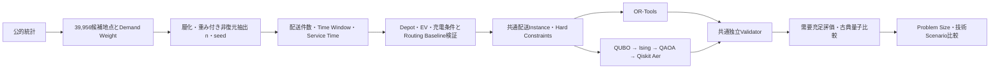

# 研究可視化ポータル 研究仕様書

文書状態: Draft  
調査基準日: 2026-08-28  
対象: `/home/takuma/kmd-analysis`  
関連画面仕様: [research_portal_ui_spec.md](research_portal_ui_spec.md)

## 2026-09-09の設計更新

今後の研究パイプラインは[最新B2C配送パイプライン](RESEARCH_PIPELINE_REFERENCE.md#b2c-pipeline-20260909)を設計正本とする。住宅向け宅配を主対象に、39,956候補地点から層化・重み付き非復元抽出し、顧客数nと複数乱数の種を実験パラメータにする。主需要単位は配送件数、基準は単一配送拠点、主指標はDFR_orders。OR-Toolsと制約なし二値二次最適化→量子近似最適化アルゴリズム→Qiskit Aerは同一問題例・共通必須制約を使用し、独立検証器を通して比較する。技術想定条件では顧客・需要・時間窓・道路条件を原則固定する。

旧記述との不整合は上記の最新方針を優先する。既存成果物の生成・受入事実は保持し、今後の設計採択を実装完了とは扱わない。

## 1. 目的

本ポータルは、プロジェクトメンバーが研究の全体構造、現在地、モデル間関係、利用データ、変数・パラメータ、仮説、未実装部分、根拠を、一枚地図を入口として把握するための内部向け研究可視化サイトである。

Web表示する研究内容の唯一の正本（Single 出典 of Truth）は、今後導入する機械可読な `Research Portal Registry` とする。Webアプリは案内文書、軽量マークアップ文書、ソースコード、実行成果物を走査して研究内容を推定してはならない。リポジトリ内ファイルは登録簿から参照される根拠であり、Web表示の第二の正本ではない。

この仕様は登録簿とWebサイトの設計のみを定める。登録簿本体、データ構造、検証器、Web 画面は今回実装しない。

## 2. 想定利用者

- 研究代表者・研究実施者: 現在工程、依存関係、blocked要因、次に確定すべき項目を確認する。
- 共同研究者・指導者: 研究上の主張と、実装・データ・検証根拠の境界をレビューする。
- 実装担当者: モデル、入力、変数、出力、受入ゲート、未実装部分を追跡する。
- 新規参加者: 一枚地図から研究全体を理解し、詳細Drawerから根拠ファイルへ移動する。

一般公開者向けの説明サイト、実験実行画面、成果物ダウンロードポータルは初期対象外とする。

## 3. 基本原則

1. **登録簿-only rendering**: ノード、関係、状況、説明、変数、根拠、表示順は登録簿だけから描画する。
2. **No inference**: CodexおよびWebアプリはリポジトリにない研究内容、因果、数値、完了状態を推測・追加しない。
3. **Fact / 設計 separation**: リポジトリで確認できる現状と、将来構想・仮説・外部モデルを別フィールドで明示する。
4. **Unknown preservation**: 未確定は `unknown` とし、空欄や暫定値を確定値として補完しない。
5. **Planned preservation**: 将来構築予定は `planned` とし、実装済みの見た目にしない。
6. **Traceability**: 各ノード・関係・変数・状況判定から、根拠または設計意図を記録したリポジトリ相対保存先へ到達できる。
7. **Scientific 準備状況 separation**: コードが存在することと、正式研究結果に使用可能であることを分ける。
8. **不具合 visibility**: blocked、未受理、未評価、矛盾、根拠不足を成功状態と同じく表示する。
9. **No overwrite of history**: 根拠は履歴を上書きせず、登録簿で現行採用・廃止・置換関係を管理する。

## 4. 調査で確認した研究の現状

### 4.1 現時点の中心線

```text
Open Data
  → Baseline Model（道路・一般交通・合成配送需要の基盤を構築中）
  → Common Delivery Instance（未固定）
  → Baseline / Classical / Qiskit Aer QAOA（正式比較前）
  → Computation Time / Delivery Fulfillment（正式値は未算出）
  → Future Analyses（planned / hypothesis / external model）
```

これは概念上の入口であり、全工程が直列に完了済みという意味ではない。特に2026-08-28時点では、一般交通の経路-生成設定が未凍結で、既存候補は品質ゲートを満たしていない。共通配送問題、古典比較、Aer 量子近似最適化アルゴリズム比較、正式な配送需要充足値は未完成である。

<a id="42-初期registryへ移す推奨ノード"></a>

### 4.2 初期登録簿へ移す推奨ノード

次表の状況は、調査結果を初期登録簿へ転記する際の候補であり、本仕様書自体をWeb表示の正本にしてはならない。登録簿作成時に研究責任者が根拠を再確認し、`reviewed_by` と `reviewed_at` を付けて承認する。

| 初期識別子 | 表示名 | node kind | 状況候補 | nature | リポジトリ根拠と境界 |
|---|---|---|---|---|---|
| `data.open_data` | Open Data | `dataset_group` | `implemented` | `repository_grounded` | データ台帳と取得記録が存在する。ただし各データセットの利用可否は個別状況を持つ。 |
| `model.baseline` | Baseline Model | `model` | `in_progress` | `repository_grounded` | 道路、交通、需要の一部は実装済み。一般交通経路-生成は未凍結、正式較正・独立検証は未完了。 |
| `instance.common_delivery` | 共通配送問題 | `experiment_instance` | `planned` | `repository_grounded_design` | 同一顧客、車両、需要、費用、制約等の契約は文書化されるが、正式問題例は未固定。 |
| `method.baseline` | Baseline / fixed_hash_no_reordering | `method` | `in_progress` | `repository_grounded_design` | 合成需要の計算コードと比較器仕様がある。正式な配送点・車両・完了判定を使う比較実行は未完了。 |
| `method.classical` | 古典最適化 | `method` | `planned` | `repository_grounded_design` | 比較規約と実装計画はあるが、正式求解器実装・結果は確認できない。 |
| `method.qaoa_aer` | Qiskit Aer QAOA | `method` | `planned` | `repository_grounded_design` | QUBO/QAOA/Aerの方針はあるが、正式実装・結果は確認できない。Aerは量子実機ではない。 |
| `metric.computation_time` | Computation Time | `metric` | `planned` | `repository_grounded_design` | 前処理、制約なし二値二次最適化生成、回測定、復号、修復等を含む計測境界は方針化されるが値はない。 |
| `metric.delivery_fulfillment` | 配送需要の充足 | `metric` | `blocked` | `repository_grounded_design` | 指標概念は定義済みだが、配送停止、車両、稼働時間、道路・交通等が未固定で正式値を計算できない。 |
| `future.qubit_scale` | Quantum Bit Scale Analysis | `analysis` | `planned` | `repository_grounded_design` | 量子ビット幅・規模 隔たりの文献分析資産はある。配送比較結果との正式接続は将来分析。 |
| `future.battery_external_model` | Quantum-to-Battery External Model | `external_model` | `planned` | `hypothesis` | 量子材料・化学知見を性能範囲へ変換する構想はあるが、量子計算から電池性能への直接因果モデルはない。 |
| `future.demand_statistical_model` | Population / Household Demand Model | `external_model` | `planned` | `hypothesis` | 世帯・EC利用から需要を構成する式は構想として記載される。係数・推定・検証は未確定。 |
| `future.final_fulfillment` | Final Delivery Demand Fulfillment | `outcome` | `planned` | `hypothesis` | 将来需要・車両技術・求解器を統合した最終評価は未実装。 |
| `future.urban_society_economy` | Urban Society / Economy | `outcome` | `planned` | `hypothesis` | application-stage / 社会的-要件接続の構想はあるが、リポジトリ内に定量的な接続モデルはない。 |

### 4.3 現状と将来構想の境界

- 「Qiskit Aer 量子近似最適化アルゴリズム」は計画された回路シミュレーション手法であり、量子実機性能または量子優位性の根拠ではない。
- `82,023宅配便個数相当／日`は実注文数、実配送先数、実停止数、実受取人数ではない。
- 現在の人口・施設・充電器等の一部は代理指標または合成入力であり、観測された配送運用ではない。
- Future Wheels等の得点や条件付き plausibilityは観測確率ではない。将来分析ノードの設計・不確実性根拠として扱う。
- 量子計算からバッテリー性能、人口・世帯から配送需要、配送成果からUrban Society / Economyへの接続は、それぞれ独立した外部モデルまたは仮説として扱い、矢印だけで因果確定を表現しない。

## 5. 一枚地図の研究構成

<a id="51-デフォルトview"></a>

### 5.1 デフォルト表示


```mermaid
flowchart LR
  OD[公的統計] --> C[39,956候補地点とDemand Weight]
  C --> S[層化・重み付き非復元抽出 n・seed]
  S --> D[配送件数・Time Window・Service Time]
  D --> R[Depot・EV・充電条件とRouting Baseline検証]
  R --> CDI[共通配送Instance・Hard Constraints]
  CDI --> OR[OR-Tools]
  CDI --> Q[QUBO → Ising → QAOA → Qiskit Aer]
  OR --> V[共通独立Validator]
  Q --> V
  V --> DF[需要充足評価・古典量子比較]
  DF --> SC[Problem Size・技術Scenario比較]
```

この図は2026-09-09採択の設計であり、実装状況は登録簿の証拠に従う。

### 5.2 展開時の部分グラフ

`Baseline Model` は少なくとも次へ展開できる。

- Study Area / Road Network
- General Traffic Demand and Routing
- Calibration Observations
- Independent Validation Observations
- Synthetic Delivery Demand
- Vehicle / EV / Charging Conditions
- SUMO Simulation

`Common Delivery Instance` は少なくとも次へ展開できる。

- customers / aggregated delivery requests
- depot(s)
- vehicles and capacities
- demand
- distance / travel-time / energy matrices
- constraints and objective
- feasibility checker and final evaluator
- common seeds and solver-specific seeds

`Future Analyses` は現行モデルに混ぜず、計画済み専用subgraphとして展開する。

## 6. ノード種別

登録簿の `kind` は次のclosed vocabularyとする。

| kind | 用途 | 例 |
|---|---|---|
| `research_question` | 研究目的・問い | 量子計算が都市配送需要充足へ与える影響 |
| `stage` | 研究工程・ゲート | traffic routing, independent validation |
| `dataset` / `dataset_group` | 入力データまたは集合 | OSM, Road Census, Open Data |
| `model` | 内部モデル | Baseline Model |
| `external_model` | リポジトリ外の知識・推定を必要とする接続モデル | battery performance model |
| `experiment_instance` | 求解器間で凍結する共通問題 | 共通配送問題 |
| `method` | 比較手法・処理 | baseline, classical, QAOA |
| `simulation` | 実行・動的評価 | SUMO delivery simulation |
| `metric` | 評価指標 | computation time, fulfillment |
| `variable` | 観測・派生・出力変数 | completed demand, travel time |
| `parameter` | 事前固定・仮定・感度値 | vehicle count, QAOA reps |
| `hypothesis` | 未検証の命題 | battery improvement may affect fulfillment |
| `outcome` | 上位成果・社会接続 | Urban Society / Economy |
| `evidence_group` | 複数根拠の論理集合 | calibration acceptance evidence |
| `issue` | 阻害要因・矛盾・要確認 | route-generation setting not frozen |

大きな地図では `variable` と `parameter` を初期非表示にできるが、削除せずDrawerと絞り込みから到達可能にする。

<a id="7-relation種別"></a>

## 7. 関係種別

関係は有向道路区間とし、`source`、`target`、`type`、`status`、`nature`、`evidence_refs` を必須とする。矢印は因果を自動的に意味しない。

| 種類 | 意味 |
|---|---|
| `inputs_to` | データ・変数を入力する |
| `transforms_to` | 明示した変換規則で別表現を生成する |
| `parameterizes` | パラメーターがモデル・手法の挙動を設定する |
| `produces` | 実行またはモデルが成果・評価指標を出す |
| `evaluated_by` | 対象を評価指標・検査器で評価する |
| `compares_with` | 同一条件で比較する対称関係。双方向描画する |
| `depends_on` | 対象の開始・成立に出典が必要である |
| `blocked_by` | 未解消課題が対象を停止する |
| `calibrated_by` | 較正用根拠との関係 |
| `validated_by` | 未使用観測等による独立検証との関係 |
| `supports` | 根拠が主張・状況・設計を支持する |
| `hypothesizes_influence_on` | 未検証の影響仮説。実線の因果矢印にしない |
| `projects_to` | 統計・想定条件・外部 モデルによる将来投影 |
| `supersedes` | 新しい記録が旧記録を置換する。旧記録は保持する |

`supports` は実証済みを意味せず、根拠の `role` と `strength` を併読する。`hypothesizes_influence_on` と `projects_to` は `nature: hypothesis` または `external_model` を必須とする。

<a id="8-status定義"></a>

## 8. 状況定義

<a id="81-canonical-status"></a>

### 8.1 正本 状況

| 状況 | 定義 | 必須条件 |
|---|---|---|
| `implemented` | 対象がリポジトリに実体として存在し、定義した実装完了条件を満たす | 実装根拠、検査根拠、確認情報を持つ。研究利用可能性は別の `readiness` で示す |
| `in_progress` | 仕様化・実装・検証の作業中、または一部だけ利用できる | 完了済み範囲、未完了範囲、next 処理を持つ |
| `planned` | 将来構築・実行予定で、完了した実体または結果がない | 設計-intent 根拠、入口 条件、期待する出力を持つ |
| `blocked` | 進行に必要な入力・判断・上流判定基準が満たされず停止中 | 1件以上の `blocked_by` 関係、解除条件を持つ |
| `unknown` | リポジトリ根拠または判断が不足し、他の状況を正当に割り当てられない | `unknown_reason` と確認方法を持つ。空欄代用は禁止 |

<a id="82-既存statusからの移行"></a>

### 8.2 既存状況からの移行

| 既存表現 | 登録簿への原則変換 |
|---|---|
| `COMPLETE`, `completed` | 根拠と完了条件を再確認後 `implemented` |
| `CURRENT`, `PARTIAL` | `in_progress` |
| `NOT STARTED`, `NOT-STARTED` | `planned` |
| `BLOCKED` | `blocked` |
| `not_accepted`, `not_ready`, `rejected` | 状況を機械的に一意変換せず、実装状況と `readiness` を分けて再判定 |
| 未記載・矛盾 | `unknown` |

<a id="83-readinessとstatusの分離"></a>

### 8.3 準備状況と状況の分離

`status` は作業・実装の状態を表す。研究結果への利用可否は `readiness` で表す。

`readiness` の値は `accepted` / `provisional` / `not_accepted` / `not_evaluated` / `unknown` とする。例: コードと単位 試験が存在する道路網処理は `status: implemented` でも、正式道路網として未受理なら `readiness: not_accepted` になり得る。

## 9. 変数・パラメータ・仮説の表現

変数とパラメータはノードとして地図に出せるほか、所有ノードのDrawerに一覧表示する。最低フィールドは次のとおり。

- `id`, `label_ja`, `symbol`
- `kind`: `variable` または `parameter`
- `role`: `observed` / `derived` / `estimated` / `model_assumed` / `sensitivity` / `output`
- `value`: 確定値がある場合のみ。未確定値を仮置きしない
- `unit`, `data_type`, `allowed_range`
- `scope`, `time_basis`, `geographic_scope`
- `owner_node_refs`
- `status`, `readiness`
- `evidence_refs`, `uncertainty`, `limitations`

仮説ノードは `statement`、`independent_variables`、`dependent_variables`、`mechanism_status`、`test_method`、`falsification_or_rejection_condition`、`evidence_refs` を持つ。未定義項目は `unknown` と明示する。

<a id="10-registry構造"></a>

## 10. 登録簿構造

### 10.1 配置

実装時の推奨配置は次とする。

```text
reproducibility/config/research_portal/
  registry.yml
  research_portal_registry.schema.json
```

`registry.yml` が研究表示内容の唯一の正本である。データ構造は構造の正本であり研究内容を保持しない。表示用ジェイソン形式、検索索引、配置座標は生成物とし、直接編集しない。

<a id="102-root構造"></a>

### 10.2 最上位構造

```yaml
schema_version: 1
registry_id: kmd_research_portal
registry_version: 1
updated_at: "2026-08-28"
reviewed_by: unknown
default_view_id: research_overview
metadata:
  title_ja: 東京都市配送×量子未来社会
  scope_note_ja: 大田区を起点とする合成都市配送研究
controlled_vocabularies: {}
evidence: []
nodes: []
relations: []
views: []
known_conflicts: []
```

<a id="103-node最小例"></a>

### 10.3 ノード最小例

```yaml
- id: method.qaoa_aer
  label_ja: Qiskit Aer QAOA
  kind: method
  status: planned
  readiness: not_evaluated
  nature: repository_grounded_design
  summary_ja: 共通配送問題をQUBO化し、古典計算機上のAerで回路を模擬する計画
  current_state_ja: 正式実装・正式比較結果は未確認
  not_claimed_ja:
    - 量子実機性能
    - 量子優位性
  evidence_refs:
    - ev.optimization_protocol
    - ev.readme_qaoa_scope
  variables: []
  parameters: []
  entry_conditions:
    - instance.common_delivery is frozen
  exit_conditions: unknown
  next_actions: []
  limitations: []
  tags: [optimization, qaoa, simulator]
  review:
    reviewed_by: unknown
    reviewed_at: unknown
```

<a id="104-evidence最小例"></a>

### 10.4 根拠最小例

```yaml
- id: ev.optimization_protocol
  path: 05_src/traffic_simulation/optimization_comparison_protocol.md
  label_ja: 古典・QAOA比較規約
  role: design_intent
  supports:
    - method.qaoa_aer
    - instance.common_delivery
  locator:
    heading: Common Instance
    line_start: unknown
  version:
    git_commit: unknown
    sha256: unknown
  strength: direct_repository_evidence
  limitations_ja: 比較結果または実装完了のEvidenceではない
```

<a id="105-view"></a>

### 10.5 表示

`views` は研究内容ではなく、登録簿内node/relationの表示集合を定める。最低限 `research_overview`、`current_stage`、`data_lineage`、`future_analysis` を用意できる構造とする。既定値位置は登録簿に保存してよいが、自動配置による一時座標は生成物に保存する。

<a id="11-evidence--provenanceルール"></a>

## 11. 根拠 / 出典・来歴ルール

1. 根拠 保存先はリポジトリの最上位相対保存先とし、絶対保存先、`..`、外部URLだけの根拠を禁止する。
2. 保存先が存在するだけでは十分でなく、`role` を `observation` / `input_registry` / `specification` / `implementation` / `test` / `run_artifact` / `acceptance_decision` / `design_intent` / `limitation` のいずれかで示す。
3. 状況を `implemented` にするには、原則として `implementation` と `test` または `acceptance_decision` の根拠を要する。
4. `planned` ノードは `design_intent` 根拠を要する。リポジトリに設計意図すらない場合は、最初に登録簿上で `nature: hypothesis`、`evidence_gap: true` とし、外部事実を記入しない。
5. 根拠 locatorは軽量マークアップ文書 heading、コンマ区切り形式 キー、YAML/JSON 参照先、コードsymbol、成果物 識別子のいずれかを使う。line番号だけに依存しない。
6. 数値を表示する場合、単位、対象期間、地理範囲、分母、変換、出典 成果物を必須とする。
7. 生成成果物はinput/config/code/environment/outputの識別値を可能な範囲で保存する。Git外の大容量成果物は存在可否と再生成方法を示す。
8. 根拠が古い、矛盾する、置換済みの場合は削除せず `superseded_by` または `known_conflicts` で表す。
9. リポジトリファイルへのリンクは閲覧用であり、Webアプリが内容を読み直して登録簿を上書きしてはならない。
10. 第三者データはライセンス、再配布制限、取得日、SHA-256を既存データ台帳へ追跡する。

## 12. 更新フロー

1. 研究作業により仕様、実装、実行結果、受入判断の根拠をリポジトリへ追加する。
2. 研究担当者が `registry.yml` の対象node/relation/variable/evidenceを更新する。
3. 状況変更時は、変更理由、旧状況、新状況、根拠、確認者、日付を登録簿履歴に記録する。
4. 検証器でデータ構造、参照整合、保存先存在、状況条件、循環、孤立ノード、根拠条件を検査する。
5. 確認者がfact/design、implemented/readiness、current/supersededを確認する。
6. 登録簿変更をmergeする。
7. CIが表示用成果物を登録簿だけから再生成し、Webサイトを更新する。

リポジトリの軽量マークアップ文書またはコードだけを変更して登録簿を更新しなかった場合、Web表示は変わらない。これは意図した動作であり、CIは「根拠側変更に対する登録簿確認漏れ」を注意事項として報告できるが、自動推論で状況を変えない。

<a id="13-validationルール"></a>

## 13. 検証ルール

<a id="131-errorとして停止する項目"></a>

### 13.1 誤りとして停止する項目

- ヤムル形式またはデータ構造不適合、未知項目、未知列挙値
- node/relation/evidence 識別子の重複
- 関係のsource/target、根拠 ref、owner ref、表示 refの不在
- リポジトリ 根拠 保存先の不在、絶対保存先、保存先 traversal
- `implemented` なのにimplementation/test/acceptance 根拠がない
- `blocked` なのに `blocked_by` または解除条件がない
- `unknown` なのに理由がない
- `planned` 関係を実線の確定関係として指定する
- `hypothesizes_influence_on` に `nature` または不確実性表示がない
- 数値に単位、範囲、出典がない
- `compares_with` で比較条件またはcommon 問題例が参照されない
- Qiskit Aer ノードが量子計算 実機または量子優位性を主張する文言を持つ
- 生成済み 成果物を登録簿正本として参照する循環構造

<a id="132-warningとしてレビューする項目"></a>

### 13.2 注意事項としてレビューする項目

- マップ上の孤立ノード
- 90日等の運用閾値を超えた未レビュー状況
- `line_start` のみでheading/symbol等の安定locatorがない
- `planned` / `unknown` のまま長期更新されない項目
- 同一対象に相反する現行 根拠がある
- 表示に含まれないノード
- 根拠 保存先が未コミットまたはGit外成果物で、再生成手順がない

<a id="133-graph整合"></a>

### 13.3 グラフ整合

- `depends_on` / `blocked_by` の循環は原則誤り。研究上必要な循環モデルは `influences` 系の別関係として明示する。
- `supersedes` は有向非循環でなければならない。
- 将来 subgraphから現行実装ノードへ戻る関係は、既存結果の根拠に見えないよう `planned` または `hypothesis` に限定する。

<a id="14-repository既存資産との対応"></a>

## 14. リポジトリ既存資産との対応

| 登録簿領域 | 主な既存資産 | 初期利用方針 |
|---|---|---|
| 研究目的・全体像 | `README.md` | 概要と設計意図の根拠。数値・現在地は後発記録を優先して移行 |
| 研究工程・作業規則 | `00_project_management/0-2-A_20260823_COMPLETE_研究全体構造と作業管理規則.md` | stage hierarchyと旧状況の移行元 |
| 最新横断課題 | `00_project_management/0-2-C_20260825_CURRENT_研究上の問題点とモデル課題.md` | 課題、阻害要因、利用可否の根拠 |
| 機械可読進捗 | `reproducibility/config/traffic_simulation/research_stage.yml` | 既存assetとして参照するが、更新日が古く状況集合も不足するためポータル 登録簿へ直接流用しない |
| 進捗loader | `05_src/traffic_simulation/research_stage.py` | 登録簿-only生成の先行実装パターン。ポータル用には5 状況対応が必要 |
| データ台帳 | `03_data/metadata/traffic_simulation_sources.csv` | データセット 根拠と第三者データ出典・来歴 |
| データ来歴 | `03_data/metadata/data_provenance.md`, `03_data/metadata/acquisition/` | 取得・処理・制限 |
| Baseline demand | `05_src/traffic_simulation/demand/20260718_20260903_baseline_demand_and_comparator.md`, `prepare_baseline_demand.py`, `baseline_demand.yml` | 合成需要、指標境界、比較器の仕様・実装根拠 |
| Baseline traffic current | `05_src/traffic_simulation/road_census_sumo_current_baseline.md` | 2026-08-27時点の対応付け・属性未完了状態 |
| Route generation | `05_src/traffic_simulation/marouter_route_generation_specification.md`, `calibration/diagnose_marouter_route_generation.py` | 2026-08-28時点の現行 stageと不合格判定基準 根拠 |
| 車両条件 | `reproducibility/config/traffic_simulation/scenario_profiles/managed_urban_ev_delivery_v1.yml` | 固定モデル仮定。実測車両と表示しない |
| 比較規約 | `05_src/traffic_simulation/optimization_comparison_protocol.md` | common 問題例、公平性、計算時間境界、Aerの解釈 |
| V&V | `05_src/traffic_simulation/20260730_20260903_simulation_model_development_and_vv.md` | verification/calibration/validation/readinessの区別 |
| 将来・規模分析 | `05_src/literature_analysis/make_scale_gap_analysis.py`, `make_updated_future_wheels.py`, `05_src/visualization/make_future_wheels_figures.py` | 将来分析の設計・文献根拠。現在の配送モデル結果とは分離 |
| 研究構造 | `01_research_design/research_structure.md`, `analysis_method.md` | synthetic/proxyの限界、次段階の設計根拠 |

## 15. 不足・矛盾・要確認事項

1. **ポータル 登録簿が未存在**: 現在の正本は用途別に複数存在する。初期登録簿作成時に責任者と承認フローを決める必要がある。
2. **進捗の時間差**: `research_stage.yml` は2026-07-31更新で、案内文書は2026-08-25、Road Census 保存時点の記録は2026-08-27、marouter診断は2026-08-28である。既存ヤムル形式を最新状態とみなせない。
3. **状況語彙の不一致**: COMPLETE/CURRENT/PARTIAL/NOT STARTED/BLOCKED、completed/in_progress/planned、not_accepted/rejected等が併存する。移行時に状況と準備状況を分離する必要がある。
4. **基準の粒度**: 基準 demand計算、未最適化比較器、道路交通基準、スーモ 基準が別対象である。単一ノードにまとめすぎずsubnode化する必要がある。
5. **正式な共通配送問題が未固定**: 配送停止、拠点、車両数、積載、再積載、稼働時間、時間窓、サービス時間、電気自動車/充電、費用 行列が不足する。
6. **求解器実装・結果不足**: 古典計算とAer 量子近似最適化アルゴリズムの正式比較コード・実行 成果物・受入 根拠は確認できない。
7. **評価指標名の要確認**: `Delivery Fulfillment`、配送需要充足率、配送需要充足人口相当 `P_eq` が併存する。分母・単位・主指標/補助指標を登録簿作成前に確定する。
8. **Computation Time境界の要確認**: equal-予算比較とbest-参照比較を分け、前処理・制約なし二値二次最適化・回路評価・復号・修復・スーモ評価の包含範囲を確定する必要がある。
9. **将来外部モデル不足**: 量子計算→電池、population/household/EC→demand、fulfillment→Urban Society/Economyの定量モデル、係数、検証、外部出典は未確定である。
10. **根拠 locator**: 既存軽量マークアップ文書はheading変更があり得る。安定識別子、成果物 識別子、ジェイソン形式 参照先の導入が望ましい。
11. **成果物のGit外配置**: `reproducibility/outputs/` の一部はGit管理外であり、Web deployment環境から直接開けない可能性がある。閲覧代理指標または再生成情報の方針が必要。
12. **言語**: 日本語を主要なとするか、日英併記を必須にするか未確定。初期版は `label_ja` と `summary_ja` を必須、英語は任意を推奨する。

## 16. 実装しないこと

- 今回はWeb 画面、登録簿、データ構造、検証器、CI、プログラム用インターフェースを実装しない。
- リポジトリをクロールして研究内容や状況を自動生成しない。
- 文献や外部Webから新しい研究主張、数値、将来予測を追加しない。
- 量子実機性能、量子優位性、実配送需要、実顧客、実受取人数、東京全域への一般化を主張しない。
- 計画済み ノードを実装済みに見せるデモデータを作らない。
- 研究コードの実行、較正、量子近似最適化アルゴリズム実験、スーモ結果の再計算を行わない。
- 登録簿からリポジトリ 根拠ファイルを編集する機能を作らない。
- Wiki、タスク管理、実験orchestration、ファイルアップロード、コメント機能を初期範囲に含めない。

## 17. 研究仕様の受入条件

- 一枚地図の全node/relationが登録簿からのみ得られる。
- 現状とfuture/planned/hypothesis/external モデルが混同されない。
- 5 状況と準備状況が別軸で定義される。
- 各ノードから少なくとも設計意図または現状のリポジトリ 根拠へ到達できる。
- 根拠の役割が実装、試験、結果、受入、設計意図、限界として区別される。
- 変数、パラメーター、hypotheses、issues、不明が隠蔽されない。
- 案内文書やコード変更だけではWeb表示が変わらず、登録簿更新後に検証・再生成される。
- 既存assetの矛盾と更新日の差が初期登録簿で解消または明示される。
