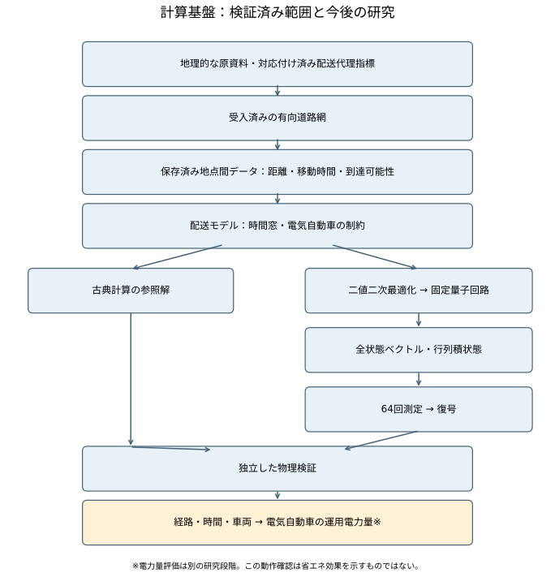
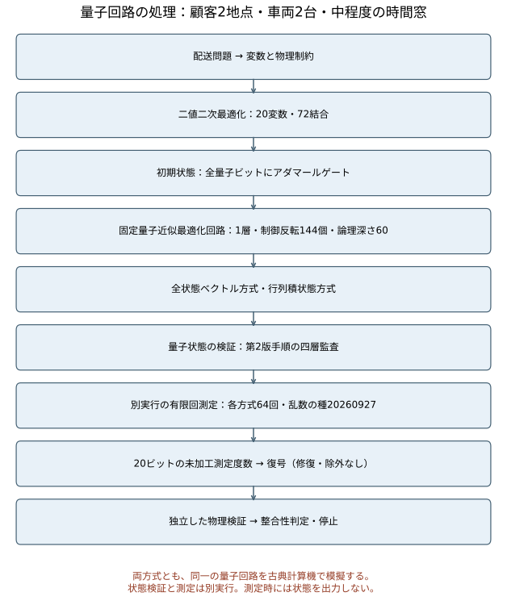
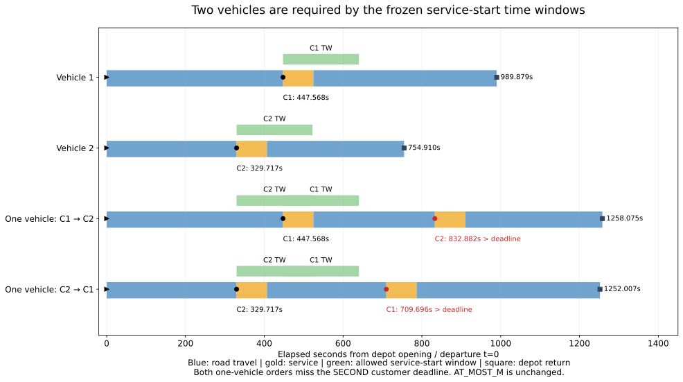

# 計算基盤検証のまとめ

対象：N002/M2/TW-MODERATE。2026-09-28時点の保存済み成果物に基づく。状態：**state-level PASS、finite-shot PASS、計算基盤検証 PASS / COMPLETE**。本書と図は説明資料であり、新しい科学authorityではない。

## 1. 目的と検証範囲

実世界由来の道路・配送地点データを、配送問題、QUBO、量子回路シミュレーション、sampling、復号・独立物理検証へ接続する計算基盤を整理する。今回完了したのは、実際に2台必要な小規模ケースにおけるbackend整合性とsampling処理経路の検証である。EV運用電力量の手法間比較や量子優位性の検証完了ではない。

図1：古典参照と量子回路シミュレーションの分岐、共通の物理検証、および将来のEV運用電力量評価への接続。末尾の電力量評価は本smoke試験の成果ではない。

## 2. 入力データと交通経路計算

道路は受理済みSUMO network `P13-THREE-TIER-RUN-3-GEOMETRY-REACCEPTANCE`。道路形状・接続・一方通行・delivery許可を反映した有向グラフである。実世界由来のデータであっても、全属性が実測値という意味ではない。

配送地点はbuilding由来の配送proxyを道路へ写像したもの。図の点は道路上のaccess位置で、建物入口の実測座標ではない。デポは `DEP_006`、顧客は次表の2地点。需要は方法論上のparcel-equivalent、時間窓は既存ベンチマークのsynthetic条件である。実際の配達注文・約束時刻とは扱わない。

| 顧客 | ID | 需要 | service-start時間窓（秒） | service（秒） |
|---|---|---:|---|---:|
| C1 | `2026-01-01-13111-bldg-43666` | 1 | [447.567658002, 640.2250420895] | 77.062953635 |
| C2 | `2026-01-01-13111-bldg-67228` | 7 | [329.717250938, 522.3746350255] | 77.062953635 |

利用可能車両M=2、各容量Q=14、総需要D=8。`m_used <= M`（AT_MOST_M）を維持する。デポ時間範囲は[0, 1858.122377706]秒。

保存済みODは3地点間の6有向arcについて、到達可否、距離m、移動時間s、edge列、出発・到着offsetを持つ。対象6arcは到達可能・検証PASS。元routing実装のedge移動時間はlength/speedに基づき、方向と接続を考慮する。距離と時間は直線距離や実測混雑時間ではない。本資料ではOD値を読み取り、routingを再計算していない。

## 3. 配送問題とQUBO

基盤にはVRPTWとMinimal EVRPの物理検証がある。この対象では顧客の一度訪問、車両割当、経路順序、容量、時間窓、デポ、使用／未使用車両を扱う。Battery/SOCはCURRENT条件で冗長だが検証され、充電はINACTIVE。充電あり一般EVRPをこの結果だけで検証済みとはしない。

目的関数は有向道路移動時間の合計（秒）。運用電力量最小化や車両数最小化を直接の目的としていない。

formulationは `REDUCED_POSITION_CAPACITY_SLACK_V1`。route-position変数、容量slack、時間制約用ancillaを用い、目的と制約penaltyをQUBOへ符号化する。8 route変数＋8 slack＋4 temporal ancilla＝20変数。非ゼロcouplerは72。QUBOエネルギーが小さいことと物理的feasibleは区別し、復号後に独立検証する。

## 4. Dense / MPSとstate-level検証

図2：Dense（statevector）とMPS（matrix product state）は、**同一量子回路を古典計算機上でシミュレーションする2方式**である。古典最適化法対量子計算法の比較ではなく、実QPU実験でもない。

初期状態は各qubitへH、固定parameterのp=1 QAOA、X mixer。20 qubits、144 structural CX、論理深さ60。保存命令は科学論理深さとは分離する。optimizerは使用していない。state-levelではDense native stateと確率、MPS native stateと許可済みstreamed contractionによる確率を比較し、full MPS statevector復元を行わない。

Protocol v2の四層は、構造的一致、数値的一致、最適化判断の一致、物理的配送結果の一致。正規化誤差≤1e-10、TVD・必須event mass差・正規化QUBO期待値差≤0.0005。物理的booleanと最適目的値classは厳密一致で判定し、確率順位は必須でない。

## 5. finite-shot sampling、復号、独立検証

state-level PASS後に、別の監督付きtaskでDense64 shots×1とMPS64 shots×1を実行した。seed=20260927。samplingではstate/probability exportもstate再実行も行わない。

20-bit raw countsを保存し、bit順`c19..c0`、測定写像q_i→c_iと凍結variable orderを検査する。decoderはbitstringを経路・割当・補助変数へ解釈し、独立validatorはvisit、route、assignment、vehicle use、AT_MOST_M、capacity、TW、depot、全体feasibility、最適物理classを検査する。

invalid encodingは修復・除外・feasibleへの投影をしない。decode errorと物理的invalidを区別し、構造的に評価不能なものも保持する。車両ラベル交換の物理的同値性を扱うがraw encodingは残す。

64-shot smokeは指定shots・backend・形式・復号・検証・資源・会計のintegrity試験。feasible/optimalが0でも、それだけでFAILにしない。empirical histogram TVDはDIAGNOSTIC_ONLYで、state-levelの0.0005を適用しない。

## 6. 実道路の2台経路と時間軸

図3：保存済み古典feasible referenceのDepot→C1→DepotとDepot→C2→Depot。青は往路、橙は復路、矢印は走行方向、灰は同じnetworkの局所表示。各legの保存済みedge列に沿ってlane 0 polylineを描画し、両端は保存offsetで切り取った。offsetは宣言lane長に対する比率でgeometryへ対応付ける。顧客間を直線で結んでいない。背景は接続道路も含むため全線がdelivery経路とは限らない。

これは**samplingで得られた配送解ではない**。samplingのfeasible sampleは両backendとも0である。車両ラベルは古典参照の代表表現であり、交換しても物理的に同値。

図4：保存済み物理fleet検証のservice-startとdepot returnを表示。出発t=0、移動区間、service区間、service-startの許容TWを区別する。図の緑帯はservice全体の完了期限ではない。1台の両順序では第2顧客のservice開始が期限を超える。一方で各顧客への単独往復はfeasible。したがって2台必要性はTWの帰結であり、`m_used = M`を強制制約として加えた結果ではない。

古典最適移動時間は1590.662580223秒。車両ラベルを除くfeasible構造は1通りで、手法間の最適化品質を比較する証拠としては限定的である。

## 7. 検証履歴

| 段階 | 対象 | 目的 | 正本の結果 |
|---|---|---|---|
| Phase1 v1 | 初期backend比較 | 初期判定 | FAILを保持、forensic branch B2 |
| Phase1 v2 | nested N003/M1/WIDE | Protocol v2のstate整合＋smoke | PASS |
| Phase2 | nested N004/M1/WIDE | state＋finite-shot | PASS / COMPLETE |
| N5 checkpoint | nested N005/M1/WIDE | Dense資源境界 | CLOSED_BY_STATIC_RESOURCE_EVIDENCE |
| Meaningful multi-vehicle | N002/M2/TW-MODERATE | state-level四層監査 | PASS |
| Meaningful multi-vehicle | 同上 | sampling pipeline | PASS / COMPLETE |

N5は29 qubits、Dense raw8GiBが256MiB上限を超える静的境界。実行失敗ではなく、`NOT_EVALUABLE_WITH_CURRENT_DENSE_REFERENCE`。MPS単独でpaired equivalenceが成立したとはしない。

## 8. N002/M2の最終数値

### State-level（保存値）

| 項目 | 値 |
|---|---:|
| Dense正規化誤差 | 3.759471033093487e-16 |
| MPS正規化誤差 | 3.631350862370875e-14 |
| TVD | 2.635077480603001e-08 |
| 最大event mass差 | 1.527906516381899e-10 |
| 正規化QUBO期待値差 | 3.521255840860218e-11 |
| Dense supervised full-call（秒） | 4.665094147 |
| MPS取得込みsupervised full-call（秒） | 4.629352248 |
| 監督STOP時総時間（秒） | 21.230574491 |

四層監査・独立validator・資源・materialization・会計はPASS。上表は保存成果物から機械読込みした値で、stateを再生成していない。

### Finite-shot（保存値）

| 項目 | Dense | MPS |
|---|---:|---:|
| requested / returned shots | 64 / 64 | 64 / 64 |
| counts合計 | 64 | 64 |
| integrity | PASS | PASS |
| feasible samples | 0 | 0 |
| optimal samples | 0 | 0 |
| supervised full-call（秒） | 4.601901583 | 4.528426863 |

empirical TVD=1.0（診断のみ）。decoder・独立validator・資源／出力・supervision・会計PASS。監督STOP時総時間=19.695256364秒。full-callはbackend内部時間だけでなく起動・取得・即時検査等を含む。報告の総時間は途中pipeline値ではなく最終STOP receiptを用いる。

sampling予算は2/2 calls・128/128 shots消費、予約0。state予算2/2は不変。本資料作成での科学実行・shots・state再実行・optimizer・retryは0。

## 9. 主張できること・できないこと

確認できたのは、凍結したこの小規模入力でDense/MPSのstate-level結果がProtocol v2内で整合し、指定samplingから復号・独立検証・会計・STOPまでの経路が機能したこと。

量子優位性、省エネ効果、高い解品質、64 shotsの十分性、大規模問題や実QPUへの適用可能性は示していない。QUBOの目的値とEV電力量を同一視せず、simulator資源を実QPU電力へ読み替えない。

## 10. 今後の研究での利用

本MD・SVGは方法説明、基盤検証の報告、論文・スライドでの再利用に使う。図3は古典参照、図4は保存済み物理検証、図1末尾は研究上の後続段階としてcaptionと一緒に用いる。

次の研究taskはMETHOD_COMPARISON_SCALEの選定・固定に向けた証拠整理と判断。現時点ではNOT_FROZEN、Main S0はNOT_AUTHORIZED。本資料作成によって次の科学実行を許可しない。将来の電力量比較では同一物理条件、Battery条件、計算エネルギーの評価境界を別途固定する。

## 11. Provenance

| 記述・図 | 正本・成果物 |
|---|---|
| 現在の状態 | [CURRENT_EXECUTION](../CURRENT_EXECUTION.md) |
| network / 図1・3 | [network_acceptance.json](outputs/traffic_simulation/attribute_resolution_v17/phase13_20260903_three_tier_completion/run_3_geometry_reacceptance/network_acceptance.json) |
| 道路geometry / 図3 | [three_tier.net.xml](outputs/traffic_simulation/attribute_resolution_v17/phase13_20260903_three_tier_completion/run_3_geometry_reacceptance/three_tier.net.xml) |
| OD edge列・offset / 図3 | [od_manifest.csv](outputs/traffic_simulation/r24_benchmark_instance_suite/20260915_v1/instances/R24-RND-N002-R01/od_manifest.csv) |
| 配送地点・需要の由来 | [base_instance.json](outputs/traffic_simulation/r24_benchmark_instance_suite/20260915_v1/instances/R24-RND-N002-R01/base_instance.json) |
| TW・車両・容量 / 図4 | [SELECTED_INSTANCE.json](outputs/traffic_simulation/r24_first_meaningful_multi_vehicle_preflight/20260927_v1/SELECTED_INSTANCE.json) |
| 経路と時刻 / 図3・4 | [EXACT_PHYSICAL_FLEETS.json](outputs/traffic_simulation/r24_first_meaningful_multi_vehicle_preflight/20260927_v1/EXACT_PHYSICAL_FLEETS.json) |
| 2台必要性 | [MULTI_VEHICLE_MIN_VEHICLE_PROOFS.json](outputs/traffic_simulation/r24_first_meaningful_multi_vehicle_preflight/20260927_v1/MULTI_VEHICLE_MIN_VEHICLE_PROOFS.json) |
| QUBO構造 / 図2 | [SELECTED_CANDIDATE_STATIC_QUBO.json](outputs/traffic_simulation/r24_first_meaningful_multi_vehicle_preflight/20260927_v1/SELECTED_CANDIDATE_STATIC_QUBO.json) |
| QAOA論理回路 / 図2 | [CANONICAL_CIRCUIT_METADATA.json](outputs/traffic_simulation/r24_meaningful_multi_vehicle_state/20260928_v3/CANONICAL_CIRCUIT_METADATA.json) |
| Protocol v2 | [BACKEND_FEASIBILITY_PROTOCOL_V2.md](outputs/traffic_simulation/r24_backend_feasibility_protocol_v2/20260927_v3/BACKEND_FEASIBILITY_PROTOCOL_V2.md) |
| Phase1 v1保持・v2結果 | [PHASE1_V2_FINAL_REPORT.md](outputs/traffic_simulation/r24_backend_feasibility_phase1_v2/20260927_v1/PHASE1_V2_FINAL_REPORT.md) |
| N004/M1 | [PHASE2_OVERALL_DECISION.json](outputs/traffic_simulation/r24_backend_feasibility_phase2_finite_shot/20260927_v1/PHASE2_OVERALL_DECISION.json) |
| N5境界 | [N5_CHECKPOINT_DECISION.json](outputs/traffic_simulation/r24_n5_transition_checkpoint/20260927_v1/N5_CHECKPOINT_DECISION.json) |
| state数値 | [NUMERICAL_EQUIVALENCE_V2.json](outputs/traffic_simulation/r24_meaningful_multi_vehicle_state/20260928_v3/NUMERICAL_EQUIVALENCE_V2.json) |
| state時間 | [RUNTIME_POLICY_V2_ACCOUNTING.json](outputs/traffic_simulation/r24_meaningful_multi_vehicle_state/20260928_v3/RUNTIME_POLICY_V2_ACCOUNTING.json) |
| state監督STOP | [STOP.json](outputs/traffic_simulation/r24_meaningful_multi_vehicle_state/20260928_v3/STOP.json) |
| finite-shot判定 | [FINITE_SHOT_DECISION.json](outputs/traffic_simulation/r24_meaningful_multi_vehicle_finite_shot/20260928_v1/FINITE_SHOT_DECISION.json) |
| finite-shot診断 | [FINITE_SHOT_DIAGNOSTICS.json](outputs/traffic_simulation/r24_meaningful_multi_vehicle_finite_shot/20260928_v1/FINITE_SHOT_DIAGNOSTICS.json) |
| finite-shot時間 | [RUNTIME_POLICY_V2_ACCOUNTING.json](outputs/traffic_simulation/r24_meaningful_multi_vehicle_finite_shot/20260928_v1/RUNTIME_POLICY_V2_ACCOUNTING.json) |
| finite-shot監督STOP | [STOP.json](outputs/traffic_simulation/r24_meaningful_multi_vehicle_finite_shot/20260928_v1/STOP.json) |
| decoder | [DECODER_REPORT.json](outputs/traffic_simulation/r24_meaningful_multi_vehicle_finite_shot/20260928_v1/DECODER_REPORT.json) |
| validator | [INDEPENDENT_VALIDATOR_REPORT.json](outputs/traffic_simulation/r24_meaningful_multi_vehicle_finite_shot/20260928_v1/INDEPENDENT_VALIDATOR_REPORT.json) |
| completion | [MEANINGFUL_MULTI_VEHICLE_OVERALL_DECISION.json](outputs/traffic_simulation/r24_meaningful_multi_vehicle_finite_shot/20260928_v1/MEANINGFUL_MULTI_VEHICLE_OVERALL_DECISION.json) |

図のsource hashとgeometry処理は[FIGURE_DATA_PROVENANCE.json](figures/computation_platform/FIGURE_DATA_PROVENANCE.json)、全成果物の完全性は[manifest](COMPUTATION_PLATFORM_SUMMARY_MANIFEST.json)を参照。SVGを主成果物とし、同名PNGをプレビュー用に添付。再描画コードは[build_figures.py](figures/computation_platform/build_figures.py)（保存データの読取りと作図のみ）。
