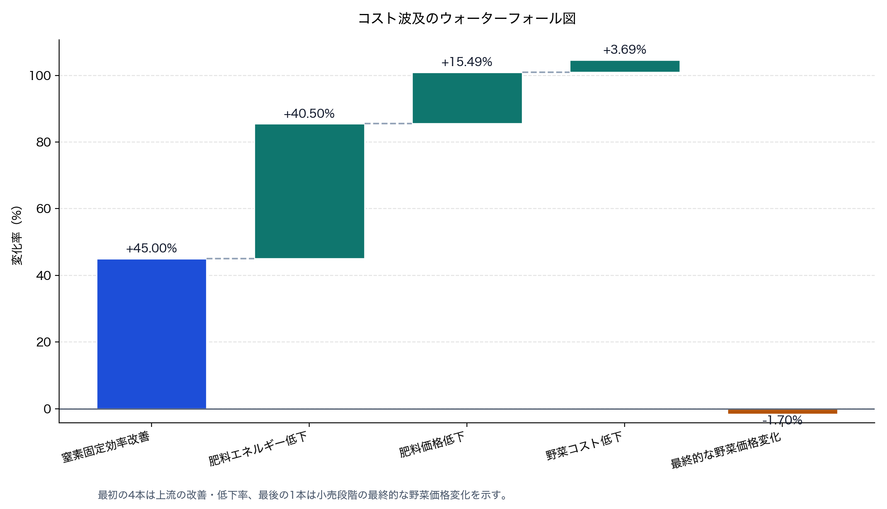
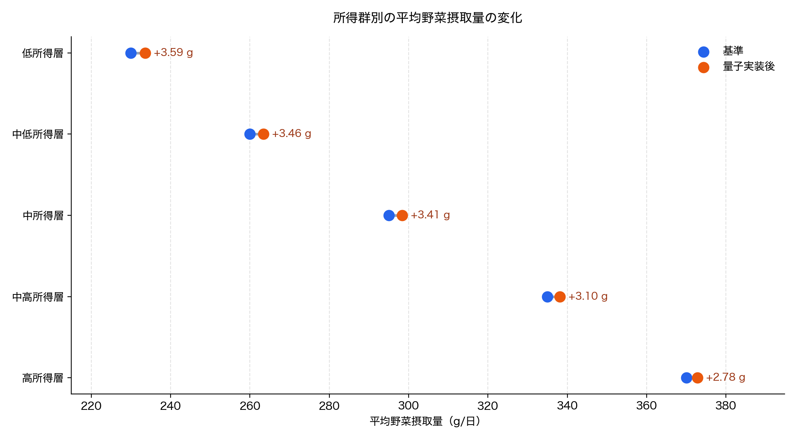
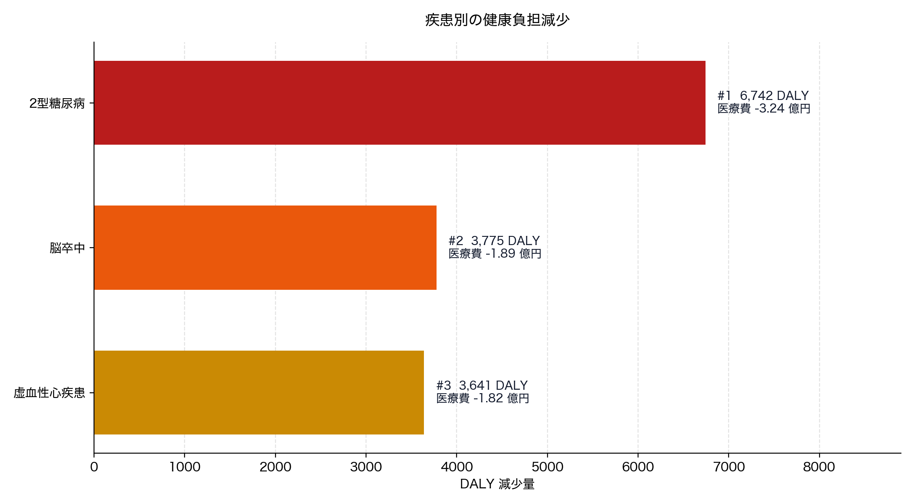

# 量子技術の窒素固定実装による波及効果サンプル分析レポート

## 1. 目的
本レポートは，量子コンピュータの実装によって窒素固定のエネルギー効率が改善した場合に，肥料価格，野菜価格，野菜摂取，生活習慣病負担，社会保険料負担相当額へどのような波及が生じるかを，簡略化したサンプルモデルで試算した結果を示すものである。

## 2. 分析モデルの概要
本モデルは，窒素固定効率の改善が肥料生産のエネルギー投入を減らし，その一部が肥料価格へ転嫁され，さらに野菜価格の低下を通じて摂取量を増加させるという連鎖を仮定する。価格と数量の変化は，需要弾力性と供給弾力性を用いた縮約均衡で近似した。健康影響については，平均野菜摂取量の増分に応じて疾患リスクが比例的に低下すると仮定し，疾患別 DALYs と医療費の減少を計算した。

## 3. 重要な前提
| 項目              | 値       |
| --------------- | ------- |
| 量子実装による窒素固定効率改善 | 45.00%  |
| 肥料生産エネルギー低下     | 40.50%  |
| 肥料価格低下          | 15.49%  |
| 野菜の供給側コスト低下     | 3.69%   |
| 野菜価格変化          | -1.70%  |
| 野菜数量変化          | 1.19%   |
| 推奨摂取量           | 350 g/日 |

## 4. 主要結果
| 指標                | 結果              |
| ----------------- | --------------- |
| 野菜平均価格（基準）        | 420.0 円/kg      |
| 野菜平均価格（量子実装後）     | 412.9 円/kg      |
| 平均野菜摂取量（基準）       | 283.00 g/日      |
| 平均野菜摂取量（量子実装後）    | 286.37 g/日      |
| 平均野菜摂取量の増加        | 3.37 g/日        |
| 推奨摂取量達成人口比（基準）    | 19.06%          |
| 推奨摂取量達成人口比（量子実装後） | 20.32%          |
| 推奨摂取量達成人口比の変化     | 1.263 パーセントポイント |
| 年間野菜供給量（基準）       | 12,911,875 トン/年 |
| 年間野菜供給量（量子実装後）    | 13,065,676 トン/年 |
| DALYs 総減少量        | 14,158.10       |
| 健康寿命近似値の改善        | 0.04134 日/人・年   |
| 社会保険料負担相当額の減少     | 4,860,948,879 円 |

## 5. 所得群別の摂取結果
| 群     | 平均摂取量 基準   | 平均摂取量 量子後  | 増分       | 達成人口比 基準 | 達成人口比 量子後 |
| ----- | ---------- | ---------- | -------- | -------- | --------- |
| 低所得層  | 230.00 g/日 | 233.59 g/日 | 3.59 g/日 | 4.32%    | 4.82%     |
| 中低所得層 | 260.00 g/日 | 263.46 g/日 | 3.46 g/日 | 8.31%    | 9.15%     |
| 中所得層  | 295.00 g/日 | 298.41 g/日 | 3.41 g/日 | 17.97%   | 19.49%    |
| 中高所得層 | 335.00 g/日 | 338.10 g/日 | 3.10 g/日 | 39.25%   | 41.43%    |
| 高所得層  | 370.00 g/日 | 372.78 g/日 | 2.78 g/日 | 65.54%   | 67.57%    |

## 6. 疾患別の健康・費用結果
| 疾患     | リスク低下率 | 症例減少数     | DALY減少   | 医療費減少           |
| ------ | ------ | --------- | -------- | --------------- |
| 2型糖尿病  | 0.27%  | 26,967.82 | 6,741.95 | 3,236,137,950 円 |
| 虚血性心疾患 | 0.20%  | 7,584.70  | 3,640.66 | 1,820,327,597 円 |
| 脳卒中    | 0.24%  | 5,899.21  | 3,775.49 | 1,887,747,137 円 |

## 7. 統計検定
群別・疾患別の集計値しか存在しないため，本レポートでは個票データに対する平均差の検定ではなく，変化方向の一貫性をみる exact sign test（片側検定）を実施した。帰無仮説は「増加または減少の方向に一貫性がない」，対立仮説は「仮説に沿った方向へ一貫して変化している」である。

| 検定対象        | 分析単位 | 非ゼロ差数 | 正の差 | 負の差 | 平均変化                 | 片側 p 値  | 5% 判定  |
| ----------- | ---- | ----- | --- | --- | -------------------- | ------- | ------ |
| 平均野菜摂取量の増加  | 所得群  | 5     | 5   | 0   | 3.2684 g/日           | 0.03125 | 有意     |
| 推奨摂取量達成率の増加 | 所得群  | 5     | 5   | 0   | 0.0141 割合            | 0.03125 | 有意     |
| 症例数の減少      | 疾患   | 3     | 3   | 0   | 13,483.9081 件        | 0.12500 | 有意ではない |
| DALY の減少    | 疾患   | 3     | 3   | 0   | 4,719.3678 DALY      | 0.12500 | 有意ではない |
| 年間医療費の減少    | 疾患   | 3     | 3   | 0   | 2,314,737,561.3922 円 | 0.12500 | 有意ではない |

所得群ベースの 2 検定では 5 群すべてで改善方向の差が出ており，片側 p 値は 0.03125 となる。一方，疾患ベースの検定は対象疾患が 3 件しかないため，すべて同方向でも片側 p 値は 0.12500 にとどまり，5% 水準では有意にならない。

ただし，これらの検定は観測標本から母集団を推定する実証統計ではなく，シミュレーション出力が群や疾患をまたいでどれだけ整合的に同方向へ動いているかを確認する補助的な位置づけである。

## 8. 図

## 9. 解釈
サンプル計算では，量子技術実装による窒素固定効率の改善が，最終的には野菜価格の低下と摂取量の増加につながるという方向性が確認された。ただし，肥料費が野菜小売価格に占める比率には限界があるため，価格低下幅は小さく，健康指標への影響も緩やかである。したがって，本研究の実証では，肥料価格の転嫁率，低所得層の価格反応，疾病リスク関数の妥当性が結果を大きく左右する。

## 10. 限界
本レポートの数値はサンプル値に基づくものであり，実測値ではない。健康寿命は DALY 減少から導いた近似指標であり，厳密な生命表推計ではない。また，本モデルは加工食品代替，輸入依存，政策補助，農家の価格戦略，所得制約の動学などを考慮していない。今回追加した統計検定も，群別・疾患別の集計値に対する方向性確認であり，個票データに基づく厳密な因果推定や母集団推測ではない。今後は，肥料市場データ，野菜品目別需要，疾病別用量反応関係，社会保険財政データを導入することで厳密化が必要である。

## 11. 社会的インパクトの示唆
サンプル計算の範囲でも，量子技術の実装が食料・健康・社会保障にまたがる波及を持ち得ることが示唆される。定量的には，野菜平均価格は 420.0 円/kg から 412.9 円/kg へ約 1.7% 低下し，平均野菜摂取量は 283.00 g/日から 286.37 g/日へ 3.37 g/日増加する。推奨摂取量達成人口比も 19.06% から 20.32% へ 1.263 パーセントポイント改善しており，総人口 1.25 億人を前提にすると，推奨水準に達する人が概算で約 158 万人増える規模感になる。

健康・財政面では，DALYs 総減少量は 14,158.10，健康寿命近似値の改善は 1 人あたり年 0.04134 日，社会保険料負担相当額の減少は年約 48.6 億円と試算されている。疾患別には，2型糖尿病で約 26,968 件，虚血性心疾患で約 7,585 件，脳卒中で約 5,899 件の症例減少が見込まれており，医療費減少額はそれぞれ約 32.4 億円，18.2 億円，18.9 億円である。金額や健康指標の絶対値は大きく見える一方，1 人あたりの変化は小さいため，この結果は『即時に劇的な社会変化を起こす』というより『小幅な改善が人口全体では無視できない規模に積み上がる』タイプのインパクトとして読むのが適切である。

もっとも，現時点で言えるのはあくまで『そのような方向の社会的インパクトがありうる』という示唆であり，政策判断に使うには実データによる再推計，所得階層別の需要分析，疾病別の用量反応関係，制度財政への波及経路の精査が不可欠である。
